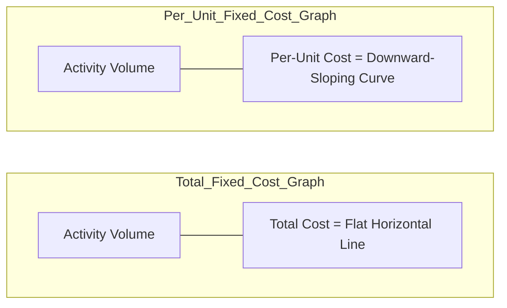

## Fixed Cost Definition and Characteristics

### Definition

A **fixed cost** is a cost whose total amount remains constant in the short run, regardless of changes in the level of business activity, within a defined **relevant range** of volume and a specified time period. Fixed costs arise primarily from capacity-related decisions (plant size, equipment, staffing levels) rather than from output volume itself.

$$TFC = k \quad \text{for all } Q \in [Q_{min}, Q_{max}]$$

Where $TFC$ is total fixed cost, $k$ is a constant, and $Q$ is the quantity of activity bounded by the relevant range $[Q_{min}, Q_{max}]$.

### Core Characteristics

**Key Points**

- **Constant in total**: Total fixed cost does not change as activity volume rises or falls within the relevant range.
- **Inversely variable per unit**: Fixed cost per unit decreases as volume increases, and increases as volume decreases, since the same total is spread over more or fewer units.
- **Time-bound**: Fixed costs are fixed only over a specified period (e.g., monthly rent); over a long enough horizon, virtually all costs become adjustable.
- **Capacity-driven**: Fixed costs typically represent the cost of maintaining the capacity to produce, not the act of producing itself.
- **Relevant-range dependent**: Outside the assumed range of activity, the fixed cost level itself can shift (e.g., leasing a second warehouse).

$$FC_{\text{per unit}} = \frac{TFC}{Q}$$

**Example**

A company leases factory space for $40,000 per month, fixed regardless of output.

| Units Produced ($Q$) | Total Fixed Cost | Fixed Cost per Unit |
| --- | --- | --- |
| 1,000 | $40,000 | $40.00 |
| 2,000 | $40,000 | $20.00 |
| 4,000 | $40,000 | $10.00 |
| 8,000 | $40,000 | $5.00 |

Total fixed cost never changes across these volumes; only the per-unit allocation shrinks — this is the basis of **economies of scale from fixed-cost absorption**.

### Graphical Behavior

The following SVG plots total fixed cost (flat line) against per-unit fixed cost (declining curve) over a relevant range of 0–10,000 units at $TFC = \$40{,}000$.

<svg xmlns="http://www.w3.org/2000/svg" viewBox="0 0 640 400">
<text x="320" y="24" text-anchor="middle" font-size="16" font-family="sans-serif" font-weight="bold">Fixed Cost Behavior (svg_diagram)</text>
<line x1="70" y1="340" x2="600" y2="340" stroke="black" stroke-width="1.5" />
<line x1="70" y1="340" x2="70" y2="50" stroke="black" stroke-width="1.5" />
<text x="335" y="375" text-anchor="middle" font-size="12" font-family="sans-serif">Activity Volume (units)</text>
<text x="25" y="195" text-anchor="middle" font-size="12" font-family="sans-serif" transform="rotate(-90 25,195)">Cost (\$)</text>
<line x1="70" y1="140" x2="600" y2="140" stroke="#2060c0" stroke-width="2.5" />
<text x="605" y="144" font-size="11" font-family="sans-serif" fill="#2060c0">Total Fixed Cost</text>
<path d="M 90 60 C 150 130, 220 220, 320 280 C 400 310, 480 325, 580 332" fill="none" stroke="#c04020" stroke-width="2.5" />
<text x="585" y="330" font-size="11" font-family="sans-serif" fill="#c04020">Per-Unit Fixed Cost</text>

<text x="70" y="355" font-size="10" font-family="sans-serif" text-anchor="middle">0</text>

<text x="600" y="355" font-size="10" font-family="sans-serif" text-anchor="middle">10,000</text>

<text x="55" y="144" font-size="10" font-family="sans-serif" text-anchor="end">$40,000</text>

</svg>

### Committed vs. Discretionary Fixed Costs

**Key Points**

- **Committed fixed costs**: Long-term, structural costs arising from ownership of facilities and core organizational structure (e.g., depreciation, property taxes, long-term lease payments, salaries of key permanent staff). Difficult to reduce quickly without impairing long-term operating capability.
- **Discretionary (managed) fixed costs**: Set by periodic management decisions and can be adjusted in the short run with less structural damage (e.g., advertising budgets, R&D spending, employee training programs, donations).

| Attribute | Committed Fixed Cost | Discretionary Fixed Cost |
| --- | --- | --- |
| Time horizon to change | Long (multi-year) | Short (can adjust year-to-year) |
| Origin | Capacity/structural decisions | Periodic budget decisions |
| Example | Building depreciation | Marketing campaign budget |
| Risk of cutting | Impairs long-term capacity | Lower immediate structural risk |

### Common Examples of Fixed Costs

- Straight-line depreciation on equipment and buildings
- Property taxes and insurance premiums
- Salaried employee compensation (as opposed to hourly/piece-rate)
- Long-term equipment or facility lease payments
- Base salary component of management compensation

### Common Pitfalls

- Treating fixed costs as fixed indefinitely — they are only fixed within the relevant range and time period; a large enough volume change can force a step up (e.g., leasing additional space).
- Confusing "fixed in total" with "fixed per unit" — the per-unit amount is the variable element, not the total.
- Assuming all fixed costs are equally difficult to cut — committed and discretionary fixed costs have very different flexibility profiles for cost-control decisions.
- Ignoring that fixed costs still exist even at zero output (e.g., rent is owed whether or not any units are produced), which distinguishes them fundamentally from variable costs.

**Next Steps**

- Variable Cost Definition and Characteristics
- Mixed (Semi-Variable) Cost Behavior and Separation Techniques
- Relevant Range Assumption in Cost Estimation
- Committed vs. Discretionary Fixed Cost Decisions in Budgeting
- Fixed Cost's Role in Operating Leverage and Break-Even Analysis