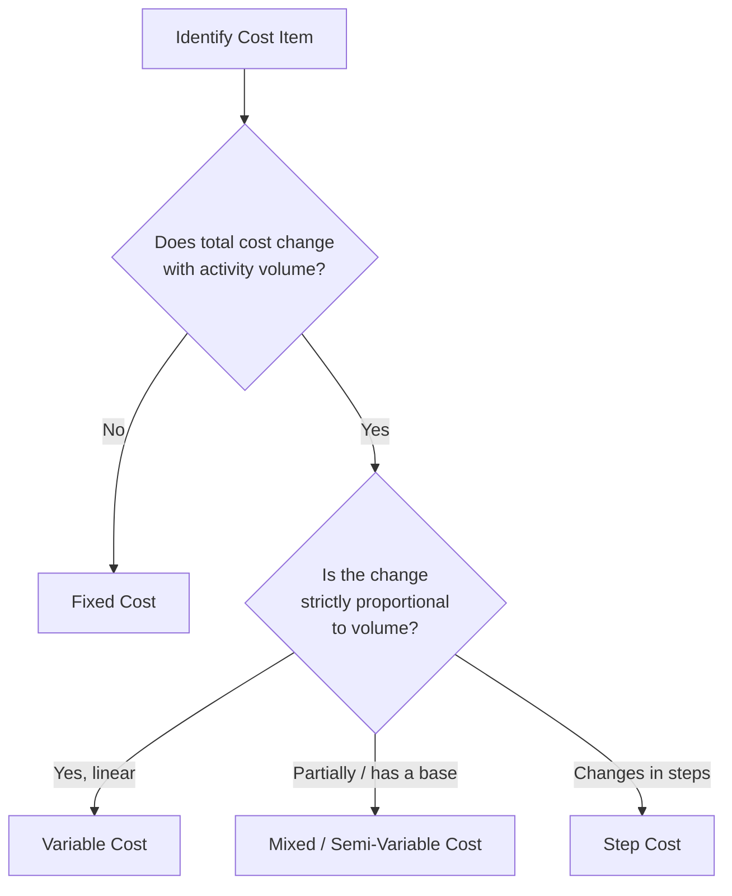

## Variable Cost Definition and Characteristics

### Definition

A variable cost is an expense whose **total amount changes in direct proportion to changes in activity volume**, while the cost **per unit remains constant** across the relevant range of activity.

$$TC_v = v \times Q$$

Where:

- $TC_v$ = total variable cost
- $v$ = variable cost per unit (constant)
- $Q$ = quantity of activity (units produced, units sold, machine hours, etc.)

The defining behavioral trait is the linear relationship between total cost and the chosen activity driver, not the cost's classification by function (e.g., "manufacturing" vs. "selling") or its controllability.

### Core Characteristics

**Key Points**

- **Constant per-unit cost**: The cost per unit of activity does not change as volume changes, assuming the relevant range and input prices remain stable.
- **Proportional total cost**: Total variable cost scales linearly with volume — double the output, double the total variable cost.
- **Zero at zero activity**: In a pure variable cost model, total variable cost is $0 when $Q = 0$. This distinguishes variable costs from fixed and mixed costs, which retain a baseline cost even at zero output.
- **Activity-driven, not time-driven**: Unlike fixed costs, which accrue with the passage of time regardless of output, variable costs are incurred only because production or sales activity occurs.
- **Relevant range dependency**: The constant per-unit assumption holds only within a defined band of activity (the *relevant range*). Outside that range, per-unit variable cost can shift due to bulk discounts, overtime premiums, or capacity-driven inefficiencies. [Inference] The precise boundaries of the relevant range are empirical and specific to each organization's cost structure, not a fixed universal threshold.

### Common Examples

| Cost Item | Activity Driver | Why It's Variable |
| --- | --- | --- |
| Direct materials | Units produced | Each unit requires a fixed quantity of raw material input |
| Direct labor (piece-rate or per-unit) | Units produced | Labor cost scales with output when compensation is output-linked |
| Sales commissions | Units/revenue sold | Commission percentage applied to each sale |
| Shipping/freight-out | Units shipped | Per-unit or per-shipment carrier charges |
| Packaging materials | Units produced | Consumed proportionally with each unit packaged |
| Credit card processing fees | Sales revenue | Percentage-based fee per transaction |
| Utilities tied to machine usage | Machine hours | Power consumption scales with equipment runtime |

### Graphical Behavior

Total variable cost graphed against activity volume is a straight line through the origin. Per-unit variable cost graphed against volume is a horizontal line.

<svg xmlns="http://www.w3.org/2000/svg" viewBox="0 0 640 320">
<text x="320" y="20" text-anchor="middle" font-size="14" font-weight="bold" fill="#222">Variable Cost Behavior (svg_diagram)</text>

<g transform="translate(20,40)">
<text x="140" y="0" text-anchor="middle" font-size="12" fill="#333">Total Variable Cost</text>
<line x1="40" y1="220" x2="40" y2="20" stroke="#333" stroke-width="1.5" />
<line x1="40" y1="220" x2="260" y2="220" stroke="#333" stroke-width="1.5" />
<text x="10" y="30" font-size="10" fill="#333">Cost ($)</text>
<text x="150" y="245" font-size="10" fill="#333">Activity (Units)</text>
<line x1="40" y1="220" x2="250" y2="30" stroke="#2b6cb0" stroke-width="2.5" />
<text x="255" y="30" font-size="10" fill="#2b6cb0">TVC = vQ</text>
<circle cx="40" cy="220" r="3" fill="#2b6cb0" />
<text x="30" y="235" font-size="9" fill="#555">origin (0,0)</text>
</g>

<g transform="translate(340,40)">
<text x="140" y="0" text-anchor="middle" font-size="12" fill="#333">Per-Unit Variable Cost</text>
<line x1="40" y1="220" x2="40" y2="20" stroke="#333" stroke-width="1.5" />
<line x1="40" y1="220" x2="260" y2="220" stroke="#333" stroke-width="1.5" />
<text x="10" y="30" font-size="10" fill="#333">Cost/Unit ($)</text>
<text x="150" y="245" font-size="10" fill="#333">Activity (Units)</text>
<line x1="40" y1="120" x2="250" y2="120" stroke="#c05621" stroke-width="2.5" />
<text x="255" y="120" font-size="10" fill="#c05621">constant v</text>
</g>
</svg>

### Determining Variability: The Cost Behavior Test

A cost qualifies as variable if it passes this test: **does total cost change when activity volume changes, and does it return to zero (or its baseline) when activity is zero?**

### Variable Cost vs. Fixed Cost — Contrast Table

| Attribute | Variable Cost | Fixed Cost |
| --- | --- | --- |
| Total cost behavior | Changes proportionally with volume | Constant regardless of volume (within relevant range) |
| Per-unit behavior | Constant per unit | Decreases per unit as volume rises |
| Cost at zero activity | $0 | Equal to the fixed baseline |
| Driver | Activity/volume | Time (period-based) |
| Risk profile | Lower operating leverage, cost scales with revenue | Higher operating leverage, magnifies profit swings |

### Relevance to Cost-Volume-Profit (CVP) Analysis

Variable cost per unit is the input used to calculate **contribution margin**, the foundation of CVP and breakeven analysis:

$$CM = P - v$$

Where $P$ is the selling price per unit and $v$ is the variable cost per unit. Contribution margin represents the amount each unit sold contributes toward covering fixed costs and, beyond breakeven, toward operating profit.

### Worked Example

A manufacturer produces a component with the following variable cost inputs per unit:

| Component | Cost per Unit |
| --- | --- |
| Direct materials | $12.00 |
| Direct labor | $8.50 |
| Variable manufacturing overhead | $3.25 |
| Sales commission | $2.00 |
| **Total variable cost per unit** | **$25.75** |

**Example**

At 1,000 units: $TC_v = 25.75 \times 1{,}000 = \$25{,}750$

At 2,500 units: $TC_v = 25.75 \times 2{,}500 = \$64{,}375$

The per-unit cost of $25.75 remains constant across both volumes; only the total scales — confirming the proportional relationship that defines a variable cost.

### Practical Identification Pitfalls

- **Discretionary vs. engineered variability**: Some costs *appear* variable because management adjusts them with volume (e.g., temporary labor), but they are not contractually or physically tied to output — these are better modeled as discretionary fixed costs reset periodically.
- **Step-variable costs**: Costs like additional supervisory labor added per batch of 500 units behave variably in aggregate but are technically step costs, not pure variable costs, because they change in discrete increments rather than continuously.
- **Mixed cost misclassification**: Utility bills with a base service charge plus usage-based charges are mixed costs; treating the entire bill as variable overstates the proportional component. [Unverified] The exact fixed/variable split of a specific mixed cost typically requires the high-low method or regression analysis on historical billing data.

**Next Steps**

- Fixed Cost Definition and Characteristics
- Mixed (Semi-Variable) Costs and the High-Low Method
- Step-Variable and Step-Fixed Cost Behavior
- Relevant Range and Its Limits on Cost Assumptions
- Contribution Margin and Contribution Margin Ratio
- Cost-Volume-Profit (CVP) Analysis and Breakeven Point
- Degree of Operating Leverage (DOL) Calculation and Interpretation
- Cost Estimation Methods: High-Low Method, Scatterplot, Regression Analysis