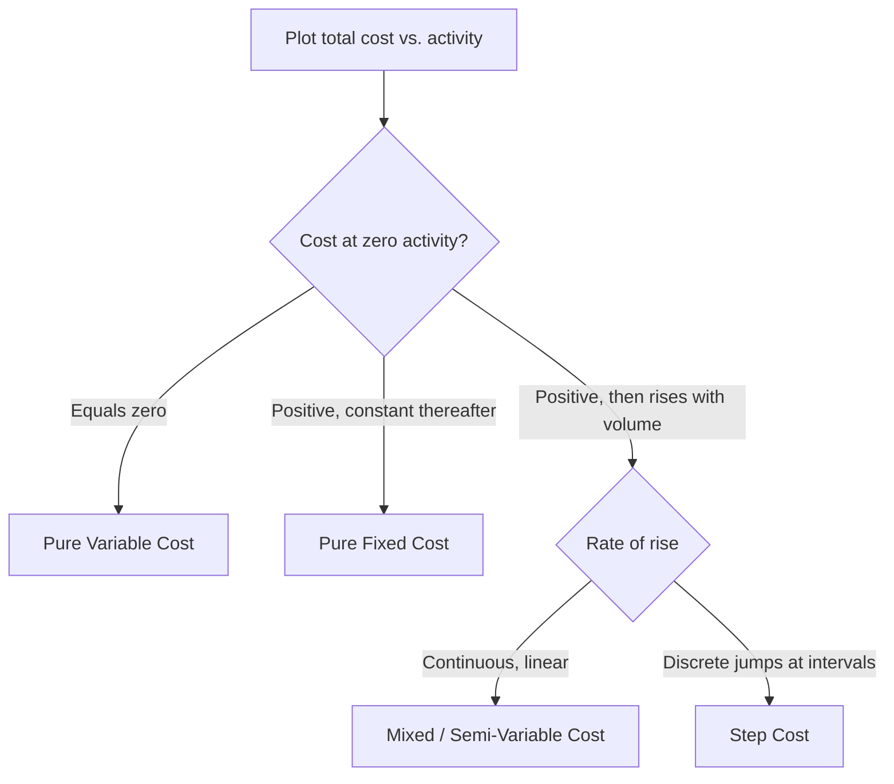

## Mixed and Semi-Variable Cost Behavior

### Definition

A mixed cost (also called a **semi-variable cost**) contains both a fixed component and a variable component within a single cost item. It does not disappear at zero activity, unlike a pure variable cost, and it does not remain flat across all volume levels, unlike a pure fixed cost.

$$TC = F + vQ$$

Where:

- $TC$ = total mixed cost
- $F$ = fixed component (the baseline cost incurred even at zero activity)
- $v$ = variable cost per unit of activity
- $Q$ = activity volume (units, hours, transactions, etc.)

This linear cost function is the algebraic foundation for nearly all cost estimation techniques covered in managerial accounting.

### Core Characteristics

**Key Points**

- **Two embedded components**: A single line-item cost bundles a fixed charge (independent of volume) and a variable charge (proportional to volume).
- **Positive cost at zero activity**: Because of the fixed component $F$, total mixed cost never falls to $0 even when $Q = 0$ — this is the primary test distinguishing a mixed cost from a pure variable cost.
- **Non-proportional total cost growth**: Total cost rises with volume, but not in strict proportion — average cost per unit declines as volume increases because the fixed component is spread over more units.
- **Requires decomposition for planning**: Because budgeting, forecasting, and CVP analysis require costs classified as strictly fixed or strictly variable, mixed costs must be split into their two components before being used in those models.
- **Common in overhead and utility accounts**: Mixed costs are especially prevalent in indirect cost pools — utilities, maintenance, equipment rental, and semi-automated labor arrangements.

### Common Examples

| Cost Item | Fixed Component | Variable Component |
| --- | --- | --- |
| Electricity bill | Base service/connection charge | Usage charge per kWh |
| Telephone/data plan | Monthly subscription fee | Per-minute or per-GB overage charge |
| Equipment rental | Flat monthly rental fee | Usage-based surcharge (e.g., per hour operated) |
| Vehicle/delivery costs | Fixed insurance and depreciation | Fuel and mileage-based maintenance |
| Sales force compensation | Base salary | Commission per sale |
| Maintenance contracts | Retainer fee | Per-service-call charge |
| Machine leasing with overage clause | Base lease payment | Per-unit-over-threshold fee |

### Graphical Behavior

Total mixed cost, plotted against activity, is a straight line with a **positive y-intercept** (equal to $F$) and a **positive slope** (equal to $v$).

<svg xmlns="http://www.w3.org/2000/svg" viewBox="0 0 640 300">
<text x="320" y="20" text-anchor="middle" font-size="14" font-weight="bold" fill="#222">Mixed Cost Behavior (svg_diagram)</text>
<g transform="translate(60,40)">
<line x1="40" y1="220" x2="40" y2="20" stroke="#333" stroke-width="1.5" />
<line x1="40" y1="220" x2="480" y2="220" stroke="#333" stroke-width="1.5" />
<text x="10" y="30" font-size="10" fill="#333">Total Cost ($)</text>
<text x="330" y="245" font-size="10" fill="#333">Activity Volume (Q)</text>



```

<line x1="40" y1="180" x2="480" y2="180" stroke="#999" stroke-width="1" stroke-dasharray="4,3" />
<text x="420" y="175" font-size="10" fill="#666">Fixed portion (F)</text>


<line x1="40" y1="180" x2="460" y2="35" stroke="#2b6cb0" stroke-width="2.5" />
<text x="380" y="45" font-size="10" fill="#2b6cb0">TC = F + vQ</text>


<circle cx="40" cy="180" r="3.5" fill="#c05621" />
<text x="45" y="200" font-size="9" fill="#c05621">Intercept = F</text>


<line x1="200" y1="130" x2="200" y2="100" stroke="#888" stroke-width="1" stroke-dasharray="2,2" />
<line x1="200" y1="100" x2="260" y2="100" stroke="#888" stroke-width="1" stroke-dasharray="2,2" />
<text x="205" y="95" font-size="9" fill="#666">Δcost / Δunit = v (slope)</text>
```

</g>
</svg>

### Distinguishing Mixed Costs from Other Behaviors



### Cost Estimation Methods for Decomposing Mixed Costs

Because $F$ and $v$ are not separately reported on invoices or ledgers, they must be **estimated** from historical cost-activity data pairs.

#### 1. High-Low Method

Uses only the two most extreme observations (highest and lowest activity level) to estimate $v$ and $F$.

$$v = \frac{TC_{high} - TC_{low}}{Q_{high} - Q_{low}}$$


$$F = TC_{high} - (v \times Q_{high})$$

**Example**

| Month | Machine Hours | Total Maintenance Cost |
| --- | --- | --- |
| March | 1,200 | $18,400 |
| July (high) | 2,000 | $24,000 |
| November (low) | 900 | $16,100 |

$$v = \frac{24{,}000 - 16{,}100}{2{,}000 - 900} = \frac{7{,}900}{1{,}100} \approx \$7.18 \text{ per hour}$$


$$F = 24{,}000 - (7.18 \times 2{,}000) = 24{,}000 - 14{,}360 = \$9{,}640$$

Estimated cost function: $TC = 9{,}640 + 7.18Q$

- **Advantages**: Simple, fast, requires no software.
- **Limitations**: Uses only two data points, so it is highly sensitive to outliers and ignores all information in the intermediate observations. [Inference] Results from the high-low method are best treated as a rough estimate rather than a precise cost driver relationship, particularly when the high/low activity points are not representative of typical operations.

#### 2. Scatterplot (Scattergraph) Method

Plots all historical cost-activity pairs on a graph, then visually fits a line through the data to estimate the intercept ($F$) and slope ($v$). Primarily used as a **diagnostic step** to detect outliers, nonlinearity, or structural breaks before applying regression.

#### 3. Regression Analysis (Least-Squares Method)

Uses all available data points and statistical least-squares fitting to minimize the sum of squared residuals between the actual costs and the fitted line.

$$TC_i = F + vQ_i + \varepsilon_i$$

Where $\varepsilon_i$ is the residual (unexplained) error for observation $i$. Regression coefficients are typically obtained via:

$$v = \frac{n\sum(Q_iTC_i) - \sum Q_i \sum TC_i}{n\sum Q_i^2 - (\sum Q_i)^2}$$


$$F = \bar{TC} - v\bar{Q}$$

- **Advantages**: Uses all data points, produces goodness-of-fit statistics ($R^2$), and allows statistical significance testing on the coefficients.
- **Limitations**: Requires more data and computational tooling (spreadsheet or statistical software); assumes a linear relationship and stable cost structure over the historical period used. [Unverified] The reliability of a regression-based estimate for future budgeting depends on whether the underlying cost-driver relationship remains stable going forward, which cannot be guaranteed from historical data alone.

### Comparison of Estimation Methods

| Method | Data Points Used | Precision | Complexity | Outlier Sensitivity |
| --- | --- | --- | --- | --- |
| High-Low | 2 (highest & lowest) | Low | Very low | High |
| Scatterplot | All (visual) | Low–Moderate | Low | Moderate (visually detectable) |
| Regression | All (statistical) | High | Moderate–High | Low (with diagnostics) |

### Relevance to Budgeting and CVP Analysis

Once decomposed, the fixed component $F$ is added to the organization's total fixed cost pool, and the variable component $v$ is added to the total variable cost per unit — enabling accurate **contribution margin** and **breakeven** calculations that assume strict fixed/variable classification:

$$\text{Total Fixed Costs} = \sum F_i \quad \text{(across all mixed and pure fixed costs)}$$


$$\text{Total Variable Cost per Unit} = \sum v_i \quad \text{(across all mixed and pure variable costs)}$$

Failing to decompose a mixed cost — e.g., treating an entire utility bill as variable — systematically distorts breakeven volume and understates the fixed cost base.

### Practical Pitfalls

- **Relevant range violations**: The estimated $F$ and $v$ are only valid within the activity range observed in the historical data; extrapolating far beyond that range risks inaccurate projections.
- **Structural cost changes**: A change in utility rates, lease terms, or labor contracts mid-period breaks the linear assumption unless the estimation window is restricted to the post-change data.
- **Confusing step costs with mixed costs**: Costs that change in discrete jumps (e.g., adding a supervisor for every 10 additional workers) are step-variable costs, not mixed costs, and should not be forced into a continuous linear model.
- **Ignoring seasonality**: Utility and mixed costs with seasonal drivers (e.g., heating/cooling) can produce a poor high-low estimate if the sampled high and low months reflect seasonal extremes rather than genuine activity-driven variation.

**Next Steps**

- Fixed Cost Definition and Characteristics
- Variable Cost Definition and Characteristics
- Step-Variable and Step-Fixed Cost Behavior
- High-Low Method: Worked Problem Sets
- Regression Analysis for Cost Estimation (Simple and Multiple Regression)
- Relevant Range and Its Limits on Cost Assumptions
- Contribution Margin and Contribution Margin Ratio
- Cost-Volume-Profit (CVP) Analysis and Breakeven Point