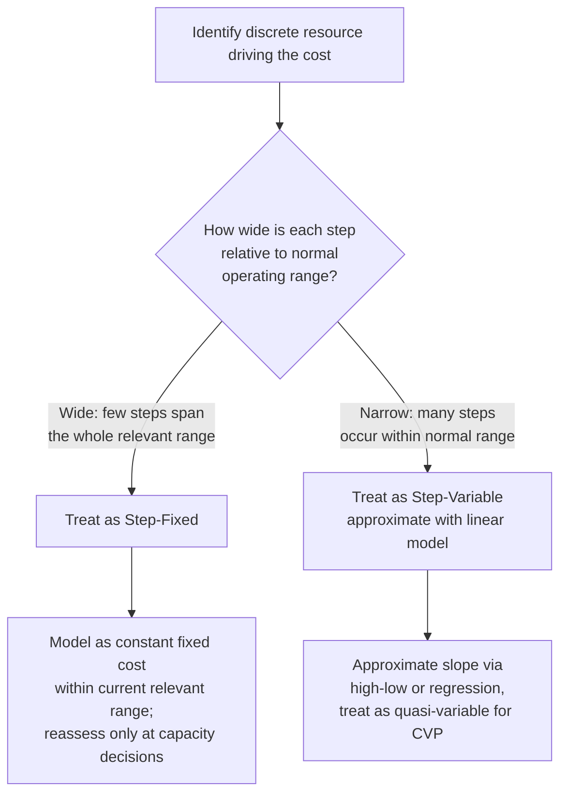

## Step Costs and Step Fixed versus Step Variable Behavior

### Definition

A step cost is an expense that remains **constant within a defined activity band** but jumps to a new constant level once activity crosses a threshold. Unlike pure fixed costs (constant everywhere) or pure variable costs (continuously proportional), step costs are **discontinuous** — cost is flat, then jumps, then flat again, forming a staircase pattern when graphed against activity.

$$TC = F_i \quad \text{for } Q_{i-1} < Q \leq Q_i$$

Where $F_i$ is the fixed cost level applicable within band $i$, bounded by activity thresholds $Q_{i-1}$ and $Q_i$. Each time activity crosses a threshold $Q_i$, the applicable cost resets to a new level $F_{i+1}$.

### Core Characteristics

**Key Points**

- **Discontinuous, not linear**: Total cost does not rise smoothly with each additional unit of activity; it holds flat, then jumps abruptly at threshold points.
- **Driven by resource indivisibility**: Step costs arise because certain resources (a supervisor, a machine, a delivery truck, a production shift) can only be acquired in discrete, indivisible chunks — you cannot hire "0.3 of a supervisor."
- **Width of the step matters**: The classification of a step cost as behaving more like fixed or more like variable cost depends on how wide each step is relative to the normal operating range.
- **Relevant range sensitivity**: Step costs are the clearest illustration of why the "relevant range" assumption exists in cost accounting — a cost that looks fixed within a narrow band of activity can turn out to be variable-like once a wider range is considered.
- **Capacity-driven**: Each step typically represents the addition (or removal) of a discrete unit of capacity, so step costs are closely tied to capacity planning and resource-utilization decisions.

### Step-Fixed vs. Step-Variable: The Core Distinction

Both are step costs, but they are distinguished by the **width of the step** relative to the range of activity a business normally operates within.

| Attribute | Step-Fixed Cost | Step-Variable Cost |
| --- | --- | --- |
| Step width | Wide — steps span a large range of activity | Narrow — steps occur frequently, in small increments |
| Practical treatment | Treated as fixed within the relevant range | Treated as approximately variable (steps are frequent enough to resemble a continuous slope) |
| Typical driver | Capacity additions (e.g., a new production line, a new warehouse) | Small-batch resource additions (e.g., one additional worker per 10-unit batch) |
| Example | Adding a second manufacturing plant when demand exceeds single-plant capacity | Adding one quality inspector for every 500 units produced |
| Modeling approach | Modeled as a fixed cost, revised only when a major capacity decision is made | Often approximated with a continuous variable-cost function for planning purposes |

### Graphical Behavior

Both are staircase functions, but the **step width** differs sharply between the two.

<svg xmlns="http://www.w3.org/2000/svg" viewBox="0 0 700 340">
<text x="350" y="20" text-anchor="middle" font-size="14" font-weight="bold" fill="#222">Step-Fixed vs. Step-Variable Cost (svg_diagram)</text>

<g transform="translate(20,45)">
<text x="150" y="0" text-anchor="middle" font-size="12" fill="#333">Step-Fixed (wide steps)</text>
<line x1="40" y1="240" x2="40" y2="20" stroke="#333" stroke-width="1.5" />
<line x1="40" y1="240" x2="300" y2="240" stroke="#333" stroke-width="1.5" />
<text x="10" y="30" font-size="9" fill="#333">Cost</text>
<text x="150" y="260" font-size="9" fill="#333">Activity</text>



```
<line x1="40" y1="200" x2="130" y2="200" stroke="#2b6cb0" stroke-width="2.5" />
<line x1="130" y1="200" x2="130" y2="140" stroke="#2b6cb0" stroke-width="1" stroke-dasharray="3,2" />
<line x1="130" y1="140" x2="220" y2="140" stroke="#2b6cb0" stroke-width="2.5" />
<line x1="220" y1="140" x2="220" y2="80" stroke="#2b6cb0" stroke-width="1" stroke-dasharray="3,2" />
<line x1="220" y1="80" x2="290" y2="80" stroke="#2b6cb0" stroke-width="2.5" />
<text x="60" y="255" font-size="8" fill="#666">1 plant</text>
<text x="150" y="255" font-size="8" fill="#666">2 plants</text>
<text x="235" y="255" font-size="8" fill="#666">3 plants</text>
```

</g>

<g transform="translate(370,45)">
<text x="150" y="0" text-anchor="middle" font-size="12" fill="#333">Step-Variable (narrow steps)</text>
<line x1="40" y1="240" x2="40" y2="20" stroke="#333" stroke-width="1.5" />
<line x1="40" y1="240" x2="300" y2="240" stroke="#333" stroke-width="1.5" />
<text x="10" y="30" font-size="9" fill="#333">Cost</text>
<text x="150" y="260" font-size="9" fill="#333">Activity</text>



```
<line x1="40" y1="220" x2="65" y2="220" stroke="#c05621" stroke-width="2" />
<line x1="65" y1="220" x2="65" y2="205" stroke="#c05621" stroke-width="1" stroke-dasharray="2,2" />
<line x1="65" y1="205" x2="90" y2="205" stroke="#c05621" stroke-width="2" />
<line x1="90" y1="205" x2="90" y2="190" stroke="#c05621" stroke-width="1" stroke-dasharray="2,2" />
<line x1="90" y1="190" x2="115" y2="190" stroke="#c05621" stroke-width="2" />
<line x1="115" y1="190" x2="115" y2="175" stroke="#c05621" stroke-width="1" stroke-dasharray="2,2" />
<line x1="115" y1="175" x2="140" y2="175" stroke="#c05621" stroke-width="2" />
<line x1="140" y1="175" x2="140" y2="160" stroke="#c05621" stroke-width="1" stroke-dasharray="2,2" />
<line x1="140" y1="160" x2="165" y2="160" stroke="#c05621" stroke-width="2" />
<line x1="165" y1="160" x2="165" y2="145" stroke="#c05621" stroke-width="1" stroke-dasharray="2,2" />
<line x1="165" y1="145" x2="190" y2="145" stroke="#c05621" stroke-width="2" />
<line x1="190" y1="145" x2="190" y2="130" stroke="#c05621" stroke-width="1" stroke-dasharray="2,2" />
<line x1="190" y1="130" x2="215" y2="130" stroke="#c05621" stroke-width="2" />
<line x1="215" y1="130" x2="215" y2="115" stroke="#c05621" stroke-width="1" stroke-dasharray="2,2" />
<line x1="215" y1="115" x2="290" y2="90" stroke="#c05621" stroke-width="2" />
<text x="150" y="255" font-size="8" fill="#666">frequent small increments ≈ linear</text>
```

</g>
</svg>

### Common Examples

| Cost Item | Step Trigger | Classification |
| --- | --- | --- |
| Production supervisor salary | One supervisor per 20 workers | Step-fixed (moderate width) |
| Manufacturing plant / production line | Capacity threshold (e.g., 50,000 units/year) | Step-fixed (wide steps) |
| Delivery trucks | One truck per ~200 daily delivery stops | Step-fixed to step-variable depending on fleet granularity |
| Quality control inspectors | One inspector per 500 units inspected | Step-variable (narrow steps) |
| Warehouse/storage space | Additional leased space per capacity block | Step-fixed |
| Customer service staff | One representative per N support tickets/day | Step-variable |
| Software licensing (seat-based tiers) | License tier thresholds (e.g., 1–50, 51–100 users) | Step-fixed |

### Decision Framework: Classifying a Step Cost



### Worked Example

A call center staffs customer service representatives. Each representative can handle up to 400 support tickets per month. Monthly base salary per representative: $3,200.

| Monthly Ticket Volume | Representatives Needed | Total Staffing Cost |
| --- | --- | --- |
| 1–400 | 1 | $3,200 |
| 401–800 | 2 | $6,400 |
| 801–1,200 | 3 | $9,600 |
| 1,201–1,600 | 4 | $12,800 |

**Example**

At 750 tickets: 2 representatives are required → total cost = $6,400 (not a fraction of a representative). Adding one more ticket at 401 tickets triggers hiring a second full representative, jumping total cost by $3,200 despite only a marginal increase in volume — the hallmark of step-cost discontinuity.

Because the step width here (400 tickets) is narrow relative to typical monthly ranges of several thousand tickets across a larger center, this cost is often modeled as **step-variable** and approximated with a linear cost driver rate of $3,200 / 400 = $8.00 per ticket for planning purposes, despite being fundamentally a step function.

### Relevance to Planning and CVP Analysis

- **Capacity planning**: Step-fixed cost decisions (adding a plant, a shift, a warehouse) are strategic, lumpy investments requiring separate capital budgeting analysis rather than routine CVP treatment.
- **Approximation in CVP models**: Traditional CVP analysis assumes a single linear cost function across the relevant range. Step-variable costs with narrow, frequent steps are commonly approximated as continuous variable costs since the approximation error is small when steps are numerous. Step-fixed costs with wide steps are instead treated as constants within the current relevant range, with explicit notes on the volume threshold at which the next relevant range (and next fixed cost level) begins.
- **Threshold-triggered budgeting**: Effective budgeting for step costs requires forecasting whether expected activity will approach a threshold, since crossing it triggers a discrete cost jump rather than a smooth incremental increase.

### Practical Pitfalls

- **Misapplying a linear model near a threshold**: Using a continuous variable-cost approximation when forecasted volume sits close to a step boundary can significantly understate costs if the threshold is crossed.
- **Ignoring step-down potential**: Step costs are not always one-directional; a sustained decline in activity can justify eliminating a step (e.g., reducing shifts), but organizations often exhibit "sticky" cost behavior, delaying step-downs due to severance costs, morale, or capacity retention for anticipated recovery. [Inference] The degree of cost stickiness varies by organization and cost item and is not a universal constant.
- **Confusing step-fixed with mixed cost**: A mixed cost has a continuous variable component layered on a fixed base; a step-fixed cost has no continuous variable component at all — it is flat within each band, with all variability occurring instantaneously at threshold crossings.
- **Granularity mismatch in forecasting models**: Building an annual budget model using monthly step data (or vice versa) can misrepresent when thresholds are actually crossed, especially for costs with seasonal activity patterns.

**Next Steps**

- Fixed Cost Definition and Characteristics
- Variable Cost Definition and Characteristics
- Mixed and Semi-Variable Cost Behavior
- Relevant Range and Its Limits on Cost Assumptions
- Capacity Planning and Capacity Cost Decisions
- Cost Stickiness and Asymmetric Cost Behavior
- Cost-Volume-Profit (CVP) Analysis and Breakeven Point
- Contribution Margin and Contribution Margin Ratio