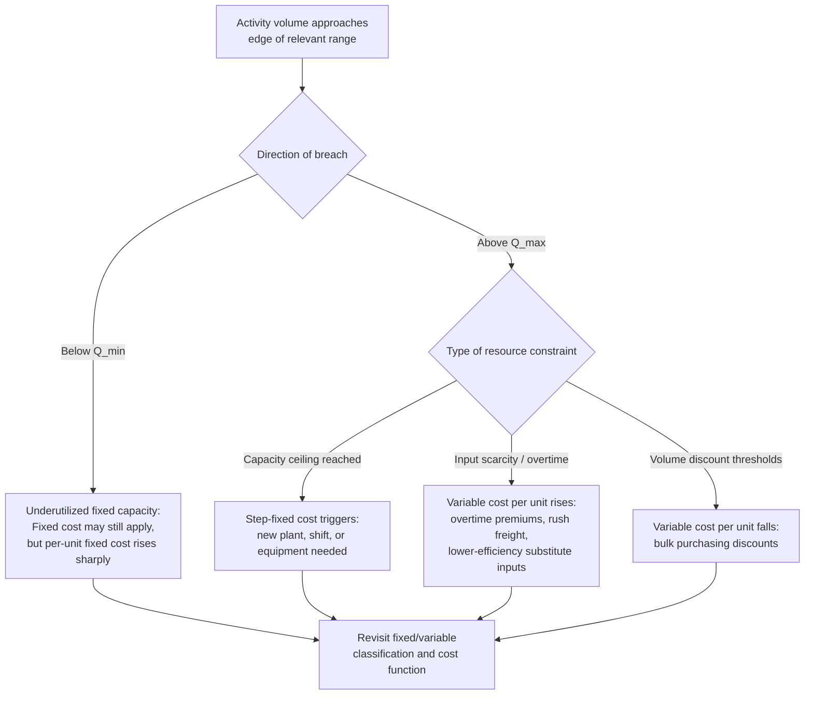

## The Relevant Range Concept

### Definition

The relevant range is the **span of activity volume within which a specific set of cost behavior assumptions — fixed cost totals, variable cost per unit, and linear cost relationships — is expected to hold true.** Outside this range, those assumptions break down: fixed costs may step to a new level, variable cost per unit may change due to efficiency or price effects, and previously linear cost functions may become nonlinear.

$$TC = F + vQ, \quad \text{valid only for } Q_{min} \leq Q \leq Q_{max}$$

Where $Q_{min}$ and $Q_{max}$ define the boundaries of the relevant range. The cost function above is an approximation valid strictly within these bounds — it is not a universal law of the cost item's behavior at all volumes.

### Core Characteristics

**Key Points**

- **Bounds cost assumptions, not just costs**: The relevant range doesn't just describe "normal" activity — it defines the boundary conditions under which the fixed/variable cost classifications used in budgeting and CVP analysis remain valid.
- **Tied to existing capacity and contracts**: The relevant range is typically bounded by current facility capacity, existing equipment capabilities, current supplier/labor agreements, and current staffing levels — all of which are fixed only until a structural change occurs.
- **Time-bound, not permanent**: A relevant range applies to a specific period and resource configuration. As capacity is added or removed, the relevant range shifts, and a new set of cost assumptions must be established.
- **Foundational to CVP and budgeting validity**: Every CVP formula, breakeven calculation, and flexible budget assumes operation within the relevant range. Extrapolating those formulas beyond it produces unreliable projections.
- **Explains apparent contradictions in cost classification**: The relevant range is why a cost can be legitimately called "fixed" for planning purposes even though, viewed over a long enough horizon or wide enough volume range, virtually all costs are variable.

### Why the Relevant Range Exists

Cost behavior is fundamentally a function of the underlying resources and contracts supporting operations. Within a given configuration of plant, equipment, staffing, and supplier agreements:

- **Fixed costs stay fixed** because the resources creating them (leases, salaried staff, depreciation) don't need to change to support any volume within that configuration's capacity.
- **Variable cost per unit stays constant** because input prices (materials, per-unit labor rates) are typically locked in at prevailing terms and efficiency levels don't materially shift.

Once activity approaches the edges of what the current configuration can support, these assumptions break down for structural reasons — not because the underlying accounting theory changes, but because the physical and contractual resources are being pushed past what they were built or priced for.

### Graphical Behavior

The relevant range appears as the bounded segment of the cost line where a fixed cost is genuinely flat and a variable cost per unit is genuinely constant. Outside the shaded band, the same cost item may behave differently.

<svg xmlns="http://www.w3.org/2000/svg" viewBox="0 0 680 320">
<text x="340" y="20" text-anchor="middle" font-size="14" font-weight="bold" fill="#222">The Relevant Range (svg_diagram)</text>
<g transform="translate(40,45)">
<line x1="40" y1="230" x2="40" y2="20" stroke="#333" stroke-width="1.5" />
<line x1="40" y1="230" x2="580" y2="230" stroke="#333" stroke-width="1.5" />
<text x="10" y="30" font-size="10" fill="#333">Fixed Cost ($)</text>
<text x="290" y="255" font-size="10" fill="#333">Activity Volume (Q)</text>



```

<rect x="200" y="20" width="220" height="210" fill="#bee3f8" opacity="0.35" />
<text x="310" y="35" text-anchor="middle" font-size="10" fill="#2b6cb0" font-weight="bold">Relevant Range</text>


<line x1="40" y1="200" x2="200" y2="200" stroke="#999" stroke-width="1.5" stroke-dasharray="4,3" />

<line x1="200" y1="140" x2="420" y2="140" stroke="#2b6cb0" stroke-width="2.5" />

<line x1="420" y1="140" x2="420" y2="80" stroke="#c05621" stroke-width="1.5" stroke-dasharray="4,3" />
<line x1="420" y1="80" x2="560" y2="80" stroke="#999" stroke-width="1.5" stroke-dasharray="4,3" />

<text x="90" y="215" font-size="8" fill="#666">below capacity —</text>
<text x="90" y="225" font-size="8" fill="#666">assumption unverified</text>
<text x="440" y="70" font-size="8" fill="#666">above capacity —</text>
<text x="440" y="60" font-size="8" fill="#c05621">new fixed cost tier</text>

<line x1="200" y1="230" x2="200" y2="20" stroke="#718096" stroke-width="1" stroke-dasharray="2,2" />
<line x1="420" y1="230" x2="420" y2="20" stroke="#718096" stroke-width="1" stroke-dasharray="2,2" />
<text x="195" y="245" font-size="9" fill="#333">Q_min</text>
<text x="415" y="245" font-size="9" fill="#333">Q_max</text>
```

</g>
</svg>

### How Costs Behave Outside the Relevant Range



### Worked Example

A bakery's production facility has a single oven line with a practical capacity of 8,000 loaves per month. Within that capacity:

- Fixed costs (rent, oven lease, head baker salary): $14,000/month, flat from 0 to 8,000 loaves.
- Variable cost per loaf (flour, yeast, packaging, hourly staff): $1.35/loaf, constant across that range.

Estimated cost function: $TC = 14{,}000 + 1.35Q$, valid for $0 \leq Q \leq 8{,}000$.

**Example**

At 6,000 loaves: $TC = 14{,}000 + (1.35 \times 6{,}000) = 14{,}000 + 8{,}100 = \$22{,}100$ — within the relevant range, the formula is reliable.

If demand grows to 9,500 loaves/month, the facility exceeds its 8,000-loaf capacity. To meet demand, the bakery must either:

- Add overtime shifts, raising variable cost per loaf to $1.68 (overtime premium) for units above 8,000, or
- Lease a second oven, adding a step-fixed cost of $6,500/month for the whole batch above capacity.

Applying the original formula $TC = 14{,}000 + 1.35(9{,}500) = \$26{,}825$ at this volume would **understate** the true cost, because 9,500 loaves falls outside the relevant range where $14,000 and $1.35 were validated.

### Relevant Range vs. Other Cost Behavior Concepts

| Concept | Relationship to Relevant Range |
| --- | --- |
| Fixed cost | Assumed flat *only* within the relevant range; steps to a new level outside it |
| Variable cost per unit | Assumed constant *only* within the relevant range; shifts due to discounts, overtime, or efficiency changes outside it |
| Step cost | Each "step" in a step-cost function effectively defines its own relevant range with a distinct fixed cost level |
| Mixed cost | The estimated fixed ($F$) and variable ($v$) components from high-low or regression analysis are valid strictly within the range of the historical data used to estimate them |
| CVP / breakeven analysis | All breakeven and target-profit calculations are valid only within the relevant range; breakeven volumes projected far outside historical activity levels carry elevated uncertainty |

### Practical Implications for Cost Estimation

- **High-low and regression methods are relevant-range-bound**: Any cost function estimated from historical data (see high-low method, regression analysis) is only valid across the activity range actually observed in that historical data — extrapolation beyond the sampled range is a common source of forecasting error.
- **Multiple relevant ranges may coexist**: A firm operating multiple product lines, shifts, or facilities may need distinct cost functions (and distinct relevant ranges) for each, rather than a single blended cost function across all operations.
- **Capacity decisions redefine the relevant range**: Any capital investment or divestment (new machinery, plant closure, workforce reduction) creates a new relevant range with its own fixed cost baseline and variable cost rate, requiring the cost function to be re-derived rather than assumed to hold.

### Practical Pitfalls

- **Extrapolation risk**: Applying a cost function to volumes well outside the range used to estimate it, without adjustment, is one of the most common analytical errors in cost estimation and budgeting.
- **Assuming an infinite relevant range**: Textbook problems sometimes omit the relevant range for simplicity, which can lead learners to treat fixed and variable cost classifications as universally true rather than range-bound approximations. [Inference] In practice, most real-world relevant ranges are narrower than the full historical range of activity a business has ever experienced, since capacity configurations change over time.
- **Ignoring asymmetric effects at the boundaries**: The cost consequences of exceeding $Q_{max}$ (e.g., overtime, rush costs) are often more severe per unit than the cost benefits of operating below $Q_{min}$ (e.g., simply underutilized fixed capacity), and treating both boundaries as symmetric can distort risk assessments.

**Next Steps**

- Fixed Cost Definition and Characteristics
- Variable Cost Definition and Characteristics
- Mixed and Semi-Variable Cost Behavior
- Step Costs and Step-Fixed versus Step-Variable Behavior
- Cost Estimation Methods: High-Low, Scatterplot, and Regression
- Cost-Volume-Profit (CVP) Analysis and Breakeven Point
- Capacity Planning and Capacity Cost Decisions
- Flexible Budgeting Across Multiple Activity Levels