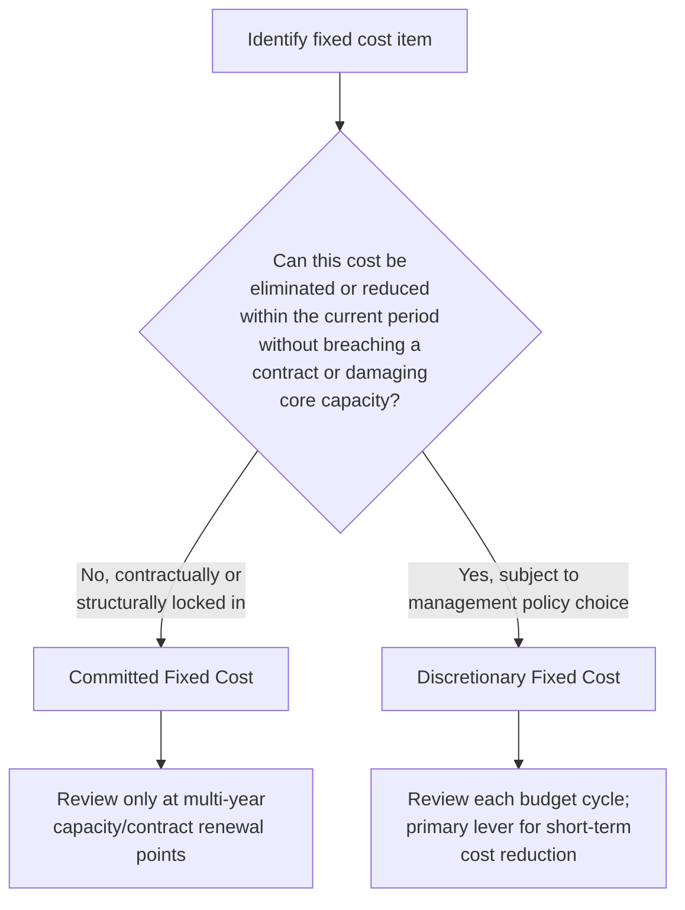

## Committed versus Discretionary Fixed Costs

### Definition

Fixed costs, while uniform in their *behavior* (constant total within the relevant range), are not uniform in their **origin or flexibility**. They are subdivided into two categories based on how easily management can alter them in the short run:

- **Committed fixed costs**: Long-term, structural costs arising from ownership of facilities, equipment, and organizational infrastructure. They cannot be significantly reduced in the short term without impairing the organization's fundamental operating capacity.
- **Discretionary fixed costs** (also called *managed* or *programmed* costs): Costs set annually or periodically by management decision, not tied to a fixed long-term commitment, and therefore adjustable in the short run with comparatively lower structural consequence.

Both categories satisfy the same cost-behavior definition — $TC = F$, constant across activity volume within the relevant range — but they differ sharply in their **adjustability horizon**.

### Core Characteristics

**Key Points**

- **Time horizon of commitment**: Committed fixed costs typically stem from multi-year contracts, capital investments, or depreciation schedules; discretionary fixed costs are typically re-authorized on an annual or periodic budget cycle.
- **Reversibility**: Discretionary fixed costs can generally be reduced or eliminated within a single budget period with limited operational damage; committed fixed costs cannot be reduced without triggering layoffs, breach of contract, asset write-downs, or loss of core capacity.
- **Origin of the decision**: Committed costs stem from strategic, capacity-defining decisions made in prior periods (e.g., signing a 10-year lease). Discretionary costs stem from current-period policy choices (e.g., this year's advertising budget).
- **Behavioral consistency, structural difference**: Both are "fixed" in the cost-behavior sense of not varying with volume, but the *reason* they don't vary differs — committed costs don't vary because contracts and physical capacity constrain them; discretionary costs don't vary with volume simply because management chose a flat amount for the period, independent of output.
- **Risk implications**: A high proportion of committed fixed costs raises operating leverage and financial risk, since those costs must be paid regardless of downturns in activity; discretionary fixed costs offer a lever for rapid cost-cutting during a downturn.

### Comparison Table

| Attribute | Committed Fixed Costs | Discretionary Fixed Costs |
| --- | --- | --- |
| Time horizon | Long-term (years) | Short-term (typically one budget period) |
| Origin | Prior strategic/capacity decisions | Current management policy |
| Adjustability | Low — reduction requires major structural change | High — can be cut or reallocated quickly |
| Reversal cost | High (contract penalties, layoffs, asset losses) | Low (simply reduce next period's budget) |
| Relationship to output capacity | Directly defines the organization's operating capacity | Does not define capacity; supports discretionary programs |
| Typical review cycle | Multi-year (lease renewal, capital budgeting cycle) | Annual (budget approval cycle) |

### Common Examples

| Cost Item | Category | Why |
| --- | --- | --- |
| Building lease (10-year term) | Committed | Legally binding contract; breaking it incurs penalties |
| Depreciation on owned equipment | Committed | Reflects a prior capital investment; sunk in the accounting sense |
| Salaried core production/administrative staff | Committed | Layoffs carry severance costs and capacity/knowledge loss |
| Property taxes and insurance | Committed | Tied to owned or leased facilities, contractually or legally fixed |
| Long-term loan interest/principal | Committed | Contractual debt service obligation |
| Advertising and marketing budget | Discretionary | Set annually by management policy; can be cut with limited immediate operational harm |
| Employee training and development programs | Discretionary | Budgeted per period; reducible without breaching contracts |
| Research and development spending | Discretionary | Often set as a percentage of revenue or a fixed annual allocation, revisited yearly |
| Charitable/community contributions | Discretionary | Entirely at management's discretion, no contractual obligation |
| Consulting and professional development fees | Discretionary | Engaged per period as needed; not a standing structural commitment |

### Graphical Behavior

Both categories appear identical on a standard cost-volume graph (a flat horizontal line), since the distinction is not about behavior relative to activity but about **adjustability relative to time and management decision**.

<svg xmlns="http://www.w3.org/2000/svg" viewBox="0 0 680 300">
<text x="340" y="20" text-anchor="middle" font-size="14" font-weight="bold" fill="#222">Committed vs. Discretionary Fixed Costs (svg_diagram)</text>
<g transform="translate(40,45)">
<line x1="40" y1="220" x2="40" y2="20" stroke="#333" stroke-width="1.5" />
<line x1="40" y1="220" x2="580" y2="220" stroke="#333" stroke-width="1.5" />
<text x="10" y="30" font-size="10" fill="#333">Cost ($)</text>
<text x="290" y="245" font-size="10" fill="#333">Activity Volume (identical behavior on this axis)</text>



```

<line x1="40" y1="80" x2="560" y2="80" stroke="#2b6cb0" stroke-width="3" />
<text x="565" y="85" font-size="10" fill="#2b6cb0">Committed</text>


<line x1="40" y1="160" x2="560" y2="160" stroke="#c05621" stroke-width="2" stroke-dasharray="6,3" />
<text x="565" y="165" font-size="10" fill="#c05621">Discretionary</text>


<line x1="300" y1="160" x2="300" y2="195" stroke="#c05621" stroke-width="1.5" marker-end="url(#arrowhead)" />
<text x="310" y="195" font-size="9" fill="#c05621">reducible next period</text>


<text x="300" y="70" font-size="9" fill="#2b6cb0">locked in by contract/capacity</text>

</g>
</svg>

### Decision Framework: Classifying a Fixed Cost



### Worked Example

A mid-sized manufacturing firm's annual fixed cost budget:

| Cost Item | Amount | Category |
| --- | --- | --- |
| Factory lease (8-year term, 3 years remaining) | $480,000 | Committed |
| Equipment depreciation | $210,000 | Committed |
| Core salaried staff (production management, accounting) | $650,000 | Committed |
| Property insurance | $45,000 | Committed |
| Marketing and advertising | $180,000 | Discretionary |
| Employee training programs | $60,000 | Discretionary |
| R&D allocation | $220,000 | Discretionary |
| **Total Fixed Costs** | **$1,845,000** | — |
| **Committed subtotal** | **$1,385,000 (75%)** | — |
| **Discretionary subtotal** | **$460,000 (25%)** | — |

**Example**

If the firm faces a revenue downturn requiring an immediate 15% reduction in fixed costs ($276,750), management has meaningful short-term flexibility only over the $460,000 discretionary subtotal. Cutting the full $276,750 from discretionary spending alone would require eliminating roughly 60% of the discretionary budget — a substantial reduction, but one that avoids breaching the lease, triggering layoffs of core staff, or writing down committed equipment. Attempting the same cut from committed costs would likely require lease renegotiation, equipment disposal, or workforce reductions with material severance and capacity consequences.

### Relevance to Strategic and Operational Decisions

- **Downturn resilience**: Firms with a higher proportion of discretionary fixed costs relative to committed fixed costs have greater short-term flexibility to respond to demand shocks without structural disruption.
- **Operating leverage implications**: A higher committed fixed cost base increases operating leverage — profit swings more dramatically with volume changes — because that portion of cost cannot be scaled down when revenue falls (see Degree of Operating Leverage).
- **Budgeting cycle relevance**: Discretionary fixed costs are the primary target of **zero-based budgeting** approaches, since each period's discretionary allocation is, by definition, a fresh management decision rather than an inherited structural obligation.
- **Capital budgeting linkage**: Committed fixed costs originate from capital budgeting decisions (facility, equipment investment); understanding this category bridges cost behavior analysis with longer-horizon capital investment appraisal.

### Practical Pitfalls

- **Treating discretionary costs as freely reversible without consequence**: While easier to cut than committed costs, discretionary costs (training, R&D, marketing) often carry longer-term strategic costs (reduced competitiveness, talent attrition, lost market share) even though they lack immediate contractual penalties. [Inference] The magnitude of these longer-term consequences is context-specific and not directly observable from the cost classification alone.
- **Misclassifying near-committed discretionary costs**: Some discretionary costs (e.g., a multi-year marketing sponsorship agreement) can behave more like committed costs once contractually signed, even though the underlying spending category is typically discretionary.
- **Assuming committed costs are entirely unchangeable**: Over a sufficiently long horizon, committed costs do become adjustable (lease non-renewal, equipment disposal at end of useful life) — the "committed" label reflects short-to-medium-term inflexibility, not permanent fixity. [Unverified] The specific horizon at which a committed cost becomes practically adjustable depends on contract terms and asset useful life, which vary by item.
- **Overlooking the base-year effect in discretionary budgeting**: Because discretionary costs are commonly set as an increment over the prior year's budget rather than justified from zero, they can accumulate structural rigidity over time even without a formal long-term commitment, blurring the line between the two categories in practice.

**Next Steps**

- Fixed Cost Definition and Characteristics
- Variable Cost Definition and Characteristics
- Step Costs and Step-Fixed versus Step-Variable Behavior
- The Relevant Range Concept
- Degree of Operating Leverage (DOL) and Cost Structure Risk
- Zero-Based Budgeting Methodology
- Capital Budgeting and Long-Term Investment Appraisal
- Cost Stickiness and Asymmetric Cost Behavior