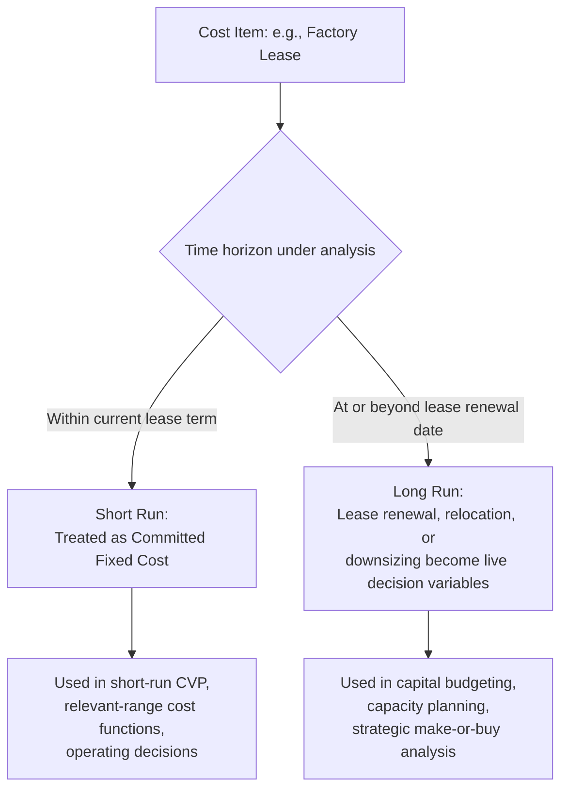

## Short Run versus Long Run Cost Behavior


### Definition

Cost behavior classifications — fixed, variable, mixed, and step costs — are not absolute properties of a cost item; they are **time-horizon dependent**. The short run and long run are defined not by a fixed calendar duration but by whether the resource(s) generating the cost can be adjusted:

- **Short run**: The period during which at least one input or resource is fixed in quantity — capacity cannot be materially changed, so costs tied to that fixed input behave as fixed costs regardless of activity volume.
- **Long run**: The period sufficiently extended that **all inputs and resources become variable** — every cost, including those classified as "fixed" in the short run, can in principle be adjusted, eliminated, or reconfigured.

$$\lim_{\text{horizon} \to \text{long run}} F \rightarrow \text{adjustable}$$

This is the economic foundation underlying the accounting convention that fixed costs are "fixed" only within a defined relevant range and time period — not universally or permanently.

### Core Characteristics

**Key Points**

- **All costs are ultimately variable**: In the long run, given enough time, every committed fixed cost — leases, equipment, even core staffing — can be renegotiated, replaced, or eliminated, making the fixed/variable distinction a short-run planning convention rather than an immutable classification.
- **The dividing line is resource flexibility, not calendar time**: The short run/long run boundary is defined by contract terms, asset useful lives, and notice periods — not a fixed number of months or years. A month-to-month lease may already be "long run" for that cost, while a 20-year facility mortgage remains "short run" for a decade or more.
- **Different costs have different short-run/long-run boundaries simultaneously**: At any given moment, a firm may be in the "short run" for its facility lease (locked in for years) while simultaneously in the "long run" for its temporary staffing (adjustable within weeks) — the horizon is cost-item-specific, not organization-wide.
- **Relevant range is a short-run construct**: The relevant range concept — the activity band within which current fixed/variable classifications hold — is inherently a short-run tool. Long-run analysis explicitly steps outside any single relevant range to consider entirely new capacity configurations.
- **Committed vs. discretionary fixed costs sit at different points on this spectrum**: Discretionary fixed costs convert to "variable" (adjustable) faster than committed fixed costs when moving from short run toward long run, since they lack the contractual lock-in of committed costs.

### Short Run vs. Long Run: Comparison Table

| Attribute | Short Run | Long Run |
| --- | --- | --- |
| Resource flexibility | At least one input fixed (capacity constrained) | All inputs variable; capacity itself is a decision variable |
| Fixed costs | Genuinely fixed within the current relevant range | Effectively variable — subject to renegotiation, replacement, or elimination |
| Relevant range | A defined, bounded concept | Not applicable in the same sense — multiple relevant ranges can be chosen |
| Typical decisions | Operating decisions: pricing, production scheduling, order acceptance | Structural decisions: capacity expansion, plant location, make-or-buy, market entry/exit |
| Cost-volume-profit (CVP) applicability | Directly applicable — assumes a stable fixed cost base | Requires re-derivation for each candidate capacity configuration before CVP applies |
| Typical horizon example | Current lease term, current equipment's useful life | Beyond next lease renewal, next major capital investment cycle |

### How the Horizon Reclassifies the Same Cost



### Graphical Behavior

As the planning horizon extends, the "step" at which a fixed cost can change becomes reachable — a cost that appears as a flat line in short-run analysis becomes one segment of a step-cost or long-run average cost curve when the horizon widens.

<svg xmlns="http://www.w3.org/2000/svg" viewBox="0 0 680 320">
<text x="340" y="20" text-anchor="middle" font-size="14" font-weight="bold" fill="#222">Short-Run Fixed Cost vs. Long-Run Adjustability (svg_diagram)</text>
<g transform="translate(40,45)">
<line x1="40" y1="240" x2="40" y2="20" stroke="#333" stroke-width="1.5" />
<line x1="40" y1="240" x2="580" y2="240" stroke="#333" stroke-width="1.5" />
<text x="10" y="30" font-size="10" fill="#333">Cost ($)</text>
<text x="290" y="260" font-size="10" fill="#333">Planning Horizon →</text>



```

<rect x="40" y="20" width="180" height="220" fill="#bee3f8" opacity="0.3" />
<text x="130" y="35" text-anchor="middle" font-size="10" fill="#2b6cb0" font-weight="bold">Short Run</text>
<line x1="40" y1="150" x2="220" y2="150" stroke="#2b6cb0" stroke-width="2.5" />
<text x="60" y="170" font-size="9" fill="#2b6cb0">fixed within current lease term</text>


<line x1="220" y1="240" x2="220" y2="20" stroke="#718096" stroke-width="1" stroke-dasharray="2,2" />
<text x="222" y="35" font-size="8" fill="#666">lease renewal point</text>


<rect x="220" y="20" width="340" height="220" fill="#fed7aa" opacity="0.25" />
<text x="390" y="35" text-anchor="middle" font-size="10" fill="#c05621" font-weight="bold">Long Run</text>
<line x1="220" y1="150" x2="260" y2="150" stroke="#c05621" stroke-width="2" stroke-dasharray="4,2" />
<line x1="260" y1="150" x2="260" y2="90" stroke="#c05621" stroke-width="1.5" stroke-dasharray="3,2" />
<line x1="260" y1="90" x2="560" y2="90" stroke="#c05621" stroke-width="2" />
<text x="400" y="80" font-size="9" fill="#c05621">renegotiated / new facility size chosen</text>
```

</g>
</svg>

### Worked Example

A logistics company leases a warehouse under a 5-year contract at $18,000/month, currently in year 2 of the lease (3 years remaining).

**Short-run view (current 3-year window)**: The $18,000/month lease is a committed fixed cost. CVP analysis, order-acceptance decisions, and monthly budgeting all treat this as fixed regardless of shipping volume — the relevant range is bounded by the current warehouse's physical capacity.

**Example**

At the current volume of 40,000 units/month, capacity utilization is 80% of the warehouse's 50,000-unit practical capacity — well within the relevant range, so the $18,000/month fixed cost assumption holds for short-run pricing and volume decisions.

**Long-run view (beyond the 3-year remaining term, or considering early termination)**: Once the horizon extends to or past the lease's expiration, the $18,000/month cost becomes a decision variable. Management can choose to:

- Renew at the same size,
- Downsize to a smaller facility if volume has structurally declined,
- Expand to a larger facility if volume has grown near or past the 50,000-unit capacity ceiling, or
- Relocate entirely.

At this point, the cost that was "fixed" throughout the short-run analysis becomes one of several candidate cost structures being evaluated in a capital budgeting or facility-planning decision — the long-run analysis is precisely the exercise of choosing which new "short run" configuration (and its own new relevant range) to lock into next.

### Relevance to Managerial Decision-Making

| Decision Type | Horizon | Cost Behavior Assumption Used |
| --- | --- | --- |
| Accept a one-time special order at a discounted price | Short run | Fixed costs are sunk/irrelevant; only variable costs matter for the incremental decision |
| Set the annual sales price and budget | Short run | Current fixed cost base and variable cost per unit, per the relevant range |
| Decide whether to build a second production facility | Long run | All costs, including current "fixed" costs, are decision variables; requires comparing entirely new cost structures |
| Renegotiate a union labor contract | Long run (relative to that specific committed cost) | The current labor cost structure is one option among several being evaluated for the next contract period |
| Evaluate outsourcing vs. in-house production (make-or-buy) | Long run | In-house fixed costs are only avoidable if the underlying resources (equipment, staff) can actually be redeployed or eliminated — a long-run question |

### Connection to Committed and Discretionary Fixed Costs

The short run/long run distinction explains *why* committed and discretionary fixed costs behave differently under pressure: discretionary fixed costs effectively have a much shorter "long run" — they can be reclassified as adjustable within a single budget cycle — while committed fixed costs retain short-run fixed behavior for a much longer horizon, bounded by contract terms and asset useful lives. The short run/long run framework is the general principle; committed vs. discretionary is its practical application to a single budget period.

### Practical Pitfalls

- **Applying short-run CVP formulas to long-run capacity decisions**: A breakeven calculation using the current fixed cost base is invalid once a decision under consideration (e.g., building a new plant) would itself change that fixed cost base — this is a common error when short-run tools are misapplied to structural decisions.
- **Treating "long run" as a fixed calendar period across all cost items**: Because different costs have different contract terms and asset lives, there is no single "long run" date for an entire organization — analysis must specify which cost item's horizon is under consideration. [Inference] Conflating a company-wide "long run" with any single cost item's specific adjustability horizon is a frequent source of confusion in applied cost analysis.
- **Ignoring switching and transition costs when moving to a "long-run" configuration**: Even though all costs are theoretically variable in the long run, transitioning to a new configuration (relocating, retraining, breaking a lease) typically incurs its own one-time costs that must be factored into the long-run decision, not just the resulting new steady-state cost structure. [Unverified] The magnitude of these transition costs is specific to each situation and cannot be generalized.
- **Sunk cost fallacy in long-run analysis**: Long-run decisions should evaluate costs and benefits prospectively; costs already committed and unrecoverable under the current structure (sunk costs) are irrelevant to the forward-looking choice among new configurations, even though they were correctly treated as fixed in short-run analysis.

**Next Steps**

- Committed versus Discretionary Fixed Costs
- The Relevant Range Concept
- Step Costs and Step-Fixed versus Step-Variable Behavior
- Sunk Costs and Their Irrelevance to Decision-Making
- Make-or-Buy Analysis and Relevant Costing
- Capital Budgeting and Long-Term Investment Appraisal
- Degree of Operating Leverage (DOL) and Cost Structure Risk
- Cost-Volume-Profit (CVP) Analysis and Breakeven Point