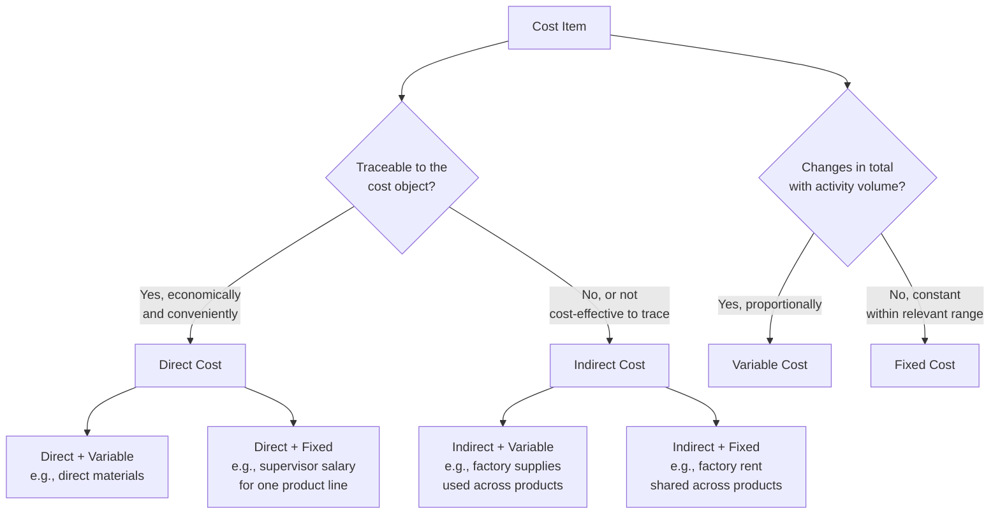

## Direct and Indirect Costs versus Fixed and Variable Costs


### Definition

Direct/indirect and fixed/variable are **two independent classification dimensions** applied to the same underlying cost items. They answer fundamentally different questions and must not be conflated:

- **Direct vs. Indirect** answers: *"Can this cost be economically and conveniently traced to a specific cost object?"* This is a question of **traceability**.
- **Fixed vs. Variable** answers: *"Does this cost's total amount change in proportion to activity volume?"* This is a question of **behavior**.

Because these are orthogonal dimensions, any cost item can theoretically fall into any one of four combinations, and correctly classifying a cost requires answering both questions separately rather than assuming one implies the other.

### The Two Independent Dimensions

**Key Points**

- **Traceability (Direct/Indirect) depends on the cost object chosen**: A cost is direct or indirect *relative to* a specific cost object (a product, department, project, or customer) — the same cost can be direct with respect to one cost object and indirect with respect to another.
- **Behavior (Fixed/Variable) depends on the activity driver chosen**: A cost is fixed or variable *relative to* a specific activity measure (units produced, machine hours, sales volume) — the same cost can appear fixed relative to one driver and variable relative to another.
- **No inherent correlation between the two dimensions**: Direct costs are not automatically variable, and indirect costs are not automatically fixed, though this is a common misconception. Each cost must be evaluated on both dimensions independently.
- **Both classifications serve different decision purposes**: Direct/indirect classification supports cost tracing, product costing, and responsibility accounting. Fixed/variable classification supports CVP analysis, budgeting, and short-run decision-making.

### The Four-Quadrant Framework



### Comparison Table: Two Dimensions, Not One

|  | **Fixed** | **Variable** |
| --- | --- | --- |
| **Direct** | Direct + Fixed: e.g., a salaried supervisor assigned exclusively to one product line — traceable to that line, but salary doesn't change with units produced | Direct + Variable: e.g., direct materials for a specific product — traceable to the product, and total cost scales with units produced |
| **Indirect** | Indirect + Fixed: e.g., factory building depreciation shared across all product lines — not traceable to any one product, and constant regardless of volume | Indirect + Variable: e.g., factory-wide utility costs tied to machine hours across multiple products — not traceable to one product, but total cost scales with overall activity |

### Worked Examples by Quadrant

**Example**

*Direct + Variable* — Direct materials (e.g., fabric used in a specific garment line): Traceable directly to that product line (direct), and total material cost rises proportionally with units produced (variable).

*Direct + Fixed* — A dedicated production line manager's salary, assigned solely to Product Line A: Traceable directly to Product Line A (direct), but the salary is a fixed monthly amount regardless of how many units that line produces (fixed).

*Indirect + Variable* — Factory-wide electricity consumed by shared manufacturing equipment, allocated across multiple product lines based on machine hours: Not traceable to any single product without an allocation method (indirect), but total electricity cost rises with overall machine usage across all lines (variable).

*Indirect + Fixed* — Factory building depreciation, shared by all product lines manufactured in that facility: Not traceable to any single product without allocation (indirect), and the depreciation charge is the same each period regardless of production volume (fixed).

### Why the Two Dimensions Are Often Confused

A common but incorrect heuristic is "direct costs are variable, indirect costs are fixed." This pattern appears frequently *in practice* because:

- Direct materials and direct labor (piece-rate) are, in many manufacturing settings, both directly traceable *and* variable — reinforcing the association.
- Overhead costs (indirect by nature, since they support multiple cost objects) are often dominated by fixed items like rent and depreciation — reinforcing the association from the other direction.

However, this is a **correlation observed in common cases, not a logical rule**, and numerous legitimate exceptions exist (see the Direct+Fixed and Indirect+Variable quadrants above). Relying on the heuristic without verifying each cost independently produces classification errors, particularly in service industries, project-based businesses, and multi-product manufacturing environments where dedicated fixed resources per line or project are common.

### Relevance to Cost Object Selection

Because traceability is defined relative to the chosen cost object, the same cost item can shift between direct and indirect depending on what is being costed:

| Cost Item | Cost Object: "Product A" | Cost Object: "Factory as a whole" |
| --- | --- | --- |
| Dedicated machine operator for Product A's line | Direct (traceable to Product A) | Indirect (part of overall factory labor pool, not traced to individual output) |
| Factory rent | Indirect (shared across all products) | Direct (traceable to "the factory" as the cost object itself) |

This illustrates that direct/indirect is not an intrinsic property of the cost — it is a relationship between the cost and a specifically defined cost object.

### Relevance to Costing Systems and Decision-Making

| Application | Which Dimension Matters | Why |
| --- | --- | --- |
| Product costing (assigning cost to units) | Direct/Indirect | Determines whether a cost is traced directly or allocated via a cost driver/overhead rate |
| Cost-Volume-Profit (CVP) analysis | Fixed/Variable | Determines contribution margin and breakeven calculations, independent of traceability |
| Responsibility accounting / departmental performance evaluation | Direct/Indirect | Determines which costs a department manager can be held accountable for (their direct, controllable costs) |
| Special order / short-run pricing decisions | Fixed/Variable | Only variable costs (and avoidable fixed costs) are relevant to the incremental decision, regardless of traceability |
| Activity-Based Costing (ABC) | Both, jointly | ABC refines indirect cost allocation using multiple activity drivers, effectively making previously "indirect" costs more precisely traceable while still assessing each cost pool's behavior relative to its driver |

### Graphical Representation of the Two Independent Axes

<svg xmlns="http://www.w3.org/2000/svg" viewBox="0 0 640 400">
<text x="320" y="20" text-anchor="middle" font-size="14" font-weight="bold" fill="#222">Two Independent Cost Classification Axes (svg_diagram)</text>
<g transform="translate(70,50)">

<line x1="0" y1="300" x2="0" y2="0" stroke="#333" stroke-width="1.5" />
<line x1="0" y1="300" x2="480" y2="300" stroke="#333" stroke-width="1.5" />
<text x="-45" y="150" font-size="11" fill="#333" transform="rotate(-90 -45,150)">Traceability</text>
<text x="180" y="325" font-size="11" fill="#333">Behavior</text>



```
<text x="-30" y="80" font-size="10" fill="#333">Direct</text>
<text x="-38" y="230" font-size="10" fill="#333">Indirect</text>
<text x="90" y="315" font-size="10" fill="#333">Fixed</text>
<text x="330" y="315" font-size="10" fill="#333">Variable</text>


<line x1="240" y1="0" x2="240" y2="300" stroke="#ccc" stroke-width="1" stroke-dasharray="3,3" />
<line x1="0" y1="150" x2="480" y2="150" stroke="#ccc" stroke-width="1" stroke-dasharray="3,3" />


<rect x="10" y="10" width="220" height="130" fill="#bee3f8" opacity="0.3" />
<text x="30" y="35" font-size="10" fill="#2b6cb0" font-weight="bold">Direct + Fixed</text>
<text x="30" y="50" font-size="8" fill="#2c5282">e.g., dedicated line</text>
<text x="30" y="62" font-size="8" fill="#2c5282">supervisor salary</text>

<rect x="250" y="10" width="220" height="130" fill="#c6f6d5" opacity="0.3" />
<text x="270" y="35" font-size="10" fill="#276749" font-weight="bold">Direct + Variable</text>
<text x="270" y="50" font-size="8" fill="#276749">e.g., direct materials</text>

<rect x="10" y="160" width="220" height="130" fill="#fed7aa" opacity="0.3" />
<text x="30" y="185" font-size="10" fill="#c05621" font-weight="bold">Indirect + Fixed</text>
<text x="30" y="200" font-size="8" fill="#9c4221">e.g., factory depreciation</text>

<rect x="250" y="160" width="220" height="130" fill="#fbb6ce" opacity="0.3" />
<text x="270" y="185" font-size="10" fill="#97266d" font-weight="bold">Indirect + Variable</text>
<text x="270" y="200" font-size="8" fill="#702459">e.g., shared utility cost</text>
<text x="270" y="212" font-size="8" fill="#702459">by machine hours</text>
```

</g>
</svg>

### Practical Pitfalls

- **Assuming direct implies variable**: A dedicated fixed resource (e.g., a machine or supervisor assigned exclusively to one product) remains direct even though its cost doesn't change with output — misclassifying it as variable would distort per-unit cost projections at different volumes.
- **Assuming indirect implies fixed**: Shared costs that scale with aggregate activity (e.g., indirect materials, shared utilities tied to total machine hours) are indirect but variable — treating them as fixed overhead understates cost sensitivity to volume changes across the shared cost pool.
- **Conflating "cost object" scope when discussing traceability**: Classifying a cost as "indirect" without specifying the cost object in question is ambiguous — the same cost can be indirect to one cost object and direct to another, so any direct/indirect classification statement is incomplete without naming the cost object.
- **Using direct/indirect terminology in CVP and behavior discussions**: Because CVP analysis, breakeven calculations, and contribution margin all depend strictly on the fixed/variable dimension, using "direct cost" as a proxy for "variable cost" in these contexts risks including direct-but-fixed costs in a variable cost pool, distorting contribution margin calculations. [Inference] This substitution error is common in introductory treatments that simplify the two dimensions into one for pedagogical ease, but it does not hold rigorously.

**Next Steps**

- Variable Cost Definition and Characteristics
- Fixed Cost Definition and Characteristics
- Committed versus Discretionary Fixed Costs
- Cost Allocation Methods and Overhead Application
- Activity-Based Costing (ABC) Fundamentals
- Contribution Margin and Contribution Margin Ratio
- Responsibility Accounting and Controllable Costs
- Relevant Costing for Short-Run Decisions