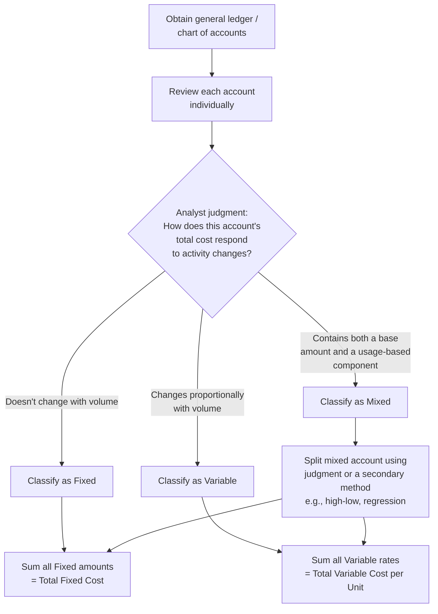

## The Account Classification Method

### Definition

The account classification method (also called the **account analysis method**) is a cost estimation technique in which each general ledger account is individually reviewed and classified in its entirety as fixed, variable, or mixed, based on the analyst's judgment and knowledge of the underlying cost driver — rather than through statistical analysis of historical cost-activity data.

$$TC = \sum_{i} F_i + \sum_{j} v_j Q_j$$

Where each account $i$ classified as fixed contributes its full balance to the fixed cost pool, and each account $j$ classified as variable contributes a per-unit rate $v_j$ derived from that account's relationship to its activity driver $Q_j$. Mixed accounts are typically further split into their fixed and variable components based on judgment or a secondary estimation technique.

### Core Characteristics

**Key Points**

- **Judgment-based, not statistically derived**: Unlike the high-low method or regression analysis, account classification relies on the analyst's (often an accountant's or department manager's) informed judgment about how each cost behaves, rather than fitting a line to historical data points.
- **Applied at the account level**: The unit of analysis is the general ledger account itself (e.g., "Indirect Labor," "Utilities," "Repairs and Maintenance") rather than individual transactions or a single blended cost pool.
- **Requires familiarity with underlying cost drivers**: Accurate classification depends on the analyst understanding what actually drives each account's cost — a contractual lease, a piece-rate labor agreement, a usage-metered utility — not just the account title.
- **Fast and low-cost to implement**: Because it does not require regression software, extensive historical data sets, or statistical expertise, account classification is often the first (and sometimes only) cost estimation method used in smaller organizations or for a first-pass budget estimate.
- **Inherently subjective**: Two analysts reviewing the same chart of accounts may classify certain ambiguous accounts differently, introducing variability and potential bias absent from data-driven methods.

### The Account Classification Process

### Worked Example

A small manufacturing firm's cost accountant reviews the chart of accounts to prepare a cost function for the upcoming budget period. Monthly production volume: 5,000 units.

| GL Account | Monthly Amount | Analyst Classification | Basis for Judgment |
| --- | --- | --- | --- |
| Direct materials | $42,500 | Variable ($8.50/unit) | Bill of materials specifies fixed material quantity per unit |
| Direct labor (piece-rate) | $27,500 | Variable ($5.50/unit) | Labor contract pays per unit assembled |
| Factory rent | $9,000 | Fixed | Fixed monthly lease payment, no usage clause |
| Equipment depreciation | $6,200 | Fixed | Straight-line depreciation, time-based not usage-based |
| Indirect materials/supplies | $4,750 | Variable ($0.95/unit) | Consumed roughly in proportion to units produced, per plant manager's estimate |
| Factory utilities | $5,800 | Mixed → split: $2,000 fixed + $0.76/unit | Base service charge plus metered usage; analyst estimates the split from the utility provider's rate schedule |
| Quality control salaries | $8,000 | Fixed | Salaried inspectors, staffing level not tied to daily volume |
| Maintenance and repairs | $3,600 | Mixed → split: $1,200 fixed + $0.48/unit | Routine scheduled maintenance (fixed) plus wear-related repairs correlated with machine usage (variable), per maintenance supervisor's estimate |

**Example**

Total Fixed Cost: $9{,}000 + 6{,}200 + 8{,}000 + 2{,}000 + 1{,}200 = \$26{,}400$

Total Variable Cost per Unit: $8.50 + 5.50 + 0.95 + 0.76 + 0.48 = \$16.19$

Resulting cost function: $TC = 26{,}400 + 16.19Q$

At the current 5,000-unit volume: $TC = 26{,}400 + (16.19 \times 5{,}000) = 26{,}400 + 80{,}950 = \$107{,}350$, which should approximate the total operating cost reflected in the source ledger for that period, serving as a reasonableness check on the classification exercise.

### Advantages

- **Speed and low resource requirement**: Can be completed in a single review session by someone familiar with operations, without requiring a data set of historical cost-activity pairs.
- **Leverages operational knowledge directly**: Incorporates contextual understanding (contract terms, known usage patterns, upcoming rate changes) that purely statistical methods cannot capture from historical numbers alone.
- **Account-level granularity**: Because each account is assessed individually, it avoids the blending problem of aggregate statistical methods, which can obscure the true behavior of a small number of accounts within a larger blended cost pool.
- **Useful when historical data is unreliable or unavailable**: For a new product line, a recently reorganized cost center, or a company migrating accounting systems, account classification may be the only feasible method since sufficient clean historical data for regression or high-low analysis does not yet exist.

### Limitations

- **Subjectivity and inconsistency**: Because classification depends on individual judgment, the same account may be classified differently by different analysts, or even inconsistently by the same analyst across periods, reducing comparability over time.
- **No statistical validation**: Unlike regression analysis, account classification produces no goodness-of-fit measure (such as $R^2$) to indicate how well the resulting cost function actually explains historical cost variation.
- **Risk of oversimplified mixed-cost splits**: When an analyst estimates the fixed/variable split of a mixed account "by feel" rather than through a systematic technique, the resulting split may be materially inaccurate. [Inference] The reliability of a judgment-based mixed-cost split is generally lower than a split derived from regression on sufficient historical data, though the degree of inaccuracy is specific to the analyst's familiarity with that cost.
- **Scales poorly with a large or complex chart of accounts**: Manually reviewing hundreds of GL accounts individually is time-intensive and increases the risk of inconsistent treatment across similar accounts reviewed by different staff or departments.
- **Vulnerable to classification bias**: An analyst with an incentive to present a particular cost structure (e.g., minimizing apparent fixed costs to make a business case look more scalable) can consciously or unconsciously skew classifications, a risk not present in objective statistical fitting.

### Comparison to Other Cost Estimation Methods

| Attribute | Account Classification | High-Low Method | Regression Analysis |
| --- | --- | --- | --- |
| Basis | Analyst judgment per account | Two extreme data points | Statistical fit across all data points |
| Data requirement | Current chart of accounts and operational knowledge | Minimum 2 historical cost-activity observations | Multiple historical cost-activity observations |
| Objectivity | Low (subjective) | Moderate (mechanical but outlier-sensitive) | High (statistically derived, testable) |
| Speed of implementation | Fast | Fast | Moderate to slow (requires data preparation and computation) |
| Granularity | Account-by-account | Single blended cost pool (or applied per account) | Single blended cost pool (or applied per account) |
| Best suited for | New cost centers, limited historical data, quick first-pass estimates | Quick approximate estimate when only summary data is available | Rigorous, data-supported cost function development |

### Relevance to Broader Cost Estimation Practice

Account classification is rarely used in complete isolation in mature cost accounting systems; it is more commonly used as:

- A **first-pass screening tool** to identify which accounts are clearly fixed or clearly variable (reducing the number of accounts requiring more rigorous statistical analysis), reserving high-low or regression methods for genuinely ambiguous mixed accounts.
- A **cross-check** against the results of a statistical method, since a regression-derived split that contradicts strong operational knowledge (e.g., a lease account statistically appearing "variable" due to a coincidental correlation) may indicate a spurious statistical relationship rather than genuine cost behavior.
- The **default method** in organizations too small, too new, or too resource-constrained to maintain the clean historical data sets required for regression-based estimation.

### Practical Pitfalls

- **Classifying by account title rather than actual driver behavior**: An account labeled "Variable Overhead" in the chart of accounts is not automatically variable in a rigorous cost-behavior sense — the label reflects a prior classification decision, not verified current behavior, and should be re-examined rather than taken at face value.
- **Ignoring relevant range boundaries during classification**: An account classified as fixed based on current operating conditions may not remain fixed if the firm is planning a volume change that approaches or exceeds the relevant range — classification should be paired with an explicit statement of the volume range over which it is expected to hold.
- **Treating the resulting cost function as precise**: Because the method is judgment-based rather than statistically fitted, presenting the resulting $TC = F + vQ$ function with the same implied precision as a regression output (e.g., reporting $v$ to several decimal places without qualification) can overstate the reliability of the estimate. [Unverified] The actual margin of error in an account-classification-derived cost function is not quantifiable through the method itself, unlike regression's standard errors and confidence intervals.
- **Failing to periodically re-review classifications**: Cost drivers and contract terms change over time (a previously fixed lease may convert to a variable usage-based agreement, a previously piece-rate labor arrangement may shift to salaried); classifications performed once and never revisited can become stale.

**Next Steps**

- Mixed and Semi-Variable Cost Behavior
- High-Low Method for Cost Estimation
- Scatterplot (Scattergraph) Method
- Regression Analysis for Cost Estimation
- The Relevant Range Concept
- Committed versus Discretionary Fixed Costs
- Contribution Margin and Contribution Margin Ratio
- Flexible Budgeting Across Multiple Activity Levels