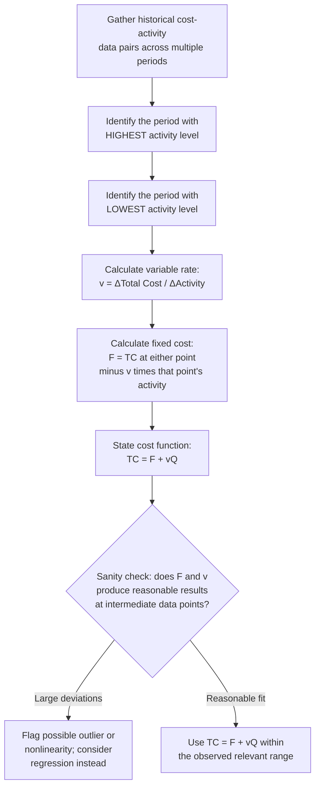

## The High-Low Method

### Definition

The high-low method is a cost estimation technique that separates a mixed cost into its fixed and variable components using **only the two most extreme observations** in a historical data set — the period with the highest activity level and the period with the lowest activity level. It derives a linear cost function by calculating the slope (variable rate) and intercept (fixed cost) implied by the change between these two points.

$$TC = F + vQ$$

$$v = \frac{TC_{high} - TC_{low}}{Q_{high} - Q_{low}}$$

$$F = TC_{high} - (v \times Q_{high}) \quad \text{or equivalently} \quad F = TC_{low} - (v \times Q_{low})$$

Where $Q_{high}$ and $Q_{low}$ are selected based on the **highest and lowest activity levels** in the data set — not necessarily the highest and lowest total costs, which is a common point of confusion.

### Core Characteristics

**Key Points**

- **Selection is driven by activity level, not cost**: The high and low points are identified by the activity driver (units, hours, etc.), not by the total cost amount. Selecting points based on cost instead of activity is a frequent methodological error.
- **Uses only two data points**: All other observations in the historical data set are discarded; the method extracts no additional information from intermediate data points, even when many are available.
- **Produces a linear approximation**: The resulting $F$ and $v$ define a straight-line cost function assumed to hold across the relevant range spanning from $Q_{low}$ to $Q_{high}$.
- **Computationally simple**: Requires only basic arithmetic — no regression software, statistical packages, or specialized tooling — making it executable by hand or in a basic spreadsheet.
- **Sensitive to outliers by construction**: Because the method relies entirely on the two extreme points, any anomaly, one-time event, or measurement error at either extreme disproportionately affects the entire resulting cost function.

### Step-by-Step Procedure

### Worked Example

A distribution company tracks monthly warehouse operating costs against shipment volume over six months:

| Month | Shipments (units) | Total Warehouse Cost |
| --- | --- | --- |
| January | 3,200 | $28,400 |
| February | 4,100 | $31,900 |
| March | 2,800 | $26,900 |
| April (highest activity) | 5,600 | $37,200 |
| May | 3,900 | $30,800 |
| June (lowest activity) | 2,500 | $25,700 |

**Example**

Step 1 — Identify high and low activity points:

- $Q_{high} = 5{,}600$ (April), $TC_{high} = \$37{,}200$
- $Q_{low} = 2{,}500$ (June), $TC_{low} = \$25{,}700$

Step 2 — Calculate variable rate:

$$v = \frac{37{,}200 - 25{,}700}{5{,}600 - 2{,}500} = \frac{11{,}500}{3{,}100} \approx \$3.71 \text{ per shipment}$$

Step 3 — Calculate fixed cost (using the high point):

$$F = 37{,}200 - (3.71 \times 5{,}600) = 37{,}200 - 20{,}776 = \$16{,}424$$

Verification using the low point:

$$F = 25{,}700 - (3.71 \times 2{,}500) = 25{,}700 - 9{,}275 = \$16{,}425$$

(The $1 difference reflects rounding of $v$ to two decimal places.)

Resulting cost function: $TC = 16{,}424 + 3.71Q$

Step 4 — Reasonableness check against an intermediate point (February, 4,100 shipments):

$$TC_{predicted} = 16{,}424 + (3.71 \times 4{,}100) = 16{,}424 + 15{,}211 = \$31{,}635$$

Actual February cost was $31,900 — a difference of $265 (about 0.8%), suggesting the high-low estimate provides a reasonably close approximation for this data set, though it is not an exact fit by construction.

### The Outlier Sensitivity Problem

Because only two points determine the entire cost function, the high-low method is structurally vulnerable to distortion when either extreme observation is unrepresentative of normal cost behavior.

**Example**

Suppose July experiences an unusual one-time equipment breakdown, pushing warehouse cost to $29,000 despite only 2,300 shipments — the lowest activity level in an expanded seven-month data set, but with an anomalously elevated cost due to emergency repairs.

Recalculating using July as the new low point:

$$v = \frac{37{,}200 - 29{,}000}{5{,}600 - 2{,}300} = \frac{8{,}200}{3{,}300} \approx \$2.48 \text{ per shipment}$$

$$F = 37{,}200 - (2.48 \times 5{,}600) = 37{,}200 - 13{,}888 = \$23{,}312$$

The estimated variable rate drops from $3.71 to $2.48 per shipment, and fixed cost rises from $16,424 to $23,312 — a substantial shift driven entirely by one anomalous data point, illustrating why the high-low method's simplicity comes at the cost of robustness.

### Advantages

- **Minimal data and computation requirements**: Usable with as few as two historical observations and basic arithmetic, making it accessible without specialized software or statistical training.
- **Fast to execute**: Can be computed manually in minutes, useful for quick estimates or preliminary budget planning.
- **Transparent and easy to explain**: The calculation logic is intuitive and easy to communicate to non-technical stakeholders compared to regression coefficients and statistical output.
- **Useful as a quick cross-check**: Even when regression is used as the primary method, high-low can serve as a fast sanity check on the resulting cost function's general order of magnitude.

### Limitations

- **Extreme outlier sensitivity**: As shown above, the result can shift dramatically based on which two points happen to represent the highest and lowest activity levels, regardless of whether those points are representative of typical operations.
- **Ignores all intermediate data**: Even a rich historical data set with dozens of observations contributes no additional precision beyond the two extreme points selected.
- **No statistical validation available**: The method produces no goodness-of-fit measure, standard error, or confidence interval — there is no way to quantify how well the two-point line actually represents the broader data set beyond informal reasonableness checks against other points.
- **Assumes linearity across the full range between the two extremes**: If cost behavior is nonlinear (e.g., due to step costs, volume discounts, or capacity constraints) between $Q_{low}$ and $Q_{high}$, the linear estimate can significantly misstate costs at intermediate volumes.
- **Vulnerable to non-representative extreme periods**: Seasonal peaks, holidays, one-time events, or unusual operating conditions occurring at either extreme point distort the entire estimate, even though such periods are, almost by definition, atypical.

### Comparison to Other Cost Estimation Methods

| Attribute | High-Low Method | Scatterplot Method | Regression Analysis |
| --- | --- | --- | --- |
| Data points used | 2 (highest and lowest activity) | All (visual inspection) | All (statistical fitting) |
| Outlier sensitivity | Very high | Moderate (visible, can be excluded) | Low (with proper diagnostics) |
| Objectivity | Mechanical but point-selection is inherently fragile | Subjective (visual line-fitting) | High (mathematically determined least-squares fit) |
| Statistical validation | None | None | Yes ($R^2$, standard errors, significance tests) |
| Computational requirement | Basic arithmetic | Graphing (manual or spreadsheet) | Spreadsheet or statistical software |
| Typical use case | Quick estimate, limited data, preliminary analysis | Diagnostic step before regression; outlier detection | Primary method when sufficient clean historical data is available |

### Relevance to Broader Cost Estimation Practice

The high-low method is most defensible as:

- A **rapid preliminary estimate** when time or data constraints prevent regression analysis.
- A **teaching tool** for illustrating the mechanics of separating a mixed cost into fixed and variable components before introducing more rigorous statistical techniques.
- A **secondary cross-check** against regression output, where a large divergence between the two methods' results may signal the presence of outliers or nonlinearity worth investigating further.

It is generally not recommended as the sole basis for significant budgeting, pricing, or capital decisions when a larger, cleaner historical data set and access to regression tools are available, given its structural vulnerability to the extreme points selected.

### Practical Pitfalls

- **Selecting high/low by cost instead of activity**: The correct selection criterion is the highest and lowest *activity* level, not the highest and lowest *total cost* — these can differ if cost and activity are not perfectly correlated, and selecting by cost produces an incorrect and internally inconsistent estimate.
- **Failing to inspect the data for outliers before applying the method**: Because the method is mechanically applied to whichever two points happen to be extreme, skipping a basic visual or logical review of those two specific periods risks anchoring the entire cost function to an anomalous event.
- **Presenting the result with unwarranted precision**: Reporting $v$ to several decimal places implies a level of statistical confidence the two-point method does not actually provide; results should be communicated as approximate estimates. [Inference] The appropriate level of precision to report depends on the intended use of the estimate and the degree of variability in the underlying data, which the high-low method itself does not quantify.
- **Applying the resulting cost function outside the $Q_{low}$ to $Q_{high}$ range**: The linear relationship is only validated between the two selected points; extrapolating beyond either extreme reintroduces the same relevant-range risk present in any cost estimation method, compounded by the method's reliance on just two observations.

**Next Steps**

- Mixed and Semi-Variable Cost Behavior
- The Account Classification Method
- Scatterplot (Scattergraph) Method
- Regression Analysis for Cost Estimation
- The Relevant Range Concept
- Cost-Volume-Profit (CVP) Analysis and Breakeven Point
- Flexible Budgeting Across Multiple Activity Levels