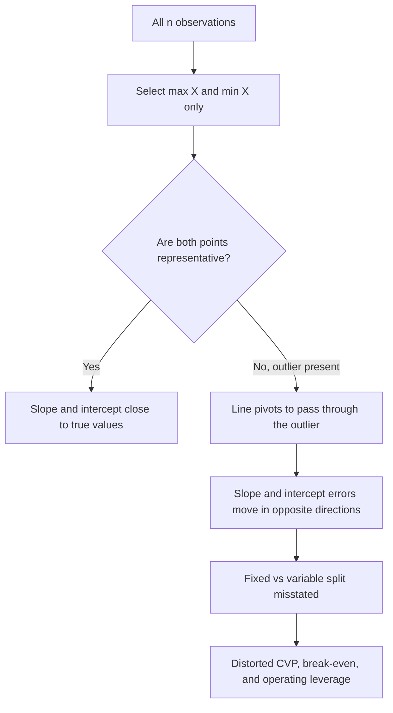

## Limitations and Outlier Sensitivity of the High Low Method


### Overview

The High Low Method estimates a mixed (semi-variable) cost by splitting it into a variable rate and a fixed component using only two observations: the period with the highest activity level and the period with the lowest activity level. Its appeal is simplicity, but that same simplicity is the source of its weaknesses. Because the entire estimate rests on two data points, any distortion in either point passes straight into the cost function $Y = a + bX$, and every downstream decision (pricing, break-even analysis, operating leverage, budgeting) inherits that distortion.

This reference covers the mechanics briefly, then focuses on why the method is fragile, how to detect and quantify outlier effects, how the errors propagate into fixed vs. variable cost structure and operating leverage, and what to use instead.

### Method Recap

Given a cost function $Y = a + bX$ where $Y$ is total cost, $X$ is the activity level (cost driver), $a$ is total fixed cost, and $b$ is the variable cost per unit of activity:

$$b = \frac{Y_{high} - Y_{low}}{X_{high} - X_{low}}$$


$$a = Y_{high} - bX_{high} = Y_{low} - bX_{low}$$

**Key Points**

- Only two of the $n$ observations influence the result; the other $n-2$ observations have zero weight.
- "High" and "Low" are defined by the activity level ($X$), not by the cost ($Y$).
- The fitted line passes exactly through the two chosen points by construction, so it has no residual error at those points, regardless of how unrepresentative they are.

### Core Limitations

#### 1. Information Loss (Two-Point Estimation)

The method discards the vast majority of the data. With 24 months of observations, 22 months contribute nothing. Statistical estimators such as ordinary least squares (OLS) use every observation and minimize total squared error, which gives them far lower variance when the data is noisy.

#### 2. Extreme Values Are Not Representative

The highest and lowest activity levels are, by definition, the most unusual periods. Extremes are frequently produced by atypical circumstances:

- Peak periods: overtime premiums, rush shipping, temporary staff, capacity strain, step-cost thresholds being crossed.
- Trough periods: shutdowns, strikes, holidays, seasonal closures, inefficient partial operation, fixed-cost under-absorption effects.
- Abnormal events: natural disasters, equipment failure, one-time promotions, or data-entry errors.

The cost behavior at these extremes often differs from the behavior in the normal operating range.

#### 3. Violation of the Relevant Range Assumption

Linear cost functions are valid only inside a **relevant range**, the band of activity where fixed costs stay fixed and per-unit variable costs stay constant. Extreme observations are the ones most likely to lie outside that range. If the high point sits above a capacity step (for example, a second shift or a new warehouse lease begins), the computed slope absorbs a fixed-cost step and overstates the variable rate.

#### 4. Sensitivity to Timing and Cost Mismatch

Costs recorded in a period may not correspond to activity in that period. Examples include:

- Maintenance performed in a slow month but caused by usage in prior busy months.
- Annual insurance, bonuses, or property taxes booked in a single month.
- Utility bills with billing-cycle lags.

If such a mismatch lands in the high or low period, the slope is distorted, while in a regression it would be diluted by the other observations.

#### 5. No Measure of Fit or Reliability

The method provides no $R^2$, standard error, confidence interval, or residual diagnostics. The analyst cannot tell whether the linear model is appropriate or how uncertain $a$ and $b$ are.

#### 6. Assumes a Single Cost Driver and Linearity

Like simple regression, it models one driver. It cannot handle multiple cost drivers (for example, machine hours and number of setups) or nonlinear behavior (economies of scale, learning curves, step costs, or curvilinear cost patterns).

#### 7. Ambiguity When Extremes Tie or Sit Close Together

If the high and low activity levels are nearly equal, the denominator $X_{high} - X_{low}$ approaches zero and the slope explodes. If multiple periods tie for the high or low activity level, the method gives different answers depending on which tied period is picked.

### Outlier Sensitivity

#### Why the Method Is Maximally Exposed

An outlier is an observation whose cost is unusually far from the underlying cost relationship. In OLS, one outlier among $n$ points has a bounded pull on the line. In the High Low Method, if an outlier happens to be the high or low activity observation, it has **100% of the influence on one of the two anchor points**, and therefore a large share of the influence on the slope.

The slope is a ratio of differences, so an error $\varepsilon$ in the cost of one endpoint changes the slope by:

$$\Delta b = \frac{\varepsilon}{X_{high} - X_{low}}$$

and changes the intercept by:

$$\Delta a = -\Delta b \cdot X_{high}$$ (if the error is in the high point and the intercept is recomputed from the high point)

The smaller the activity range $X_{high} - X_{low}$, the larger the slope distortion from a given cost error. The distortion in slope and intercept moves in opposite directions: an overstated variable rate produces an understated fixed cost, and vice versa.

**Key Points**

- Outlier at the high point (cost too high): slope overstated, intercept understated.
- Outlier at the low point (cost too high): slope understated, intercept overstated.
- Outlier at an interior point: no effect at all (it is ignored), which is a limitation in itself because it can hide a real pattern.

#### Worked Example: Clean Data

A manufacturer records monthly machine hours and total maintenance cost for eight months.

| Month | Machine Hours | Maintenance Cost ($) |
| --- | --- | --- |
| Jan | 2,000 | 14,000 |
| Feb | 2,400 | 15,600 |
| Mar | 2,800 | 17,200 |
| Apr | 3,000 | 18,000 |
| May | 3,400 | 19,600 |
| Jun | 3,600 | 20,400 |
| Jul | 3,800 | 21,200 |
| Aug | 4,000 | 22,000 |

High: Aug (4,000 hours, $22,000). Low: Jan (2,000 hours, $14,000).

$$b = \frac{22{,}000 - 14{,}000}{4{,}000 - 2{,}000} = \frac{8{,}000}{2{,}000} = 4.00 \text{ per hour}$$


$$a = 22{,}000 - 4.00 \times 4{,}000 = 6{,}000$$

Cost function: $Y = 6{,}000 + 4.00X$. Here the data is perfectly linear, so every method agrees.

#### Worked Example: Outlier at the High Point

Suppose in August the plant ran overtime and had an emergency repair, pushing recorded cost to $26,000 for the same 4,000 hours.

$$b = \frac{26{,}000 - 14{,}000}{4{,}000 - 2{,}000} = \frac{12{,}000}{2{,}000} = 6.00 \text{ per hour}$$


$$a = 26{,}000 - 6.00 \times 4{,}000 = 2{,}000$$

**Output**

| Quantity | True Value | High Low (with outlier) | Error |
| --- | --- | --- | --- |
| Variable rate $b$ | 4.00 | 6.00 | +50% |
| Fixed cost $a$ | 6,000 | 2,000 | −67% |

A single $4,000 anomaly, only 18% above the true August cost, inflated the variable rate by 50% and shrank the estimated fixed cost by two-thirds.

#### Prediction Impact

Forecast maintenance cost at 3,000 hours (the middle of the range):

- True: $6{,}000 + 4.00(3{,}000) = 18{,}000$
- Distorted High Low: $2{,}000 + 6.00(3{,}000) = 20{,}000$ (an 11% overestimate)

Forecast at 2,500 hours (below the middle):

- True: $6{,}000 + 4.00(2{,}500) = 16{,}000$
- Distorted: $2{,}000 + 6.00(2{,}500) = 17{,}000$ (a 6% overestimate)

Because the distorted line pivots through the low point, errors are smallest near the low activity level and grow toward and beyond the high activity level.

#### Worked Example: Outlier at the Low Point

Now suppose January was distorted by a holiday shutdown that left cost at $16,000 (the plant paid for fixed servicing but ran few hours), while the other months are clean.

$$b = \frac{22{,}000 - 16{,}000}{4{,}000 - 2{,}000} = 3.00$$


$$a = 22{,}000 - 3.00 \times 4{,}000 = 10{,}000$$

The variable rate is understated by 25% and the fixed cost is overstated by 67%. The fixed vs. variable split is essentially inverted relative to the truth.

#### Geometric Intuition



The illustration below shows how the fitted line pivots when the high point is an outlier.

<svg xmlns="http://www.w3.org/2000/svg" viewBox="0 0 640 400" width="640" height="400" font-family="sans-serif" font-size="12">
<title>High Low Outlier Sensitivity (svg_diagram)</title>
<text x="320" y="24" text-anchor="middle" font-size="15" font-weight="bold">High Low Outlier Sensitivity (svg_diagram)</text>
<line x1="70" y1="340" x2="600" y2="340" stroke="#333" stroke-width="2" />
<line x1="70" y1="340" x2="70" y2="50" stroke="#333" stroke-width="2" />
<text x="335" y="385" text-anchor="middle">Activity level (machine hours)</text>
<text x="20" y="200" text-anchor="middle" transform="rotate(-90 20 200)">Total cost</text>
<line x1="110" y1="280" x2="560" y2="160" stroke="#2a7d2a" stroke-width="2.5" />
<text x="565" y="158" fill="#2a7d2a">True line</text>
<line x1="110" y1="280" x2="560" y2="90" stroke="#c0392b" stroke-width="2.5" stroke-dasharray="7,4" />
<text x="565" y="88" fill="#c0392b">High Low (outlier)</text>
<circle cx="110" cy="280" r="6" fill="#2a7d2a" />
<text x="110" y="305" text-anchor="middle">Low point</text>
<circle cx="200" cy="256" r="4" fill="#888" />
<circle cx="270" cy="237" r="4" fill="#888" />
<circle cx="340" cy="219" r="4" fill="#888" />
<circle cx="420" cy="197" r="4" fill="#888" />
<circle cx="490" cy="179" r="4" fill="#888" />
<circle cx="560" cy="90" r="6" fill="#c0392b" />
<text x="560" y="72" text-anchor="middle" fill="#c0392b">High point (outlier)</text>
<text x="330" y="130" fill="#555">Grey points are ignored by the method</text>
</svg>

### Detecting Outlier Contamination

Before trusting a High Low estimate, run diagnostics on the full dataset.

#### 1. Scatter Plot Inspection

Plot all observations of cost against activity. Check whether the high and low points lie on the general pattern formed by the interior points. A high or low point that visibly sits above or below the cloud is a warning sign.

#### 2. Compare Against a Regression Line

Fit an OLS regression to all data and compare slopes and intercepts.

$$b_{OLS} = \frac{\sum (X_i - \bar{X})(Y_i - \bar{Y})}{\sum (X_i - \bar{X})^2}, \quad a_{OLS} = \bar{Y} - b_{OLS}\bar{X}$$

A large gap between $b_{HL}$ and $b_{OLS}$ (a common rule of thumb is more than roughly 10 to 15%, though this threshold is a judgment call rather than a standard) signals that the two extreme points are unrepresentative.

#### 3. Residual Check at the Extremes

Compute the residual of the high and low points from the OLS line:

$$e_i = Y_i - (a_{OLS} + b_{OLS}X_i)$$

Large residuals at these two points relative to the standard error of the regression indicate contamination.

#### 4. Sensitivity (Leave-Extremes-Out) Test

Recompute High Low using the second-highest and second-lowest activity levels. If the estimates change substantially, the method is unstable for this dataset.

#### Worked Sensitivity Test

Using the data with the August outlier (26,000), drop August and January, then use the next extremes: Jul (3,800 hours, $21,200) and Feb (2,400 hours, $15,600).

$$b = \frac{21{,}200 - 15{,}600}{3{,}800 - 2{,}400} = \frac{5{,}600}{1{,}400} = 4.00$$


$$a = 21{,}200 - 4.00 \times 3{,}800 = 6{,}000$$

The "second-tier" estimate recovers the true values (4.00 and 6,000), whereas the original extremes gave (6.00 and 2,000). The large disagreement between the two runs confirms that the original extremes were contaminated.

### Effect on Fixed vs. Variable Cost Structure and Operating Leverage

The cost split from cost estimation feeds directly into cost-volume-profit (CVP) analysis and operating leverage.

Let $p$ be the selling price per unit, $v$ the variable cost per unit, and $F$ total fixed cost. Then:

$$CM = p - v, \quad Q_{BE} = \frac{F}{p - v}, \quad DOL = \frac{Q(p - v)}{Q(p - v) - F} = \frac{CM_{total}}{EBIT}$$

Where DOL is the degree of operating leverage. Because a High Low outlier misstates $b$ (feeding $v$) and $a$ (feeding $F$) in opposite directions, the CVP outputs are distorted in a compounding way.

#### Worked Example: Impact on Break-Even and DOL

Assume maintenance is the only mixed cost, and the product sells for $20 per unit with other variable costs of $8 per unit, other fixed costs of $30,000 per month, and each unit requires 0.5 machine hours (so maintenance variable cost per unit equals $0.5b$). Monthly volume is 6,000 units.

**True structure** ($b = 4.00$, $a = 6{,}000$):

- Maintenance variable per unit: $0.5 \times 4.00 = 2.00$
- Total variable per unit: $8 + 2 = 10$
- Contribution margin per unit: $20 - 10 = 10$
- Total fixed: $30{,}000 + 6{,}000 = 36{,}000$
- Break-even: $Q_{BE} = 36{,}000 / 10 = 3{,}600$ units
- Contribution margin total at 6,000 units: $60{,}000$
- EBIT: $60{,}000 - 36{,}000 = 24{,}000$
- DOL: $60{,}000 / 24{,}000 = 2.50$

**Distorted structure** ($b = 6.00$, $a = 2{,}000$):

- Maintenance variable per unit: $0.5 \times 6.00 = 3.00$
- Total variable per unit: $8 + 3 = 11$
- Contribution margin per unit: $20 - 11 = 9$
- Total fixed: $30{,}000 + 2{,}000 = 32{,}000$
- Break-even: $Q_{BE} = 32{,}000 / 9 \approx 3{,}556$ units
- Contribution margin total at 6,000 units: $54{,}000$
- EBIT: $54{,}000 - 32{,}000 = 22{,}000$
- DOL: $54{,}000 / 22{,}000 \approx 2.45$

**Output**

| Metric | True | Distorted | Difference |
| --- | --- | --- | --- |
| Contribution margin/unit | $10.00 | $9.00 | −10% |
| Total fixed cost | $36,000 | $32,000 | −11% |
| Break-even units | 3,600 | ~3,556 | −1.2% |
| EBIT at 6,000 units | $24,000 | $22,000 | −8.3% |
| DOL | 2.50 | ~2.45 | −2% |

In this example, the break-even and DOL changes look modest because the distortion partially offsets: less fixed cost lowers break-even, while a lower margin raises it. That offsetting is coincidental and not reliable. The offset breaks down away from the base volume. For a large volume increase (say 12,000 units), the overstated variable rate causes profit to be underestimated, and for a large decrease the understated fixed cost causes losses to be underestimated. The distortion in the *structure* (a plant that looks more variable and less fixed than it is) leads to a systematically underestimated operating leverage risk profile at extreme volumes.

**Key Points**

- Outliers that overstate the variable rate make the cost structure look more flexible than it really is, which understates the downside risk of falling volume.
- Outliers that understate the variable rate make the cost structure look more rigid than it is, which overstates operating leverage and can lead to overly cautious capacity decisions.
- Contribution-margin-based decisions (special orders, make-or-buy, product-line elimination) are directly sensitive to $b$.

### Quantifying Sensitivity Analytically

Let the high point's cost carry an error $\varepsilon_H$ and the low point's cost an error $\varepsilon_L$. The resulting slope error is:

$$\Delta b = \frac{\varepsilon_H - \varepsilon_L}{X_{high} - X_{low}}$$

The **relative** slope error is:

$$\frac{\Delta b}{b} = \frac{\varepsilon_H - \varepsilon_L}{Y_{high} - Y_{low}}$$

This shows the sensitivity is governed by the ratio of the error to the *cost spread* between the two points. A wide cost spread dilutes any single error; a narrow spread amplifies it.

In the worked example: $\varepsilon_H = 4{,}000$, $\varepsilon_L = 0$, cost spread $= 8{,}000$, so relative slope error $= 4{,}000/8{,}000 = 50\%$, matching the earlier result.

**Key Points**

- Widening the range between high and low activity levels reduces the impact of a fixed-size error.
- The method is most reliable when the dataset spans a wide activity range and both extremes are verified as normal.

### Common Pitfalls

- **Choosing high/low by cost instead of activity.** The extremes must be selected by the cost driver value. Selecting by cost can pair mismatched points and give a nonsensical slope.
- **Using the wrong driver.** If the chosen driver poorly explains cost, the method offers no warning.
- **Mixing units or periods.** Combining monthly and quarterly observations, or unadjusted price-level changes (inflation), distorts the slope. Inflation adjustment or index normalization should be applied first when data spans long periods.
- **Blindly discarding outliers.** Removing an extreme point simply because it looks unusual can be as biased as keeping it. Investigate the cause first.
- **Treating the result as precise.** Reporting $b$ and $a$ to many decimal places conveys false precision given the method's two-point basis.

### Mitigation Strategies

1. **Screen and adjust the extremes.** Investigate the high and low periods for one-time events. Adjust for known abnormal items (for example, remove a one-time repair) or replace the extreme with the next most representative period, documenting the choice.
2. **Use multiple High Low pairs.** Compute estimates from several pairs (highest and lowest, second-highest and second-lowest, and so on) and compare. Stable estimates increase confidence.
3. **Use regression instead.** Least-squares regression (simple or multiple) uses all data, provides $R^2$ and standard errors, and supports multiple drivers.
4. **Use robust regression.** Techniques such as least absolute deviations or Theil-Sen (median of pairwise slopes) reduce outlier influence. [Inference] For typical cost accounting datasets these often outperform High Low, though the improvement depends on the data.
5. **Use the scatter-plot (visual fit) method** as a check, drawing a line through the bulk of the data.
6. **Restrict to the relevant range.** Exclude observations outside the range where fixed costs and per-unit costs are believed stable.
7. **Use account analysis / engineering estimates** to classify costs directly, using knowledge of the cost drivers rather than statistical fitting alone.

#### Python Example: Comparing High Low to OLS and Theil-Sen

```python
import numpy as np

hours = np.array([2000, 2400, 2800, 3000, 3400, 3600, 3800, 4000], dtype=float)
cost  = np.array([14000, 15600, 17200, 18000, 19600, 20400, 21200, 26000], dtype=float)  # Aug is an outlier

def high_low(x, y):
    i_hi, i_lo = np.argmax(x), np.argmin(x)
    b = (y[i_hi] - y[i_lo]) / (x[i_hi] - x[i_lo])
    a = y[i_hi] - b * x[i_hi]
    return a, b

def ols(x, y):
    b = np.sum((x - x.mean()) * (y - y.mean())) / np.sum((x - x.mean()) ** 2)
    a = y.mean() - b * x.mean()
    return a, b

def theil_sen(x, y):
    slopes = [
        (y[j] - y[i]) / (x[j] - x[i])
        for i in range(len(x)) for j in range(i + 1, len(x))
        if x[j] != x[i]
    ]
    b = np.median(slopes)
    a = np.median(y - b * x)
    return a, b

for name, fn in [("High-Low", high_low), ("OLS", ols), ("Theil-Sen", theil_sen)]:
    a, b = fn(hours, cost)
    print(f"{name:10s} fixed a = {a:10.2f}   variable b = {b:6.3f}")
```

**Output**

Approximate results (exact values may differ slightly by floating-point handling):

```text
High-Low   fixed a =    2000.00   variable b =  6.000
OLS        fixed a =    2482.14   variable b =  5.5 (approx.; pulled upward by the outlier)
Theil-Sen  fixed a =    6000.00   variable b =  4.000 (approx.; median slope resists the outlier)
```

[Unverified] The OLS and Theil-Sen figures above are illustrative approximations of the expected pattern (OLS is influenced by the outlier but less than High Low, and Theil-Sen is largely resistant) and should be confirmed by running the code.

#### Python Example: Leave-Extremes-Out Sensitivity Test

```python
def hl_sensitivity(x, y, trim=2):
    order = np.argsort(x)
    results = []
    for k in range(trim + 1):
        idx_lo, idx_hi = order[k], order[-(k + 1)]
        b = (y[idx_hi] - y[idx_lo]) / (x[idx_hi] - x[idx_lo])
        a = y[idx_hi] - b * x[idx_hi]
        results.append((k, a, b))
    return results

for k, a, b in hl_sensitivity(hours, cost):
    print(f"Trim {k}: a = {a:9.2f}, b = {b:.3f}")
```

If the values of $a$ and $b$ change sharply between $k=0$ and $k=1$, the outermost points are suspect.

### Comparison With Alternative Estimation Methods

| Criterion | High Low | Scatter Plot | Simple Regression (OLS) | Robust Regression |
| --- | --- | --- | --- | --- |
| Data points used | 2 | All (visually) | All | All |
| Outlier sensitivity | Very high | Moderate (judgment) | Moderate | Low |
| Goodness-of-fit measure | None | None (visual only) | $R^2$, std. error | Varies by method |
| Multiple drivers | No | No | Extends to multiple regression | Yes (in many forms) |
| Effort / tooling | Minimal | Low | Moderate (spreadsheet or software) | Higher |
| Objectivity | High (formulaic) | Low (subjective) | High | High |
| Best use | Quick approximation on clean data | Screening and outlier detection | General purpose | Noisy or contaminated data |

### When the High Low Method Is Still Acceptable

- A quick, order-of-magnitude estimate is sufficient and precision is not critical.
- The dataset is small, and the extreme points have been verified as representative.
- The relationship is known to be close to linear across a wide range.
- It serves as a sanity check alongside regression rather than as the sole basis for a decision.
- Time or data constraints (for example, only summary data for two periods is available) rule out other methods.

### Practical Checklist

1. Plot the data and look for visual outliers.
2. Confirm the extremes are within the relevant range and free of one-time events.
3. Verify the cost and activity data are matched in timing.
4. Adjust for inflation or price changes when data spans long periods.
5. Compute High Low using several pairs and compare.
6. Compare with an OLS or robust estimate.
7. Propagate the resulting $a$ and $b$ into break-even and DOL, and test how much the results shift under alternative estimates.
8. Document assumptions and treatment of any excluded or adjusted points.

### Conclusion

The High Low Method's two-point design gives it speed and transparency but leaves it structurally vulnerable: each anchor point carries enormous weight, the extremes are the most likely observations to be abnormal or outside the relevant range, and the method offers no diagnostics to reveal the problem. A single outlier at either endpoint pivots the fitted line, distorting the variable rate and the fixed cost in opposite directions, which in turn misrepresents the fixed vs. variable cost structure and the operating leverage derived from it. Behavior of real datasets varies, so the magnitude of these effects should be tested rather than assumed. Analysts should treat High Low output as a rough estimate, validate the extremes, run sensitivity checks, and prefer regression-based or robust methods when decisions depend on accurate cost separation.

**Related Topics**

- Scatter plot (visual fit) method for cost estimation
- Simple linear regression for cost separation ($R^2$, standard error, t-statistics)
- Multiple regression with several cost drivers
- Robust regression and Theil-Sen estimators
- Step costs and the relevant range
- Adjusting cost data for inflation and timing mismatches
- Cost-volume-profit analysis and break-even sensitivity
- Degree of operating leverage and margin of safety