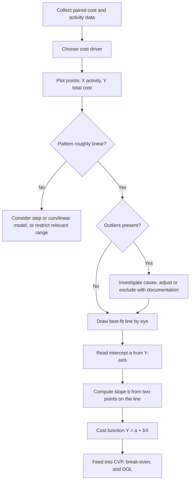

## The Scattergraph Method


### Overview

The Scattergraph Method (also called the scatter plot or visual-fit method) estimates a mixed cost function by plotting historical observations of total cost against an activity level (the cost driver) and fitting a straight line through the resulting cloud of points by visual judgment. The intercept of that line estimates total fixed cost, and its slope estimates the variable cost per unit of activity.

$$Y = a + bX$$

Where $Y$ is total cost, $X$ is the activity level, $a$ is the fixed cost component (the vertical intercept), and $b$ is the variable cost per unit of activity (the slope).

The method sits between the High Low Method (two points, purely formulaic) and least-squares regression (all points, mathematically optimized). Unlike High Low, it uses all observations and, more importantly, it makes the data visible, which allows the analyst to judge linearity, spot outliers, and identify the relevant range before committing to a cost function.

**Key Points**

- Every observation influences the picture, though the final line is drawn by judgment and not by a formula.
- The plot is a diagnostic tool as much as an estimation tool: it reveals nonlinearity, step costs, and outliers.
- The result is subjective; two analysts can draw slightly different lines and obtain different estimates of $a$ and $b$.
- It is commonly used as a screening step before regression or as a quick estimate when software is unavailable.

### Role in the Cost Structure and Operating Leverage Context

Separating mixed costs into fixed and variable components is a prerequisite for cost-volume-profit (CVP) analysis and operating leverage measurement. The scattergraph supplies the two inputs those analyses require:

- $b$ feeds the variable cost per unit $v$, and therefore the contribution margin per unit $CM = p - v$.
- $a$ feeds total fixed cost $F$, and therefore break-even volume and the degree of operating leverage.

$$Q_{BE} = \frac{F}{p - v}, \qquad DOL = \frac{Q(p - v)}{Q(p - v) - F}$$

A cost structure with a high fixed component and a low variable rate has high operating leverage; the scattergraph makes that structure visible as a high intercept and a shallow slope.

### Step-by-Step Procedure

1. **Collect paired data.** Gather $n$ observations of total cost $Y_i$ and the activity level $X_i$ for matching periods (monthly is typical).
2. **Choose the cost driver.** Select the activity measure that plausibly causes the cost (machine hours, direct labor hours, units produced, miles driven).
3. **Set up the axes.** Place the activity level on the horizontal axis (independent variable) and total cost on the vertical axis (dependent variable). Start the vertical axis at zero so the intercept is visible.
4. **Plot every observation** as a point $(X_i, Y_i)$.
5. **Inspect the pattern.** Check for approximate linearity, outliers, clusters, and step patterns.
6. **Fit a line by eye** through the center of the cloud so that roughly half the points fall above the line and half below, with the distances balanced. The line should not be forced through the origin, and it should not simply connect the highest and lowest points.
7. **Read the intercept.** The point where the line crosses the vertical axis at $X = 0$ is the estimate of $a$. If the relevant range does not include zero, this is an extrapolation and should be interpreted as a mathematical constant of the line, not literally as the cost at zero activity.
8. **Compute the slope.** Choose two well-separated points on the fitted line (not necessarily data points) and compute:

$$b = \frac{Y_2 - Y_1}{X_2 - X_1}$$

9. **Write the cost function** $Y = a + bX$ and validate it against the data.



### Worked Example

A print shop records monthly machine hours and total utilities cost for twelve months.

| Month | Machine Hours | Utilities Cost ($) |
| --- | --- | --- |
| Jan | 1,200 | 7,900 |
| Feb | 1,500 | 8,600 |
| Mar | 1,800 | 9,400 |
| Apr | 1,400 | 8,300 |
| May | 2,100 | 10,100 |
| Jun | 2,400 | 10,900 |
| Jul | 2,000 | 9,900 |
| Aug | 2,600 | 11,300 |
| Sep | 2,200 | 10,500 |
| Oct | 1,700 | 9,000 |
| Nov | 2,500 | 11,200 |
| Dec | 1,900 | 9,700 |

**Step 1: Plot.** Plotting these twelve points shows a clear upward trend with modest scatter and no obvious outliers, so a linear model is reasonable.

**Step 2: Fit a line by eye.** Suppose the analyst draws a line that passes near the point $(1{,}500;\ 8{,}600)$ and near $(2{,}500;\ 11{,}100)$, with points fairly evenly distributed above and below.

**Step 3: Compute the slope.**

$$b = \frac{11{,}100 - 8{,}600}{2{,}500 - 1{,}500} = \frac{2{,}500}{1{,}000} = 2.50 \text{ per machine hour}$$

**Step 4: Compute the intercept.** Using the point $(1{,}500;\ 8{,}600)$:

$$a = 8{,}600 - 2.50 \times 1{,}500 = 8{,}600 - 3{,}750 = 4{,}850$$

**Step 5: Cost function.**

$$Y = 4{,}850 + 2.50X$$

**Step 6: Predict.** At 2,000 machine hours: $4{,}850 + 2.50(2{,}000) = 9{,}850$. The actual July cost at 2,000 hours was $9,900, a difference of $50, which suggests a good fit.

**Output**

| Component | Estimate | Interpretation |
| --- | --- | --- |
| Fixed cost $a$ | $4,850 per month | Baseline utilities regardless of usage within the relevant range |
| Variable rate $b$ | $2.50 per machine hour | Incremental cost of each additional hour |

### Reading the Plot: Pattern Diagnostics

The scattergraph is valuable because the shape of the cloud tells the analyst whether a linear mixed-cost model is appropriate.

| Visual Pattern | Interpretation | Recommended Action |
| --- | --- | --- |
| Points cluster tightly around an upward line | Strong linear relationship | Fit line; estimates are reliable |
| Wide, diffuse cloud | Weak relationship; driver may be poorly chosen | Try another driver or a multiple-driver model |
| Points curve upward or downward | Nonlinear behavior (overtime premiums, economies of scale, learning) | Use a curvilinear model or restrict the range |
| Horizontal band | Cost is essentially fixed | Treat as fixed cost |
| Line through the origin | Cost is essentially purely variable | Treat as variable cost |
| Staircase pattern | Step costs | Model each range separately |
| One or a few isolated points | Outliers | Investigate cause before including or excluding |

#### Illustration

<svg xmlns="http://www.w3.org/2000/svg" viewBox="0 0 640 420" width="640" height="420" font-family="sans-serif" font-size="12">
<title>Scattergraph with Visual Best-Fit Line (svg_diagram)</title>
<text x="320" y="24" text-anchor="middle" font-size="15" font-weight="bold">Scattergraph with Visual Best-Fit Line (svg_diagram)</text>
<line x1="80" y1="350" x2="600" y2="350" stroke="#333" stroke-width="2" />
<line x1="80" y1="350" x2="80" y2="50" stroke="#333" stroke-width="2" />
<text x="340" y="398" text-anchor="middle">Activity level (machine hours)</text>
<text x="24" y="200" text-anchor="middle" transform="rotate(-90 24 200)">Total cost ($)</text>
<line x1="80" y1="260" x2="580" y2="120" stroke="#1f5fbf" stroke-width="2.5" />
<text x="584" y="118" fill="#1f5fbf">Fitted line</text>
<circle cx="80" cy="260" r="6" fill="#c0392b" />
<text x="92" y="282" fill="#c0392b">Intercept a = fixed cost</text>
<circle cx="150" cy="255" r="4" fill="#555" />
<circle cx="200" cy="228" r="4" fill="#555" />
<circle cx="245" cy="230" r="4" fill="#555" />
<circle cx="290" cy="205" r="4" fill="#555" />
<circle cx="330" cy="200" r="4" fill="#555" />
<circle cx="375" cy="180" r="4" fill="#555" />
<circle cx="420" cy="170" r="4" fill="#555" />
<circle cx="465" cy="158" r="4" fill="#555" />
<circle cx="510" cy="132" r="4" fill="#555" />
<circle cx="545" cy="135" r="4" fill="#555" />
<line x1="200" y1="228" x2="200" y2="350" stroke="#aaa" stroke-dasharray="4,3" />
<line x1="420" y1="170" x2="420" y2="350" stroke="#aaa" stroke-dasharray="4,3" />
<text x="310" y="372" text-anchor="middle" fill="#666">Relevant range</text>
<line x1="200" y1="360" x2="420" y2="360" stroke="#666" stroke-width="1.5" />
<text x="340" y="70" text-anchor="middle" fill="#555">Slope b = rise / run between two points on the line</text>
</svg>

### Fitting Guidelines

To reduce subjectivity, follow these practices when drawing the line:

- **Balance the residuals.** Roughly equal numbers of points above and below, with similar total vertical distance on each side.
- **Anchor near the center of mass.** A least-squares line always passes through the point of means $(\bar{X}, \bar{Y})$. Passing the eye-fitted line near that point improves accuracy.

$$\bar{X} = \frac{1}{n}\sum X_i, \qquad \bar{Y} = \frac{1}{n}\sum Y_i$$

- **Do not connect the extremes.** Doing so reduces the method to High Low and forfeits its main advantage.
- **Do not force the line through the origin** unless the cost is known to be purely variable.
- **Compute the slope from two widely separated points on the line.** Using points that are close together magnifies reading errors.
- **Use a transparent ruler or a drawn line on a chart tool,** and check the fit by asking whether shifting the line up, down, or rotating it would visibly improve the balance.

#### Worked Check: Center of Mass

For the print shop data, the sums are $\sum X = 23{,}300$ and $\sum Y = 116{,}800$, so:

$$\bar{X} = \frac{23{,}300}{12} \approx 1{,}941.67, \qquad \bar{Y} = \frac{116{,}800}{12} \approx 9{,}733.33$$

Evaluating the eye-fitted line at $\bar{X}$: $4{,}850 + 2.50 \times 1{,}941.67 \approx 9{,}704$, which is only about $29 below $\bar{Y}$. The fitted line therefore passes very close to the point of means, an encouraging sign that it is well centered.

### Assessing Fit Quality

Because the method has no formula, the analyst should still evaluate the line quantitatively.

**Residuals.** For each observation:

$$e_i = Y_i - (a + bX_i)$$

**Mean absolute error (MAE) and a rough error ratio:**

$$MAE = \frac{1}{n}\sum |e_i|$$

**Sum of residuals.** For a well-balanced line, $\sum e_i \approx 0$.

#### Worked Residual Table (Print Shop)

Using $Y = 4{,}850 + 2.50X$:

| Month | X | Actual Y | Predicted Y | Residual $e$ |
| --- | --- | --- | --- | --- |
| Jan | 1,200 | 7,900 | 7,850 | +50 |
| Feb | 1,500 | 8,600 | 8,600 | 0 |
| Mar | 1,800 | 9,400 | 9,350 | +50 |
| Apr | 1,400 | 8,300 | 8,350 | −50 |
| May | 2,100 | 10,100 | 10,100 | 0 |
| Jun | 2,400 | 10,900 | 10,850 | +50 |
| Jul | 2,000 | 9,900 | 9,850 | +50 |
| Aug | 2,600 | 11,300 | 11,350 | −50 |
| Sep | 2,200 | 10,500 | 10,350 | +150 |
| Oct | 1,700 | 9,000 | 9,100 | −100 |
| Nov | 2,500 | 11,200 | 11,100 | +100 |
| Dec | 1,900 | 9,700 | 9,600 | +100 |

Sum of residuals $= +350$, so the line sits slightly low on average (mean residual $\approx +29$). The mean absolute error is:

$$MAE = \frac{50+0+50+50+0+50+50+50+150+100+100+100}{12} = \frac{700}{12} \approx 58.3$$

That is roughly 0.6% of mean cost, a very small error, so the fit is strong.

**Key Points**

- A consistently positive or negative residual sum indicates the line should be shifted.
- Residuals that grow with $X$ indicate nonlinearity or changing variance.
- These checks are objective supplements to a subjective fitting process.

### Handling Outliers

Because all points are visible, outliers can be recognized before fitting.

1. **Identify** points that lie far from the general cloud.
2. **Investigate** the cause: one-time repairs, strikes, data-entry errors, unusual seasonality, mismatched timing between cost and activity.
3. **Decide and document.** If the cause is a non-recurring event outside normal operations, adjust or exclude the point and note the reason. If no explanation is found, consider fitting with and without the point and comparing the resulting cost functions.
4. **Avoid automatic deletion.** Removing points solely because they look inconvenient can bias the estimate.

Compared with the High Low Method, an outlier here has only a small influence if it is an interior point and is bounded by the analyst's judgment about where the bulk of the data lies.

### Relevant Range and Extrapolation

The fitted line describes cost behavior only over the range of activity actually observed.

- Extending the line back to $X = 0$ to read the intercept is a mathematical extrapolation. The intercept represents the fixed component only if fixed costs remain fixed down to and including zero activity, which is often not true (for example, a plant might shut down at low volume and shed some fixed costs).
- Predictions outside the observed range are unreliable because step costs, capacity constraints, or overtime premiums may change the cost behavior.
- The relevant range should be marked on the chart and included with the reported cost function.

### Extended Example: Impact on Operating Leverage

Using the print shop's utilities as a mixed cost, assume the shop sells jobs at $40 per job, each job requires 0.5 machine hours, other variable costs are $14 per job, and other monthly fixed costs are $20,000. The shop completes 4,000 jobs per month.

**Cost separation results**

- Utilities variable cost per job: $0.5 \times 2.50 = 1.25$
- Total variable cost per job: $14 + 1.25 = 15.25$
- Contribution margin per job: $40 - 15.25 = 24.75$
- Total fixed cost: $20{,}000 + 4{,}850 = 24{,}850$

**CVP outputs**

$$Q_{BE} = \frac{24{,}850}{24.75} \approx 1{,}004 \text{ jobs}$$

At 4,000 jobs:

- Total contribution margin $= 4{,}000 \times 24.75 = 99{,}000$
- EBIT $= 99{,}000 - 24{,}850 = 74{,}150$
- $DOL = \frac{99{,}000}{74{,}150} \approx 1.34$

**Output**

| Metric | Value |
| --- | --- |
| Contribution margin per job | $24.75 |
| Total fixed cost | $24,850 |
| Break-even volume | ~1,004 jobs |
| EBIT at 4,000 jobs | $74,150 |
| Degree of operating leverage | ~1.34 |

A DOL of about 1.34 means that a 10% increase in volume raises operating income by roughly 13.4%, holding the cost structure constant. Errors in the eye-fitted $a$ and $b$ propagate into these figures: for example, if the analyst mistakenly shifted the intercept by $500, total fixed cost would move by about 2% and the DOL would change accordingly.

### Building a Scattergraph in Software

#### Python (matplotlib)

```python
import numpy as np
import matplotlib.pyplot as plt

hours = np.array([1200, 1500, 1800, 1400, 2100, 2400,
                  2000, 2600, 2200, 1700, 2500, 1900], dtype=float)
cost  = np.array([7900, 8600, 9400, 8300, 10100, 10900,
                  9900, 11300, 10500, 9000, 11200, 9700], dtype=float)

# Analyst's eye-fitted line
a_eye, b_eye = 4850.0, 2.50

x_line = np.linspace(0, hours.max() * 1.05, 100)
y_line = a_eye + b_eye * x_line

fig, ax = plt.subplots(figsize=(8, 5))
ax.scatter(hours, cost, color="gray", label="Observations")
ax.plot(x_line, y_line, color="tab:blue", label=f"Visual fit: Y = {a_eye:.0f} + {b_eye:.2f}X")
ax.scatter([0], [a_eye], color="tab:red", zorder=5, label="Intercept (fixed cost)")
ax.set_xlim(left=0)
ax.set_ylim(bottom=0)
ax.set_xlabel("Machine hours")
ax.set_ylabel("Total utilities cost ($)")
ax.set_title("Scattergraph")
ax.legend()
plt.show()

# Residual diagnostics
pred = a_eye + b_eye * hours
resid = cost - pred
print("Sum of residuals:", resid.sum())
print("MAE:", np.abs(resid).mean())
```

#### Spreadsheet Approach

1. Enter activity in one column and cost in the adjacent column.
2. Select both columns and insert an XY (Scatter) chart, using markers only.
3. Set the vertical axis minimum to 0 and the horizontal axis minimum to 0.
4. Add a straight line (either drawn manually as a shape or, as a comparison aid, a linear trendline).
5. Read the slope and intercept from the drawn line's coordinates, or from the trendline equation for comparison.

**Key Points**

- A spreadsheet's built-in trendline is a least-squares regression line, not a visual fit. It is a useful benchmark to compare with the eye-fitted line, but presenting it as the scattergraph method conflates the two techniques.
- Behavior and default axis settings vary across spreadsheet and plotting tools, so verify axis ranges and that the intercept is visible.

### Advantages

- **Uses all observations,** unlike High Low.
- **Visual diagnostics** reveal nonlinearity, step costs, outliers, and the relevant range before any number is computed.
- **Simple and fast,** requiring no statistical software.
- **Communicates well** to non-technical stakeholders, since the relationship is visible.
- **Serves as a screening step** to decide whether regression is appropriate and which observations need investigation.

### Limitations

- **Subjectivity.** Different analysts draw different lines; results are not reproducible.
- **No statistical measures.** There is no $R^2$, standard error, or confidence interval unless computed separately.
- **Judgment-based outlier treatment** can introduce bias in either direction.
- **Single driver only.** It cannot model multiple cost drivers simultaneously.
- **Linear assumption.** A straight line may misrepresent curved or stepped cost behavior.
- **Extrapolation risk.** The intercept and predictions outside the relevant range may be misleading.
- **Scale sensitivity.** The visual impression of fit can change with axis scaling and chart size.
- **Small sample weakness.** With few observations, the position of the line is highly uncertain.

### Comparison With Other Cost Estimation Methods

| Criterion | Scattergraph | High Low | Least-Squares Regression |
| --- | --- | --- | --- |
| Observations used | All (visually) | 2 | All |
| Objectivity | Low (judgment) | High (formula) | High (formula) |
| Outlier handling | Visible; judgment-based | Very sensitive if at extremes | Moderate; influential points can pull the line |
| Fit statistics | None (unless added) | None | $R^2$, standard error, t-statistics |
| Multiple drivers | No | No | Yes (multiple regression) |
| Nonlinearity detection | Yes (visual) | No | Requires residual analysis |
| Effort | Low | Very low | Moderate |
| Typical role | Screening and quick estimate | Rough approximation | Primary estimation method |

### Best-Practice Workflow

1. Always plot first, regardless of the estimation method eventually chosen.
2. Use the scattergraph to verify linearity, identify the relevant range, and flag outliers.
3. Resolve outliers by investigating causes and documenting decisions.
4. Draw the line, compute $a$ and $b$, and check residuals.
5. Cross-check against a least-squares estimate and, if available, a High Low estimate using verified representative points.
6. If the estimates agree closely, adopt the result; if they diverge, investigate the source of the discrepancy before using them in CVP or leverage calculations.
7. Report the cost function together with the relevant range and any adjustments made to the data.

### Common Pitfalls

- **Axes reversed.** Activity belongs on the horizontal axis and cost on the vertical axis.
- **Truncated vertical axis.** Not starting at zero hides the intercept and can exaggerate the slope's steepness.
- **Line forced through the origin** when a fixed component exists.
- **Line drawn through the highest and lowest points,** which turns the method into High Low.
- **Confusing the plotted intercept with actual fixed cost** when zero activity lies outside the relevant range.
- **Mixing time periods or price levels** without adjustment, which spreads the cloud artificially. Inflation adjustment or index normalization should be applied first when data spans long periods.
- **Ignoring timing mismatches** between when cost is recorded and when the activity occurs.
- **Over-precision.** Reporting $a$ and $b$ to many decimal places overstates the accuracy of an eye-fitted estimate.

### Conclusion

The Scattergraph Method occupies a practical middle ground in cost estimation: it uses every observation, exposes the shape of the data, and produces a usable fixed and variable cost split with minimal computation. Its central strength is diagnostic, since plotting reveals nonlinearity, step costs, and outliers that formula-driven methods can conceal, while its central weakness is subjectivity, since the line is fitted by judgment and carries no built-in measure of reliability. In the context of fixed vs. variable cost structure and operating leverage, the intercept and slope it produces feed directly into contribution margin, break-even, and DOL calculations, so errors in the eye-fitted line propagate into those results. Best practice is to use the scattergraph as a screening and validation step, quantify the fit with residual checks, and corroborate the estimates with least-squares regression before relying on them for decisions. Real-world behavior varies with the dataset, so results should be validated rather than assumed.

**Related Topics**

- Least-squares regression for cost separation ($R^2$, standard error, t-statistics)
- Multiple regression with several cost drivers
- Step costs, curvilinear costs, and the relevant range
- Outlier detection and robust estimation techniques
- Residual analysis and confidence intervals for cost estimates
- Account analysis and the engineering (industrial) method
- Cost-volume-profit analysis and break-even sensitivity
- Degree of operating leverage and margin of safety