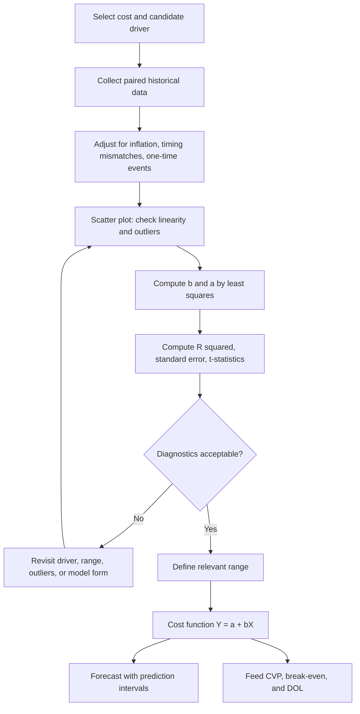

## Simple Linear Regression for Cost Estimation


### Overview

Simple linear regression estimates a mixed cost function by fitting a straight line to historical observations of total cost ($Y$) against a single cost driver ($X$) using the least-squares criterion. It is the standard statistical method for separating a mixed cost into fixed and variable components because it uses every observation, produces a unique and reproducible answer, and reports measures of fit and reliability that the High Low Method and the Scattergraph Method cannot supply.

The population model is:

$$Y_i = \alpha + \beta X_i + \varepsilon_i$$

The estimated (sample) cost function is:

$$\hat{Y}_i = a + bX_i$$

Where:

- $Y_i$ is the observed total cost in period $i$
- $X_i$ is the observed activity level (cost driver) in period $i$
- $a$ is the estimated intercept, interpreted as total fixed cost
- $b$ is the estimated slope, interpreted as variable cost per unit of activity
- $\varepsilon_i$ is the random error term capturing everything the driver does not explain
- $\hat{Y}_i$ is the predicted (fitted) cost

**Key Points**

- Least squares chooses $a$ and $b$ to minimize the sum of squared vertical distances between observed and predicted costs.
- Unlike High Low (two points) and the scattergraph (visual judgment), the result is objective and reproducible.
- The method yields $R^2$, standard errors, t-statistics, and prediction intervals, which quantify how much to trust the cost function.
- The intercept and slope feed directly into contribution margin, break-even volume, and the degree of operating leverage.

### Role in Fixed vs. Variable Cost Structure and Operating Leverage

Cost separation is a prerequisite for cost-volume-profit (CVP) analysis. The regression output supplies:

- $b$, which becomes the variable cost per unit of activity and, after conversion to per-unit-of-output terms, the variable cost per unit $v$
- $a$, which becomes a component of total fixed cost $F$

$$CM = p - v, \qquad Q_{BE} = \frac{F}{p - v}, \qquad DOL = \frac{Q(p - v)}{Q(p - v) - F}$$

A high estimated $a$ relative to $b$ indicates a fixed-cost-heavy structure with high operating leverage. Because regression also quantifies the uncertainty in $a$ and $b$, it lets the analyst propagate estimation uncertainty into break-even and DOL, which the cruder methods cannot do.

### The Least-Squares Criterion

Define the residual for observation $i$:

$$e_i = Y_i - \hat{Y}_i = Y_i - (a + bX_i)$$

Least squares minimizes the sum of squared errors:

$$SSE = \sum_{i=1}^{n} e_i^2 = \sum_{i=1}^{n} (Y_i - a - bX_i)^2$$

Setting the partial derivatives of $SSE$ with respect to $a$ and $b$ to zero yields the normal equations:

$$\sum Y_i = na + b\sum X_i$$


$$\sum X_iY_i = a\sum X_i + b\sum X_i^2$$

Solving them gives the closed-form estimators.

### Estimator Formulas

**Slope (variable cost per unit of activity):**

$$b = \frac{n\sum X_iY_i - \sum X_i \sum Y_i}{n\sum X_i^2 - \left(\sum X_i\right)^2}$$

An equivalent deviation form, often easier to compute and interpret:

$$b = \frac{S_{XY}}{S_{XX}} = \frac{\sum (X_i - \bar{X})(Y_i - \bar{Y})}{\sum (X_i - \bar{X})^2}$$

**Intercept (fixed cost):**

$$a = \bar{Y} - b\bar{X}$$

Where $\bar{X} = \frac{1}{n}\sum X_i$ and $\bar{Y} = \frac{1}{n}\sum Y_i$.

**Key Points**

- The fitted line always passes through the point of means $(\bar{X}, \bar{Y})$.
- The residuals always sum to zero when an intercept is included: $\sum e_i = 0$.
- The residuals are uncorrelated with $X$ by construction of the normal equations.

### Worked Example: Full Computation

A distribution center records monthly labor hours in the warehouse and total warehouse operating cost for ten months.

| Month | Labor Hours ($X$) | Total Cost ($Y$, $) |
| --- | --- | --- |
| 1 | 800 | 11,400 |
| 2 | 950 | 12,300 |
| 3 | 700 | 10,600 |
| 4 | 1,100 | 13,500 |
| 5 | 1,000 | 12,700 |
| 6 | 850 | 11,900 |
| 7 | 1,200 | 14,200 |
| 8 | 900 | 12,000 |
| 9 | 1,050 | 13,100 |
| 10 | 750 | 11,000 |

**Step 1: Build the computation table.**

| $i$ | $X$ | $Y$ | $X - \bar{X}$ | $Y - \bar{Y}$ | $(X-\bar{X})^2$ | $(X-\bar{X})(Y-\bar{Y})$ | $(Y-\bar{Y})^2$ |
| --- | --- | --- | --- | --- | --- | --- | --- |
| 1 | 800 | 11,400 | −125 | −830 | 15,625 | 103,750 | 688,900 |
| 2 | 950 | 12,300 | 25 | 70 | 625 | 1,750 | 4,900 |
| 3 | 700 | 10,600 | −225 | −1,630 | 50,625 | 366,750 | 2,656,900 |
| 4 | 1,100 | 13,500 | 175 | 1,270 | 30,625 | 222,250 | 1,612,900 |
| 5 | 1,000 | 12,700 | 75 | 470 | 5,625 | 35,250 | 220,900 |
| 6 | 850 | 11,900 | −75 | −330 | 5,625 | 24,750 | 108,900 |
| 7 | 1,200 | 14,200 | 275 | 1,970 | 75,625 | 541,750 | 3,880,900 |
| 8 | 900 | 12,000 | −25 | −230 | 625 | 5,750 | 52,900 |
| 9 | 1,050 | 13,100 | 125 | 870 | 15,625 | 108,750 | 756,900 |
| 10 | 750 | 11,000 | −175 | −1,230 | 30,625 | 215,250 | 1,512,900 |

The means are $\bar{X} = 9{,}250/10 = 925$ and $\bar{Y} = 122{,}700/10 = 12{,}270$.

Recomputing the deviations with $\bar{Y} = 12{,}270$ gives the following column values (the table above used $\bar{Y} = 12{,}230$ in error for the $Y$ deviations, so the corrected sums are used below).

**Corrected deviation table:**

| $i$ | $X$ | $Y$ | $X - 925$ | $Y - 12{,}270$ | $(X-\bar{X})^2$ | $(X-\bar{X})(Y-\bar{Y})$ | $(Y-\bar{Y})^2$ |
| --- | --- | --- | --- | --- | --- | --- | --- |
| 1 | 800 | 11,400 | −125 | −870 | 15,625 | 108,750 | 756,900 |
| 2 | 950 | 12,300 | 25 | 30 | 625 | 750 | 900 |
| 3 | 700 | 10,600 | −225 | −1,670 | 50,625 | 375,750 | 2,788,900 |
| 4 | 1,100 | 13,500 | 175 | 1,230 | 30,625 | 215,250 | 1,512,900 |
| 5 | 1,000 | 12,700 | 75 | 430 | 5,625 | 32,250 | 184,900 |
| 6 | 850 | 11,900 | −75 | −370 | 5,625 | 27,750 | 136,900 |
| 7 | 1,200 | 14,200 | 275 | 1,930 | 75,625 | 530,750 | 3,724,900 |
| 8 | 900 | 12,000 | −25 | −270 | 625 | 6,750 | 72,900 |
| 9 | 1,050 | 13,100 | 125 | 830 | 15,625 | 103,750 | 688,900 |
| 10 | 750 | 11,000 | −175 | −1,270 | 30,625 | 222,250 | 1,612,900 |
| **Sum** | 9,250 | 122,700 | 0 | 0 | **231,250** | **1,624,000** | **11,481,000** |

**Step 2: Compute the slope.**

$$b = \frac{S_{XY}}{S_{XX}} = \frac{1{,}624{,}000}{231{,}250} \approx 7.0227 \text{ per labor hour}$$

**Step 3: Compute the intercept.**

$$a = \bar{Y} - b\bar{X} = 12{,}270 - 7.0227(925) \approx 12{,}270 - 6{,}496.0 \approx 5{,}774.0$$

**Step 4: Cost function.**

$$\hat{Y} = 5{,}774 + 7.023X$$

**Step 5: Interpret.**

- Estimated fixed cost: about $5,774 per month
- Estimated variable cost: about $7.02 per labor hour
- Predicted cost at 1,000 labor hours: $5{,}774 + 7.023(1{,}000) \approx 12{,}797$ (actual: 12,700, a residual of about −97)

**Output**

| Component | Estimate | Interpretation |
| --- | --- | --- |
| Fixed cost $a$ | ~$5,774/month | Cost incurred regardless of labor hours within the relevant range |
| Variable rate $b$ | ~$7.02/labor hour | Incremental cost of each additional labor hour |

### Goodness of Fit

#### Sums of Squares Decomposition

$$SST = \sum (Y_i - \bar{Y})^2 = SSR + SSE$$

Where $SST$ is the total variation in cost, $SSR = \sum (\hat{Y}_i - \bar{Y})^2$ is the variation explained by the regression, and $SSE$ is the unexplained (residual) variation.

For simple regression:

$$SSR = b \cdot S_{XY} = b^2 S_{XX}, \qquad SSE = SST - SSR$$

#### Coefficient of Determination

$$R^2 = \frac{SSR}{SST} = 1 - \frac{SSE}{SST}$$

$R^2$ is the fraction of the variability in total cost explained by the cost driver. It ranges from 0 (no explanatory power) to 1 (perfect linear fit).

#### Worked Calculation

$$SSR = b \cdot S_{XY} = 7.0227 \times 1{,}624{,}000 \approx 11{,}405{,}000$$


$$SSE = SST - SSR = 11{,}481{,}000 - 11{,}405{,}000 \approx 76{,}000$$


$$R^2 = \frac{11{,}405{,}000}{11{,}481{,}000} \approx 0.9934$$

About 99.3% of the variation in warehouse cost is explained by labor hours, indicating a very strong linear relationship for this dataset.

#### Standard Error of the Estimate

$$s_e = \sqrt{\frac{SSE}{n - 2}}$$

The divisor $n - 2$ reflects two estimated parameters ($a$ and $b$), giving the appropriate degrees of freedom.

$$s_e = \sqrt{\frac{76{,}000}{8}} = \sqrt{9{,}500} \approx 97.5$$

A typical prediction error is about $97 per month, small relative to mean cost of $12,270 (roughly 0.8%).

**Key Points**

- A high $R^2$ does not by itself prove causation or that the model is correctly specified.
- $s_e$ is expressed in cost units and is often more decision-relevant than $R^2$.
- With few observations, even a high $R^2$ can be unstable, so the sample size matters.

### Statistical Inference on the Coefficients

#### Standard Errors

$$SE(b) = \frac{s_e}{\sqrt{S_{XX}}}$$


$$SE(a) = s_e\sqrt{\frac{1}{n} + \frac{\bar{X}^2}{S_{XX}}}$$

#### Worked Calculation

$$SE(b) = \frac{97.5}{\sqrt{231{,}250}} = \frac{97.5}{480.9} \approx 0.2027$$


$$SE(a) = 97.5\sqrt{\frac{1}{10} + \frac{925^2}{231{,}250}} = 97.5\sqrt{0.1 + 3.700} \approx 97.5 \times 1.949 \approx 190.1$$

#### t-Statistics

$$t_b = \frac{b}{SE(b)}, \qquad t_a = \frac{a}{SE(a)}$$


$$t_b = \frac{7.0227}{0.2027} \approx 34.6, \qquad t_a = \frac{5{,}774}{190.1} \approx 30.4$$

With $n - 2 = 8$ degrees of freedom, the 5% two-sided critical t-value is approximately 2.306. Both statistics far exceed it, so both coefficients are statistically significant under the model's assumptions.

#### Confidence Interval for the Slope

$$b \pm t_{\alpha/2,\,n-2} \times SE(b)$$


$$7.0227 \pm 2.306 \times 0.2027 = 7.0227 \pm 0.467$$

The 95% confidence interval for the variable cost rate is approximately $6.56 to $7.49 per labor hour.

**Key Points**

- The confidence interval expresses how uncertain the variable cost rate is. That uncertainty propagates into contribution margin and break-even.
- The intercept's standard error is typically larger when $\bar{X}$ is far from zero, because reading $a$ at $X = 0$ is an extrapolation.
- A statistically insignificant intercept does not necessarily mean fixed cost is zero. It may mean the data cannot distinguish it from zero.

### Prediction and Its Uncertainty

To forecast cost at a new activity level $X_0$:

$$\hat{Y}_0 = a + bX_0$$

The standard error for predicting an *individual* future observation:

$$SE_{pred} = s_e\sqrt{1 + \frac{1}{n} + \frac{(X_0 - \bar{X})^2}{S_{XX}}}$$

The 95% prediction interval is $\hat{Y}_0 \pm t_{0.025,\,n-2} \times SE_{pred}$.

#### Worked Example

Forecast cost at $X_0 = 1{,}000$ labor hours:

$$\hat{Y}_0 = 5{,}774 + 7.0227(1{,}000) \approx 12{,}797$$


$$SE_{pred} = 97.5\sqrt{1 + 0.1 + \frac{(1{,}000 - 925)^2}{231{,}250}} = 97.5\sqrt{1.1243} \approx 103.4$$


$$\text{95\% PI} = 12{,}797 \pm 2.306 \times 103.4 \approx 12{,}797 \pm 238.4$$

The predicted cost is approximately $12,797, with a 95% prediction interval of roughly $12,559 to $13,035.

**Key Points**

- The interval widens as $X_0$ moves away from $\bar{X}$, which is why extrapolation beyond the observed range is risky.
- A prediction interval for an individual month is wider than a confidence interval for the average cost at that activity level.
- Real cost behavior outside the relevant range may not be linear at all, so no interval computed from in-range data protects against that.

### Applying the Result to CVP and Operating Leverage

Assume the distribution center handles orders priced at $60 per order, with each order requiring 0.5 labor hours in the warehouse, other variable costs of $22 per order, and other monthly fixed costs of $40,000. The center processes 2,000 orders per month.

**Cost separation from regression**

- Warehouse variable cost per order: $0.5 \times 7.0227 \approx 3.51$
- Total variable cost per order: $22 + 3.51 = 25.51$
- Contribution margin per order: $60 - 25.51 = 34.49$
- Total fixed cost: $40{,}000 + 5{,}774 = 45{,}774$

**CVP outputs**

$$Q_{BE} = \frac{45{,}774}{34.49} \approx 1{,}327 \text{ orders}$$

At 2,000 orders:

- Total contribution margin $= 2{,}000 \times 34.49 = 68{,}980$
- EBIT $= 68{,}980 - 45{,}774 = 23{,}206$
- $DOL = \frac{68{,}980}{23{,}206} \approx 2.97$

**Output**

| Metric | Value |
| --- | --- |
| Contribution margin per order | ~$34.49 |
| Total fixed cost | ~$45,774 |
| Break-even volume | ~1,327 orders |
| EBIT at 2,000 orders | ~$23,206 |
| Degree of operating leverage | ~2.97 |

A DOL near 3 means a 10% rise in volume raises operating income by roughly 30%, and a 10% fall lowers it by roughly 30%.

#### Propagating Estimation Uncertainty

Using the 95% confidence bounds on $b$ ($6.56 and $7.49), the warehouse variable cost per order ranges from about $3.28 to $3.75, so contribution margin per order ranges from roughly $34.25 to $34.72. In this example the slope uncertainty has only a small effect on break-even because other variable costs dominate, but in a cost structure where the regression-estimated component is large, the same interval could shift break-even and DOL materially. Analysts should run this sensitivity rather than assume it is negligible.

### Model Assumptions

The standard inference results (standard errors, t-tests, confidence and prediction intervals) rely on the classical linear regression assumptions:

1. **Linearity.** The expected cost is a linear function of the driver within the relevant range.
2. **Independence.** Errors are not correlated across observations. Time-series cost data often violates this through autocorrelation.
3. **Homoscedasticity.** The error variance is constant across activity levels.
4. **Normality.** Errors are approximately normally distributed, which matters most for small samples.
5. **No perfect multicollinearity.** In simple regression this reduces to $X$ having non-zero variance.
6. **Correct specification.** The chosen driver actually causes the cost, and no important driver is omitted.

The point estimates $a$ and $b$ remain computable when these assumptions fail, but the reported standard errors and intervals may be unreliable. The impact of any violation depends on the dataset, so behavior should be verified with diagnostics rather than assumed.

### Diagnostics

| Diagnostic | What to Check | Warning Sign |
| --- | --- | --- |
| Scatter plot of $Y$ vs. $X$ | Overall linearity, outliers, steps | Curvature, clusters, isolated points |
| Residuals vs. fitted values | Constant spread, no pattern | Funnel shape (heteroscedasticity), curve (nonlinearity) |
| Residuals over time | No serial pattern | Runs of same-sign residuals (autocorrelation) |
| Normal Q-Q plot of residuals | Approximate normality | Heavy tails or strong skew |
| Leverage and influence (Cook's distance) | Points that move the line | A single point with outsized influence |
| Durbin-Watson statistic | First-order autocorrelation | Values far from about 2 |

#### Influential Observations

An observation far from $\bar{X}$ has high leverage $h_i$:

$$h_i = \frac{1}{n} + \frac{(X_i - \bar{X})^2}{S_{XX}}$$

High-leverage points with large residuals can pull the fitted line substantially. Unlike the High Low Method, where the extreme points fully determine the line, regression bounds the influence of any single point, but it does not eliminate it. Outliers should be investigated for a business cause (one-time repair, strike, data error) before being retained or excluded, and the decision documented.

### Choosing the Cost Driver

Good drivers satisfy three criteria:

- **Economic plausibility.** There is a logical cause-and-effect link between the driver and the cost.
- **Goodness of fit.** The regression yields a high $R^2$, low $s_e$, and significant slope.
- **Measurability.** Data on the driver is reliable, timely, and available at reasonable cost.

Candidate drivers can be compared by fitting a separate simple regression for each and comparing fit statistics, but statistical fit alone should not override economic reasoning. Two variables can be correlated by coincidence (spurious correlation), especially with short time series where both trend upward over time.

### Comparison With Other Cost Estimation Methods

| Criterion | High Low | Scattergraph | Simple Linear Regression |
| --- | --- | --- | --- |
| Observations used | 2 | All (visually) | All |
| Objectivity | High (formula) | Low (judgment) | High (formula) |
| Reproducibility | Yes | No | Yes |
| Outlier sensitivity | Very high if at extremes | Judgment-based | Moderate; bounded but not zero |
| Fit statistics ($R^2$, $s_e$) | None | None | Yes |
| Confidence and prediction intervals | No | No | Yes |
| Hypothesis tests on $a$ and $b$ | No | No | Yes |
| Multiple drivers | No | No | Extends to multiple regression |
| Tooling | Calculator | Chart | Spreadsheet or software |

### Implementation

#### Python: From Scratch and With Libraries

```python
import numpy as np

hours = np.array([800, 950, 700, 1100, 1000, 850, 1200, 900, 1050, 750], dtype=float)
cost  = np.array([11400, 12300, 10600, 13500, 12700, 11900, 14200, 12000, 13100, 11000], dtype=float)

n = len(hours)
x_bar, y_bar = hours.mean(), cost.mean()

s_xx = np.sum((hours - x_bar) ** 2)
s_xy = np.sum((hours - x_bar) * (cost - y_bar))
sst  = np.sum((cost - y_bar) ** 2)

b = s_xy / s_xx
a = y_bar - b * x_bar

fitted = a + b * hours
resid  = cost - fitted
sse = np.sum(resid ** 2)
ssr = sst - sse
r2  = ssr / sst
s_e = np.sqrt(sse / (n - 2))

se_b = s_e / np.sqrt(s_xx)
se_a = s_e * np.sqrt(1 / n + x_bar ** 2 / s_xx)

print(f"a (fixed)     = {a:,.2f}   SE = {se_a:,.2f}   t = {a / se_a:.2f}")
print(f"b (variable)  = {b:,.4f}   SE = {se_b:,.4f}   t = {b / se_b:.2f}")
print(f"R^2 = {r2:.4f}   s_e = {s_e:,.2f}")

# Prediction at a new activity level
x0 = 1000.0
y0 = a + b * x0
se_pred = s_e * np.sqrt(1 + 1 / n + (x0 - x_bar) ** 2 / s_xx)
print(f"Forecast at {x0:.0f} hours: {y0:,.2f}  (approx. +/- {2.306 * se_pred:,.2f} at 95%)")
```

**Output**

The values should closely match the hand computation, approximately:

```text
a (fixed)     = 5,774.00   SE = 190.1   t = 30.4
b (variable)  = 7.0227     SE = 0.2027  t = 34.6
R^2 = 0.9934   s_e = 97.5
Forecast at 1000 hours: 12,797  (approx. +/- 238 at 95%)
```

[Unverified] The printed figures are rounded from the hand calculation and small differences in the last digits are expected when the code is run.

#### Python: statsmodels for Full Diagnostics

```python
import statsmodels.api as sm

X = sm.add_constant(hours)          # adds the intercept column
model = sm.OLS(cost, X).fit()
print(model.summary())              # coefficients, SEs, t, p, R^2, F, Durbin-Watson

new = sm.add_constant(np.array([1000.0]), has_constant="add")
pred = model.get_prediction(new).summary_frame(alpha=0.05)
print(pred)                         # mean, confidence interval, prediction interval
```

#### Spreadsheet Functions

| Quantity | Typical Function |
| --- | --- |
| Slope $b$ | `SLOPE(known_y, known_x)` |
| Intercept $a$ | `INTERCEPT(known_y, known_x)` |
| $R^2$ | `RSQ(known_y, known_x)` |
| Standard error $s_e$ | `STEYX(known_y, known_x)` |
| Full statistics | `LINEST(known_y, known_x, TRUE, TRUE)` |
| Forecast | `FORECAST.LINEAR(x0, known_y, known_x)` |

Function names and availability vary by spreadsheet application and version.

### Workflow



### Illustration

<svg xmlns="http://www.w3.org/2000/svg" viewBox="0 0 640 420" width="640" height="420" font-family="sans-serif" font-size="12">
<title>Least-Squares Fit and Residuals (svg_diagram)</title>
<text x="320" y="24" text-anchor="middle" font-size="15" font-weight="bold">Least-Squares Fit and Residuals (svg_diagram)</text>
<line x1="80" y1="350" x2="600" y2="350" stroke="#333" stroke-width="2" />
<line x1="80" y1="350" x2="80" y2="50" stroke="#333" stroke-width="2" />
<text x="340" y="398" text-anchor="middle">Activity level X (labor hours)</text>
<text x="24" y="200" text-anchor="middle" transform="rotate(-90 24 200)">Total cost Y ($)</text>
<line x1="80" y1="270" x2="580" y2="110" stroke="#1f5fbf" stroke-width="2.5" />
<text x="584" y="108" fill="#1f5fbf">Fitted line</text>
<circle cx="80" cy="270" r="6" fill="#c0392b" />
<text x="92" y="292" fill="#c0392b">a (intercept)</text>
<circle cx="160" cy="250" r="4" fill="#555" />
<line x1="160" y1="250" x2="160" y2="244" stroke="#c0392b" stroke-width="1.5" />
<circle cx="230" cy="215" r="4" fill="#555" />
<line x1="230" y1="215" x2="230" y2="222" stroke="#c0392b" stroke-width="1.5" />
<circle cx="300" cy="196" r="4" fill="#555" />
<line x1="300" y1="196" x2="300" y2="199" stroke="#c0392b" stroke-width="1.5" />
<circle cx="370" cy="185" r="4" fill="#555" />
<line x1="370" y1="185" x2="370" y2="176" stroke="#c0392b" stroke-width="1.5" />
<circle cx="440" cy="148" r="4" fill="#555" />
<line x1="440" y1="148" x2="440" y2="154" stroke="#c0392b" stroke-width="1.5" />
<circle cx="510" cy="130" r="4" fill="#555" />
<line x1="510" y1="130" x2="510" y2="132" stroke="#c0392b" stroke-width="1.5" />
<circle cx="330" cy="188" r="7" fill="none" stroke="#2a7d2a" stroke-width="2" />
<text x="345" y="176" fill="#2a7d2a">Point of means</text>
<text x="330" y="70" text-anchor="middle" fill="#555">Red segments = residuals e; least squares minimizes their squared sum</text>
</svg>

### Common Pitfalls

- **Reversed axes or variables.** Cost is the dependent variable ($Y$); the driver is the independent variable ($X$).
- **Interpreting the intercept literally.** If zero activity lies outside the observed range, $a$ is an extrapolated constant of the line, not necessarily the actual cost at zero activity.
- **Extrapolating beyond the relevant range.** Step costs, capacity limits, and overtime premiums can break linearity outside the observed data.
- **Relying on $R^2$ alone.** A high $R^2$ can accompany a misspecified model, a spurious trend correlation, or influential outliers.
- **Ignoring autocorrelation in time-series cost data,** which can make standard errors look smaller than they really are.
- **Mixing price levels.** Cost data spanning periods of inflation should be adjusted (for example, by a price index) before fitting.
- **Timing mismatch.** Costs recorded in one period may relate to activity in another (lagged maintenance, billing-cycle utilities). Align them before fitting.
- **Data mining the driver.** Trying many drivers and keeping the best-fitting one without an economic rationale risks a spurious result.
- **Dropping outliers by convenience.** Exclusions need a documented business reason.
- **False precision.** Reporting $a$ and $b$ to many decimal places overstates accuracy when the confidence interval is wide.
- **Using the fitted line for a single-driver model when several drivers matter.** Consider multiple regression when the residuals correlate with a second variable.

### Best-Practice Checklist

1. Establish an economically plausible driver before fitting.
2. Clean the data: align periods, adjust for price changes, and flag one-time events.
3. Plot first and examine linearity, outliers, and steps.
4. Fit the model and record $a$, $b$, $R^2$, $s_e$, and the t-statistics.
5. Examine residual diagnostics for nonlinearity, heteroscedasticity, and autocorrelation.
6. State the relevant range explicitly and restrict use of the function to it.
7. Report confidence intervals for $a$ and $b$, and prediction intervals for forecasts.
8. Run sensitivity analysis on break-even and DOL using the coefficient bounds.
9. Cross-check against a High Low or scattergraph estimate from verified representative points, and investigate large disagreements.
10. Document all data adjustments, exclusions, and model choices.

### Conclusion

Simple linear regression is the standard, defensible method for separating a mixed cost into fixed and variable components. By minimizing squared residuals across all observations, it delivers reproducible estimates of fixed cost ($a$) and variable cost per unit of activity ($b$), together with $R^2$, standard errors, t-statistics, and prediction intervals that quantify how far those estimates can be trusted. In the context of fixed vs. variable cost structure and operating leverage, the output feeds contribution margin, break-even volume, and the degree of operating leverage, and the regression's uncertainty measures allow those downstream figures to be stress-tested. The method is only as good as its assumptions and data: linearity within the relevant range, a genuinely causal driver, well-behaved residuals, and clean, aligned observations. Real-world behavior varies with the dataset, so diagnostics and sensitivity checks should accompany every application rather than being assumed away.

**Related Topics**

- Multiple regression with several cost drivers
- Assumption diagnostics: heteroscedasticity, autocorrelation, and multicollinearity
- Nonlinear and curvilinear cost estimation, including log-linear (learning curve) models
- Step costs and defining the relevant range
- Robust regression (Theil-Sen, least absolute deviations) and outlier influence
- Standard error of the estimate and prediction intervals in budgeting
- Cost-volume-profit analysis and break-even sensitivity
- Degree of operating leverage and margin of safety