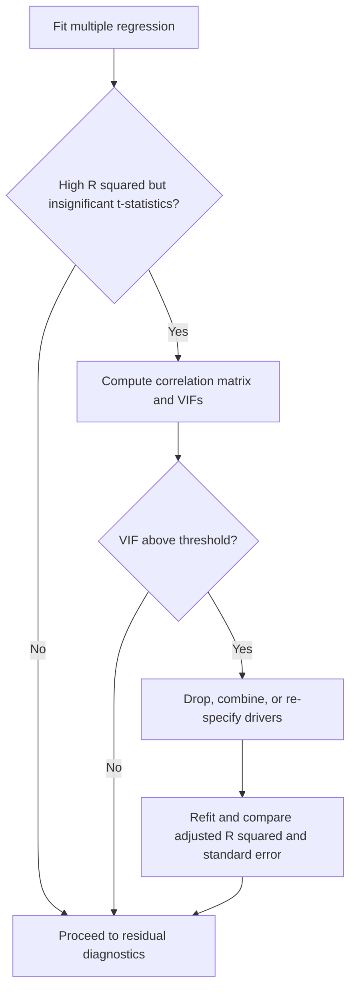
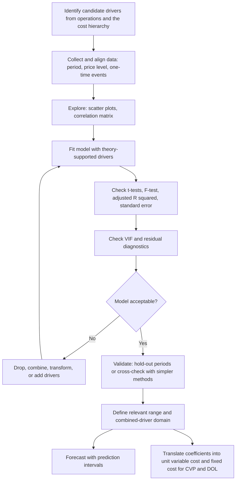

## Multiple Regression and Multiple Cost Drivers


### Overview

Multiple regression extends simple linear regression to estimate a cost function that depends on two or more cost drivers at the same time. Many real costs are not explained well by a single activity measure. Warehouse cost may depend on both labor hours and the number of shipments. Maintenance cost may depend on machine hours and the number of production runs. Overhead in an activity-based costing (ABC) setting may depend on units produced, setups, and inspections simultaneously. Forcing such a cost onto a single driver leaves the other drivers' effects in the error term, biasing the coefficient on the driver that was included and producing a poor fit.

The population model with $k$ drivers is:

$$Y_i = \beta_0 + \beta_1 X_{1i} + \beta_2 X_{2i} + \dots + \beta_k X_{ki} + \varepsilon_i$$

The estimated cost function is:

$$\hat{Y}_i = b_0 + b_1 X_{1i} + b_2 X_{2i} + \dots + b_k X_{ki}$$

Where:

- $Y_i$ is total cost in period $i$
- $X_{ji}$ is the level of cost driver $j$ in period $i$
- $b_0$ is the estimated intercept, interpreted as the cost component that does not vary with any of the included drivers (the fixed component)
- $b_j$ is the estimated variable cost per unit of driver $j$, holding all other drivers constant
- $\varepsilon_i$ is the random error term

**Key Points**

- Each slope coefficient is a *partial* effect: the expected change in cost for a one-unit change in that driver while the other drivers are held fixed.
- Adding relevant drivers can sharply reduce unexplained variation and remove the bias that arises from omitting a true driver.
- Adding irrelevant or highly overlapping drivers can degrade the model, so driver selection needs both economic reasoning and statistical diagnostics.
- The result supports multi-driver cost pools, activity-based costing, and a more refined view of what is truly fixed versus variable.

### Role in Fixed vs. Variable Cost Structure and Operating Leverage

With a single driver, the entire non-fixed portion of a cost is attributed to volume. Multiple regression separates cost behavior along several dimensions, which changes the interpretation of "variable":

- Costs that vary with **unit-level** drivers (units produced, machine hours) scale with volume.
- Costs that vary with **batch-level** drivers (setups, purchase orders, production runs) scale with the number of batches, not the number of units.
- The intercept captures costs that vary with none of the included drivers.

This matters for operating leverage. A cost that looks fixed with respect to units may actually be variable with respect to batches, so the true short-run and long-run cost structure differs from the one a single-driver model would imply. If a firm changes batch size, the single-driver model would misstate the effect on total cost, and the degree of operating leverage computed from it would be off.

For CVP analysis, the unit-level coefficients determine the unit variable cost, while the batch-level coefficients require a translation using batch size:

$$v_{unit} = \sum_{\text{unit-level}} b_j \cdot u_j \; + \; \sum_{\text{batch-level}} \frac{b_m}{B}$$

Where $u_j$ is the driver usage per unit of output and $B$ is the number of output units per batch.

### Matrix Formulation and Estimation

Stack the $n$ observations into matrices:

$$\mathbf{y} = \mathbf{X}\boldsymbol{\beta} + \boldsymbol{\varepsilon}$$

Where $\mathbf{y}$ is an $n \times 1$ vector of costs, $\mathbf{X}$ is an $n \times (k+1)$ design matrix whose first column is all ones (for the intercept) and whose remaining columns hold the driver values, and $\boldsymbol{\beta}$ is the $(k+1) \times 1$ coefficient vector.

The least-squares criterion minimizes the sum of squared residuals:

$$SSE = (\mathbf{y} - \mathbf{X}\mathbf{b})^{\top}(\mathbf{y} - \mathbf{X}\mathbf{b})$$

Setting the gradient to zero yields the normal equations and the estimator:

$$\mathbf{X}^{\top}\mathbf{X}\,\mathbf{b} = \mathbf{X}^{\top}\mathbf{y} \quad\Rightarrow\quad \mathbf{b} = (\mathbf{X}^{\top}\mathbf{X})^{-1}\mathbf{X}^{\top}\mathbf{y}$$

The estimated covariance matrix of the coefficients is:

$$\widehat{\text{Var}}(\mathbf{b}) = s_e^2\,(\mathbf{X}^{\top}\mathbf{X})^{-1}, \qquad s_e^2 = \frac{SSE}{n - k - 1}$$

The standard error of coefficient $b_j$ is the square root of the $j$-th diagonal element of this matrix.

**Key Points**

- The inverse $(\mathbf{X}^{\top}\mathbf{X})^{-1}$ exists only if the columns of $\mathbf{X}$ are linearly independent, which is why perfect multicollinearity breaks the model.
- The residual degrees of freedom are $n - k - 1$: each additional driver consumes one degree of freedom.
- The fitted values are $\hat{\mathbf{y}} = \mathbf{X}\mathbf{b}$ and the residuals are $\mathbf{e} = \mathbf{y} - \hat{\mathbf{y}}$, with $\mathbf{X}^{\top}\mathbf{e} = \mathbf{0}$.

### Worked Example: Two Cost Drivers

A distribution firm records monthly warehouse operating cost, total labor hours, and the number of shipments dispatched for twelve months.

| Month | Labor Hours ($X_1$) | Shipments ($X_2$) | Total Cost ($Y$, $) |
| --- | --- | --- | --- |
| 1 | 800 | 40 | 15,010 |
| 2 | 950 | 30 | 15,760 |
| 3 | 700 | 55 | 14,600 |
| 4 | 1,100 | 35 | 17,790 |
| 5 | 1,000 | 60 | 18,240 |
| 6 | 850 | 25 | 14,290 |
| 7 | 1,200 | 50 | 19,450 |
| 8 | 900 | 45 | 16,570 |
| 9 | 1,050 | 38 | 17,240 |
| 10 | 750 | 32 | 13,590 |
| 11 | 1,150 | 58 | 19,470 |
| 12 | 980 | 42 | 16,930 |

The data were constructed so that the underlying relationship is approximately:

$$Y \approx 4{,}000 + 8.00\,X_1 + 60.00\,X_2 + \text{noise}$$

**Step 1: Fit the model.** Solving the normal equations (by software, since the arithmetic for $(\mathbf{X}^{\top}\mathbf{X})^{-1}$ is impractical by hand for $k = 2$ with twelve observations) yields estimates close to the constructing values. Representative output:

| Coefficient | Estimate | Interpretation |
| --- | --- | --- |
| $b_0$ (intercept) | ~$3,970 | Fixed cost not driven by labor hours or shipments |
| $b_1$ (labor hours) | ~$8.02 per hour | Variable cost per labor hour, holding shipments constant |
| $b_2$ (shipments) | ~$60.1 per shipment | Variable cost per shipment, holding labor hours constant |

[Unverified] These coefficient values are illustrative of the pattern expected from the constructed data. Exact figures should be confirmed by running the code in the implementation section, as the noise term determines the last digits.

**Step 2: Interpret.** For a month with no change in shipments, each additional labor hour adds about $8.02 to cost. For a month with no change in labor hours, each additional shipment adds about $60.10. The cost function is:

$$\hat{Y} = 3{,}970 + 8.02\,X_1 + 60.1\,X_2$$

**Step 3: Predict.** For a planned month with 1,000 labor hours and 45 shipments:

$$\hat{Y} = 3{,}970 + 8.02(1{,}000) + 60.1(45) = 3{,}970 + 8{,}020 + 2{,}704.5 \approx 14{,}694$$

**Step 4: Compare with a single-driver model.** Fitting labor hours alone would attribute the shipment effect to labor hours (to the extent the two are correlated) and leave the rest in the error term, producing a higher standard error and a less reliable forecast in months where shipments and hours diverge. The comparison is quantified below with adjusted $R^2$ and $s_e$.

### Goodness of Fit

#### Coefficient of Determination

$$R^2 = 1 - \frac{SSE}{SST}, \qquad SST = \sum (Y_i - \bar{Y})^2$$

$R^2$ never decreases when a driver is added, even if the driver is irrelevant, so it cannot be used alone to compare models with different numbers of drivers.

#### Adjusted $R^2$

$$\bar{R}^2 = 1 - \frac{SSE/(n - k - 1)}{SST/(n - 1)} = 1 - (1 - R^2)\frac{n - 1}{n - k - 1}$$

Adjusted $R^2$ penalizes the loss of degrees of freedom and can decrease when a driver adds little explanatory power.

#### Standard Error of the Estimate

$$s_e = \sqrt{\frac{SSE}{n - k - 1}}$$

This is the typical prediction error in cost units and is often the most decision-relevant fit measure for budgeting.

#### Illustrative Comparison

| Model | Drivers | $R^2$ | Adjusted $R^2$ | $s_e$ ($) |
| --- | --- | --- | --- | --- |
| A | Labor hours only | ~0.83 | ~0.81 | ~900 |
| B | Labor hours + shipments | ~0.99 | ~0.99 | ~120 |

[Inference] These figures illustrate the typical pattern when a second true driver is added to a model that omitted it. The exact values depend on the data and should be computed, not assumed.

**Key Points**

- Adjusted $R^2$ and $s_e$ are better than raw $R^2$ for comparing models of different size.
- A large jump in fit after adding a driver suggests that the driver captured real cost behavior that the simpler model left in the error.

### Statistical Inference

#### t-Tests on Individual Coefficients

For each driver $j$:

$$t_j = \frac{b_j}{SE(b_j)}$$

compared against a t-distribution with $n - k - 1$ degrees of freedom. The null hypothesis $H_0: \beta_j = 0$ states that the driver has no effect on cost after accounting for the other drivers.

#### Confidence Intervals

$$b_j \pm t_{\alpha/2,\,n-k-1} \cdot SE(b_j)$$

#### Overall F-Test

The F-test evaluates whether at least one driver has explanatory power:

$$F = \frac{SSR/k}{SSE/(n - k - 1)} = \frac{R^2/k}{(1 - R^2)/(n - k - 1)}$$

The null hypothesis is $H_0: \beta_1 = \beta_2 = \dots = \beta_k = 0$. A large $F$ (small p-value) rejects it.

#### Nested Model F-Test (Do the Extra Drivers Help?)

To test whether a subset of $q$ additional drivers improves a restricted model:

$$F = \frac{(SSE_R - SSE_U)/q}{SSE_U/(n - k - 1)}$$

Where $SSE_R$ is the residual sum of squares of the restricted (smaller) model and $SSE_U$ that of the unrestricted (larger) model.

**Key Points**

- A significant F-test with individually insignificant t-statistics is a classic symptom of multicollinearity.
- The t-test for one driver is conditional on the others being in the model, so dropping one driver changes the others' coefficients and significance.
- Statistical significance does not imply economic importance. Compare the coefficient magnitude with the driver's typical range.

### Multicollinearity

Multicollinearity occurs when two or more drivers are strongly correlated with each other. It is common in cost data because activity measures often move together (more production means more machine hours, more labor hours, and more material handling).

#### Consequences

- The overall fit may remain good, but individual coefficients become unstable and have large standard errors.
- Coefficients can change sign or magnitude dramatically when a single observation or driver is added or removed.
- Separating the effect of one driver from another becomes statistically difficult.
- Prediction within the observed pattern of co-movement can still be accurate, but prediction when drivers diverge from their historical relationship can be unreliable.

#### Detection

**Correlation matrix.** Pairwise correlations above roughly 0.8 to 0.9 between drivers are a warning sign, though this threshold is a rule of thumb and not a formal standard.

**Variance Inflation Factor (VIF).** For driver $j$, regress $X_j$ on the other drivers and obtain $R_j^2$:

$$VIF_j = \frac{1}{1 - R_j^2}$$

Commonly cited guidelines flag $VIF > 5$ or $VIF > 10$ as concerning. These cutoffs are conventions and vary by field.

**Condition number** of the scaled design matrix, and the pattern of large standard errors alongside a high $R^2$.

#### Worked VIF Example

For two drivers only, the VIF is symmetric and depends on their correlation $r_{12}$:

$$VIF = \frac{1}{1 - r_{12}^2}$$

If labor hours and shipments have $r_{12} = 0.30$, then $VIF = 1/(1 - 0.09) \approx 1.10$, indicating negligible collinearity. If a different pair has $r_{12} = 0.95$, then $VIF = 1/(1 - 0.9025) \approx 10.3$, which is a serious concern.

#### Remedies

1. **Drop or combine redundant drivers.** Keep the one with the clearest economic link to the cost.
2. **Create a composite driver** (for example, a weighted index or a ratio such as shipments per labor hour) when the drivers measure the same underlying activity.
3. **Collect more data,** ideally with periods where the drivers move independently.
4. **Use regularized regression** (ridge regression) or dimension-reduction methods (principal components) when prediction is the goal and coefficient interpretation is secondary. [Inference] These are seldom needed for small cost accounting models, but they can help when many correlated drivers are present.
5. **Rely on prediction only within the observed correlation pattern** and flag when a forecast scenario breaks that pattern.



### Selecting Cost Drivers

Driver selection combines economic logic and statistical evidence.

**Economic criteria**

- **Cause and effect.** There should be a plausible operational reason why the driver causes cost, for example, setups drive setup labor and tooling cost.
- **Cost hierarchy fit.** Match drivers to levels: unit-level (units, machine hours), batch-level (setups, orders), product-sustaining (engineering changes), and facility-sustaining (which are typically fixed and not driven by activity).
- **Measurability and data availability.** Drivers must be measured reliably and consistently with the cost period.

**Statistical criteria**

- Significant coefficients with signs consistent with expectation (a negative coefficient on a driver expected to add cost is a red flag)
- Improvement in adjusted $R^2$ and reduction in $s_e$
- Low multicollinearity among the retained drivers
- Clean residual diagnostics

**Selection strategies**

- **Theory-first (preferred).** Start with the drivers that operational knowledge suggests, then test them.
- **Forward, backward, or stepwise selection.** Automated procedures add or remove drivers based on significance or information criteria. [Inference] These can overfit small samples and may select spurious drivers, so their output should be checked against economic reasoning.
- **Information criteria.** Compare models using AIC or BIC, which penalize complexity:

$$AIC = n\ln\left(\frac{SSE}{n}\right) + 2(k+1), \qquad BIC = n\ln\left(\frac{SSE}{n}\right) + (k+1)\ln n$$

Lower values indicate a better trade-off between fit and parsimony.

#### Sample Size Guidance

Each estimated coefficient consumes a degree of freedom. A common rule of thumb suggests having at least 10 to 15 observations per driver, though the appropriate number depends on noise level and driver variability and this guideline is a heuristic and not a strict requirement. With only 12 observations and 2 drivers, as in the example, degrees of freedom are 9, which is workable but leaves little room to add more drivers.

### Model Assumptions and Diagnostics

The inference results rely on the classical assumptions:

1. **Linearity** in the coefficients within the relevant range
2. **Independence** of errors (no autocorrelation)
3. **Homoscedasticity** (constant error variance)
4. **Normality** of errors (most important for small samples)
5. **No perfect multicollinearity**
6. **Correct specification** with no omitted relevant driver correlated with the included ones

| Diagnostic | Purpose | Warning Sign |
| --- | --- | --- |
| Residuals vs. fitted values | Linearity, constant variance | Curvature or funnel shape |
| Residuals vs. each driver | Driver-specific nonlinearity | Systematic pattern against a single driver |
| Residuals over time | Autocorrelation | Runs of same-sign residuals |
| Durbin-Watson statistic | First-order autocorrelation | Values far from about 2 |
| Normal Q-Q plot | Normality | Heavy tails or skew |
| Breusch-Pagan or White test | Heteroscedasticity | Small p-value |
| Leverage and Cook's distance | Influential observations | A single point with outsized influence |
| VIF | Multicollinearity | Values above the chosen threshold |

Violations of these assumptions typically affect the standard errors and intervals more than the point estimates, but the severity depends on the dataset. Behavior should be verified with diagnostics rather than assumed.

### Prediction With Multiple Drivers

For a new vector of driver values $\mathbf{x}_0 = (1, X_{10}, X_{20}, \dots, X_{k0})^{\top}$:

$$\hat{Y}_0 = \mathbf{x}_0^{\top}\mathbf{b}$$

The standard error for predicting an individual future observation is:

$$SE_{pred} = s_e\sqrt{1 + \mathbf{x}_0^{\top}(\mathbf{X}^{\top}\mathbf{X})^{-1}\mathbf{x}_0}$$

and the prediction interval is $\hat{Y}_0 \pm t_{\alpha/2,\,n-k-1}\cdot SE_{pred}$.

**Key Points**

- The interval widens when $\mathbf{x}_0$ lies far from the center of the observed data in *any* driver dimension.
- With multiple drivers, a point can be within the observed range of each driver individually but outside the observed *combination* (hidden extrapolation). For example, high labor hours with very low shipments may never have occurred historically. Predictions in such regions are unreliable.

### Applying Results to CVP and Operating Leverage

Assume the firm sells fulfillment services at $95 per shipment, and each shipment requires 20 labor hours in the warehouse on average (so 45 shipments correspond to 900 labor hours in a typical month). The firm also has other variable cost of $30 per shipment and other fixed cost of $25,000 per month. Volume is 50 shipments per month.

**Cost separation from the regression**

- Warehouse cost per shipment from labor hours: $20 \times 8.02 = 160.40$
- Warehouse cost per shipment directly from the shipment driver: $60.10$
- Total warehouse variable cost per shipment: $160.40 + 60.10 = 220.50$
- Total variable cost per shipment: $220.50 + 30 = 250.50$

This exceeds the $95 selling price, so the example price is too low for the scenario. For a coherent illustration, assume the price is $400 per shipment.

- Contribution margin per shipment: $400 - 250.50 = 149.50$
- Total fixed cost: $25{,}000 + 3{,}970 = 28{,}970$

**CVP outputs**

$$Q_{BE} = \frac{28{,}970}{149.50} \approx 194 \text{ shipments}$$

At 300 shipments:

- Total contribution margin $= 300 \times 149.50 = 44{,}850$
- EBIT $= 44{,}850 - 28{,}970 = 15{,}880$
- $DOL = \frac{44{,}850}{15{,}880} \approx 2.82$

**Output**

| Metric | Value |
| --- | --- |
| Contribution margin per shipment | ~$149.50 |
| Total fixed cost | ~$28,970 |
| Break-even volume | ~194 shipments |
| EBIT at 300 shipments | ~$15,880 |
| Degree of operating leverage | ~2.82 |

#### Why the Multi-Driver Structure Matters

Suppose management can reduce labor hours per shipment from 20 to 16 through process improvement. A single-driver model built on shipments alone would not represent this change in the cost function, whereas the multi-driver model shows:

$$\Delta v = (20 - 16) \times 8.02 = 32.08 \text{ per shipment}$$

Contribution margin rises to about $181.58, break-even falls, and operating leverage changes. The multiple-driver structure is what lets the analyst evaluate operational changes that alter the *mix* of driver consumption without changing volume.

### Extensions

#### Dummy (Indicator) Variables

Categorical effects can be included by coding them as 0/1 variables.

$$Y_i = \beta_0 + \beta_1 X_{1i} + \beta_2 D_i + \varepsilon_i$$

Examples include a peak-season indicator, a shift indicator, or a machine-type indicator. The coefficient $\beta_2$ is the shift in cost associated with the condition being present. When a categorical variable has $m$ categories, use $m - 1$ dummy variables to avoid perfect multicollinearity (the dummy variable trap).

#### Interaction Terms

When the effect of one driver depends on the level of another:

$$Y_i = \beta_0 + \beta_1 X_{1i} + \beta_2 X_{2i} + \beta_3 (X_{1i}X_{2i}) + \varepsilon_i$$

The marginal cost of driver 1 is then $\beta_1 + \beta_3 X_{2i}$, which varies with driver 2.

#### Nonlinear Terms and Transformations

Polynomial terms (for example $X^2$) can capture convex or concave cost behavior, and log transformations can model learning curves or scale effects:

$$\ln Y_i = \beta_0 + \beta_1 \ln X_{1i} + \beta_2 \ln X_{2i} + \varepsilon_i$$

In the log-log form, the coefficients are elasticities, and the model is still linear in the parameters. Note that the log form changes the interpretation and does not by itself produce a fixed vs. variable split.

#### Lagged Drivers

When cost responds with delay (maintenance after heavy usage), include a lagged driver $X_{j,t-1}$. This reduces the timing mismatch problem but consumes an observation and a degree of freedom.

### Implementation

#### Python: Matrix Solution From Scratch

```python
import numpy as np

labor = np.array([800, 950, 700, 1100, 1000, 850, 1200, 900, 1050, 750, 1150, 980], dtype=float)
ships = np.array([40, 30, 55, 35, 60, 25, 50, 45, 38, 32, 58, 42], dtype=float)
cost  = np.array([15010, 15760, 14600, 17790, 18240, 14290,
                  19450, 16570, 17240, 13590, 19470, 16930], dtype=float)

n = len(cost)
X = np.column_stack([np.ones(n), labor, ships])   # intercept, driver 1, driver 2
k = X.shape[1] - 1

# Normal equations (lstsq is numerically safer than explicitly inverting)
b, *_ = np.linalg.lstsq(X, cost, rcond=None)

fitted = X @ b
resid  = cost - fitted
sse = resid @ resid
sst = np.sum((cost - cost.mean()) ** 2)

r2      = 1 - sse / sst
adj_r2  = 1 - (sse / (n - k - 1)) / (sst / (n - 1))
s_e     = np.sqrt(sse / (n - k - 1))

cov_b = s_e ** 2 * np.linalg.inv(X.T @ X)
se_b  = np.sqrt(np.diag(cov_b))
t_b   = b / se_b

names = ["Intercept", "Labor hours", "Shipments"]
for nm, coef, se, t in zip(names, b, se_b, t_b):
    print(f"{nm:12s} coef = {coef:10.3f}   SE = {se:8.3f}   t = {t:7.2f}")
print(f"R^2 = {r2:.4f}   adj R^2 = {adj_r2:.4f}   s_e = {s_e:.2f}")

# VIF for two drivers
r12 = np.corrcoef(labor, ships)[0, 1]
print(f"Correlation between drivers = {r12:.3f}   VIF = {1 / (1 - r12 ** 2):.2f}")
```

#### Python: statsmodels With Full Diagnostics

```python
import pandas as pd
import statsmodels.api as sm
from statsmodels.stats.outliers_influence import variance_inflation_factor
from statsmodels.stats.stattools import durbin_watson
from statsmodels.stats.diagnostic import het_breuschpagan

df = pd.DataFrame({"cost": cost, "labor": labor, "ships": ships})
X = sm.add_constant(df[["labor", "ships"]])
model = sm.OLS(df["cost"], X).fit()
print(model.summary())            # coefficients, SEs, t, p, R^2, adj R^2, F, AIC, BIC

vif = pd.Series(
    [variance_inflation_factor(X.values, i) for i in range(1, X.shape[1])],
    index=["labor", "ships"],
)
print("VIF:\n", vif)
print("Durbin-Watson:", durbin_watson(model.resid))
print("Breusch-Pagan p-value:", het_breuschpagan(model.resid, X)[1])

new = pd.DataFrame({"const": [1.0], "labor": [1000.0], "ships": [45.0]})
print(model.get_prediction(new).summary_frame(alpha=0.05))   # CI and prediction interval
```

**Output**

[Unverified] Results should resemble the following pattern when run (exact digits depend on the noise in the data and on library versions):

```text
Intercept    coef ~ 3,970    (fixed component)
Labor hours  coef ~ 8.0      (per labor hour)
Shipments    coef ~ 60       (per shipment)
R^2 ~ 0.99   adj R^2 ~ 0.99  s_e ~ 100 to 150
VIF for each driver ~ 1.1 (low collinearity)
```

#### Spreadsheet Approach

| Task | Typical Function or Tool |
| --- | --- |
| Full regression output | `LINEST(known_y, known_xs, TRUE, TRUE)` array function, or the Data Analysis Regression tool |
| Predicted value | `TREND(known_y, known_xs, new_xs)` |
| Correlation between drivers | `CORREL(range1, range2)` |

`LINEST` returns coefficients in *reverse* order of the driver columns (last driver first, intercept last), which is a frequent source of mistakes. Function names, behavior, and availability vary by application and version.

### Workflow



### Illustration

<svg xmlns="http://www.w3.org/2000/svg" viewBox="0 0 660 420" width="660" height="420" font-family="sans-serif" font-size="12">
<title>Multiple Cost Drivers Feeding One Cost Function (svg_diagram)</title>
<text x="330" y="26" text-anchor="middle" font-size="15" font-weight="bold">Multiple Cost Drivers Feeding One Cost Function (svg_diagram)</text>
<rect x="30" y="70" width="170" height="50" fill="#e8f0fb" stroke="#1f5fbf" stroke-width="1.5" />
<text x="115" y="100" text-anchor="middle">X1: Labor hours</text>
<rect x="30" y="150" width="170" height="50" fill="#e8f0fb" stroke="#1f5fbf" stroke-width="1.5" />
<text x="115" y="180" text-anchor="middle">X2: Shipments</text>
<rect x="30" y="230" width="170" height="50" fill="#e8f0fb" stroke="#1f5fbf" stroke-width="1.5" />
<text x="115" y="260" text-anchor="middle">X3: Setups (batch-level)</text>
<rect x="30" y="310" width="170" height="50" fill="#f3f3f3" stroke="#888" stroke-width="1.5" />
<text x="115" y="340" text-anchor="middle">Constant (fixed component)</text>
<line x1="200" y1="95" x2="330" y2="205" stroke="#555" stroke-width="1.5" />
<line x1="200" y1="175" x2="330" y2="210" stroke="#555" stroke-width="1.5" />
<line x1="200" y1="255" x2="330" y2="220" stroke="#555" stroke-width="1.5" />
<line x1="200" y1="335" x2="330" y2="230" stroke="#555" stroke-width="1.5" />
<text x="250" y="115" fill="#1f5fbf">b1</text>
<text x="255" y="185" fill="#1f5fbf">b2</text>
<text x="255" y="250" fill="#1f5fbf">b3</text>
<text x="255" y="318" fill="#555">b0</text>
<circle cx="360" cy="215" r="32" fill="#fff6e0" stroke="#c98a00" stroke-width="2" />
<text x="360" y="220" text-anchor="middle" font-size="18">Σ</text>
<line x1="392" y1="215" x2="470" y2="215" stroke="#555" stroke-width="2" />
<polygon points="470,209 482,215 470,221" fill="#555" />
<rect x="485" y="180" width="150" height="70" fill="#e9f6ea" stroke="#2a7d2a" stroke-width="1.5" />
<text x="560" y="208" text-anchor="middle">Predicted cost</text>
<text x="560" y="228" text-anchor="middle">Y-hat = b0 + b1X1 + b2X2 + b3X3</text>
<text x="330" y="395" text-anchor="middle" fill="#555">Each coefficient is a partial effect: the change in cost per unit of one driver, others held constant</text>
</svg>

### Comparison With Simpler Methods

| Criterion | High Low | Scattergraph | Simple Regression | Multiple Regression |
| --- | --- | --- | --- | --- |
| Drivers modeled | 1 | 1 | 1 | 2 or more |
| Observations used | 2 | All (visually) | All | All |
| Objectivity | High | Low | High | High |
| Fit statistics | None | None | $R^2$, $s_e$ | $R^2$, adjusted $R^2$, $s_e$, F, AIC/BIC |
| Handles batch- and unit-level costs together | No | No | No | Yes |
| Omitted-driver bias | Present | Present | Present | Reduced if drivers are correct |
| Sensitivity to multicollinearity | Not applicable | Not applicable | Not applicable | Yes |
| Data requirement | Minimal | Low | Moderate | Higher (more observations per driver) |
| Interpretation effort | Low | Low | Low | Higher (partial effects) |

### Common Pitfalls

- **Adding drivers without economic rationale.** More drivers always raise $R^2$, which can create the illusion of improvement. Prefer adjusted $R^2$, AIC/BIC, and operational logic.
- **Ignoring multicollinearity.** Highly correlated drivers produce unstable, hard-to-interpret coefficients even when the fit is excellent.
- **Interpreting a coefficient without "holding other drivers constant."** Each slope is a partial effect, and the interpretation changes when the set of drivers changes.
- **Overfitting small samples.** With few observations relative to drivers, the model can fit noise and forecast poorly. Validate on hold-out periods where possible.
- **Hidden extrapolation.** A forecast can be inside each driver's observed range yet outside the observed *combination* of drivers.
- **Wrong sign or implausible magnitude.** A negative coefficient on a driver expected to increase cost often signals collinearity, omitted variables, or a data problem, not a genuine negative effect.
- **Mixing cost hierarchy levels incorrectly.** Treating a batch-level driver as unit-level (or vice versa) in CVP translation misstates unit variable cost.
- **Dummy variable trap.** Including all $m$ categories plus an intercept creates perfect multicollinearity.
- **Using stepwise selection blindly.** Automated selection can pick spurious drivers and inflate apparent significance.
- **Neglecting time-series issues.** Autocorrelation and common trends (inflation, growth) can create spurious relationships. Adjust price levels and check residual autocorrelation.
- **Interpreting the intercept literally** when the combined driver values at zero lie outside the observed data.

### Best-Practice Checklist

1. Start from the cost hierarchy and operational logic to propose candidate drivers.
2. Clean and align the data, adjusting for inflation, timing mismatches, and one-time events.
3. Inspect scatter plots and the driver correlation matrix before fitting.
4. Fit a parsimonious model and compare alternatives using adjusted $R^2$, $s_e$, and AIC/BIC.
5. Test coefficient signs against economic expectation and check t-tests, confidence intervals, and the F-test.
6. Compute VIFs and address multicollinearity when it affects interpretation.
7. Examine residual diagnostics for nonlinearity, heteroscedasticity, autocorrelation, and influential points.
8. Validate with hold-out data or by comparing against a simpler method on verified representative periods.
9. Define the relevant range for each driver and the domain of driver *combinations*.
10. Translate coefficients into unit variable cost, batch-level cost, and fixed cost for CVP, break-even, and DOL, and run sensitivity using coefficient confidence bounds.
11. Document data adjustments, exclusions, and model choices.

### Conclusion

Multiple regression allows cost estimation to reflect the fact that many costs respond to more than one activity at once. By estimating a partial effect for each driver, it separates unit-level, batch-level, and other cost behaviors, reduces the bias that comes from omitting a true driver, and supports activity-based costing and richer CVP analysis. In the context of fixed vs. variable cost structure and operating leverage, it refines what counts as variable (with respect to which driver), sharpens the fixed cost estimate to the component that varies with none of the included drivers, and enables analysis of operational changes that alter driver mix without changing volume. These benefits come with added demands: more observations per driver, careful handling of multicollinearity, attention to hidden extrapolation, and disciplined driver selection grounded in economic reasoning as well as statistical fit. Real-world behavior varies with the dataset, so diagnostics, validation, and sensitivity analysis should accompany every application rather than being assumed away.

**Related Topics**

- Multicollinearity remedies: ridge regression and principal components
- Activity-based costing and the cost hierarchy (unit, batch, product, facility levels)
- Dummy variables, interaction terms, and nonlinear cost models
- Learning curves and log-linear cost estimation
- Model validation: hold-out testing and cross-validation for cost forecasts
- Residual diagnostics: heteroscedasticity and autocorrelation tests
- Cost-volume-profit analysis with multiple cost drivers
- Degree of operating leverage and margin of safety sensitivity