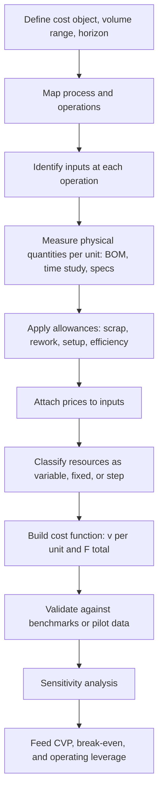

## The Engineering Estimation Method


### Overview

The Engineering Estimation Method (also called the industrial engineering method, the work measurement method, or the bottom-up input-output method) estimates cost behavior by analyzing the physical relationship between inputs and outputs. Instead of inferring cost behavior statistically from historical accounting records, it asks: what resources (materials, labor time, machine time, energy, supplies) should be consumed to produce one unit of output or to perform one activity, and what does each resource cost?

The method builds the cost function from the ground up:

$$C(Q) = \underbrace{\sum_{j} p_j \, q_j \, Q}_{\text{variable cost}} + \underbrace{F}_{\text{fixed cost}}$$

Where $Q$ is the volume of output (or activity), $q_j$ is the physical quantity of input $j$ required per unit of output, $p_j$ is the price per unit of input $j$, and $F$ is the total of resources committed regardless of volume (facility lease, salaried supervision, capacity-related depreciation).

The variable cost per unit is therefore:

$$v = \sum_{j} p_j \, q_j$$

**Key Points**

- Cost behavior is derived from *physical processes and specifications*, not from the pattern in past ledgers.
- It is the only major cost estimation method that does not require historical cost data, so it can be applied to new products, new processes, new facilities, and changed technologies.
- Fixed and variable components are identified by asking which resources scale with output and which are committed in lumps, which makes the fixed vs. variable classification an explicit engineering judgment.
- Its accuracy depends on the quality of the process analysis and on how well standards reflect actual operating conditions.

### Role in Fixed vs. Variable Cost Structure and Operating Leverage

The method directly produces the two quantities that drive cost-volume-profit (CVP) analysis and operating leverage:

- The unit variable cost $v$ from the input-output specifications
- The fixed cost $F$ from the capacity and committed resources needed to run the process

$$CM = p - v, \qquad Q_{BE} = \frac{F}{p - v}, \qquad DOL = \frac{Q(p - v)}{Q(p - v) - F}$$

Because the analyst chooses the process design, the method makes the *structural* trade-off between fixed and variable cost explicit. Comparing two production technologies, for example manual assembly with low fixed cost and high labor per unit, versus automated assembly with high fixed cost and low labor per unit, is a direct engineering estimation exercise. The automated design has a higher break-even volume and higher operating leverage, but a higher contribution margin per unit and greater profit potential at high volume.

### Core Concepts

#### Input-Output Relationships

Every process transforms inputs into outputs. The engineering method documents, for each input, the quantity required per unit of output under defined conditions.

| Input Type | Typical Physical Measure | Typical Behavior |
| --- | --- | --- |
| Direct materials | Kilograms, meters, units per output | Variable |
| Direct labor | Standard hours per unit | Variable (if hours are adjusted with volume) |
| Machine time | Machine hours per unit | Variable in usage, fixed in capacity |
| Energy | kWh per unit or per machine hour | Mixed |
| Indirect supplies | Units per batch or per hour | Variable or step |
| Supervision, engineering | Salaried positions | Fixed or step |
| Facility, equipment | Lease or depreciation | Fixed |

#### Allowances and Efficiency Factors

Theoretical requirements are adjusted for realistic operating conditions:

- **Yield or scrap allowance:** If 5% of input becomes waste, required input is $q_{net} / (1 - 0.05)$.
- **Rework and defect allowance** for units that must be redone.
- **Setup and changeover time** amortized over the batch.
- **Fatigue, personal, and delay allowances** in labor standards.
- **Utilization or efficiency factor:** If a machine runs at 85% of rated speed, effective output per hour is reduced accordingly.

$$q_{effective} = \frac{q_{theoretical}}{\text{yield} \times \text{efficiency}}$$

#### Cost Hierarchy Alignment

Engineering analysis naturally separates cost by level of activity:

- **Unit-level:** materials and direct labor per unit
- **Batch-level:** setups, inspections, material handling per batch
- **Product-sustaining:** engineering changes, specifications
- **Facility-sustaining:** plant management, building costs

Batch-level costs convert to a per-unit basis using batch size $B$:

$$v_{batch\text{-}derived} = \frac{p_m \, q_m}{B}$$

### Step-by-Step Procedure

1. **Define the cost object and scope.** Specify the product, process, or activity, the volume range, and the time horizon (the relevant range).
2. **Map the process.** Document the sequence of operations, using a flowchart or routing sheet.
3. **Identify all resource inputs** at each operation (materials, labor, machines, energy, supplies, space, indirect support).
4. **Measure or specify physical quantities per unit.** Use bills of materials, engineering drawings, time and motion studies, work sampling, machine specifications, and supplier data.
5. **Apply allowances** for scrap, rework, setup, delays, and efficiency losses.
6. **Attach prices** to each input using current or forecast supplier quotes, wage rates, utility tariffs, and lease terms.
7. **Classify each resource** as variable, fixed, or step with respect to the chosen driver, and identify the capacity increments for step items.
8. **Build the cost function:** aggregate variable cost per unit and total fixed cost.
9. **Validate** against any available historical data, benchmark studies, or pilot runs.
10. **Test sensitivity** to key assumptions (yield, wage rates, efficiency, volume).
11. **Document** all assumptions, sources, and the relevant range.



### Worked Example: Building a Cost Function From Specifications

A company plans to manufacture a stainless-steel water bottle. There is no production history, so the engineering method is used.

**Process specifications (per finished bottle)**

| Input | Physical Requirement | Price |
| --- | --- | --- |
| Stainless steel | 0.45 kg net | $4.00 per kg |
| Lid components | 1 set | $0.60 per set |
| Packaging | 1 unit | $0.35 per unit |
| Direct labor | 0.12 standard hours | $18.00 per hour |
| Machine time | 0.08 machine hours | Energy and consumables $6.00 per machine hour |

**Allowances**

- Steel scrap during forming: 8% of gross input becomes waste
- Labor efficiency: workers achieve 90% of standard time (delays, fatigue)
- Defective units requiring full rework: none assumed in this example

**Step 1: Adjust for allowances.**

Gross steel per good bottle:

$$q_{steel} = \frac{0.45}{1 - 0.08} = \frac{0.45}{0.92} \approx 0.4891 \text{ kg}$$

Effective labor hours per bottle:

$$q_{labor} = \frac{0.12}{0.90} \approx 0.1333 \text{ hours}$$

**Step 2: Compute variable cost per unit.**

| Input | Quantity | Price | Cost per Bottle |
| --- | --- | --- | --- |
| Stainless steel | 0.4891 kg | $4.00 | $1.956 |
| Lid components | 1 set | $0.60 | $0.600 |
| Packaging | 1 unit | $0.35 | $0.350 |
| Direct labor | 0.1333 h | $18.00 | $2.400 |
| Machine variable (energy, consumables) | 0.08 h | $6.00 | $0.480 |
| **Total variable cost per bottle** |  |  | **$5.786** |

$$v \approx 5.79$$

**Step 3: Identify fixed and step costs (monthly).**

| Resource | Monthly Cost | Behavior |
| --- | --- | --- |
| Facility lease | $12,000 | Fixed |
| Equipment depreciation (forming line) | $9,500 | Fixed (capacity: 40,000 bottles/month) |
| Production supervisor (salaried) | $5,500 | Fixed |
| Quality and maintenance staff | $7,000 | Fixed |
| Insurance and other overhead | $1,500 | Fixed |
| **Total fixed cost** | **$35,500** |  |

**Step 4: Cost function.**

$$C(Q) = 35{,}500 + 5.786\,Q \qquad (0 \le Q \le 40{,}000)$$

**Step 5: CVP application.** At a selling price of $14.00:

$$CM = 14.00 - 5.786 = 8.214$$


$$Q_{BE} = \frac{35{,}500}{8.214} \approx 4{,}322 \text{ bottles per month}$$

At $Q = 12{,}000$:

- Total contribution margin $= 12{,}000 \times 8.214 = 98{,}568$
- EBIT $= 98{,}568 - 35{,}500 = 63{,}068$
- $DOL = \frac{98{,}568}{63{,}068} \approx 1.56$

**Output**

| Metric | Value |
| --- | --- |
| Variable cost per bottle | ~$5.79 |
| Total fixed cost | $35,500 per month |
| Contribution margin per bottle | ~$8.21 |
| Break-even volume | ~4,322 bottles per month |
| EBIT at 12,000 bottles | ~$63,068 |
| Degree of operating leverage | ~1.56 |

**Key Points**

- No historical cost records were needed. The entire cost function derives from specifications, standards, and quoted prices.
- The allowances (scrap and efficiency) raised the material and labor cost per bottle. Ignoring them would understate variable cost and overstate contribution margin.
- The cost function is valid only up to the stated capacity of 40,000 bottles. Beyond that, an additional line is required, creating a step in fixed cost.

### Worked Example: Comparing Two Process Designs

Suppose engineering evaluates an automated alternative that cuts labor and scrap but requires expensive equipment.

| Parameter | Design A (Semi-manual) | Design B (Automated) |
| --- | --- | --- |
| Variable cost per bottle | $5.79 | $4.60 |
| Total fixed cost per month | $35,500 | $58,000 |
| Capacity (bottles per month) | 40,000 | 80,000 |

**Break-even volumes** at a $14.00 price:

$$Q_{BE}^{A} = \frac{35{,}500}{14 - 5.79} \approx 4{,}324, \qquad Q_{BE}^{B} = \frac{58{,}000}{14 - 4.60} \approx 6{,}170$$

**Volume at which the two designs have equal total cost** (indifference point):

$$35{,}500 + 5.79\,Q = 58{,}000 + 4.60\,Q \;\Rightarrow\; 1.19\,Q = 22{,}500 \;\Rightarrow\; Q \approx 18{,}908$$

Below about 18,908 bottles per month, Design A is cheaper. Above that volume, Design B's lower variable cost outweighs its higher fixed cost.

**DOL comparison at 12,000 bottles**

| Design | Contribution Margin | EBIT | DOL |
| --- | --- | --- | --- |
| A | $12{,}000 \times 8.21 = 98{,}520$ | $98{,}520 - 35{,}500 = 63{,}020$ | ~1.56 |
| B | $12{,}000 \times 9.40 = 112{,}800$ | $112{,}800 - 58{,}000 = 54{,}800$ | ~2.06 |

At 12,000 bottles, Design B has both lower profit and higher operating leverage, and therefore greater risk if volume falls. At 30,000 bottles, Design B is clearly more profitable, illustrating how the fixed-vs-variable structure interacts with expected volume.

**Key Points**

- The engineering method makes this comparison possible *before* either process exists.
- The choice depends on expected volume and tolerance for operating risk.

### Illustration

<svg xmlns="http://www.w3.org/2000/svg" viewBox="0 0 680 430" width="680" height="430" font-family="sans-serif" font-size="12">
<title>Engineering Estimation: Bottom-Up Cost Build (svg_diagram)</title>
<text x="340" y="26" text-anchor="middle" font-size="15" font-weight="bold">Engineering Estimation: Bottom-Up Cost Build (svg_diagram)</text>
<rect x="30" y="60" width="180" height="46" fill="#e8f0fb" stroke="#1f5fbf" stroke-width="1.5" />
<text x="120" y="88" text-anchor="middle">Bill of materials</text>
<rect x="30" y="120" width="180" height="46" fill="#e8f0fb" stroke="#1f5fbf" stroke-width="1.5" />
<text x="120" y="148" text-anchor="middle">Time and motion studies</text>
<rect x="30" y="180" width="180" height="46" fill="#e8f0fb" stroke="#1f5fbf" stroke-width="1.5" />
<text x="120" y="208" text-anchor="middle">Machine specifications</text>
<rect x="30" y="240" width="180" height="46" fill="#e8f0fb" stroke="#1f5fbf" stroke-width="1.5" />
<text x="120" y="268" text-anchor="middle">Allowances (scrap, efficiency)</text>
<rect x="30" y="300" width="180" height="46" fill="#e8f0fb" stroke="#1f5fbf" stroke-width="1.5" />
<text x="120" y="328" text-anchor="middle">Input prices and rates</text>
<line x1="210" y1="83" x2="300" y2="200" stroke="#555" stroke-width="1.5" />
<line x1="210" y1="143" x2="300" y2="205" stroke="#555" stroke-width="1.5" />
<line x1="210" y1="203" x2="300" y2="210" stroke="#555" stroke-width="1.5" />
<line x1="210" y1="263" x2="300" y2="215" stroke="#555" stroke-width="1.5" />
<line x1="210" y1="323" x2="300" y2="220" stroke="#555" stroke-width="1.5" />
<rect x="300" y="175" width="150" height="70" fill="#fff6e0" stroke="#c98a00" stroke-width="2" />
<text x="375" y="203" text-anchor="middle">Classify each input</text>
<text x="375" y="223" text-anchor="middle">variable / fixed / step</text>
<line x1="450" y1="195" x2="520" y2="150" stroke="#555" stroke-width="2" />
<line x1="450" y1="225" x2="520" y2="280" stroke="#555" stroke-width="2" />
<rect x="520" y="115" width="140" height="60" fill="#e9f6ea" stroke="#2a7d2a" stroke-width="1.5" />
<text x="590" y="141" text-anchor="middle">Variable cost v</text>
<text x="590" y="159" text-anchor="middle">per unit of output</text>
<rect x="520" y="255" width="140" height="60" fill="#fbe9e7" stroke="#c0392b" stroke-width="1.5" />
<text x="590" y="281" text-anchor="middle">Fixed cost F</text>
<text x="590" y="299" text-anchor="middle">per period</text>
<text x="340" y="395" text-anchor="middle" fill="#555">C(Q) = F + vQ, then CVP, break-even, and operating leverage</text>
</svg>

### Techniques Used to Obtain Physical Quantities

#### Time and Motion Study

Observers time each work element with a stopwatch, apply a performance rating, and add allowances:

$$\text{Normal time} = \text{Observed time} \times \text{Performance rating}$$


$$\text{Standard time} = \text{Normal time} \times (1 + \text{Allowance factor})$$

For example, an observed element time of 1.00 minute at a rating of 110% gives a normal time of 1.10 minutes. With a 15% allowance factor, standard time is $1.10 \times 1.15 = 1.265$ minutes.

#### Work Sampling

Random observations of workers estimate the proportion of time spent on productive tasks, delays, and idle time, without continuous timing. It is useful when tasks are long, varied, or non-repetitive.

#### Predetermined Time Systems

Standard data libraries (for example, MTM and MOST) assign published times to basic motions, allowing time estimates before a process exists.

#### Bills of Materials and Routings

The bill of materials lists the exact material quantities, and the routing sheet lists the sequence of operations with associated machine and labor times.

#### Machine and Equipment Specifications

Rated speed, energy consumption, changeover time, and maintenance schedules from manufacturers or pilot runs supply machine-related inputs.

#### Pilot Runs and Prototypes

Small-scale trials give empirical values for yields, cycle times, and defect rates when specifications alone are uncertain.

### Classifying Resources: Variable, Fixed, and Step

Classification is central because it determines the $a$ and $b$ (or $F$ and $v$) of the cost function. It depends on the chosen driver and the relevant range.

| Behavior | Engineering Test | Example |
| --- | --- | --- |
| Variable | Quantity consumed rises proportionally with output | Raw materials, packaging |
| Fixed | Committed in a lump for the whole relevant range | Building lease, plant manager salary |
| Step | Added in discrete increments as capacity is exceeded | Additional supervisor per 10 workers, second shift |
| Mixed | Has both a base and a usage-driven component | Utilities with a standing charge plus consumption |

**Step cost treatment.** For a resource added in increments of capacity $K$ at cost $S$ per increment, cost as a function of volume is:

$$C_{step}(Q) = S \cdot \left\lceil \frac{Q}{K} \right\rceil$$

Within any narrow volume band the step cost is effectively fixed, so the cost function is applied piecewise across bands.

**Key Points**

- The same resource can be fixed in the short run and variable in the long run, so the time horizon must be stated.
- Labor is variable only if management actually adjusts hours with volume. If workers are guaranteed a minimum schedule, part of labor cost is fixed regardless of the engineering standard.
- Depreciation on equipment is fixed with respect to volume, even though physical wear may depend on usage.

### Strengths

- **Applicable without historical data,** which suits new products, processes, facilities, and technologies.
- **Explicit cause-and-effect logic.** Cost behavior is tied to physical processes, which supports operational understanding and improvement.
- **Supports design decisions and what-if analysis,** for example, technology choice, make-or-buy, and capacity planning.
- **Avoids distortions in historical accounts,** such as allocation artifacts, timing mismatches, inflation effects, and one-time events.
- **Naturally aligns with the cost hierarchy,** enabling activity-based costing and batch-level analysis.
- **Provides a baseline for standard costing and variance analysis.**

### Limitations

- **Time-consuming and costly** because detailed process analysis and measurement are required.
- **Requires technical expertise** in industrial engineering and knowledge of the process.
- **Depends on assumed conditions.** Standards may not reflect real-world variability, learning effects, worker behavior, or equipment breakdowns.
- **Difficult for indirect and overhead costs** (administration, marketing, general support) that have no clear physical input-output relationship.
- **Can miss real-world inefficiencies and interactions** that historical data would reveal, such as coordination costs and disruptions.
- **Price and rate assumptions** (wages, materials, energy) change over time and must be updated.
- **No built-in statistical measure of reliability.** There is no standard error or confidence interval unless sensitivity analysis or simulation is added.
- **Fixed-versus-variable classification requires judgment,** which can introduce bias.
- **Standards can become stale** as technology, layout, or product design changes.

### Sensitivity and Uncertainty Analysis

Because there is no regression-based standard error, uncertainty should be assessed explicitly.

#### One-at-a-Time Sensitivity

Vary each assumption (yield, efficiency, wage rate, input price) by a plausible percentage and record the change in $v$, $F$, break-even, and DOL.

**Example: yield sensitivity for the bottle process.** If scrap rises from 8% to 12%:

$$q_{steel} = \frac{0.45}{1 - 0.12} \approx 0.5114 \text{ kg}, \quad \text{steel cost} = 0.5114 \times 4.00 = 2.045$$

Steel cost per bottle rises from $1.956 to $2.045, an increase of about $0.089. Total variable cost becomes about $5.875, and contribution margin falls to about $8.125, raising break-even to about 4,369 bottles.

#### Scenario Analysis

Define optimistic, base, and pessimistic scenarios by jointly varying key assumptions and compare resulting cost functions.

#### Monte Carlo Simulation

Assign probability distributions to uncertain inputs and simulate the distribution of $v$, break-even, and EBIT. [Inference] This is often justified when several uncertain inputs interact, but its value depends on how well the input distributions are specified.

```python
import numpy as np

rng = np.random.default_rng(42)
N = 100_000

# Uncertain inputs (illustrative distributions)
scrap     = rng.triangular(0.05, 0.08, 0.14, N)        # scrap rate
eff       = rng.triangular(0.80, 0.90, 0.97, N)        # labor efficiency
steel_px  = rng.normal(4.00, 0.30, N)                  # $ per kg
wage      = rng.normal(18.00, 1.00, N)                 # $ per hour

steel_cost = (0.45 / (1 - scrap)) * steel_px
labor_cost = (0.12 / eff) * wage
other_var  = 0.60 + 0.35 + 0.08 * 6.00                 # lids, packaging, machine variable

v = steel_cost + labor_cost + other_var
F, price, Q = 35_500.0, 14.00, 12_000

cm   = price - v
q_be = F / cm
ebit = Q * cm - F
dol  = (Q * cm) / ebit

for name, arr in [("v", v), ("Break-even", q_be), ("EBIT", ebit), ("DOL", dol)]:
    lo, med, hi = np.percentile(arr, [5, 50, 95])
    print(f"{name:11s} 5th = {lo:10.2f}   median = {med:10.2f}   95th = {hi:10.2f}")
```

**Output**

[Unverified] Results should cluster around the deterministic values (variable cost near $5.8 to $5.9, break-even near 4,300 to 4,400 bottles, DOL near 1.5 to 1.6), with spread reflecting the assumed input distributions. Exact percentiles depend on the distributions chosen and on the random seed.

### Deterministic Implementation

```python
from dataclasses import dataclass

@dataclass
class Input:
    name: str
    qty_per_unit: float      # net physical quantity per unit of output
    price: float             # price per physical unit
    yield_factor: float = 1.0   # e.g., 0.92 means 8% scrap
    efficiency: float = 1.0     # e.g., 0.90 labor efficiency

    def cost_per_unit(self) -> float:
        effective_qty = self.qty_per_unit / (self.yield_factor * self.efficiency)
        return effective_qty * self.price

variable_inputs = [
    Input("Stainless steel", 0.45, 4.00, yield_factor=0.92),
    Input("Lid components",  1.00, 0.60),
    Input("Packaging",       1.00, 0.35),
    Input("Direct labor",    0.12, 18.00, efficiency=0.90),
    Input("Machine variable", 0.08, 6.00),
]

fixed_costs = {
    "Facility lease": 12_000,
    "Equipment depreciation": 9_500,
    "Supervisor": 5_500,
    "Quality and maintenance": 7_000,
    "Insurance and overhead": 1_500,
}

v = sum(i.cost_per_unit() for i in variable_inputs)
F = sum(fixed_costs.values())
price, Q = 14.00, 12_000

cm = price - v
q_be = F / cm
ebit = Q * cm - F
dol = Q * cm / ebit

print(f"Variable cost per unit: {v:.3f}")
print(f"Total fixed cost:       {F:,.0f}")
print(f"Break-even volume:      {q_be:,.0f}")
print(f"EBIT at {Q:,}:          {ebit:,.0f}")
print(f"DOL:                    {dol:.2f}")
```

**Output**

```text
Variable cost per unit: 5.786
Total fixed cost:       35,500
Break-even volume:      4,322
EBIT at 12,000:         63,068
DOL:                    1.56
```

### Integrating With Other Estimation Methods

The engineering method is often used together with statistical methods, because their strengths and weaknesses complement each other.

| Situation | Recommended Combination |
| --- | --- |
| New product with no history | Engineering method alone, then update with actual data as it accumulates |
| Existing process with rich history | Regression as primary, engineering method to validate coefficient signs and magnitudes |
| Regression yields an implausible coefficient | Use engineering estimates to identify the source (collinearity, omitted driver) |
| Overhead pools with unclear drivers | Account analysis or regression, with engineering analysis for the identifiable components |
| Establishing standards for variance analysis | Engineering method for standards, comparison with actual results to refine |

A practical approach is to treat the engineering estimate as a prior and the historical regression as evidence, reconciling large discrepancies by investigating their causes (for example, real inefficiency versus poor standards versus data problems).

### Comparison With Other Cost Estimation Methods

| Criterion | Engineering Method | Account Analysis | High Low | Scattergraph | Regression |
| --- | --- | --- | --- | --- | --- |
| Requires historical cost data | No | Yes (current accounts) | Yes | Yes | Yes |
| Basis | Physical input-output | Managerial classification | Two points | Visual fit | Statistical fit |
| Objectivity | Moderate (assumption-dependent) | Low (judgment) | High (formula) | Low | High |
| Fit or reliability statistics | None built in | None | None | None | Yes |
| Suitable for new products or processes | Yes | Limited | No | No | No |
| Handles multiple drivers | Yes | Yes | No | No | Yes (multiple regression) |
| Effort and cost | High | Low to moderate | Very low | Low | Moderate |
| Reveals process inefficiency | Yes (compared with actuals) | Limited | No | No | Limited |

### Common Pitfalls

- **Ignoring allowances.** Omitting scrap, rework, setup, and efficiency losses understates cost and overstates contribution margin.
- **Using ideal or engineering-perfect standards for planning.** Realistic (attainable) standards are more appropriate for forecasting cost, while theoretical standards are more suitable for improvement targets.
- **Treating all labor as variable.** If staffing is not adjusted with volume, a portion of labor cost behaves as fixed.
- **Neglecting step costs and capacity limits.** A single linear function applied beyond capacity misstates cost.
- **Stale prices and rates.** Failing to update wage rates, material prices, and energy tariffs erodes accuracy.
- **Overlooking indirect and support costs.** Engineering analysis of the shop floor can omit overhead that scales with complexity or volume.
- **Assuming steady state.** Learning effects during ramp-up mean early costs exceed standard, and later costs may fall below it.
- **Double counting or omitting resources.** Systematically walk every operation and reconcile the total to a known benchmark to catch omissions.
- **Confusing physical wear with accounting behavior.** Depreciation is a fixed accounting cost even if equipment wear depends on usage.
- **False precision.** Reporting cost to many decimal places overstates the certainty of an estimate built from assumptions.
- **No validation.** Engineering estimates should be checked against pilot runs, benchmarks, or early actual data.

### Best-Practice Checklist

1. State the cost object, driver, relevant range, and time horizon.
2. Document the process with flowcharts and routings, and involve the engineers and operators who know it.
3. Base physical quantities on measurement (bills of materials, time studies, machine specifications), not on guesses.
4. Include realistic allowances for scrap, rework, setup, and efficiency.
5. Use current and forecast prices with documented sources.
6. Classify every resource as variable, fixed, or step, and identify capacity increments.
7. Convert batch-level and other non-unit costs to the chosen driver using explicit batch sizes.
8. Reconcile the total to available benchmarks, budgets, or pilot data.
9. Run sensitivity, scenario, or simulation analysis on the most uncertain assumptions.
10. Update the estimate as actual data accumulates, and compare with regression results.
11. Document all assumptions, sources, and limitations.

### Conclusion

The Engineering Estimation Method builds a cost function from the physical realities of a process: what inputs are consumed, in what quantities, at what prices, and which resources are committed in lumps. This bottom-up logic makes it uniquely valuable when there is no cost history, when technology or design is changing, and when management needs to compare alternative processes before committing capital. In the context of fixed vs. variable cost structure and operating leverage, the method exposes the structural trade-off explicitly: designs with more fixed cost and lower variable cost per unit have higher break-even volume and higher operating leverage, and the method quantifies where the crossover lies. Its limits are equally clear: it is labor-intensive, depends on the quality of standards and assumptions, struggles with overhead lacking a physical input-output relationship, and provides no built-in statistical measure of reliability. Real-world behavior varies, so estimates should be validated against pilot data or actual results, stress-tested through sensitivity analysis, and used alongside statistical methods rather than in isolation.

**Related Topics**

- Account analysis method for cost classification
- Standard costing and variance analysis (price, efficiency, and yield variances)
- Time and motion study, work sampling, and predetermined time systems
- Learning curves and their effect on unit labor cost
- Step costs, capacity planning, and relevant range
- Activity-based costing and the cost hierarchy
- Sensitivity analysis, scenario analysis, and Monte Carlo simulation for cost estimates
- Cost-volume-profit analysis and degree of operating leverage for competing process designs