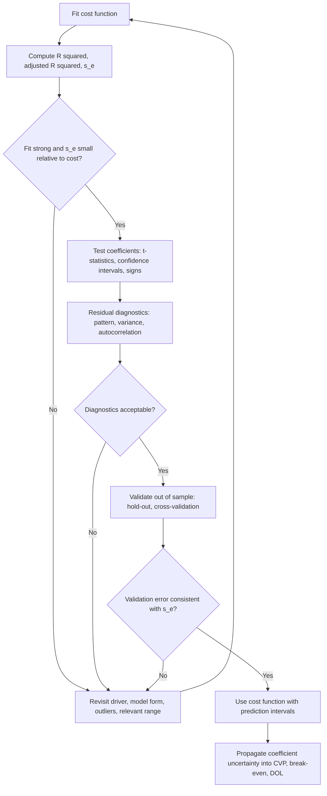

## Evaluating Cost Estimates with R Squared and Standard Error


### Overview

After a cost function has been estimated (by regression or another method), the analyst must decide whether it is good enough to use for budgeting, pricing, break-even analysis, and operating leverage measurement. Two statistics do most of the work in that judgment:

- **$R^2$ (the coefficient of determination)** measures the *proportion* of variation in cost that the model explains.
- **The standard error of the estimate ($s_e$)** measures the *typical size of the prediction error in cost units*.

They answer different questions. $R^2$ asks, "How much of the ups and downs in cost does the driver account for?" The standard error asks, "When the model predicts a cost, how far off is it likely to be, in dollars?" A complete evaluation uses both, supported by coefficient tests, residual diagnostics, and economic reasoning.

The estimated cost function for a single driver is:

$$\hat{Y}_i = a + bX_i$$

With multiple drivers:

$$\hat{Y}_i = b_0 + b_1X_{1i} + \dots + b_kX_{ki}$$

**Key Points**

- $R^2$ is unit-free and lies between 0 and 1, which makes it easy to compare but hides the dollar magnitude of errors.
- $s_e$ is in cost units and directly answers the practical question of forecast accuracy.
- Neither statistic proves causation, correct specification, or good out-of-sample performance.
- Both feed into the uncertainty attached to fixed cost, variable cost, break-even volume, and the degree of operating leverage.

### Role in Fixed vs. Variable Cost Structure and Operating Leverage

The intercept ($a$ or $b_0$) is the fixed cost estimate, and the slope ($b$) is the variable cost per unit of activity. These feed contribution margin, break-even volume, and the degree of operating leverage (DOL):

$$CM = p - v, \qquad Q_{BE} = \frac{F}{p - v}, \qquad DOL = \frac{Q(p - v)}{Q(p - v) - F}$$

Evaluation statistics tell the analyst how much confidence to place in $F$ and $v$, and therefore in every downstream number. A cost function with a low $R^2$ or a large $s_e$ relative to typical cost implies wide uncertainty in the fixed-variable split, which can make computed break-even and DOL misleading, particularly when the operating point is near break-even and the denominator of DOL is small.

### Decomposition of Variation

Total variation in observed costs splits into explained and unexplained parts:

$$SST = SSR + SSE$$


$$SST = \sum_{i=1}^{n}(Y_i - \bar{Y})^2, \quad SSR = \sum_{i=1}^{n}(\hat{Y}_i - \bar{Y})^2, \quad SSE = \sum_{i=1}^{n}(Y_i - \hat{Y}_i)^2$$

| Quantity | Meaning |
| --- | --- |
| $SST$ | Total variation of cost around its mean |
| $SSR$ | Variation explained by the regression |
| $SSE$ | Residual (unexplained) variation |

This identity holds for least-squares regression that includes an intercept. It does not hold in general for lines fitted by other methods (such as a High Low line or an eye-fitted scattergraph line), so $R^2$ computed from such lines can behave unexpectedly and may even be negative.

### The Coefficient of Determination ($R^2$)

#### Definition

$$R^2 = \frac{SSR}{SST} = 1 - \frac{SSE}{SST}$$

In simple linear regression, $R^2$ equals the square of the correlation between $X$ and $Y$:

$$R^2 = r_{XY}^2, \qquad r_{XY} = \frac{S_{XY}}{\sqrt{S_{XX}S_{YY}}}$$

#### Interpretation

- $R^2 = 0.90$ means the model accounts for 90% of the variation in cost across the sample, and 10% remains unexplained.
- $R^2 = 0$ means the driver adds nothing beyond using the mean cost.
- $R^2 = 1$ means every observation lies exactly on the fitted line.

#### What $R^2$ Does Not Tell You

- It does not indicate whether the relationship is causal.
- It does not indicate whether the linear form is correct (a curved relationship can produce a high $R^2$ while the line is systematically wrong at the extremes).
- It does not indicate the dollar size of prediction errors.
- It does not indicate whether the coefficients are statistically or economically meaningful.
- It is not comparable across datasets with very different variance in $X$ or $Y$.

#### Adjusted $R^2$

Raw $R^2$ never decreases when a driver is added, even if the driver is irrelevant. Adjusted $R^2$ corrects for the number of drivers $k$ and the sample size $n$:

$$\bar{R}^2 = 1 - \frac{SSE/(n - k - 1)}{SST/(n - 1)} = 1 - (1 - R^2)\frac{n - 1}{n - k - 1}$$

Adjusted $R^2$ can fall when a driver adds little explanatory power and is the preferred measure for comparing models with different numbers of drivers.

**Key Points**

- Use raw $R^2$ to describe the fit of a single model and adjusted $R^2$ to compare models of different size.
- A high $R^2$ from a very small sample is fragile, since two-point or three-point fits can be near-perfect by chance.

### The Standard Error of the Estimate ($s_e$)

#### Definition

$$s_e = \sqrt{\frac{SSE}{n - k - 1}} = \sqrt{MSE}$$

The divisor $n - k - 1$ is the residual degrees of freedom: $n$ observations less one degree of freedom for each of the $k$ slope coefficients and one for the intercept. For simple regression ($k = 1$) this is $n - 2$.

#### Interpretation

$s_e$ is the estimated standard deviation of the residuals, so it expresses the typical distance of an actual cost from the fitted line, in cost units. If residuals are approximately normal, roughly 68% of actual costs fall within $\pm s_e$ of the predicted cost and roughly 95% within $\pm 2s_e$ (a rule of thumb that applies only when the normality and constant-variance assumptions are reasonable and ignores estimation uncertainty in the coefficients).

#### Relative Measures

To judge whether $s_e$ is "small," compare it with the scale of cost:

$$CV_{e} = \frac{s_e}{\bar{Y}}$$

A value of $CV_e$ near 1% to 3% indicates very tight predictions, while values above 10% to 15% indicate loose predictions. These cutoffs are informal conventions that depend on the decision at stake and are not formal standards.

#### Relationship Between $R^2$ and $s_e$

$$s_e = s_Y\sqrt{(1 - R^2)\frac{n - 1}{n - k - 1}}, \qquad s_Y = \sqrt{\frac{SST}{n - 1}}$$

For a given cost variability $s_Y$, higher $R^2$ implies lower $s_e$. However, because $R^2$ depends on the spread of the data, two models can share the same $R^2$ and have very different $s_e$ if the underlying cost scales differ.

### Worked Example: Full Evaluation

A print shop regresses monthly utilities cost on machine hours using ten months of data.

| Month | Machine Hours ($X$) | Utilities Cost ($Y$, $) |
| --- | --- | --- |
| 1 | 1,200 | 7,950 |
| 2 | 1,500 | 8,550 |
| 3 | 1,800 | 9,500 |
| 4 | 1,400 | 8,250 |
| 5 | 2,100 | 10,000 |
| 6 | 2,400 | 11,000 |
| 7 | 2,000 | 9,950 |
| 8 | 2,600 | 11,250 |
| 9 | 2,200 | 10,550 |
| 10 | 1,700 | 8,900 |

**Step 1: Basic sums.**

$$\sum X = 18{,}900, \quad \sum Y = 95{,}900, \quad \bar{X} = 1{,}890, \quad \bar{Y} = 9{,}590$$

**Step 2: Deviation table.**

| $i$ | $X$ | $Y$ | $X - \bar{X}$ | $Y - \bar{Y}$ | $(X-\bar{X})^2$ | $(X-\bar{X})(Y-\bar{Y})$ | $(Y-\bar{Y})^2$ |
| --- | --- | --- | --- | --- | --- | --- | --- |
| 1 | 1,200 | 7,950 | −690 | −1,640 | 476,100 | 1,131,600 | 2,689,600 |
| 2 | 1,500 | 8,550 | −390 | −1,040 | 152,100 | 405,600 | 1,081,600 |
| 3 | 1,800 | 9,500 | −90 | −90 | 8,100 | 8,100 | 8,100 |
| 4 | 1,400 | 8,250 | −490 | −1,340 | 240,100 | 656,600 | 1,795,600 |
| 5 | 2,100 | 10,000 | 210 | 410 | 44,100 | 86,100 | 168,100 |
| 6 | 2,400 | 11,000 | 510 | 1,410 | 260,100 | 719,100 | 1,988,100 |
| 7 | 2,000 | 9,950 | 110 | 360 | 12,100 | 39,600 | 129,600 |
| 8 | 2,600 | 11,250 | 710 | 1,660 | 504,100 | 1,178,600 | 2,755,600 |
| 9 | 2,200 | 10,550 | 310 | 960 | 96,100 | 297,600 | 921,600 |
| 10 | 1,700 | 8,900 | −190 | −690 | 36,100 | 131,100 | 476,100 |
| **Sum** | 18,900 | 95,900 | 0 | 0 | **1,829,000** | **4,654,000** | **12,014,000** |

**Step 3: Estimate the cost function.**

$$b = \frac{S_{XY}}{S_{XX}} = \frac{4{,}654{,}000}{1{,}829{,}000} \approx 2.5446 \text{ per machine hour}$$


$$a = \bar{Y} - b\bar{X} = 9{,}590 - 2.5446(1{,}890) \approx 9{,}590 - 4{,}809.2 \approx 4{,}780.8$$


$$\hat{Y} = 4{,}781 + 2.5446X$$

**Step 4: Sums of squares.**

$$SST = S_{YY} = 12{,}014{,}000$$


$$SSR = b \cdot S_{XY} = 2.5446 \times 4{,}654{,}000 \approx 11{,}842{,}000$$


$$SSE = SST - SSR \approx 12{,}014{,}000 - 11{,}842{,}000 = 172{,}000$$

**Step 5: $R^2$.**

$$R^2 = \frac{11{,}842{,}000}{12{,}014{,}000} \approx 0.9857$$

About 98.6% of the variation in utilities cost is explained by machine hours.

**Step 6: Standard error of the estimate** ($n - 2 = 8$ degrees of freedom).

$$s_e = \sqrt{\frac{172{,}000}{8}} = \sqrt{21{,}500} \approx 146.6$$

**Step 7: Relative size.**

$$CV_e = \frac{146.6}{9{,}590} \approx 1.53\%$$

**Step 8: Coefficient standard errors and t-statistics.**

$$SE(b) = \frac{s_e}{\sqrt{S_{XX}}} = \frac{146.6}{\sqrt{1{,}829{,}000}} = \frac{146.6}{1{,}352.4} \approx 0.1084$$


$$t_b = \frac{2.5446}{0.1084} \approx 23.5$$


$$SE(a) = s_e\sqrt{\frac{1}{n} + \frac{\bar{X}^2}{S_{XX}}} = 146.6\sqrt{0.1 + \frac{1{,}890^2}{1{,}829{,}000}} = 146.6\sqrt{0.1 + 1.953} \approx 146.6 \times 1.433 \approx 210.1$$


$$t_a = \frac{4{,}781}{210.1} \approx 22.8$$

**Step 9: 95% confidence interval for the slope** (critical $t_{0.025,8} \approx 2.306$).

$$2.5446 \pm 2.306 \times 0.1084 = 2.5446 \pm 0.250$$

The variable cost per machine hour is estimated between about $2.29 and $2.79.

**Output**

| Statistic | Value | Reading |
| --- | --- | --- |
| Fixed cost $a$ | ~$4,781 | Baseline monthly utilities |
| Variable rate $b$ | ~$2.545 per hour | Incremental cost per machine hour |
| $R^2$ | ~0.986 | Very strong linear fit |
| $s_e$ | ~$146.6 | Typical prediction error |
| $CV_e$ | ~1.5% | Tight relative to mean cost |
| $t_b$, $t_a$ | ~23.5, ~22.8 | Both coefficients highly significant |
| 95% CI for $b$ | ~$2.29 to $2.79 | Range of plausible variable cost rates |

**Key Points**

- Both $R^2$ and $s_e$ point the same direction here, supporting the model.
- The confidence interval on $b$ is what matters for contribution margin uncertainty. Its width (about $0.50 per hour) can be propagated into CVP figures.

### Prediction Intervals

$s_e$ describes typical residual size, but a forecast for a specific new activity level $X_0$ carries additional uncertainty from the estimated coefficients.

**Simple regression:**

$$SE_{pred} = s_e\sqrt{1 + \frac{1}{n} + \frac{(X_0 - \bar{X})^2}{S_{XX}}}$$


$$\text{95\% PI} = \hat{Y}_0 \pm t_{0.025,\,n-2}\cdot SE_{pred}$$

**Multiple regression:**

$$SE_{pred} = s_e\sqrt{1 + \mathbf{x}_0^{\top}(\mathbf{X}^{\top}\mathbf{X})^{-1}\mathbf{x}_0}$$

#### Worked Example

Forecast utilities cost at $X_0 = 2{,}000$ machine hours:

$$\hat{Y}_0 = 4{,}781 + 2.5446(2{,}000) \approx 9{,}870$$


$$SE_{pred} = 146.6\sqrt{1 + 0.1 + \frac{(2{,}000 - 1{,}890)^2}{1{,}829{,}000}} = 146.6\sqrt{1.1066} \approx 154.2$$


$$\text{95\% PI} = 9{,}870 \pm 2.306 \times 154.2 \approx 9{,}870 \pm 355.6$$

The predicted cost is about $9,870, with an approximate 95% prediction interval of $9,514 to $10,226. Note that the interval is wider than $\pm s_e$ because it accounts for coefficient uncertainty and the inherent randomness of an individual month.

At $X_0 = 3{,}000$ (outside the observed range), $(3{,}000 - 1{,}890)^2 / 1{,}829{,}000 \approx 0.674$, so $SE_{pred} = 146.6\sqrt{1.774} \approx 195.3$, and the interval widens to roughly $\pm 450$. This formula understates the true risk at 3,000 hours because it assumes the linear relationship continues, and cost behavior outside the relevant range may change.

**Key Points**

- The interval is narrowest at $\bar{X}$ and widens as $X_0$ moves away from the center of the data.
- Prediction intervals for an individual month are wider than confidence intervals for the *average* cost at that activity level.
- No interval computed from in-range data protects against a structural change outside the range.

### Propagating Evaluation Results to CVP and Operating Leverage

Assume each print job uses 0.5 machine hours, sells for $40, and has other variable cost of $14. Other fixed costs are $20,000 per month. Monthly volume is 4,000 jobs.

**Point estimates**

- Utilities variable cost per job: $0.5 \times 2.5446 = 1.2723$
- Total variable cost per job: $14 + 1.2723 = 15.2723$
- Contribution margin per job: $40 - 15.2723 = 24.7277$
- Total fixed cost: $20{,}000 + 4{,}781 = 24{,}781$

$$Q_{BE} = \frac{24{,}781}{24.7277} \approx 1{,}002 \text{ jobs}$$

At 4,000 jobs:

- Total contribution margin $= 4{,}000 \times 24.7277 = 98{,}911$
- EBIT $= 98{,}911 - 24{,}781 = 74{,}130$
- $DOL = \frac{98{,}911}{74{,}130} \approx 1.334$

**Using the 95% confidence bounds on $b$** ($2.29 and $2.79 per hour):

| Case | Utilities variable per job | CM per job | Break-even | DOL at 4,000 |
| --- | --- | --- | --- | --- |
| Low $b$ (2.29) | 1.145 | 24.855 | ~997 | ~1.33 |
| Point (2.545) | 1.272 | 24.728 | ~1,002 | ~1.33 |
| High $b$ (2.79) | 1.395 | 24.605 | ~1,007 | ~1.34 |

**Output**

In this example the slope uncertainty barely affects break-even or DOL, because utilities are a small part of total variable cost and the fit is tight. In a cost structure where the regression-estimated component dominates, or where the fit is poor, the same procedure could show a material spread. [Inference] The sensitivity of downstream metrics to coefficient uncertainty depends on the share of the estimated cost in total cost and on how close the operating point is to break-even, so it should be computed and not assumed.

### Comparing Competing Models

When choosing among several candidate drivers or model forms, evaluate them with the same criteria.

| Criterion | What to Prefer |
| --- | --- |
| Adjusted $R^2$ | Higher |
| Standard error $s_e$ | Lower |
| Coefficient significance | Significant, with signs matching economic logic |
| Residual diagnostics | No pattern, constant spread |
| Multicollinearity (VIF) | Low |
| AIC and BIC | Lower |
| Out-of-sample error | Lower on hold-out data |

Information criteria for least-squares models (up to an additive constant):

$$AIC = n\ln\left(\frac{SSE}{n}\right) + 2(k + 1), \qquad BIC = n\ln\left(\frac{SSE}{n}\right) + (k + 1)\ln n$$

#### Illustrative Driver Comparison

| Model | Driver(s) | $R^2$ | Adj. $R^2$ | $s_e$ ($) | Comment |
| --- | --- | --- | --- | --- | --- |
| 1 | Machine hours | ~0.986 | ~0.984 | ~147 | Strong, plausible driver |
| 2 | Units produced | ~0.91 | ~0.90 | ~400 | Weaker link to utilities |
| 3 | Machine hours + units | ~0.987 | ~0.983 | ~150 | Little gain; possible collinearity |

[Unverified] Rows 2 and 3 are illustrative of a common pattern (a weaker driver, and a second overlapping driver that adds little), not computed results from the example data.

### Model Validation Beyond In-Sample Fit

$R^2$ and $s_e$ computed on the data used to fit the model are optimistic, since the coefficients were chosen to minimize error on exactly those points. Out-of-sample checks give a more honest assessment.

#### Hold-Out Validation

Fit on the earlier portion of the data and predict the later portion. Compute the out-of-sample errors:

$$RMSE_{test} = \sqrt{\frac{1}{m}\sum_{i=1}^{m}(Y_i - \hat{Y}_i)^2}, \qquad MAE_{test} = \frac{1}{m}\sum_{i=1}^{m}|Y_i - \hat{Y}_i|$$

If $RMSE_{test}$ is much larger than $s_e$, the model may be overfit or the cost behavior may have changed.

#### Leave-One-Out Cross-Validation

For each observation, refit without it and predict it. The PRESS statistic uses leverage $h_i$ to compute this efficiently for linear models:

$$PRESS = \sum_{i=1}^{n}\left(\frac{e_i}{1 - h_i}\right)^2, \qquad h_i = \frac{1}{n} + \frac{(X_i - \bar{X})^2}{S_{XX}}$$

A predictive $R^2$ can then be computed:

$$R^2_{pred} = 1 - \frac{PRESS}{SST}$$

A large gap between $R^2$ and $R^2_{pred}$ signals sensitivity to individual points.

#### Percentage Error Measures

$$MAPE = \frac{100}{m}\sum_{i=1}^{m}\left|\frac{Y_i - \hat{Y}_i}{Y_i}\right|$$

MAPE is intuitive for budgeting but can be unstable when actual costs are near zero.

### Diagnostics That Complement $R^2$ and $s_e$

| Diagnostic | Purpose | Warning Sign |
| --- | --- | --- |
| Scatter plot of $Y$ vs. $X$ | Linearity, outliers, steps | Curvature, clusters, isolated points |
| Residuals vs. fitted values | Constant variance, nonlinearity | Funnel or curved pattern |
| Residuals over time | Autocorrelation | Runs of same-sign residuals |
| Durbin-Watson statistic | First-order autocorrelation | Values far from about 2 |
| Normal Q-Q plot | Normality of residuals | Heavy tails or skew |
| Leverage and Cook's distance | Influential observations | A single point with outsized influence |
| VIF (multiple drivers) | Multicollinearity | Values above the chosen threshold |

Failure of these diagnostics can make the reported $s_e$ and confidence intervals unreliable even when $R^2$ is high. Behavior varies by dataset, so diagnostics should be examined and not assumed.



### Illustration

<svg xmlns="http://www.w3.org/2000/svg" viewBox="0 0 680 430" width="680" height="430" font-family="sans-serif" font-size="12">
<title>R Squared and Standard Error on a Fitted Line (svg_diagram)</title>
<text x="340" y="26" text-anchor="middle" font-size="15" font-weight="bold">R Squared and Standard Error on a Fitted Line (svg_diagram)</text>
<line x1="80" y1="350" x2="620" y2="350" stroke="#333" stroke-width="2" />
<line x1="80" y1="350" x2="80" y2="60" stroke="#333" stroke-width="2" />
<text x="350" y="398" text-anchor="middle">Activity level X</text>
<text x="24" y="205" text-anchor="middle" transform="rotate(-90 24 205)">Total cost Y</text>
<line x1="80" y1="150" x2="600" y2="150" stroke="#888" stroke-width="1.5" stroke-dasharray="6,4" />
<text x="604" y="146" fill="#666">Mean of Y</text>
<line x1="80" y1="280" x2="600" y2="90" stroke="#1f5fbf" stroke-width="2.5" />
<text x="604" y="88" fill="#1f5fbf">Fitted line</text>
<line x1="80" y1="292" x2="600" y2="102" stroke="#c98a00" stroke-width="1" stroke-dasharray="3,3" />
<line x1="80" y1="268" x2="600" y2="78" stroke="#c98a00" stroke-width="1" stroke-dasharray="3,3" />
<text x="604" y="106" fill="#c98a00">+ s_e</text>
<text x="604" y="76" fill="#c98a00">- s_e</text>
<circle cx="150" cy="262" r="4" fill="#555" />
<circle cx="230" cy="240" r="4" fill="#555" />
<circle cx="310" cy="195" r="4" fill="#555" />
<circle cx="390" cy="172" r="4" fill="#555" />
<circle cx="470" cy="140" r="4" fill="#555" />
<circle cx="550" cy="112" r="4" fill="#555" />
<line x1="390" y1="172" x2="390" y2="150" stroke="#2a7d2a" stroke-width="2" />
<text x="398" y="166" fill="#2a7d2a">explained (SSR)</text>
<line x1="470" y1="140" x2="470" y2="128" stroke="#c0392b" stroke-width="2" />
<text x="478" y="138" fill="#c0392b">unexplained (SSE)</text>
<text x="340" y="420" text-anchor="middle" fill="#555">R squared = SSR / SST; s_e = square root of SSE / (n - k - 1)</text>
</svg>

### Implementation

#### Python: Computing All Evaluation Statistics

```python
import numpy as np

hours = np.array([1200, 1500, 1800, 1400, 2100, 2400, 2000, 2600, 2200, 1700], dtype=float)
cost  = np.array([7950, 8550, 9500, 8250, 10000, 11000, 9950, 11250, 10550, 8900], dtype=float)

n, k = len(cost), 1
x_bar, y_bar = hours.mean(), cost.mean()

s_xx = np.sum((hours - x_bar) ** 2)
s_xy = np.sum((hours - x_bar) * (cost - y_bar))
sst  = np.sum((cost - y_bar) ** 2)

b = s_xy / s_xx
a = y_bar - b * x_bar

fitted = a + b * hours
resid  = cost - fitted
sse = np.sum(resid ** 2)

r2     = 1 - sse / sst
adj_r2 = 1 - (sse / (n - k - 1)) / (sst / (n - 1))
s_e    = np.sqrt(sse / (n - k - 1))
cv_e   = s_e / y_bar

se_b = s_e / np.sqrt(s_xx)
se_a = s_e * np.sqrt(1 / n + x_bar ** 2 / s_xx)

# Leverage, PRESS, and predictive R^2
h = 1 / n + (hours - x_bar) ** 2 / s_xx
press = np.sum((resid / (1 - h)) ** 2)
r2_pred = 1 - press / sst

print(f"a = {a:,.2f} (SE {se_a:,.2f}, t {a / se_a:.2f})")
print(f"b = {b:,.4f} (SE {se_b:,.4f}, t {b / se_b:.2f})")
print(f"R^2 = {r2:.4f}   adj R^2 = {adj_r2:.4f}   R^2_pred = {r2_pred:.4f}")
print(f"s_e = {s_e:,.2f}   CV_e = {cv_e:.2%}")

# 95% prediction interval at a new activity level (t critical hard-coded for df = 8)
x0, t_crit = 2000.0, 2.306
y0 = a + b * x0
se_pred = s_e * np.sqrt(1 + 1 / n + (x0 - x_bar) ** 2 / s_xx)
print(f"Forecast at {x0:.0f}: {y0:,.0f}   PI = [{y0 - t_crit * se_pred:,.0f}, {y0 + t_crit * se_pred:,.0f}]")
```

**Output**

[Unverified] Values should be close to the hand calculation (small differences in the last digits are expected from rounding):

```text
a = 4,780.8 (SE ~210, t ~22.8)
b = 2.5446 (SE ~0.108, t ~23.5)
R^2 ~ 0.986   adj R^2 ~ 0.984
s_e ~ 146.6   CV_e ~ 1.5%
Forecast at 2000: ~9,870   PI ~ [9,514, 10,226]
```

#### Python: statsmodels Summary

```python
import statsmodels.api as sm

X = sm.add_constant(hours)
model = sm.OLS(cost, X).fit()
print(model.summary())      # R^2, adj R^2, F, coefficients, SEs, t, p, AIC, BIC, Durbin-Watson
print("s_e =", np.sqrt(model.mse_resid))

pred = model.get_prediction(sm.add_constant(np.array([2000.0]), has_constant="add"))
print(pred.summary_frame(alpha=0.05))   # confidence and prediction intervals
```

#### Spreadsheet Functions

| Quantity | Typical Function |
| --- | --- |
| $R^2$ | `RSQ(known_y, known_x)` |
| Standard error $s_e$ | `STEYX(known_y, known_x)` |
| Slope, intercept | `SLOPE`, `INTERCEPT` |
| Full statistics (including SEs, F, df, SSR, SSE) | `LINEST(known_y, known_x, TRUE, TRUE)` |
| Forecast | `FORECAST.LINEAR(x0, known_y, known_x)` |

Function names and behavior vary by application and version.

### Interpretation Guide

| Situation | Reading | Suggested Action |
| --- | --- | --- |
| High $R^2$, small $s_e$, clean residuals, sensible coefficients | Reliable cost function within the relevant range | Use with prediction intervals |
| High $R^2$ but patterned residuals | Right variables, wrong functional form | Add nonlinear terms, split range, or model steps |
| High $R^2$ but large $s_e$ in dollars | Strong relationship, yet errors still matter for the decision | Assess whether the error is tolerable for the use case |
| Low $R^2$, large $s_e$ | Driver explains little | Search for better or additional drivers; check data quality |
| Low $R^2$ but significant slope | Real but noisy relationship | Use cautiously; wide prediction intervals |
| High $R^2$ with insignificant individual t-stats (multiple drivers) | Multicollinearity | Drop or combine drivers |
| $R^2$ high in sample, $R^2_{pred}$ much lower | Overfitting or influential points | Simplify, gather more data, validate out of sample |

### Common Pitfalls

- **Treating $R^2$ as a verdict.** A high $R^2$ does not establish causation, correct functional form, or forecast accuracy.
- **Using raw $R^2$ to compare models of different size.** Adding drivers mechanically raises $R^2$. Use adjusted $R^2$, AIC/BIC, and validation.
- **Ignoring the scale of $s_e$.** A model with $R^2 = 0.95$ can still have dollar errors too large for the decision. Judge $s_e$ against the tolerance of the application.
- **Reading $\pm 2s_e$ as a full prediction interval.** It ignores coefficient uncertainty and the extra width away from the mean of $X$.
- **Spurious correlation in trending data.** Cost and activity that both trend upward over time can show a high $R^2$ with no causal link. Adjust for inflation and check residual autocorrelation.
- **Extrapolating beyond the relevant range.** Fit statistics describe the observed range only.
- **In-sample optimism.** Fit statistics computed on the fitting data overstate future accuracy.
- **Ignoring outliers and leverage.** One influential point can inflate or deflate $R^2$ and shift coefficients.
- **Comparing $R^2$ across different dependent variables or transformations.** $R^2$ from a model of $\ln Y$ is not comparable with $R^2$ from a model of $Y$.
- **Forgetting the degrees-of-freedom correction.** Using $n$ instead of $n - k - 1$ understates $s_e$.
- **Applying $R^2$ to lines not fitted by least squares.** For High Low or eye-fitted lines, the decomposition $SST = SSR + SSE$ fails and the resulting $R^2$ can be misleading or negative.
- **False precision.** Reporting statistics and coefficients to many decimals implies certainty the data cannot support.

### Best-Practice Checklist

1. Report $R^2$, adjusted $R^2$, and $s_e$ (with $CV_e$) together, not any one alone.
2. Judge $s_e$ against the accuracy the decision requires, in dollars.
3. Check coefficient signs against economic logic, and report t-statistics and confidence intervals.
4. Examine residual plots and run diagnostics for nonlinearity, heteroscedasticity, autocorrelation, and influence.
5. Validate out of sample (hold-out or cross-validation) and compare out-of-sample error with $s_e$.
6. Provide prediction intervals for forecasts, not just point estimates.
7. State the relevant range and avoid extrapolating fit statistics beyond it.
8. Propagate confidence bounds on $a$ and $b$ into contribution margin, break-even, and DOL to gauge decision sensitivity.
9. Cross-check with an alternative method (engineering estimate, account analysis, or a simpler regression) and investigate large disagreements.
10. Document data adjustments, exclusions, and the reasons for model choices.

### Conclusion

$R^2$ and the standard error of the estimate give complementary answers about the quality of a cost estimate: $R^2$ says what share of cost variation the model explains, while $s_e$ says how large the prediction errors typically are in dollars. Neither is sufficient alone, and both are computed from the same sums of squares, so they should be read together with coefficient tests, confidence and prediction intervals, residual diagnostics, and out-of-sample validation. In the context of fixed vs. variable cost structure and operating leverage, these measures determine how much trust to place in the fixed cost and variable rate that feed contribution margin, break-even volume, and DOL, and confidence bounds on the coefficients allow that trust to be quantified through sensitivity analysis. A well-evaluated estimate is one whose fit is strong, whose errors are small relative to decision tolerance, whose assumptions survive diagnostic checks, and whose performance holds up on data it has not seen. Real-world behavior varies with the dataset, so evaluation should be a routine, documented step and not an assumption.

**Related Topics**

- Hypothesis tests and confidence intervals for regression coefficients
- Residual analysis: heteroscedasticity, autocorrelation, and normality tests
- Multicollinearity and variance inflation factors
- Model selection with AIC, BIC, and cross-validation
- Prediction intervals and forecast error in budgeting
- Robust regression and influential observation diagnostics
- Sensitivity analysis of break-even and operating leverage to estimation error
- Comparing regression results with engineering and account-analysis estimates