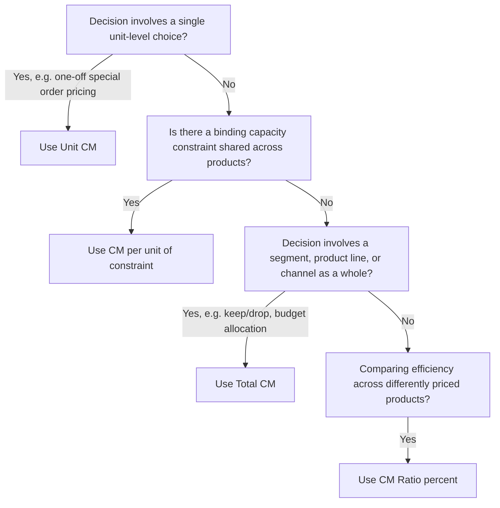

## Unit Contribution Margin versus Total Contribution Margin

### Definitions

**Unit contribution margin** is the amount each individual unit sold contributes toward fixed costs and profit, calculated as selling price per unit minus variable cost per unit.

$$CM_{unit}=Price_{unit}-VariableCost_{unit}$$

**Total contribution margin** is the aggregate contribution across all units sold in a period, calculated either by multiplying unit CM by volume or by subtracting total variable costs from total sales.

$$CM_{total}=CM_{unit}\times Q$$

$$CM_{total}=TotalSales-TotalVariableCosts$$

Both figures describe the same underlying economics at different levels of aggregation. Unit CM is a *rate*; total CM is a *quantity*. The distinction matters because each answers a different question.

### What Each Metric Answers

| Question | Correct Metric |
| --- | --- |
| Is this product profitable per sale, independent of volume? | Unit CM |
| Does this product/segment generate enough contribution to cover its share of fixed costs? | Total CM |
| Which of two products is more efficient per dollar of sales? | CM ratio (CM%), not unit CM |
| Which of two products should get priority under a capacity constraint? | CM per unit of the constrained resource |
| How much does operating income change if I sell 500 more units? | Unit CM × 500 |
| How much does operating income change if I add a whole new sales channel? | Total CM generated by that channel |

**Key Points**

- Unit CM in isolation says nothing about scale — a product with a high unit CM but low sales volume can generate less total CM than a product with a low unit CM but high volume.
- Total CM in isolation says nothing about efficiency — a product with high total CM might be masking a thin unit CM propped up purely by volume, which is fragile if volume drops.
- Comparing products by unit CM alone is a common error when a shared constraint (machine hours, shelf space, labor hours) exists; the correct ranking metric is CM per unit of the constraint, not per unit of output.

### Worked Example: Where the Two Diverge

Two products, no binding capacity constraint:

|  | Product A | Product B |
| --- | --- | --- |
| Price/unit | $100 | $20 |
| Variable cost/unit | $70 | $12 |
| **Unit CM** | **$30** | **$8** |
| Units sold | 200 | 3,000 |
| **Total CM** | **$6,000** | **$24,000** |

Product A has a much higher unit CM ($30 vs. $8), which might suggest it's the "better" product. But Product B generates four times the total contribution because volume more than compensates for the lower per-unit rate. If fixed costs are $15,000, Product B alone clears them; Product A alone does not.

[Inference: which product is "better" depends on the decision being made — capacity allocation, marketing investment, or product-line continuation each weight unit CM and total CM differently, so no single ranking is universally correct without specifying the decision context.]

### Worked Example: Where They Align (Constrained Resource)

If both products instead compete for the same limited machine hours:

|  | Product A | Product B |
| --- | --- | --- |
| Unit CM | $30 | $8 |
| Machine hours/unit | 3 | 0.4 |
| **CM per machine hour** | **$10** | **$20** |

Here, neither unit CM nor total CM (as sold historically) is the right ranking metric — CM *per unit of the constraint* is. Product B is actually the more valuable use of constrained capacity, reversing the naive "Product A has higher unit CM" conclusion. This generalizes the unit-vs-total distinction: the correct denominator is whatever resource is actually scarce.

### Decision Framework

### Sensitivity and Forecasting Use

Unit CM is the multiplier for volume-based what-if analysis:

$$\Delta OperatingIncome=CM_{unit}\times\Delta Units$$

Total CM is the figure actually compared against fixed costs to determine operating income for a period:

$$OperatingIncome_{period}=CM_{total}-FixedCosts_{period}$$

**Example**

If Product A's unit CM is $30 and a manager is deciding whether to approve a marketing push projected to add 150 units:

- Expected operating income lift: $150\times\$30=\$4{,}500$

If the same manager is instead deciding whether to keep the entire Product A line given it currently generates $6,000 in total CM against $5,000 in directly traceable fixed costs:

- Segment margin: $\$6{,}000-\$5{,}000=\$1{,}000$ — the line is worth keeping on a total-CM basis even though its unit CM is modest relative to Product B.

### Common Pitfalls

- **Ranking products for capacity allocation using unit CM instead of CM per unit of the constraint** — the single most common misapplication.
- **Treating total CM as if it were pure profit** — it still must cover fixed costs; a high total CM does not guarantee positive operating income.
- **Using unit CM to evaluate whether to keep or drop a product line** — that decision depends on total CM relative to the line's traceable fixed costs, not the per-unit rate.
- **Ignoring that unit CM can shift with volume** — if variable cost per unit includes volume discounts or step-variable components, unit CM at 100 units may differ from unit CM at 10,000 units. [Inference: this applies only when true variable costs are non-linear across the relevant range; under the standard CVP assumption of strictly linear variable costs, unit CM is constant regardless of volume.]

### Related Topics

- Contribution Margin per Unit of Constrained Resource (Theory of Constraints Tie-In)
- Segment Margin and Traceable vs. Common Fixed Costs
- Sales Mix and Weighted-Average Contribution Margin
- Break-Even Point and Target Profit Analysis
- Special Order Decisions Using Contribution Margin
- Operating Leverage and the Degree of Operating Leverage (DOL)