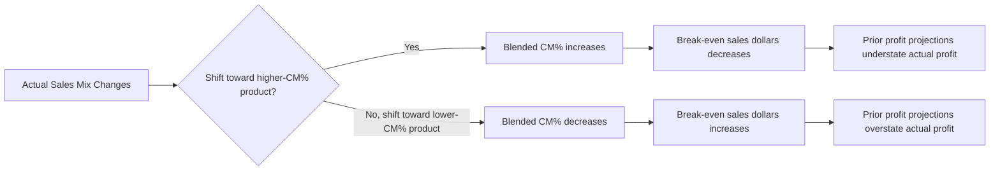

## The Contribution Margin Ratio

### Definition

The contribution margin ratio (CM ratio, or CM%) expresses contribution margin as a percentage of sales revenue. It measures how much of each sales dollar remains after variable costs to cover fixed costs and generate profit.

$$CM\%=\frac{Sales-VariableCosts}{Sales}=\frac{CM_{total}}{Sales}$$

At the unit level, it can equivalently be computed as:

$$CM\%=\frac{CM_{unit}}{Price_{unit}}=\frac{Price_{unit}-VariableCost_{unit}}{Price_{unit}}$$

The complement of the CM ratio is the variable cost ratio (VC%), since the two must sum to 100% of sales:

$$VC\%=\frac{VariableCosts}{Sales}=1-CM\%$$

### Why a Ratio (Not Just a Dollar Amount)

**Key Points**

- CM ratio is scale-independent — it allows comparison of profitability *efficiency* across products with very different prices, without volume distorting the comparison.
- It converts a revenue change directly into a profit-impact estimate without needing to know unit counts:

$$\Delta OperatingIncome=\Delta Sales\times CM\%$$

- This makes CM% the fastest tool for answering "if sales increase/decrease by $X, what happens to profit?" — no need to know price, unit cost, or volume individually.
- A high CM ratio means more of each incremental sales dollar drops to profit; a low CM ratio means most of each sales dollar is consumed by variable costs, so profit growth depends more heavily on volume.

### Worked Example

A product sells for $80/unit with variable cost of $32/unit.

$$CM_{unit}=\$80-\$32=\$48$$

$$CM\%=\$48/\$80=60\%$$

**Example**

If a manager is told sales are expected to rise by $25,000 next quarter, the profit impact can be estimated instantly:

$$\Delta OperatingIncome=\$25{,}000\times0.60=\$15{,}000$$

No need to know how many units that $25,000 represents — the ratio applies directly to revenue dollars.

### Comparing Products with the Ratio

|  | Product X | Product Y |
| --- | --- | --- |
| Price/unit | $200 | $40 |
| Variable cost/unit | $140 | $16 |
| Unit CM | $60 | $24 |
| **CM Ratio** | **30%** | **60%** |

Product Y converts sales dollars into contribution twice as efficiently as Product X, even though Product X's unit CM in dollar terms ($60) is much higher than Product Y's ($24). A marketing dollar spent driving revenue toward Product Y yields a larger profit impact per revenue dollar generated. This is the core reason CM ratio, not unit CM, is used when comparing profitability *efficiency* across dissimilar products.

### Relationship to Break-Even and Target Profit

The CM ratio is the standard denominator in break-even and target-profit formulas expressed in **sales dollars** (as opposed to units):

$$BreakEven_{dollars}=\frac{FixedCosts}{CM\%}$$

$$TargetSales_{dollars}=\frac{FixedCosts+TargetProfit}{CM\%}$$

**Example**

If fixed costs are $90,000 and CM% is 60%:

$$BreakEven_{dollars}=\$90{,}000/0.60=\$150{,}000$$

The company must generate $150,000 in sales to cover fixed costs, regardless of the mix of units that make up that revenue (assuming a constant CM% across the mix).

### CM Ratio and Sales Mix

When a company sells multiple products at different individual CM ratios, the blended (weighted-average) CM ratio depends on the relative proportion of sales dollars from each product:

$$CM\%_{blended}=\sum_{i}\left(CM\%_i\times\frac{Sales_i}{Sales_{total}}\right)$$

**Example**

| Product | CM% | % of Total Sales |
| --- | --- | --- |
| X | 30% | 40% |
| Y | 60% | 60% |

$$CM\%_{blended}=(0.30\times0.40)+(0.60\times0.60)=0.12+0.36=0.48=48\%$$

A shift in sales mix toward the higher-CM% product (Y) increases the blended ratio without any change in individual prices or costs — this is why break-even and profit projections built on a blended CM% become unreliable if the underlying sales mix shifts. [Inference: the degree of unreliability scales with how far the actual mix deviates from the mix assumed when the blended ratio was calculated; small mix shifts produce proportionally small distortion.]

### Visual: CM Ratio Sensitivity to Sales Mix Shift

### CM Ratio vs. Gross Margin Ratio

| Aspect | CM Ratio | Gross Margin Ratio |
| --- | --- | --- |
| Denominator | Sales | Sales |
| Numerator basis | Sales − Variable Costs | Sales − COGS |
| Cost classification | Behavior (fixed/variable) | Function (production/non-production) |
| Includes fixed manufacturing overhead? | No | Yes (embedded in COGS) |
| Primary use | CVP analysis, profit-impact estimation | External reporting, gross profitability |

Because gross margin ratio includes fixed manufacturing overhead in its cost base while CM ratio excludes all fixed costs, the two ratios will differ for the same company whenever fixed manufacturing costs are material — CM ratio is typically higher than gross margin ratio in that case. [Unverified: the direction and magnitude of the gap depends entirely on a given company's cost structure and cannot be generalized as a fixed rule.]

### Common Pitfalls

- **Confusing CM ratio with net profit margin** — CM% only reflects variable cost efficiency; fixed costs still must be subtracted to reach operating income.
- **Applying a single company-wide CM% to a multi-product sales forecast without accounting for mix** — see the sales mix section above; the blended ratio is only valid for the specific mix it was calculated from.
- **Using CM ratio (a percentage) when CM per unit of a constrained resource is the correct metric** — under a binding capacity constraint, ratio-to-sales is not the same as ratio-to-constraint; these can rank products differently.
- **Forgetting that CM% moves in the opposite direction of the variable cost ratio** — a cost-cutting initiative on variable costs raises CM% even at unchanged prices, which is sometimes overlooked as a lever distinct from pricing.

### Related Topics

- Unit Contribution Margin versus Total Contribution Margin
- Break-Even Point and Target Profit Analysis
- Sales Mix and Weighted-Average Contribution Margin
- Operating Leverage and the Degree of Operating Leverage (DOL)
- Cost-Volume-Profit (CVP) Analysis and the CVP Graph
- Margin of Safety