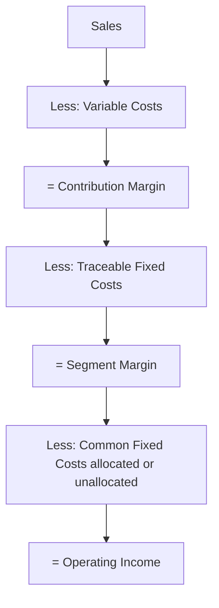

## The Contribution Margin Income Statement Format

### Definition

The contribution margin income statement (also called the "variable costing income statement" or "behavioral income statement") organizes revenues and costs by **cost behavior** — fixed versus variable — rather than by **cost function** — production versus selling/administrative, as used in the traditional (absorption/functional) income statement. It is a managerial accounting tool, not a GAAP/IFRS-required external reporting format.

### Structure

$$Sales$$

$$(-)\ VariableCosts$$

$$=\ ContributionMargin$$

$$(-)\ FixedCosts$$

$$=\ OperatingIncome$$

| Line Item | Amount |
| --- | --- |
| Sales | $X |
| (-) Variable Cost of Goods Sold | ($a) |
| (-) Variable Selling Expenses | ($b) |
| (-) Variable Administrative Expenses | ($c) |
| **= Contribution Margin** | **$X-a-b-c** |
| (-) Fixed Manufacturing Overhead | ($d) |
| (-) Fixed Selling Expenses | ($e) |
| (-) Fixed Administrative Expenses | ($f) |
| **= Operating Income** | **$X-a-b-c-d-e-f** |

Note that *all* variable costs — manufacturing and non-manufacturing — are grouped together before the CM subtotal, and *all* fixed costs — manufacturing and non-manufacturing — are grouped together after it. This is the defining structural difference from the traditional format.

### Contribution Format vs. Traditional (Functional) Format

| Aspect | Contribution Margin Format | Traditional Format |
| --- | --- | --- |
| Grouping basis | Cost behavior (fixed vs. variable) | Cost function (production vs. non-production) |
| Key subtotal | Contribution Margin | Gross Profit |
| Fixed mfg. overhead placement | Grouped with all fixed costs, below CM line | Included in COGS, above gross profit |
| GAAP/IFRS compliant for external reporting? | No | Yes |
| Primary audience | Internal management | External stakeholders, auditors, regulators |
| Best suited for | CVP analysis, break-even, what-if modeling | Financial statement comparability, external reporting |

**Key Points**

- Because fixed manufacturing overhead sits *above* the profit subtotal in the traditional format (embedded in COGS) but *below* the CM subtotal in the contribution format, gross profit and contribution margin will differ in dollar amount whenever fixed manufacturing overhead is material.
- The two formats always reconcile to the *same* operating income, since total revenue and total costs are unchanged — only the grouping and the location of the interim subtotal differ.
- The contribution format effectively separates "cost recovery from each sale" (CM) from "cost recovery from time/capacity" (fixed costs), which the traditional format does not do.

### Side-by-Side Example

Assume: Sales $500,000; Variable COGS $180,000; Variable selling $40,000; Fixed manufacturing overhead $60,000; Fixed selling & admin $90,000; (no variable admin costs in this example).

**Traditional (Functional) Format**

| Line Item | Amount |
| --- | --- |
| Sales | $500,000 |
| (-) COGS (Variable $180,000 + Fixed Mfg OH $60,000) | ($240,000) |
| **= Gross Profit** | **$260,000** |
| (-) Selling & Admin (Variable $40,000 + Fixed $90,000) | ($130,000) |
| **= Operating Income** | **$130,000** |

**Contribution Margin Format**

| Line Item | Amount |
| --- | --- |
| Sales | $500,000 |
| (-) Variable Costs ($180,000 + $40,000) | ($220,000) |
| **= Contribution Margin** | **$280,000** |
| (-) Fixed Costs ($60,000 + $90,000) | ($150,000) |
| **= Operating Income** | **$130,000** |

**Example**

Both formats arrive at the same $130,000 operating income, but the interim subtotal differs: Gross Profit ($260,000) versus Contribution Margin ($280,000). The $20,000 gap equals the $60,000 of fixed manufacturing overhead moved out of COGS, netted against how it's redistributed — in this case, the CM format's subtotal is higher because fixed mfg. overhead is excluded from the cost base used to compute it, while variable selling costs ($40,000) are included in both formats' relevant cost bases above their respective subtotals only in the CM format. [Inference: the direction and size of the gap between the two subtotals depends on the specific mix of fixed manufacturing overhead versus variable non-manufacturing costs; it is not a fixed relationship across companies.]

### Why Management Uses This Format

**Key Points**

- **CVP analysis compatibility**: Break-even, target profit, and margin of safety formulas are built directly from CM and fixed costs, so this format is the direct input to those calculations without needing to un-mix COGS.
- **Segment/product-line evaluation**: Because variable costs move with the specific segment or product, the CM format makes it straightforward to isolate a segment's direct contribution before allocating common fixed costs — supporting keep/drop analysis (see segment margin).
- **Flexible budgeting**: Variable costs can be budgeted as a rate per unit/dollar of activity, and fixed costs as a lump sum per period, which maps cleanly onto the CM statement's structure.
- **What-if / sensitivity modeling**: Changing a volume assumption only requires recalculating the variable cost and sales lines; fixed costs remain unchanged, making the format fast to re-run under different scenarios.

### Extending to Segment Reporting

The format extends naturally to a segmented contribution income statement, which separates fixed costs into **traceable** (direct to a segment) and **common** (shared across segments), introducing a segment margin subtotal between CM and operating income:

This layered structure lets management evaluate segment profitability (via segment margin) separately from company-wide fixed cost recovery (via operating income), avoiding the distortion that can occur when common fixed costs are arbitrarily allocated to segments in a traditional format.

### Limitations

- **Not acceptable for external financial reporting** under GAAP or IFRS, both of which require absorption/full costing for inventory valuation and COGS presentation; the CM format is for internal use only.
- **Requires reliable cost classification** — many real-world costs are semi-variable (mixed) and must first be split into fixed and variable components (e.g., via the high-low method or regression), introducing estimation error not present in the traditional format's direct GAAP cost pools.
- **Inventory valuation differs from GAAP** — variable costing (which underlies this statement) excludes fixed manufacturing overhead from inventory cost, so ending inventory values, and consequently reported operating income in periods where production ≠ sales, will differ from absorption costing figures used externally. [Inference: the magnitude of the difference depends on the change in inventory levels during the period; when production equals sales, variable and absorption costing yield the same operating income.]

### Common Pitfalls

- **Presenting this format to external auditors or in filed financial statements** — it is a management-only tool and does not satisfy GAAP/IFRS inventory costing rules.
- **Misplacing fixed manufacturing overhead below the CM line but still including it in COGS above** — this double-counts the cost or breaks the reconciliation to traditional-format operating income.
- **Confusing contribution margin with gross profit** when reading segment or product reports, since the two subtotals are calculated from different cost bases and are not interchangeable.
- **Failing to split mixed costs before building the statement**, which understates or overstates CM depending on how the mixed cost happens to be classified by default in the source data.

### Related Topics

- The Contribution Margin Concept and Formula
- Segment Margin and Traceable vs. Common Fixed Costs
- Variable Costing versus Absorption Costing
- Cost-Volume-Profit (CVP) Analysis and the CVP Graph
- High-Low Method and Regression for Mixed Cost Separation
- Break-Even Point and Target Profit Analysis