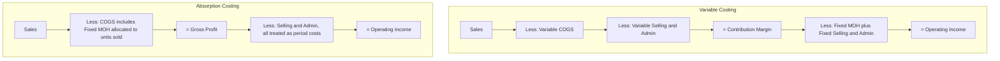

## Variable Costing versus Absorption Costing

### Definitions

**Variable costing** (also called direct costing or marginal costing) treats only variable manufacturing costs — direct materials, direct labor, and variable manufacturing overhead — as product (inventoriable) costs. Fixed manufacturing overhead is treated as a period cost, expensed in full in the period incurred regardless of how much was produced or sold.

**Absorption costing** (also called full costing) treats all manufacturing costs — variable *and* fixed manufacturing overhead — as product costs. Fixed manufacturing overhead is allocated to units produced and "absorbed" into inventory, released to the income statement only when those units are sold.

### Core Distinction: Fixed Manufacturing Overhead Treatment

| Cost | Variable Costing | Absorption Costing |
| --- | --- | --- |
| Direct materials | Product cost | Product cost |
| Direct labor | Product cost | Product cost |
| Variable manufacturing overhead | Product cost | Product cost |
| **Fixed manufacturing overhead** | **Period cost (expensed immediately)** | **Product cost (inventoried, expensed on sale)** |
| Variable selling & admin | Period cost | Period cost |
| Fixed selling & admin | Period cost | Period cost |

Both methods treat non-manufacturing costs (selling and administrative, fixed or variable) identically — as period costs. The entire distinction rests on **fixed manufacturing overhead** alone.

### Per-Unit Product Cost Formulas

$$UnitCost_{variable}=DM+DL+VariableMOH$$

$$UnitCost_{absorption}=DM+DL+VariableMOH+\frac{FixedMOH_{total}}{UnitsProduced}$$

Because absorption costing spreads fixed MOH across units produced, its per-unit product cost is sensitive to the production volume used in the allocation — a change in units produced (even with no change in total fixed MOH) changes unit cost under absorption costing but not under variable costing.

### Income Statement Format Comparison

Variable costing produces a contribution margin income statement (see prior topic); absorption costing produces the traditional/functional income statement required for external reporting.

### The Core Reconciling Driver: Production vs. Sales Volume

The two methods report *different* operating income in a period only when **units produced ≠ units sold** — that is, when inventory levels change. This happens because absorption costing defers some fixed MOH into ending inventory (as an asset) rather than expensing it all in the current period.

$$OperatingIncome_{absorption}-OperatingIncome_{variable}=FixedMOH_{deferred\ in\ ending\ inventory}-FixedMOH_{released\ from\ beginning\ inventory}$$

A simplified rule of thumb:

| Relationship | Effect on Operating Income |
| --- | --- |
| Production > Sales (inventory increases) | Absorption income > Variable income |
| Production < Sales (inventory decreases) | Absorption income < Variable income |
| Production = Sales (inventory unchanged) | Absorption income = Variable income |

**Key Points**

- When inventory builds up, absorption costing "hides" some of the period's fixed MOH inside the balance sheet (as inventory value) rather than the income statement, inflating reported income relative to variable costing.
- When inventory shrinks (selling more than is produced, drawing down existing stock), absorption costing releases fixed MOH that was deferred in *prior* periods, which can make current-period absorption income lower than variable costing income.
- Variable costing income moves directly with sales volume, unaffected by production volume — this is often cited as more intuitive for evaluating operating performance period-to-period. [Unverified: whether this is "more useful" is a matter of the specific decision context and management judgment, not a settled technical conclusion.]

### Worked Example

Assume: Units produced = 10,000; Units sold = 8,000; Fixed MOH = $50,000 (fixed cost per unit produced = $5.00); Variable manufacturing cost/unit = $12; Selling price/unit = $30; Fixed S&A = $20,000; no beginning inventory.

**Variable Costing**

| Line Item | Amount |
| --- | --- |
| Sales (8,000 × $30) | $240,000 |
| (-) Variable COGS (8,000 × $12) | ($96,000) |
| **= Contribution Margin** | **$144,000** |
| (-) Fixed MOH (all $50,000 expensed) | ($50,000) |
| (-) Fixed S&A | ($20,000) |
| **= Operating Income** | **$74,000** |

**Absorption Costing**

| Line Item | Amount |
| --- | --- |
| Sales (8,000 × $30) | $240,000 |
| (-) COGS (8,000 × [$12 + $5]) | ($136,000) |
| **= Gross Profit** | **$104,000** |
| (-) Fixed S&A | ($20,000) |
| **= Operating Income** | **$84,000** |

**Example**

The $10,000 difference ($84,000 − $74,000) equals the fixed MOH deferred into the 2,000 units of unsold ending inventory: $2{,}000\times\$5.00=\$10{,}000$. Absorption costing reports higher income here because production (10,000) exceeded sales (8,000), deferring part of the period's fixed MOH onto the balance sheet.

### Why This Matters for Contribution Margin Analysis

**Key Points**

- Contribution margin, as a concept, is only directly visible under variable costing — absorption costing's gross profit subtotal embeds fixed MOH and does not isolate cost behavior.
- CVP analysis, break-even calculations, and CM-ratio-based forecasting all implicitly assume a variable-costing view of costs; using absorption-costed unit costs in a break-even formula produces distorted results because fixed MOH is embedded in a "variable-looking" per-unit figure.
- A known critique of absorption costing is that production managers can temporarily inflate reported operating income by overproducing (building inventory) even with no change in sales — since more fixed MOH gets deferred into inventory rather than expensed. [Inference: this incentive effect is a widely discussed theoretical consequence of the accounting mechanics; its actual prevalence and materiality in practice depend on internal controls and how a specific organization evaluates managers.]

### External Reporting Requirement

Absorption costing is required under GAAP and IFRS for external financial statements and inventory valuation; variable costing is not permitted for external reporting because it does not capitalize fixed manufacturing overhead into inventory as required by these standards. Companies that use variable costing internally for decision-making must still prepare (or reconcile to) absorption-basis statements for external purposes. [Unverified: specific jurisdictional or industry exceptions may exist and should be confirmed against current authoritative standards rather than assumed universal.]

### Common Pitfalls

- **Assuming the two methods always report different income** — they converge whenever production equals sales in a period (no inventory change).
- **Using absorption-costed unit product cost in a CVP or break-even formula** — this silently embeds a fixed cost inside what the formula treats as a per-unit variable cost, distorting the break-even point.
- **Treating a period-over-period income swing as a sales performance change when it's actually a production/inventory change** — absorption costing can make operating income rise even with flat or declining sales, purely from inventory build.
- **Forgetting that fixed manufacturing overhead allocation rate depends on the denominator (budgeted vs. actual production volume) chosen for absorption costing** — different denominator choices produce different unit costs and different reported income, independent of any change in actual costs incurred.

### Related Topics

- The Contribution Margin Income Statement Format
- Fixed Manufacturing Overhead Allocation and Denominator-Level Variance
- Cost-Volume-Profit (CVP) Analysis and the CVP Graph
- Inventory Valuation Under GAAP and IFRS
- Throughput Costing (Super-Variable Costing)
- Operating Leverage and the Degree of Operating Leverage (DOL)