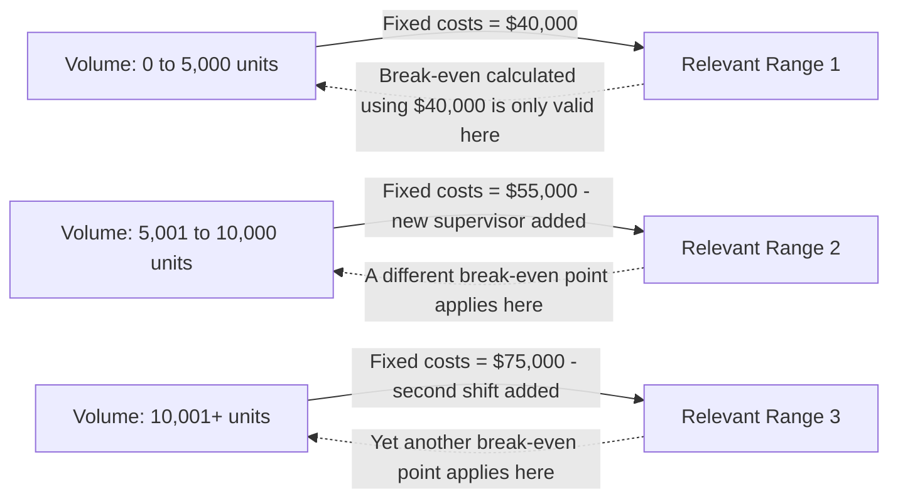

## CVP Model Assumptions and Limitations

### Overview

Cost-Volume-Profit (CVP) analysis — break-even calculations, target profit analysis, contribution margin ratios, and operating leverage — rests on a simplified linear model of how revenue and costs behave relative to volume. The model's usefulness depends entirely on how closely its underlying assumptions hold for the specific situation being analyzed. Understanding these assumptions is necessary to know when CVP conclusions are reliable and when they require adjustment or should be discarded in favor of more sophisticated tools.

### The Core CVP Model

$$OperatingIncome=(Price\times Q)-(VariableCost_{unit}\times Q)-FixedCosts$$

This single linear equation underlies break-even, target profit, margin of safety, and operating leverage calculations. Every assumption below exists to justify treating price, variable cost per unit, and fixed costs as constants in this equation.

### The Standard Assumptions

**Key Points**

1. **Linear cost behavior**: Total variable costs change in direct linear proportion to volume ($VariableCost_{unit}$ is constant at all volumes), and total fixed costs remain constant across the relevant range.
2. **Linear revenue behavior**: Selling price per unit is constant regardless of volume — no volume discounts, no price changes to stimulate demand.
3. **Single relevant range**: All assumptions hold only within a specified range of activity (the "relevant range"); outside that range, cost and price behavior may differ (e.g., a new production shift adds a step-fixed cost, or bulk discounts kick in).
4. **Constant sales mix**: For multi-product analysis, the proportion of each product within total sales remains fixed; a single blended CM ratio is only valid for that specific mix.
5. **Costs are accurately classified**: Every cost can be cleanly separated into purely fixed or purely variable components (in practice, many costs are mixed/semi-variable and must be split via methods like high-low or regression).
6. **Inventory levels are constant, or the analysis uses a "units sold" basis consistently**: The model implicitly assumes production = sales within a period, or at minimum uses variable costing where inventory changes don't distort operating income (see variable vs. absorption costing).
7. **All units produced are sold within the period / no time-value-of-money effects**: The model is a single-period, non-discounted framework — it ignores the time value of money and multi-period cash flow timing.
8. **Costs and revenues are the only relevant variables**: Non-financial factors (quality, customer relationships, strategic positioning) are outside the model's scope entirely.

### Assumption-by-Assumption: Why It Matters and What Breaks

| Assumption | What It Enables | What Happens When Violated |
| --- | --- | --- |
| Linear variable cost | $CM_{unit}$ is constant, single break-even point exists | Non-linear costs (e.g., quantity discounts, overtime premiums) mean $CM_{unit}$ changes with volume, producing multiple or shifting break-even points |
| Linear price | Revenue line is a straight line through origin | Price discounts at high volume flatten the revenue line, potentially eliminating a clean single break-even point |
| Relevant range | Fixed costs treated as a flat horizontal line | Step-fixed costs (e.g., adding a supervisor at 5,000 units) mean the "fixed cost line" is actually a staircase, invalidating a single fixed-cost figure across the full volume range analyzed |
| Constant sales mix | A single blended CM% or break-even figure is meaningful | Mix shifts change the blended CM% (see CM ratio topic), making a previously calculated break-even point stale |
| Accurate cost classification | CM and break-even formulas use the correct cost inputs | Misclassified mixed costs distort both CM and fixed cost figures, propagating error into every downstream CVP calculation |
| No inventory distortion | Variable costing income = a direct function of units sold | Absorption costing with changing inventory (see prior topic) decouples reported income from the CVP model's predictions |

### Visual: Relevant Range and the Step-Fixed Cost Problem

A single "fixed costs" figure and single break-even point are only valid within one relevant range. Applying a break-even calculation from Relevant Range 1 to a volume scenario in Relevant Range 3 produces a materially wrong answer.

### Worked Example: Where Linearity Breaks Down

A company's standard CVP model assumes: Price $40/unit, Variable cost $25/unit ($CM_{unit}=\$15$), Fixed costs $60,000, giving break-even at 4,000 units.

**Example**

Suppose demand at higher volumes requires offering a 10% price discount above 6,000 units to move additional volume, and variable cost per unit drops to $23 above 8,000 units due to a bulk materials discount. A manager using the simple linear model to project profit at 9,000 units would compute:

$$ProjectedIncome_{naive}=9{,}000\times\$15-\$60{,}000=\$75{,}000$$

But the actual figure requires splitting the volume into tiers reflecting the price and cost changes — the single linear $CM_{unit}=\$15$ no longer applies uniformly across all 9,000 units. [Inference: the specific magnitude of the resulting error depends on how many units fall into each pricing/cost tier; the naive linear projection will overstate or understate actual income depending on the net effect of the price discount versus the cost discount at that volume.] This is a textbook illustration of assumption 1 and 2 breaking down simultaneously.

### Practical Responses to Each Limitation

| Limitation | Common Mitigation |
| --- | --- |
| Non-linear costs/prices | Use piecewise CVP analysis — separate linear models for each relevant range/volume tier |
| Step-fixed costs | Explicitly model fixed costs as a step function rather than a single constant |
| Mixed costs | Apply high-low method, scattergraph, or regression analysis to split mixed costs before running CVP |
| Sales mix shifts | Recalculate blended CM% whenever actual or forecasted mix changes materially; consider per-product CVP instead of blended |
| Multi-period/capital decisions | Supplement CVP with discounted cash flow (DCF), NPV, or capital budgeting techniques for decisions spanning multiple periods |
| Non-financial factors | Treat CVP output as one input among several in a broader decision framework, not a sole decision criterion |

**Key Points**

- CVP analysis is a **planning and directional tool**, not a precise forecasting model — its value lies in showing how profit responds to changes in the underlying drivers (price, volume, cost structure), not in producing an exact profit figure under real-world conditions.
- Sensitivity analysis (varying the model's inputs across a plausible range) is the standard way practitioners compensate for the model's rigid linearity assumptions, rather than treating any single output as certain.
- Despite its limitations, CVP remains widely used specifically *because* its simplifying assumptions make it fast, intuitive, and effective for short-run, single-product-focused decisions within a known relevant range — the tool is a deliberate simplification traded for speed and clarity in exactly the conditions where the assumptions are approximately valid.

### Common Pitfalls

- **Extrapolating a break-even or profit projection far outside the relevant range** the original fixed-cost and cost-classification data were based on.
- **Ignoring step-fixed costs when volume projections span a threshold** (e.g., adding a shift, a machine, or a supervisor) — treating fixed costs as constant when they are not, within the projected range.
- **Applying a single blended CM ratio after a known or projected sales mix shift** without recalculating it (see CM ratio topic).
- **Treating CVP output as a guarantee rather than a model-based estimate** — since real cost and price behavior is rarely perfectly linear, CVP results should be paired with sensitivity ranges rather than single-point certainty. [Unverified: the appropriate degree of caution varies by industry and cost structure volatility, and is a matter of professional judgment rather than a fixed technical rule.]

### Related Topics

- Break-Even Point and Target Profit Analysis
- The Contribution Margin Ratio
- High-Low Method and Regression for Mixed Cost Separation
- Sales Mix and Weighted-Average Contribution Margin
- Step-Fixed (Step-Variable) Cost Behavior
- Sensitivity Analysis in CVP Modeling