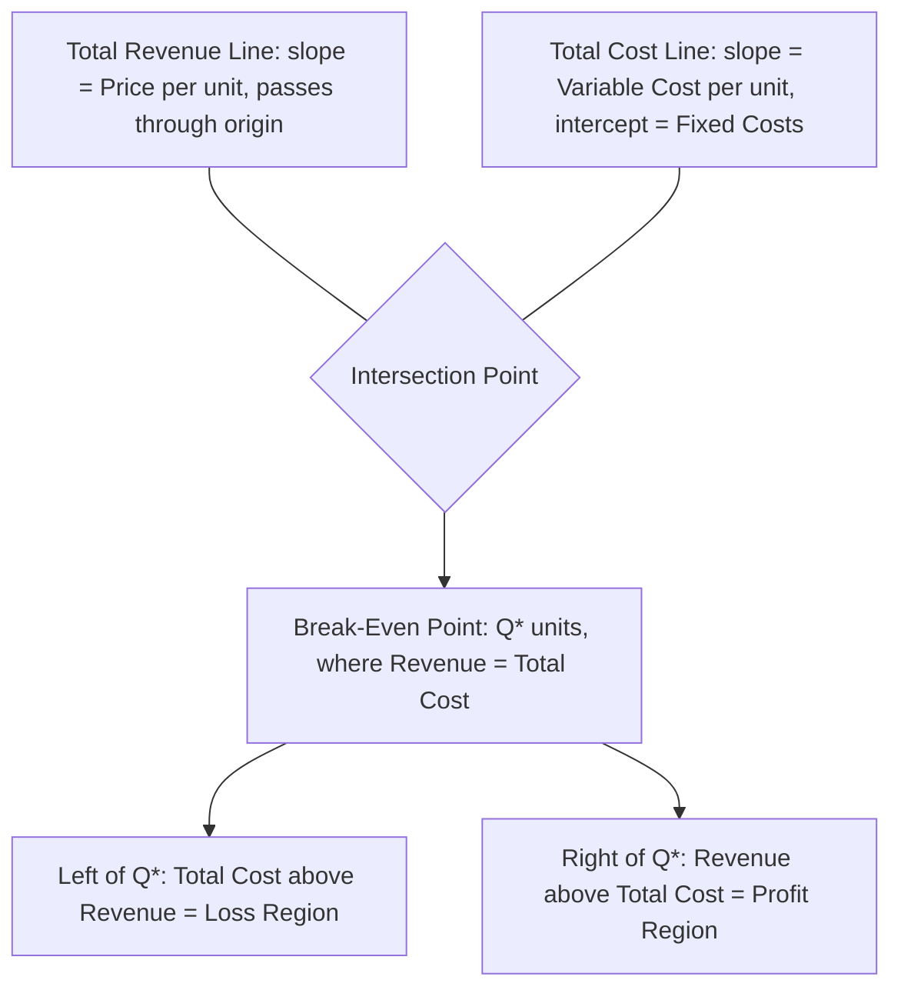

## Break Even Point in Units

### Definition

The break-even point in units is the sales volume at which total revenue exactly equals total costs — operating income equals zero. Below this volume, the company operates at a loss; above it, the company earns a profit.

### Derivation from the Profit Equation

Starting from the CVP profit equation:

$$OperatingIncome=(Q\times CM_{unit})-FixedCosts$$

Setting operating income to zero and solving for $Q$:

$$0=(Q\times CM_{unit})-FixedCosts$$

$$Q^*=\frac{FixedCosts}{CM_{unit}}$$

This is the **break-even formula in units**. It answers: how many units must be sold so that total contribution margin exactly covers total fixed costs?

### Intuitive Interpretation

**Key Points**

- Each unit sold generates $CM_{unit}$ toward covering fixed costs; break-even occurs once enough units have been sold that their cumulative CM exactly equals fixed costs.
- The formula is a pure division of "cost to be recovered" (fixed costs) by "recovery rate per unit" ($CM_{unit}$) — conceptually identical to asking how many $20 contributions are needed to pay off a $4,000 bill.
- A higher $CM_{unit}$ lowers the break-even point (each unit recovers more, so fewer are needed); higher fixed costs raise it (more must be recovered in total).

### Worked Example

A company sells a product for $45/unit, with variable cost of $27/unit, and fixed costs of $36,000/month.

$$CM_{unit}=\$45-\$27=\$18$$

$$Q^*=\frac{\$36{,}000}{\$18}=2{,}000\ units$$

**Example**

At exactly 2,000 units sold:

- Sales: $2{,}000\times\$45=\$90{,}000$
- Variable costs: $2{,}000\times\$27=\$54{,}000$
- Contribution margin: $\$90{,}000-\$54{,}000=\$36{,}000$
- Operating income: $\$36{,}000-\$36{,}000=\$0$ ✓

At 2,001 units, operating income would be $\$18$ (one more unit's worth of CM); at 1,999 units, operating loss would be $\$18$.

### Visual: Break-Even Chart

On a traditional break-even chart, the revenue line starts at the origin with slope = price/unit; the total cost line starts at the fixed-cost intercept with slope = variable cost/unit. The two lines cross exactly at $Q^*$ — the same point produced algebraically by the formula above.

### Two Equivalent Derivation Paths

Break-even in units can be reached via two mathematically identical routes, useful for cross-checking:

**Path 1 — Contribution Margin Approach** (shown above):

$$Q^*=\frac{FixedCosts}{CM_{unit}}$$

**Path 2 — Equation (Full Income Statement) Approach**: Set Sales = Total Costs and solve directly.

$$Price\times Q=VariableCost_{unit}\times Q+FixedCosts$$

$$Q\times(Price-VariableCost_{unit})=FixedCosts$$

$$Q^*=\frac{FixedCosts}{Price-VariableCost_{unit}}=\frac{FixedCosts}{CM_{unit}}$$

Both paths converge on the same formula since $Price-VariableCost_{unit}$ is simply $CM_{unit}$ by definition — the "equation approach" is the full derivation the "CM approach" formula compresses.

### Break-Even in Units vs. Break-Even in Dollars

|  | Break-Even in Units | Break-Even in Dollars |
| --- | --- | --- |
| Formula | $FixedCosts/CM_{unit}$ | $FixedCosts/CM\%$ |
| Output | A quantity (e.g., 2,000 units) | A revenue figure (e.g., $90,000) |
| Best used when | Single product, unit economics are the focus | Multi-product companies, or when unit price/cost data isn't readily available |
| Relationship | $Q^*\times Price=$ Break-Even in Dollars | Break-Even in Dollars $/Price=Q^*$ |

**Example**

Verifying consistency: $CM\%=\$18/\$45=40\%$. Break-even in dollars: $\$36{,}000/0.40=\$90{,}000$. Dividing by price: $\$90{,}000/\$45=2{,}000\ units$ — matching $Q^*$ computed directly.

### Sensitivity of the Break-Even Point

**Key Points**

- **Fixed cost changes**: A $\Delta FixedCosts$ change shifts break-even by $\Delta FixedCosts/CM_{unit}$ units — e.g., a $9,000 increase in fixed costs at $CM_{unit}=\$18$ raises break-even by 500 units.
- **Price changes**: Raising price increases $CM_{unit}$, lowering break-even volume (fewer units needed) — but this assumes volume itself doesn't fall in response to the price change, which the standard linear CVP model does not capture (see CVP assumptions and limitations).
- **Variable cost changes**: A decrease in variable cost per unit increases $CM_{unit}$, lowering break-even volume, identical in mechanical effect to a price increase.
- Because break-even is a ratio, small changes in a low-CM$_{unit}$ business can swing the break-even point dramatically, while the same dollar change has a much smaller proportional effect in a high-CM$_{unit}$ business.

### Common Pitfalls

- **Using total contribution margin instead of unit contribution margin** in the denominator — this produces a nonsensical result, since the formula requires the *per-unit* rate to convert a total dollar figure (fixed costs) into a unit count.
- **Applying a single company-wide break-even formula to a multi-product company without a valid blended CM% or CM$_{unit}$** — see sales mix and weighted-average CM ratio; break-even in units is only meaningful for a single product or a sales-mix-consistent bundle of products.
- **Forgetting that break-even is a volume where profit is exactly zero, not the minimum viable volume for the business** — a company may need a substantial margin of safety above break-even to be considered financially healthy (see margin of safety).
- **Ignoring relevant-range violations** — if the break-even quantity calculated falls outside the volume range for which the fixed cost and CM$_{unit}$ figures were valid (e.g., break-even computed at 12,000 units but fixed costs were only confirmed fixed up to 10,000 units), the answer may not hold without adjustment.

### Related Topics

- The CVP Equation and Profit Function
- Break-Even Point in Sales Dollars (via CM Ratio)
- Target Profit Analysis
- Margin of Safety
- CVP Model Assumptions and Limitations
- Sales Mix and Weighted-Average Contribution Margin