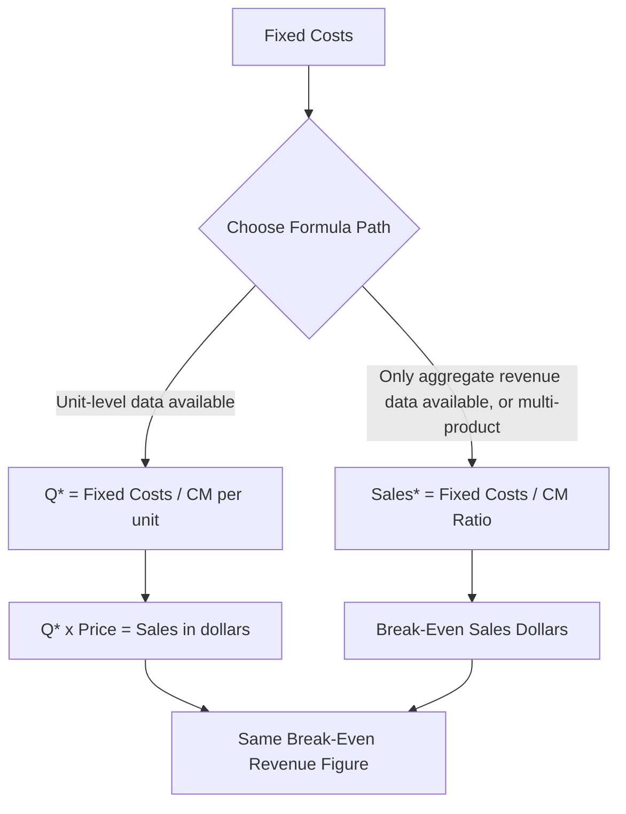

## Break Even Point in Sales Dollars

### Definition

The break-even point in sales dollars is the total revenue at which operating income equals zero, expressed in currency terms rather than unit counts. It answers the question "how much revenue must be generated to cover all costs?" without requiring knowledge of unit price or unit volume individually.

### Derivation from the Profit Equation

Starting from the dollar-sales form of the CVP profit equation:

$$OperatingIncome=(Sales\times CM\%)-FixedCosts$$

Setting operating income to zero and solving for Sales:

$$0=(Sales\times CM\%)-FixedCosts$$

$$Sales^*=\frac{FixedCosts}{CM\%}$$

This is the **break-even formula in sales dollars**, where $CM\%$ is the contribution margin ratio (see prior topic): $CM\%=CM_{total}/Sales=CM_{unit}/Price$.

### Why Use the Dollar-Sales Version

**Key Points**

- **Multi-product companies**: When a company sells many products at different prices, there is no single meaningful "unit," so a unit-based break-even formula doesn't directly apply — the dollar-sales version, using a blended CM%, sidesteps this by working entirely in revenue terms.
- **When unit-level data isn't readily available**: Some businesses (services, subscriptions, companies with highly variable product configurations) don't have a clean "price per unit" and "variable cost per unit," but can still compute total sales and total variable costs to derive CM%.
- **Faster what-if analysis on revenue targets**: Since many business conversations are framed in revenue terms ("we need $X in sales"), the dollar-sales formula directly answers planning questions without an extra unit-to-dollar conversion step.

### Worked Example

A company has fixed costs of $150,000. Total sales are $600,000 and total variable costs are $360,000.

$$CM\%=\frac{\$600{,}000-\$360{,}000}{\$600{,}000}=\frac{\$240{,}000}{\$600{,}000}=40\%$$

$$Sales^*=\frac{\$150{,}000}{0.40}=\$375{,}000$$

**Example**

At exactly $375,000 in sales:

- Variable costs (at the same 60% variable cost ratio): $\$375{,}000\times0.60=\$225{,}000$
- Contribution margin: $\$375{,}000\times0.40=\$150{,}000$
- Operating income: $\$150{,}000-\$150{,}000=\$0$ ✓

The company must generate $375,000 in revenue, in any combination of units/products consistent with the 40% blended CM ratio, to cover its $150,000 in fixed costs.

### Consistency Check with Break-Even in Units

For a single product, the dollar-sales break-even and unit break-even must reconcile exactly:

$$Sales^*=Q^*\times Price$$

**Example**

If this same company sold a single product at $50/unit with variable cost $30/unit ($CM_{unit}=\$20$, $CM\%=40\%$, matching the ratio above):

$$Q^*=\$150{,}000/\$20=7{,}500\ units$$

$$Sales^*=7{,}500\times\$50=\$375{,}000$$

Both approaches converge on the same $375,000 break-even revenue, confirming the two formulas are mathematically equivalent views of the same underlying model.

### Visual: Two Roads to the Same Break-Even Revenue

### Break-Even Dollars for Multi-Product Companies

When multiple products are sold, $CM\%$ must be the **weighted-average CM ratio**, calculated from the actual (or assumed) sales mix:

$$CM\%_{blended}=\sum_i\left(CM\%_i\times\frac{Sales_i}{Sales_{total}}\right)$$

**Example**

| Product | CM% | % of Total Sales |
| --- | --- | --- |
| A | 25% | 50% |
| B | 55% | 50% |

$$CM\%_{blended}=(0.25\times0.50)+(0.55\times0.50)=0.125+0.275=0.40=40\%$$

If fixed costs are $150,000, break-even in dollars is $\$150{,}000/0.40=\$375{,}000$ in *total* sales, split according to the 50/50 mix assumption — $187,500 from Product A and $187,500 from Product B. If the actual mix shifts away from this assumption, the blended CM% changes and this break-even figure becomes stale (see sales mix and weighted-average CM ratio).

### Sensitivity of the Dollar Break-Even Point

**Key Points**

- **Fixed cost increases** raise break-even sales proportionally: a $30,000 increase in fixed costs at a 40% CM ratio raises break-even sales by $\$30{,}000/0.40=\$75{,}000$.
- **A lower CM% requires disproportionately more revenue to break even** — since Sales* is inversely proportional to CM%, a company with a thin CM% (e.g., 10%) needs ten times its fixed costs in revenue to break even, while a company with a 50% CM% needs only double its fixed costs.
- **Improving CM% (via pricing, cost control, or shifting mix toward higher-margin products) lowers the dollar break-even point** without necessarily changing unit volume at all — this is a key lever distinct from simply "selling more units."

### Common Pitfalls

- **Using gross margin ratio instead of CM ratio in the denominator** — gross margin ratio embeds fixed manufacturing overhead and excludes variable selling/admin costs, producing an incorrect break-even figure (see contribution margin vs. gross margin).
- **Applying a blended CM% calculated from a stale or assumed sales mix** to a current planning period where the actual mix has shifted — the break-even dollar figure silently becomes inaccurate.
- **Mixing the unit-level and dollar-level formulas within one calculation** — e.g., dividing fixed costs by unit CM but reporting the answer as a dollar figure, or dividing by CM% but reporting a unit count.
- **Treating the computed break-even dollar figure as fixed indefinitely** — it must be recalculated whenever fixed costs, prices, variable costs, or (for multi-product firms) sales mix change.

### Related Topics

- Break-Even Point in Units
- The Contribution Margin Ratio
- Sales Mix and Weighted-Average Contribution Margin
- Target Profit Analysis
- Margin of Safety
- The CVP Equation and Profit Function