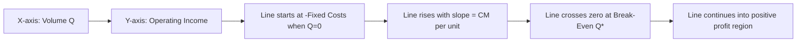

## Constructing the CVP Graph and Break Even Chart

### Purpose

The CVP graph (break-even chart) is a visual representation of the CVP profit equation, plotting total revenue and total cost as linear functions of volume on the same axes. It makes the break-even point, profit region, and loss region immediately visible, and provides an intuitive way to communicate CVP relationships without requiring the audience to work through the algebra directly.

### Axes and Setup

- **X-axis**: Volume, in units sold (or, alternatively, sales dollars for a dollar-based chart).
- **Y-axis**: Dollars — total revenue and total costs.

Two lines are plotted on these axes:

$$TotalRevenue(Q)=Price\times Q$$

$$TotalCost(Q)=(VariableCost_{unit}\times Q)+FixedCosts$$

Both are straight lines because the CVP model assumes linear price and cost behavior throughout the relevant range (see CVP model assumptions and limitations).

### Step-by-Step Construction

**Key Points**

1. **Plot the Total Fixed Cost line**: A horizontal line at height = Fixed Costs, extending across the full volume range on the chart. This represents costs that don't change with volume.
2. **Plot the Total Cost line**: Starts at the same Y-intercept as fixed costs (at $Q=0$, total cost = fixed costs, since no variable cost is incurred yet) and rises with slope = variable cost per unit. This line sits *above* the fixed cost line at every volume greater than zero, with the vertical gap between the two representing total variable costs at that volume.
3. **Plot the Total Revenue line**: Starts at the origin ($Q=0$, Revenue = $0) and rises with slope = price per unit.
4. **Identify the intersection**: The point where the Total Revenue line crosses the Total Cost line is the break-even point — at this volume, Revenue = Total Cost, so profit = 0.
5. **Shade or label the regions**: To the left of the intersection, Total Cost exceeds Revenue (loss region); to the right, Revenue exceeds Total Cost (profit region).
6. **Optionally add a Profit line**: A third line, $\pi(Q)=CM_{unit}\times Q-FixedCosts$, can be plotted directly — this line crosses zero exactly at the same break-even point, providing a simplified single-line alternative to the two-line (revenue/cost) version.

### Visual: Traditional Break-Even Chart

<svg xmlns="http://www.w3.org/2000/svg" viewBox="0 0 640 400">
<text x="320" y="24" text-anchor="middle" font-size="16" font-weight="bold" fill="#1a1a1a">Traditional Break-Even Chart (svg_diagram)</text>
<line x1="80" y1="350" x2="600" y2="350" stroke="#333" stroke-width="1.5" />
<line x1="80" y1="50" x2="80" y2="350" stroke="#333" stroke-width="1.5" />
<text x="590" y="370" font-size="12" fill="#1a1a1a">Q (units)</text>
<text x="20" y="55" font-size="12" fill="#1a1a1a">$</text>
<line x1="80" y1="270" x2="600" y2="270" stroke="#c9302c" stroke-width="2" />
<text x="420" y="262" font-size="11" fill="#c9302c">Total Fixed Cost</text>
<line x1="80" y1="270" x2="600" y2="90" stroke="#e07b39" stroke-width="2.5" />
<text x="480" y="130" font-size="11" fill="#e07b39">Total Cost (Fixed + Variable)</text>
<line x1="80" y1="350" x2="600" y2="65" stroke="#4a90d9" stroke-width="2.5" />
<text x="480" y="90" font-size="11" fill="#4a90d9">Total Revenue</text>
<circle cx="320" cy="177" r="6" fill="#5cb85c" />
<text x="330" y="172" font-size="11" font-weight="bold" fill="#5cb85c">Break-Even Point</text>
<line x1="320" y1="177" x2="320" y2="350" stroke="#999" stroke-dasharray="3,3" />
<text x="305" y="365" font-size="10" fill="#555">Q*</text>

<text x="140" y="330" font-size="11" fill="#555">Loss Region</text>

<text x="480" y="200" font-size="11" fill="#555">Profit Region</text>

<line x1="320" y1="177" x2="80" y2="177" stroke="#999" stroke-dasharray="3,3" />
<text x="30" y="181" font-size="10" fill="#555">Sales*</text>
</svg>

### Worked Example: Deriving the Plotted Values

A company: Price = $60/unit, Variable cost = $36/unit, Fixed costs = $48,000.

$$CM_{unit}=\$60-\$36=\$24$$

$$Q^*=\$48{,}000/\$24=2{,}000\ units$$

$$Sales^*=2{,}000\times\$60=\$120{,}000$$

**Example**

Points to plot each line:

| Volume (Q) | Total Revenue ($60Q$) | Total Cost ($36Q+48{,}000$) |
| --- | --- | --- |
| 0 | $0 | $48,000 |
| 1,000 | $60,000 | $84,000 |
| 2,000 (break-even) | $120,000 | $120,000 |
| 3,000 | $180,000 | $156,000 |

At $Q=2{,}000$, both lines equal $120,000 — confirming the break-even point calculated algebraically. At $Q=1{,}000$ (below break-even), cost ($84,000) exceeds revenue ($60,000): an $24,000 loss. At $Q=3{,}000$ (above break-even), revenue ($180,000) exceeds cost ($156,000): a $24,000 profit — consistent with $CM_{unit}\times1{,}000=\$24{,}000$ above/below break-even volume.

### The Profit-Volume (P/V) Graph: A Simplified Alternative

An alternative single-line version, the profit-volume graph, plots operating income directly against volume, avoiding the need for two intersecting lines:

$$\pi(Q)=CM_{unit}\times Q-FixedCosts$$

**Key Points**

- The P/V graph condenses the same information as the two-line break-even chart into a single line, making the *rate* of profit change (slope = $CM_{unit}$) and the break-even point equally visible with less visual clutter.
- The traditional break-even chart is often preferred for communicating to non-technical audiences because it separately shows revenue and total cost as recognizable quantities; the P/V graph is often preferred for quickly comparing scenarios (e.g., two different cost structures) because differing slopes/intercepts are easy to contrast on one plot.
- Both charts are visualizations of the identical underlying linear profit equation — neither adds new information beyond what the algebraic formulas already provide; the value is purely in intuitive communication and quick visual estimation of profit/loss at a glance.

### Reading Margin of Safety and Operating Leverage from the Chart

- **Margin of safety** is visually the horizontal distance on the X-axis between the break-even point and the actual (or planned) sales volume — the width of the "profit region" the company currently sits in.
- **Degree of operating leverage** relates to how steep the Total Cost or Profit line is relative to Revenue — a higher fixed-cost, higher-CM$_{unit}$ structure produces a *steeper* profit line (larger swings in profit per unit of volume change) than a lower-fixed-cost, lower-CM$_{unit}$ structure, even if both structures break even at the same volume.

### Extending the Chart for Step-Fixed Costs or Non-Linear Pricing

When fixed costs step up at a threshold volume, or price/variable cost changes across volume tiers (see CVP model assumptions and limitations), the chart is no longer two straight lines across the full range — instead:

- The Total Cost line becomes a series of connected line segments, jumping vertically at each threshold where fixed costs step up.
- The Total Revenue line may bend (change slope) at volumes where price discounts begin.
- Multiple break-even points can exist in this case, one for each relevant-range segment, and the chart must be interpreted piecewise rather than as a single global intersection. [Inference: the number and location of these additional break-even points depends entirely on where step-costs or price/cost changes occur relative to the standard single break-even point; a piecewise chart can in principle cross zero more than once.]

### Common Pitfalls

- **Extending the plotted lines beyond the relevant range** the underlying price and cost assumptions were validated for, implying a false precision at volumes where the linear assumptions may not hold.
- **Mislabeling the fixed cost line as the total cost line** — the fixed cost line is a flat horizontal reference; the total cost line must include the variable cost slope on top of it.
- **Plotting revenue starting from the fixed cost intercept instead of the origin** — revenue is $0 at zero volume; only the cost line starts above zero (at the fixed cost level).
- **Treating the chart as precise for reading off exact profit/loss figures** rather than as a visual aid — for precise calculations, the underlying algebraic CVP equation should be used; the chart is best for directional and comparative interpretation.

### Related Topics

- The CVP Equation and Profit Function
- Break-Even Point in Units
- Break-Even Point in Sales Dollars
- Margin of Safety
- Operating Leverage and the Degree of Operating Leverage (DOL)
- CVP Model Assumptions and Limitations