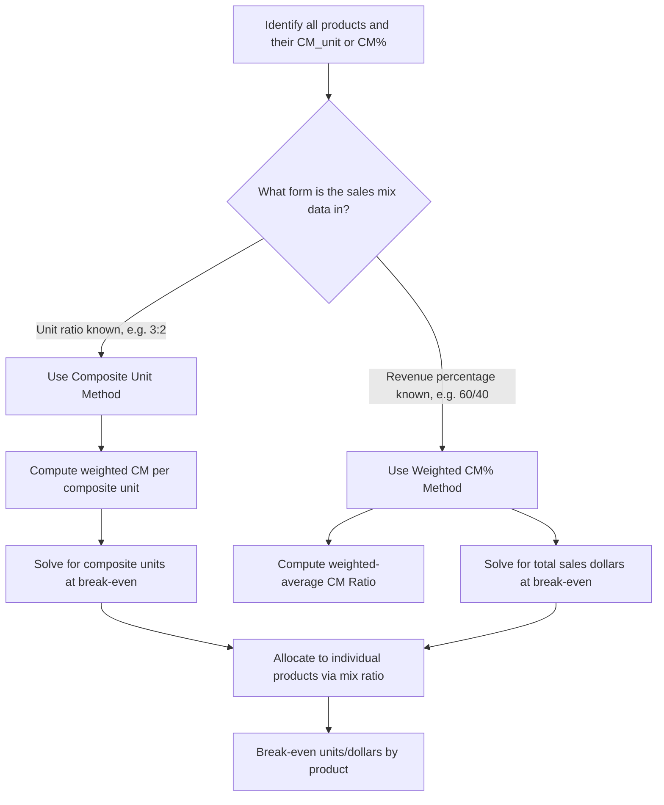

## Multi Product CVP and Weighted Average Contribution Margin

### The Core Problem

Standard single-product CVP formulas ($Q^*=FixedCosts/CM_{unit}$) assume one product with one price and one variable cost. When a company sells multiple products, there is no single "unit" to solve for — a break-even answer of "2,000 units" is meaningless without specifying *which* products those units represent. Multi-product CVP analysis resolves this by introducing a **sales mix assumption** and computing a **weighted-average contribution margin** that reflects the blended economics of that mix.

### Sales Mix Defined

Sales mix is the relative proportion in which two or more products are sold, expressed either as a ratio of units (e.g., 3 units of A for every 2 units of B) or as a percentage of total sales dollars. Multi-product CVP analysis is only valid for the specific sales mix assumed — the entire calculation must be redone if the actual mix changes materially (see CVP model assumptions and limitations).

### Method 1: Weighted-Average Contribution Margin per Unit (Composite Unit Approach)

This method requires a **unit-based sales mix ratio** and computes a blended $CM_{unit}$ representing a "composite unit" — a bundle containing the mix ratio of each product.

$$CM_{unit,weighted}=\sum_i\left(CM_{unit,i}\times MixRatio_i\right)$$

$$Q^*_{composite}=\frac{FixedCosts}{CM_{unit,weighted}}$$

The result, $Q^*_{composite}$, is the number of *composite units* (bundles) needed to break even; multiplying by each product's mix ratio gives the individual product break-even quantities.

### Worked Example: Composite Unit Approach

A company sells two products in a unit ratio of 3 units of A for every 2 units of B (a 3:2 mix). Fixed costs total $99,000.

| Product | Price | Variable Cost | $CM_{unit}$ | Mix Ratio (of 5-unit bundle) |
| --- | --- | --- | --- | --- |
| A | $40 | $25 | $15 | 3 |
| B | $60 | $40 | $20 | 2 |

**Example**

$$CM_{unit,weighted}=(\$15\times3)+(\$20\times2)=\$45+\$40=\$85\ (per\ 5\text{-}unit\ bundle)$$

$$Q^*_{composite}=\$99{,}000/\$85=1{,}164.7\approx1{,}165\ bundles$$

Individual product break-even quantities:

$$Q^*_A=1{,}165\times3=3{,}495\ units$$

$$Q^*_B=1{,}165\times2=2{,}330\ units$$

**Verification**: $CM_A=3{,}495\times\$15=\$52{,}425$; $CM_B=2{,}330\times\$20=\$46{,}600$; Total CM = $99,025 ≈ $99,000 fixed costs (small rounding difference from rounding up the fractional bundle count).

### Method 2: Weighted-Average Contribution Margin Ratio (Dollar-Sales Approach)

This method requires a **dollar-based sales mix percentage** (proportion of total sales revenue from each product) and computes a blended $CM\%$, consistent with the dollar-sales break-even formula covered previously.

$$CM\%_{weighted}=\sum_i\left(CM\%_i\times\frac{Sales_i}{Sales_{total}}\right)$$

$$Sales^*_{total}=\frac{FixedCosts}{CM\%_{weighted}}$$

Each product's break-even sales dollars is then $Sales^*_{total}\times(Sales_i/Sales_{total})$, using the same mix percentage assumed in the blend.

### Worked Example: Dollar-Sales Approach

Using the same products, but now expressed by revenue mix: Product A represents 60% of total sales dollars, Product B represents 40%. ($CM\%_A=\$15/\$40=37.5\%$; $CM\%_B=\$20/\$60=33.3\%$.)

**Example**

$$CM\%_{weighted}=(0.375\times0.60)+(0.333\times0.40)=0.225+0.1333=0.3583\approx35.8\%$$

$$Sales^*_{total}=\$99{,}000/0.358=\$276{,}536$$

Break-even sales by product:

$$Sales^*_A=\$276{,}536\times0.60=\$165{,}922$$

$$Sales^*_B=\$276{,}536\times0.40=\$110{,}614$$

Note this dollar-mix scenario (60/40 by revenue) is a *different* underlying mix assumption than the 3:2 unit-mix used in Method 1, so the two examples are not directly comparable — each method must use a mix ratio expressed in the units that method requires (unit ratio for the composite approach, revenue percentage for the CM% approach).

### Choosing Between the Two Methods

| Aspect | Composite Unit Method (CM$_{unit}$) | Weighted CM% Method |
| --- | --- | --- |
| Mix input required | Unit ratio (e.g., 3:2) | Revenue percentage (e.g., 60%/40%) |
| Output | Number of composite bundles / units per product | Total sales dollars / dollars per product |
| Best suited for | Companies with a small number of distinct, comparably-priced products sold in a predictable unit ratio | Companies with many products, widely varying prices, or where revenue mix is more stable/trackable than unit mix |
| Sensitivity | Result changes if the *unit* mix shifts | Result changes if the *revenue* mix shifts |

**Key Points**

- Neither method is inherently "more correct" — they are equivalent framings of the same underlying blended-CM logic, and the choice depends on which form of sales mix data is more reliably known or tracked for the business in question.
- Both methods collapse to the single-product formulas exactly when there is only one product (mix ratio = 100% to that product).
- A company with many SKUs (retail, distribution) will typically find the revenue-percentage (CM%) method more practical, since tracking a precise unit ratio across dozens of products is unwieldy; a company with two or three core products may find the composite-unit method more intuitive.

### Visual: Multi-Product Break-Even Workflow

### Sensitivity to Sales Mix Shifts

**Key Points**

- If actual sales mix shifts toward the higher-CM% product, the blended CM% rises, and the break-even revenue *decreases* — the company reaches profitability with less total revenue than originally planned.
- If actual sales mix shifts toward the lower-CM% product, the blended CM% falls, and break-even revenue *increases* — a company can miss a profit target even while hitting its total revenue target, purely because the mix shifted toward lower-margin products.
- This is a critical distinction from single-product CVP: in multi-product analysis, **total revenue alone does not determine profit** — the *composition* of that revenue matters just as much. [Inference: the magnitude of this effect scales with how far the CM% figures diverge across products; if all products have similar CM%, mix shifts have comparatively little effect on the blended figure and on profit outcomes.]

### Common Pitfalls

- **Mixing unit-ratio data into the CM% formula, or revenue-percentage data into the composite-unit formula** — each method requires its own specific form of mix data; using the wrong type produces a mathematically invalid blend.
- **Assuming the sales mix will remain constant when it has historically been volatile** — a blended break-even figure calculated from last year's mix can be materially wrong if this year's mix differs, even with identical prices and costs per product.
- **Reporting a single company-wide "break-even units" figure without specifying it refers to composite/bundle units, not individual product units** — this is a frequent source of confusion when communicating multi-product break-even results to non-technical stakeholders.
- **Ignoring that individual products may have very different margins even when the blended average looks healthy** — a favorable blended CM% can mask a loss-making product being subsidized by a strong performer; per-product CM analysis (see unit vs. total CM) should supplement, not replace, the blended figure.

### Related Topics

- The Contribution Margin Ratio
- Unit Contribution Margin versus Total Contribution Margin
- Break-Even Point in Units
- Break-Even Point in Sales Dollars
- CVP Model Assumptions and Limitations
- Segment Margin and Traceable vs. Common Fixed Costs