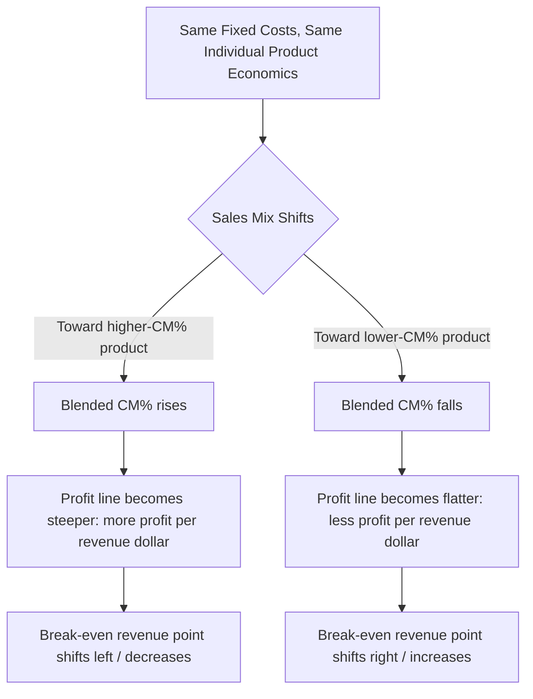

## Sales Mix Shifts and Their Effect on Break Even

### The Core Issue

Multi-product break-even calculations depend on a weighted-average contribution margin (either $CM_{unit,weighted}$ or $CM\%_{weighted}$), which is only valid for the specific sales mix used to compute it. When the actual sales mix diverges from the assumed mix, the previously calculated break-even point no longer reflects reality — even if every individual product's price, variable cost, and the company's total fixed costs remain completely unchanged. This topic isolates that effect: how and why a mix shift alone moves the break-even point.

### Why Mix Shifts Move Break-Even Even When Nothing Else Changes

The weighted-average CM% is a sales-weighted blend:

$$CM\%_{weighted}=\sum_i\left(CM\%_i\times\frac{Sales_i}{Sales_{total}}\right)$$

Because this formula is a weighted average, changing the *weights* ($Sales_i/Sales_{total}$ for each product) changes the result — independent of any change to the individual $CM\%_i$ values themselves.

$$Sales^*=\frac{FixedCosts}{CM\%_{weighted}}$$

Since break-even sales dollars is inversely proportional to $CM\%_{weighted}$, any shift in mix that raises the blended ratio *lowers* break-even revenue, and any shift that lowers the blended ratio *raises* break-even revenue.

### Direction of the Effect

| Mix Shift Direction | Effect on Blended CM% | Effect on Break-Even Sales |
| --- | --- | --- |
| Toward higher-CM% product(s) | Increases | Decreases (easier to break even) |
| Toward lower-CM% product(s) | Decreases | Increases (harder to break even) |
| No change in mix | Unchanged | Unchanged |

**Key Points**

- A company can hit its total revenue target and still miss its profit target if the mix shifted toward lower-margin products — total revenue alone does not determine whether break-even (or a profit goal) was achieved in a multi-product business.
- Conversely, a company can fall short of its total revenue target and still exceed its profit expectations if the mix shifted toward higher-margin products, since less revenue is needed to cover the same fixed costs.
- This makes sales mix a genuine third lever (alongside price and cost control) for managing profitability — deliberately steering sales toward higher-CM% products improves the blended ratio without any change to individual product economics.

### Worked Example: Planned vs. Actual Mix

A company has fixed costs of $120,000 and sells two products:

| Product | CM% | Planned Mix (% of Sales) | Actual Mix (% of Sales) |
| --- | --- | --- | --- |
| Premium | 60% | 30% | 50% |
| Standard | 20% | 70% | 50% |

**Planned break-even:**

$$CM\%_{planned}=(0.60\times0.30)+(0.20\times0.70)=0.18+0.14=0.32=32\%$$

$$Sales^*_{planned}=\$120{,}000/0.32=\$375{,}000$$

**Actual break-even (mix shifted toward Premium):**

$$CM\%_{actual}=(0.60\times0.50)+(0.20\times0.50)=0.30+0.10=0.40=40\%$$

$$Sales^*_{actual}=\$120{,}000/0.40=\$300{,}000$$

**Example**

The shift toward the higher-margin Premium product *lowered* break-even revenue by $75,000 ($375,000 − $300,000), even though neither product's price, variable cost, nor the company's fixed costs changed at all. A manager comparing actual results only to the original $375,000 break-even target would understate how much the business's underlying profitability actually improved.

### Visual: Mix Shift Effect on the CVP Line

On the CVP graph, a mix shift toward higher-margin products effectively steepens the total-revenue-to-profit relationship — the same physical revenue line, but a company reaches profitability sooner along it, because a larger share of each dollar is now contribution margin rather than variable cost.

### Quantifying the Full Profit Impact (Not Just Break-Even)

A mix shift affects realized profit at *any* volume, not only at the break-even point:

$$\Delta OperatingIncome_{from\ mix}=Sales_{total}\times(CM\%_{actual}-CM\%_{planned})$$

**Example**

If the company above actually achieved $400,000 in total sales (not just the break-even amount), the mix-shift-driven profit impact alone is:

$$\Delta OperatingIncome_{from\ mix}=\$400{,}000\times(0.40-0.32)=\$400{,}000\times0.08=\$32{,}000$$

This $32,000 favorable effect is separate from and additional to any profit impact caused by the total revenue itself differing from plan — isolating the mix effect from the volume effect is a standard variance-analysis decomposition. [Inference: this decomposition assumes each product's own price and variable cost remained unchanged from plan; if individual product prices or costs also moved, a fuller variance analysis would need to separate price, cost, mix, and volume effects individually rather than attributing the full gap to mix alone.]

### Strategic Implications

**Key Points**

- **Sales incentive design**: Compensation structures that reward total revenue (rather than CM$ or CM%-weighted revenue) can inadvertently encourage salespeople to push lower-margin, easier-to-sell products, working against the blended profitability of the business.
- **Product bundling and promotions**: A discount or bundle that shifts volume toward a lower-CM% product to drive overall unit sales may increase total revenue while simultaneously raising the break-even point — a trade-off that isn't visible from revenue figures alone.
- **Forecast reliability**: Any break-even or target-profit figure quoted to management should be explicitly tied to the sales mix assumption it was built on — presenting it as a single fixed number without that caveat risks the figure being misapplied once the actual mix diverges.
- **Monitoring cadence**: Because mix can shift gradually (seasonal patterns, changing customer preferences, new product introductions cannibalizing existing ones), blended CM% and break-even figures benefit from periodic recalculation rather than being set once and left static. [Unverified: the appropriate recalculation frequency depends on how volatile a given company's sales mix actually is in practice, which varies by industry and cannot be generalized.]

### Common Pitfalls

- **Attributing a favorable or unfavorable profit variance entirely to "volume" or "pricing" when a mix shift is the actual driver** — without decomposing the variance, a mix effect can be misdiagnosed as a different cause entirely, leading to the wrong corrective action.
- **Using last period's blended CM% for this period's break-even calculation** without checking whether the underlying mix assumption still holds.
- **Assuming a shift toward higher total unit volume is automatically favorable** — if that volume growth comes disproportionately from lower-CM% products, total profit can grow more slowly than total revenue, or even decline, despite rising volume.
- **Evaluating sales performance solely on revenue-to-target** without also tracking mix-adjusted contribution — two periods with identical total revenue can have very different underlying profitability purely due to mix composition.

### Related Topics

- Multi Product CVP and Weighted Average Contribution Margin
- The Contribution Margin Ratio
- Break-Even Point in Sales Dollars
- CVP Model Assumptions and Limitations
- Segment Margin and Traceable vs. Common Fixed Costs
- Sales Variance Analysis (Price, Volume, and Mix Effects)