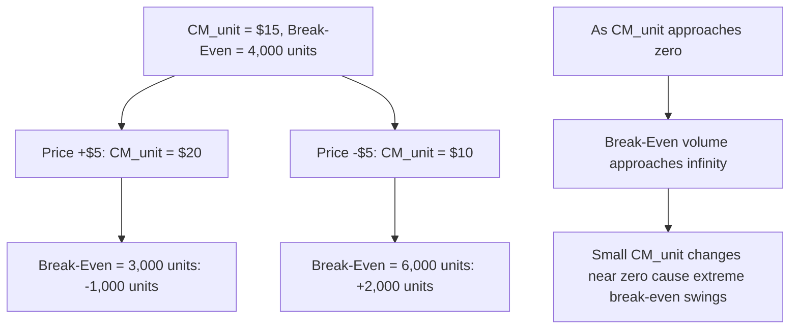

## Sensitivity of Break Even to Price and Cost Changes

### Purpose

This topic examines how the break-even point responds to changes in the three inputs that determine it — selling price, variable cost per unit, and fixed costs — treated individually and in combination. Because $CM_{unit}$ and $CM\%$ are both derived from price and variable cost, changes to either input propagate through the break-even formula nonlinearly in some cases, even though the underlying CVP model is linear in volume.

### The Break-Even Formula as the Object of Sensitivity Analysis

$$Q^*=\frac{FixedCosts}{CM_{unit}}=\frac{FixedCosts}{Price-VariableCost_{unit}}$$

Because $CM_{unit}$ sits in the denominator, break-even volume is **inversely** related to $CM_{unit}$ — and by extension, inversely related to price increases and cost decreases, but *directly* related to fixed cost increases (which sit in the numerator).

### Effect of Fixed Cost Changes

Fixed costs enter the numerator directly, so their effect on break-even is linear and straightforward:

$$\Delta Q^*=\frac{\Delta FixedCosts}{CM_{unit}}$$

**Key Points**

- A $1 increase in fixed costs always raises break-even volume by exactly $1/CM_{unit}$ units, regardless of the current volume level — this relationship is constant across the relevant range.
- Fixed cost changes are the most predictable of the three sensitivity drivers because they act as a simple additive shift in the numerator, with no interaction effects on $CM_{unit}$ itself.

**Example**

At $CM_{unit}=\$20$, a $40,000 increase in fixed costs (e.g., from opening a new facility) raises break-even by $\$40{,}000/\$20=2{,}000$ units — a direct, easily communicated impact.

### Effect of Price Changes

Because price is one of the two components of $CM_{unit}$, a price change affects break-even through its effect on the denominator — making the relationship **inverse and nonlinear** (a proportionally larger effect at lower starting $CM_{unit}$ values).

$$Q^*_{new}=\frac{FixedCosts}{(Price+\Delta Price)-VariableCost_{unit}}$$

**Worked Example**

Base case: Price = $40, Variable cost = $25 ($CM_{unit}=\$15$), Fixed costs = $60,000.

$$Q^*_{base}=\$60{,}000/\$15=4{,}000\ units$$

**Example**

A $5 price increase (to $45): $CM_{unit,new}=\$45-\$25=\$20$.

$$Q^*_{new}=\$60{,}000/\$20=3{,}000\ units$$

A $5 price *decrease* (to $35): $CM_{unit,new}=\$35-\$25=\$10$.

$$Q^*_{new}=\$60{,}000/\$10=6{,}000\ units$$

Note the asymmetry: a $5 increase lowered break-even by 1,000 units, but a $5 decrease of the same magnitude raised break-even by 2,000 units — a direct consequence of $CM_{unit}$ appearing in the denominator. Equal-magnitude price changes do **not** produce equal-magnitude break-even changes in opposite directions; the effect is more severe on the downside as $CM_{unit}$ shrinks toward zero.

### Effect of Variable Cost Changes

Variable cost per unit also affects $CM_{unit}$, with the **opposite sign** of a price change (an increase in variable cost *lowers* $CM_{unit}$, just as a price decrease does), and the same nonlinear, asymmetric sensitivity pattern applies.

$$Q^*_{new}=\frac{FixedCosts}{Price-(VariableCost_{unit}+\Delta VariableCost)}$$

**Example**

Using the same base case ($CM_{unit}=\$15$, break-even = 4,000 units): a $5 *increase* in variable cost (to $30) drops $CM_{unit}$ to $10, raising break-even to 6,000 units — mathematically identical in effect to the $5 price decrease shown above, since both reduce $CM_{unit}$ by the same $5 amount.

### Visual: Asymmetric Sensitivity Near a Thin Margin

**Key Points**

- As $CM_{unit}$ approaches zero (price approaches variable cost), the break-even point approaches infinity — a company with a very thin margin is extremely sensitive to small further erosions in price or cost, since the denominator is shrinking toward zero.
- This asymmetry means businesses with already-thin contribution margins face disproportionately larger break-even swings from adverse price or cost changes than businesses with healthy margins facing the same dollar-magnitude change.
- Conversely, businesses with strong $CM_{unit}$ have more "cushion" — the same dollar change in price or cost produces a proportionally smaller swing in break-even volume.

### Combined and Interacting Changes

When price, variable cost, and fixed costs change simultaneously, their effects on break-even do not simply add — because $CM_{unit}$ itself is recalculated from the new price and variable cost before being divided into the new fixed costs.

**Example**

Base case: Price $40, Variable cost $25 ($CM_{unit}=\$15$), Fixed costs $60,000, break-even = 4,000 units.

Suppose simultaneously: price rises $3 (to $43), variable cost rises $1 (to $26), and fixed costs rise $9,000 (to $69,000):

$$CM_{unit,new}=\$43-\$26=\$17$$

$$Q^*_{new}=\$69{,}000/\$17\approx4{,}059\ units$$

Despite a price *increase*, the break-even point still rose slightly (from 4,000 to ~4,059 units), because the fixed cost increase and the variable cost increase together outweighed the modest CM$_{unit}$ improvement. This illustrates why each input must be evaluated jointly rather than assuming a price increase alone guarantees a lower break-even point.

### Percentage Sensitivity Summary Table

| Change | Direction of Effect on $CM_{unit}$ | Direction of Effect on Break-Even Volume |
| --- | --- | --- |
| Price increase | Increases | Decreases |
| Price decrease | Decreases | Increases (disproportionately as $CM_{unit}$ shrinks) |
| Variable cost increase | Decreases | Increases (disproportionately as $CM_{unit}$ shrinks) |
| Variable cost decrease | Increases | Decreases |
| Fixed cost increase | No effect | Increases (linear/proportional) |
| Fixed cost decrease | No effect | Decreases (linear/proportional) |

### Practical Use in Decision-Making

**Key Points**

- **Pricing decisions**: Before finalizing a price cut to stimulate volume, sensitivity analysis quantifies exactly how much additional volume would be needed just to maintain the *same* total contribution margin as before the cut — a useful check against assuming a price cut is automatically beneficial.
- **Cost negotiation leverage**: Knowing how sensitive break-even is to variable cost changes helps quantify the value of a supplier negotiation or an efficiency initiative in break-even-volume terms, not just in raw dollar savings.
- **Risk flagging for thin-margin products**: Products or business lines with a low $CM_{unit}$ relative to price warrant closer monitoring, since the same-sized adverse price or cost shock produces a larger swing in required volume than for a higher-margin product. [Inference: this is a direct mathematical consequence of the inverse relationship demonstrated above, not a claim about which specific products in practice happen to have thin margins.]
- **Scenario planning / stress testing**: Building a small sensitivity table (as shown above) across plausible price, cost, and fixed-cost scenarios gives decision-makers a range of break-even outcomes rather than a single point estimate, which better reflects real-world uncertainty in these inputs.

### Common Pitfalls

- **Assuming price and variable cost changes of equal dollar magnitude produce mirror-image effects on break-even** — because $CM_{unit}$ sits in the denominator, the effects are asymmetric, especially as $CM_{unit}$ approaches zero.
- **Evaluating price, cost, and fixed cost changes independently when they occur simultaneously** — as shown above, combined changes must be recalculated jointly through $CM_{unit}$, not summed from separately calculated individual effects.
- **Ignoring that a price change may itself trigger a volume change** (price elasticity of demand) — this sensitivity analysis holds volume behaviorally fixed and only recalculates the break-even *threshold*; it does not model how actual demand might respond to the price change itself (see CVP model assumptions and limitations).
- **Failing to check whether a sensitivity scenario pushes volume outside the original relevant range** — a break-even shift large enough to cross a step-fixed-cost threshold invalidates the fixed-cost figure used in the calculation.

### Related Topics

- Break-Even Point in Units
- The CVP Equation and Profit Function
- CVP Model Assumptions and Limitations
- Margin of Safety in Units Dollars and Percentage
- Target Profit Analysis Before Tax
- Operating Leverage and the Degree of Operating Leverage (DOL)