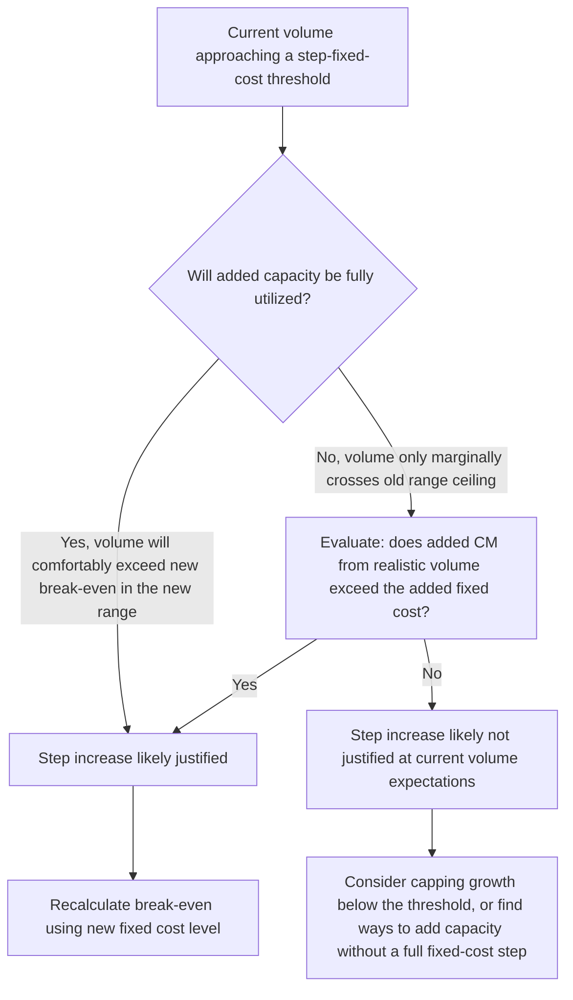

## Break Even Analysis Under Step Fixed Costs

### Definition

Step fixed costs (also called step-variable or semi-fixed costs) are costs that remain constant within a defined volume range but jump to a new, higher level once volume crosses a threshold — for example, adding a second supervisor once headcount exceeds a certain level, or leasing additional warehouse space once production surpasses existing capacity. Standard break-even analysis assumes a single constant fixed cost figure; step fixed costs violate this assumption, requiring break-even to be evaluated separately within each relevant range rather than as one global calculation.

### Why Standard Break-Even Analysis Fails Here

The standard formula assumes one fixed cost value applies at all volumes:

$$Q^*=\frac{FixedCosts}{CM_{unit}}$$

Under step fixed costs, $FixedCosts$ is not a single number but a step function of volume, $FixedCosts(Q)$:

$$FixedCosts(Q)=\begin{cases}F_1 & Q\leq Q_{threshold,1}\\F_2 & Q_{threshold,1}<Q\leq Q_{threshold,2}\\F_3 & Q_{threshold,2}<Q\leq Q_{threshold,3}\\\vdots\end{cases}$$

Because the numerator itself changes depending on which range $Q$ falls into, a single break-even calculation using one fixed-cost figure can produce a **false or misleading answer** if the calculated break-even quantity doesn't actually fall within the relevant range that fixed-cost figure applies to.

### The Piecewise Solution Method

**Key Points**

1. Identify each relevant range and its associated fixed cost level.
2. Calculate a candidate break-even quantity using each range's own fixed cost figure: $Q^*_i=F_i/CM_{unit}$.
3. **Validate** each candidate: check whether the calculated $Q^*_i$ actually falls *within* the volume range that $F_i$ applies to.
4. A candidate is only a **true break-even point** if it passes validation; candidates falling outside their own range are discarded as invalid.
5. It is possible for zero, one, or multiple valid break-even points to exist across the full set of ranges — the piecewise nature of the cost function means the standard "single break-even point" assumption does not automatically hold.

### Worked Example

A company has $CM_{unit}=\$25$ and the following step-fixed-cost structure:

| Relevant Range (units) | Fixed Costs |
| --- | --- |
| 0 – 3,000 | $50,000 |
| 3,001 – 6,000 | $80,000 |
| 6,001 – 9,000 | $120,000 |

**Example**

**Range 1 candidate:** $Q^*_1=\$50{,}000/\$25=2{,}000$ units. Check: is 2,000 within 0–3,000? **Yes** — this is a valid break-even point.

**Range 2 candidate:** $Q^*_2=\$80{,}000/\$25=3{,}200$ units. Check: is 3,200 within 3,001–6,000? **Yes** — this is also a valid break-even point.

**Range 3 candidate:** $Q^*_3=\$120{,}000/\$25=4{,}800$ units. Check: is 4,800 within 6,001–9,000? **No** — 4,800 falls in Range 2, not Range 3. This candidate is **invalid** and discarded.

**Result**: This company has **two** valid break-even points — 2,000 units and 3,200 units — not one. Between these two points (2,000–3,200 units), the company is in a narrow profit zone; above 3,200 up to the next fixed-cost step, it remains profitable; but if volume were to fall within a range where the step-up in fixed costs outpaces the added contribution margin, a second loss zone can reappear at higher volumes.

### Visual: Piecewise Break-Even Across Cost Steps

<svg xmlns="http://www.w3.org/2000/svg" viewBox="0 0 640 380">
<text x="320" y="24" text-anchor="middle" font-size="16" font-weight="bold" fill="#1a1a1a">Break-Even Under Step Fixed Costs (svg_diagram)</text>
<line x1="70" y1="330" x2="610" y2="330" stroke="#333" stroke-width="1.5" />
<line x1="70" y1="50" x2="70" y2="330" stroke="#333" stroke-width="1.5" />
<text x="600" y="350" font-size="12" fill="#1a1a1a">Q (units)</text>
<text x="20" y="55" font-size="12" fill="#1a1a1a">$</text>
<line x1="70" y1="260" x2="270" y2="260" stroke="#c9302c" stroke-width="2.5" />
<line x1="270" y1="260" x2="270" y2="210" stroke="#c9302c" stroke-width="1" stroke-dasharray="3,3" />
<line x1="270" y1="210" x2="450" y2="210" stroke="#c9302c" stroke-width="2.5" />
<line x1="450" y1="210" x2="450" y2="140" stroke="#c9302c" stroke-width="1" stroke-dasharray="3,3" />
<line x1="450" y1="140" x2="610" y2="140" stroke="#c9302c" stroke-width="2.5" />
<text x="500" y="130" font-size="11" fill="#c9302c">Step Fixed Cost</text>
<line x1="70" y1="330" x2="610" y2="70" stroke="#4a90d9" stroke-width="2.5" />
<text x="500" y="90" font-size="11" fill="#4a90d9">Total Revenue</text>
<circle cx="200" cy="268" r="6" fill="#5cb85c" />
<text x="140" y="290" font-size="10" fill="#5cb85c">Valid BE #1</text>
<circle cx="330" cy="220" r="6" fill="#5cb85c" />
<text x="340" y="215" font-size="10" fill="#5cb85c">Valid BE #2</text>
<line x1="270" y1="335" x2="270" y2="325" stroke="#999" />
<text x="255" y="345" font-size="9" fill="#555">Step 1</text>
<line x1="450" y1="335" x2="450" y2="325" stroke="#999" />
<text x="435" y="345" font-size="9" fill="#555">Step 2</text>
</svg>

### Multiple Break-Even Points: What They Mean Operationally

**Key Points**

- The zone between two valid break-even points is a genuine profit zone; if a step-fixed-cost increase looms just ahead of current volume, the business may be better off deliberately **staying below** that threshold rather than growing into it, if the added fixed cost outweighs the added contribution margin until a much higher volume is reached.
- A "dip back into loss" can occur immediately after a step-fixed-cost increase, if the jump in fixed costs is large relative to the $CM_{unit}$ available to recover it quickly — meaning growing sales can temporarily *reduce* profitability right around a threshold before profitability resumes at higher volume.
- Management decisions about whether to add capacity (and incur the associated step fixed cost) should be evaluated not just on whether the *next unit* is profitable, but on whether *enough total volume* is achievable beyond the new threshold to justify the entire step increase — a marginal analysis, not a simple pass/fail test at the boundary. [Inference: this framing follows directly from the piecewise mechanics shown above, though the specific volume needed to justify a given step depends entirely on that step's own fixed-cost magnitude and the prevailing $CM_{unit}$.]

### Decision Framework for Adding Capacity (New Step)

### Common Pitfalls

- **Using a single break-even formula with one fixed-cost figure when the true cost structure is step-fixed** — this can produce an answer that looks precise but falls in the wrong relevant range, making it operationally meaningless.
- **Assuming exactly one break-even point exists** — as shown above, it is entirely possible to have multiple valid break-even points, zero valid break-even points in a given range, or a "false" break-even candidate that must be discarded.
- **Treating growth right up to a step threshold as unambiguously good** without checking whether the fixed-cost jump just beyond it will (at least temporarily) outpace the incremental contribution margin.
- **Failing to re-validate each candidate break-even point against its own range** — a calculated $Q^*_i$ is only meaningful if it actually falls within range $i$; presenting an out-of-range candidate as a valid break-even point is a direct arithmetic-to-interpretation error.

### Related Topics

- CVP Model Assumptions and Limitations
- Break-Even Point in Units
- High-Low Method and Regression for Mixed Cost Separation
- Constructing the CVP Graph and Break Even Chart
- Sensitivity of Break Even to Price and Cost Changes
- Relevant Range and Cost Behavior Patterns