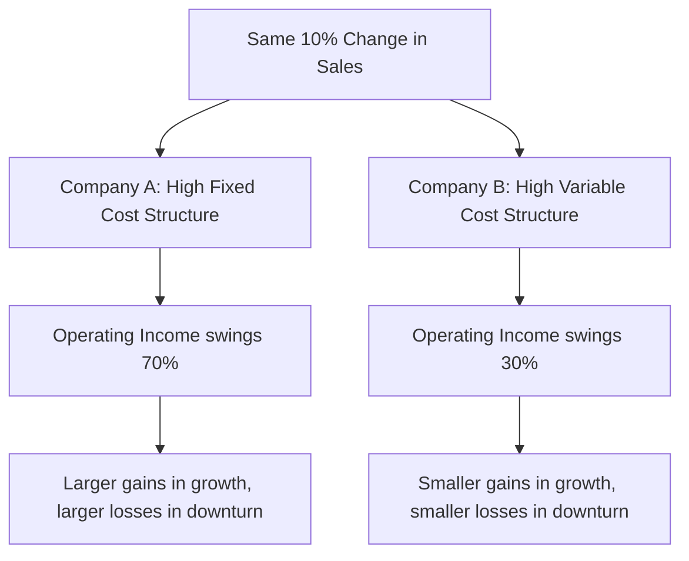

## Definition and Intuition of Operating Leverage

### Definition

Operating leverage describes how a company's mix of fixed and variable costs affects the sensitivity of its operating income to changes in sales volume. A company is said to have **high operating leverage** when a large proportion of its total costs are fixed rather than variable — in this cost structure, a given percentage change in sales produces a *larger* percentage change in operating income. A company with **low operating leverage** (a higher proportion of variable costs) sees operating income move more closely in line with sales, with less amplification in either direction.

Operating leverage is a *structural* property of how a business is built — not a financing or debt-related concept (that is financial leverage, a related but distinct idea).

### The Core Intuition: Fixed Costs Act Like a Lever

**Key Points**

- Fixed costs, once covered, don't grow with additional sales — every dollar of contribution margin from a unit sold beyond break-even flows entirely to operating income, since fixed costs are already "paid for."
- This means a business with high fixed costs (and correspondingly high $CM_{unit}$/$CM\%$, since fixed costs must be recovered from fewer, richer contribution dollars) experiences an *amplified* profit swing for the same unit-volume change compared to a business that instead incurred those costs as variable costs spread proportionally across volume.
- The lever metaphor: like a mechanical lever amplifies force, operating leverage amplifies the effect of a sales change into a larger swing in profit — in both directions. High operating leverage magnifies gains during growth, but equally magnifies losses during downturns.

### Contrasting Two Cost Structures

Consider two companies with identical sales and identical operating income at a given volume, but very different cost structures:

|  | Company A (High Fixed) | Company B (High Variable) |
| --- | --- | --- |
| Sales | $500,000 | $500,000 |
| Variable Costs | $150,000 (30% of sales) | $350,000 (70% of sales) |
| Contribution Margin | $350,000 | $150,000 |
| Fixed Costs | $300,000 | $100,000 |
| Operating Income | $50,000 | $50,000 |

**Example**

Both companies currently earn the same $50,000 operating income on the same $500,000 in sales. But their cost *structures* are opposite: Company A relies heavily on fixed costs (high operating leverage), while Company B relies heavily on variable costs (low operating leverage). This structural difference means the two companies will respond very differently to the exact same percentage change in sales volume — the topic explored below.

### What Happens When Sales Change

**Example**

Suppose sales rise 10% for both companies (to $550,000), with the same cost structure percentages applying to the new sales level:

**Company A (High Fixed):**

- New variable costs: $550{,}000\times0.30=\$165{,}000$
- New contribution margin: $\$550{,}000-\$165{,}000=\$385{,}000$
- New operating income: $\$385{,}000-\$300{,}000=\$85{,}000$
- **% change in operating income**: $(\$85{,}000-\$50{,}000)/\$50{,}000=70\%$

**Company B (High Variable):**

- New variable costs: $550{,}000\times0.70=\$385{,}000$
- New contribution margin: $\$550{,}000-\$385{,}000=\$165{,}000$
- New operating income: $\$165{,}000-\$100{,}000=\$65{,}000$
- **% change in operating income**: $(\$65{,}000-\$50{,}000)/\$50{,}000=30\%$

A 10% increase in sales produced a **70% increase** in operating income for Company A, but only a **30% increase** for Company B — the same sales change, amplified very differently depending purely on cost structure.

### The Same Amplification Works in Reverse

**Example**

If instead sales *fell* 10% (to $450,000) for both companies:

**Company A:** New CM = $450{,}000\times0.70=\$315{,}000$; New operating income = $\$315{,}000-\$300{,}000=\$15{,}000$ — a **70% decrease** from the original $50,000.

**Company B:** New CM = $450{,}000\times0.30=\$135{,}000$; New operating income = $\$135{,}000-\$100{,}000=\$35{,}000$ — only a **30% decrease** from the original $50,000.

Company A's high operating leverage cuts both ways: it delivered a much larger profit *increase* on the upside, but also a much larger profit *decrease* on the downside, for the identical 10% sales swing.

### Visual: Amplification Under High vs. Low Operating Leverage

### Why This Happens: The Mechanical Explanation

**Key Points**

- Because fixed costs don't change with volume, they act as a "hurdle" that must be cleared before any profit is generated — once cleared, *all* additional contribution margin becomes pure profit, with no offsetting cost growth to dilute it.
- A high-fixed-cost structure typically implies a high $CM\%$ (since a business built around fixed infrastructure, like manufacturing plants or capital equipment, tends to have low variable cost per unit relative to price) — and a high $CM\%$ means each incremental sales dollar contributes more directly to profit.
- Conversely, a high-variable-cost structure implies a low $CM\%$ — a smaller portion of each incremental sales dollar reaches the profit line, since more of it is consumed by costs that scale with volume, dampening the swing in either direction.
- This is why operating leverage is often described as "profit sensitivity to volume" — it captures how much *more* (or less) than proportionally profit responds to a change in sales, driven entirely by the underlying cost structure.

### Real-World Intuition: Examples of Cost Structure Extremes

**Key Points**

- **High operating leverage businesses** (illustrative, not exhaustive): capital-intensive manufacturing, airlines, software companies with high upfront development costs and low marginal delivery cost, hotels — businesses where a large investment in fixed capacity/infrastructure must be covered regardless of volume sold.
- **Low operating leverage businesses**: businesses paying primarily on a per-unit or commission basis for labor and materials, such as certain retail or distribution operations, where costs scale closely with each unit sold.
- [Inference: these are illustrative general patterns based on typical cost structures in these industries; any specific company's actual operating leverage depends on its own particular mix of fixed and variable costs and should not be assumed purely from industry category.]

### Common Pitfalls

- **Confusing operating leverage with financial leverage** — operating leverage concerns the fixed/variable *cost* structure of the business; financial leverage concerns the use of debt financing and its effect on returns to equity. The two are related in overall risk exposure but are mechanically distinct concepts.
- **Assuming high operating leverage is inherently "good" or "bad"** — it is a double-edged structural characteristic: it amplifies profit in growth and amplifies loss in decline; whether it benefits a company depends on the direction and reliability of expected sales trends, not on the leverage figure alone.
- **Believing two companies with identical current operating income have identical risk profiles** — as the worked example shows, identical current profit can mask very different underlying sensitivity to future sales changes.
- **Treating operating leverage as a fixed, unchanging company attribute** — a company's cost structure (and therefore its operating leverage) can shift over time as it automates processes, changes its labor model, or alters its fixed infrastructure investment, meaning operating leverage should be reassessed periodically rather than assumed constant.

### Related Topics

- Operating Leverage and the Degree of Operating Leverage (DOL)
- The Contribution Margin Ratio
- Margin of Safety in Units Dollars and Percentage
- Fixed Cost Behavior and the Relevant Range
- Financial Leverage and Combined Leverage
- CVP Model Assumptions and Limitations