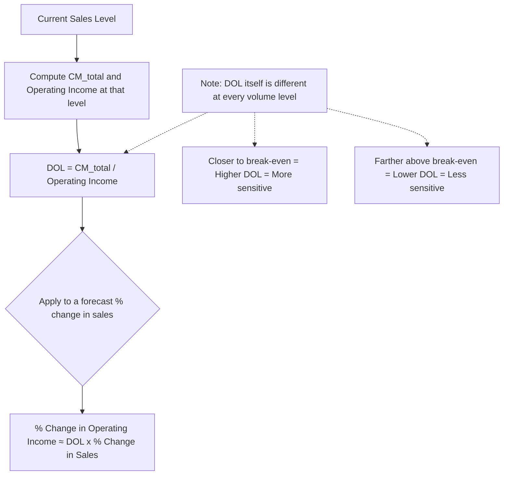

## The Degree of Operating Leverage Formula

### Definition

The Degree of Operating Leverage (DOL) is a numerical measure of how sensitive operating income is to a change in sales, at a specific volume level. It quantifies the "amplification factor" described conceptually in the previous topic — precisely how many percentage points operating income moves for each 1% change in sales, at a given starting point.

### The Formula

$$DOL=\frac{\%\Delta OperatingIncome}{\%\Delta Sales}$$

This is the foundational definition, but it requires observing two different sales levels to calculate directly. A more practical, single-point formula is derived from the CVP profit equation:

$$DOL=\frac{ContributionMargin}{OperatingIncome}$$

Both formulas produce the same result; the second is preferred in practice because it requires only *one* period's data (CM and operating income), rather than requiring a before-and-after comparison.

### Derivation: Why CM/Operating Income Works

Starting from the percentage-change definition and the CVP profit equation $\pi=CM_{unit}\cdot Q-FixedCosts$:

$$\%\Delta OperatingIncome=\frac{\Delta\pi}{\pi}=\frac{CM_{unit}\cdot\Delta Q}{\pi}$$

$$\%\Delta Sales=\frac{\Delta Q}{Q}$$

$$DOL=\frac{CM_{unit}\cdot\Delta Q/\pi}{\Delta Q/Q}=\frac{CM_{unit}\cdot Q}{\pi}=\frac{CM_{total}}{\pi}$$

**Key Points**

- Because fixed costs are constant, $\Delta FixedCosts=0$, meaning the *entire* change in operating income comes from the change in contribution margin — this is why $CM_{total}$ (not sales or any other figure) appears in the numerator of the simplified formula.
- $\Delta Q$ cancels out of the ratio entirely, which is why DOL can be computed from a single period's CM and operating income without needing to observe an actual sales change.
- DOL is always evaluated **at a specific volume/sales level** — because fixed costs stay constant while CM grows with volume, the *ratio* $CM/OperatingIncome$ itself changes as volume changes, meaning DOL is not a single fixed number for a company but a value that shifts depending on where the company currently operates relative to its break-even point.

### Worked Example

A company has: Sales = $400,000, Variable costs = $240,000, Fixed costs = $120,000.

$$CM_{total}=\$400{,}000-\$240{,}000=\$160{,}000$$

$$OperatingIncome=\$160{,}000-\$120{,}000=\$40{,}000$$

$$DOL=\$160{,}000/\$40{,}000=4.0$$

### Interpreting the DOL Value

**Key Points**

- A $DOL=4.0$ means: at this specific sales level, a 1% change in sales produces approximately a 4% change in operating income (in the same direction).
- The relationship applies to any percentage change, not just 1%: $\%\Delta OperatingIncome\approx DOL\times\%\Delta Sales$.
- $DOL$ is always $\geq1$ for a company with positive fixed costs and positive operating income — the minimum value of 1 corresponds to zero fixed costs (operating income changes exactly proportionally with sales, no amplification); higher fixed costs (relative to operating income) push DOL higher.
- A company operating very close to its break-even point will have a very high DOL (approaching infinity as operating income approaches zero), since a small operating income in the denominator produces a large ratio — this reflects genuinely higher risk/sensitivity near break-even, not a calculation artifact. [Inference: this extreme sensitivity near break-even is a direct mathematical property of the formula, and correspondingly reflects real economic sensitivity, since a company that close to break-even genuinely would see very large percentage swings in profit from small sales changes.]

### Applying DOL to Forecast Profit Changes

**Example**

Using the company above ($DOL=4.0$, current operating income = $40,000), if sales are forecast to grow by 8%:

$$\%\Delta OperatingIncome\approx4.0\times8\%=32\%$$

$$NewOperatingIncome\approx\$40{,}000\times(1+0.32)=\$52{,}800$$

**Verification via full recalculation:** New sales = $\$400{,}000\times1.08=\$432{,}000$. At a constant 60% variable cost ratio, new variable costs = $\$432{,}000\times0.60=\$259{,}200$. New CM = $\$432{,}000-\$259{,}200=\$172{,}800$. New operating income = $\$172{,}800-\$120{,}000=\$52{,}800$ ✓ — confirming the DOL shortcut matches the full recalculation exactly (within the linear CVP model).

### Visual: DOL as a Volume-Dependent Multiplier

### How DOL Changes as Volume Moves Away From Break-Even

| Sales Level | Operating Income | DOL | Interpretation |
| --- | --- | --- | --- |
| Just above break-even | Small, near $0 | Very high (e.g., 15+) | Extremely sensitive to sales swings |
| Moderately above break-even | Moderate | Moderate (e.g., 3–5) | Meaningfully leveraged |
| Well above break-even | Large | Approaches 1 as volume grows very large | Diminishing amplification effect |

**Key Points**

- As sales volume grows further above break-even, operating income grows faster than contribution margin's fixed relationship to it would initially suggest, causing the DOL ratio to *decline* toward (but never quite reach) 1 — the amplification effect is strongest near break-even and weakens as the company operates with a larger profit cushion.
- This means a single company's DOL is best understood as a *snapshot* at a specific point in its operating range, not a permanent characteristic — the same company could report a DOL of 8 in a slow quarter and a DOL of 2.5 in a strong quarter, purely due to where operating income happened to fall in each period, without any change to its actual fixed/variable cost structure.
- Because of this volume-dependence, comparing DOL figures across two companies (or two periods) is only meaningful if the comparison also accounts for how far each is operating above its own break-even point — a low DOL is not automatically "safer" if it simply reflects a company already operating at very high volume relative to its break-even.

### Common Pitfalls

- **Treating DOL as a fixed, permanent company characteristic** rather than a value computed at a specific sales level that changes as volume changes.
- **Applying the DOL shortcut formula ($\%\Delta OperatingIncome\approx DOL\times\%\Delta Sales$) across large percentage changes** without recognizing this is a local approximation most accurate for relatively small changes in volume within the same relevant range — very large swings may cross into a different DOL value or violate CVP linearity assumptions (see CVP model assumptions and limitations).
- **Confusing DOL with the degree of financial leverage (DFL) or combined leverage** — DOL isolates the effect of the fixed/variable *operating* cost structure only; it does not include the effects of interest expense or capital structure, which are captured separately by DFL.
- **Computing DOL near or below break-even without recognizing the formula's instability there** — as operating income approaches zero, DOL approaches infinity, and just below break-even (a loss), DOL becomes negative, which requires careful interpretation rather than being read at face value as "amplification."

### Related Topics

- Definition and Intuition of Operating Leverage
- Margin of Safety in Units Dollars and Percentage
- The Contribution Margin Ratio
- Financial Leverage and Combined Leverage
- CVP Model Assumptions and Limitations
- Sensitivity Analysis in CVP Modeling