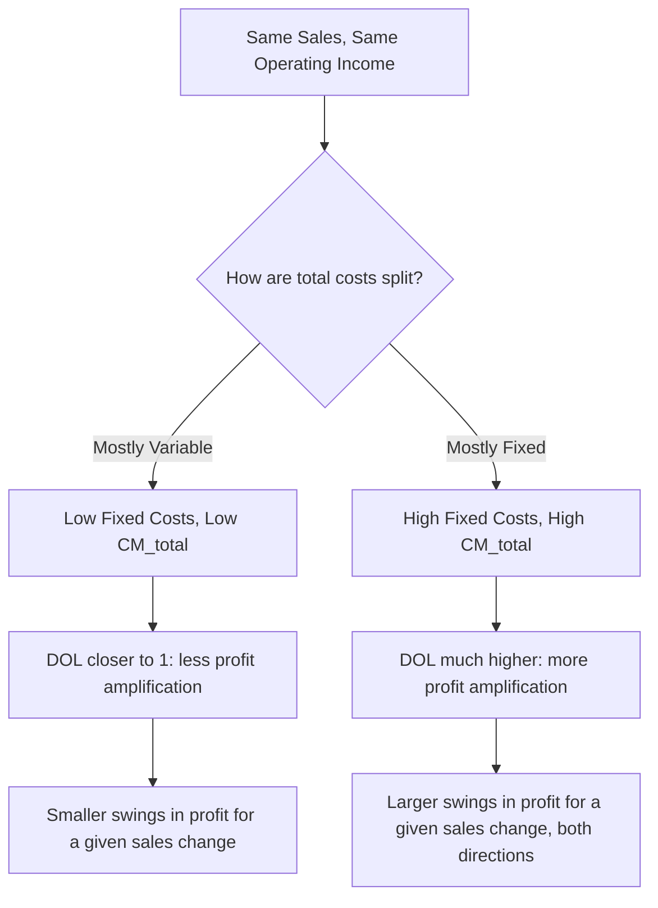

## Cost Structure as a Driver of DOL Magnitude

### Purpose

This topic isolates how a company's underlying mix of fixed versus variable costs — its **cost structure** — mechanically drives the magnitude of its Degree of Operating Leverage (DOL), holding sales revenue constant. Where the prior DOL topic established the formula and how to interpret a given DOL value, this topic examines *why* two companies with identical sales can have very different DOL figures purely because of how their total costs are divided between fixed and variable components.

### The Structural Link Between Cost Mix and DOL

Recall the DOL formula:

$$DOL=\frac{CM_{total}}{OperatingIncome}=\frac{CM_{total}}{CM_{total}-FixedCosts}$$

This rearranged form makes the driver explicit: DOL is a function of $CM_{total}$ relative to $FixedCosts$ (since $OperatingIncome=CM_{total}-FixedCosts$). At a fixed sales level, a company that has shifted more of its total costs into the "fixed" category (raising $CM_{total}$ relative to variable costs, but also raising $FixedCosts$) will show a higher DOL — because operating income becomes a *smaller residual* relative to CM, and DOL's denominator shrinks relative to its numerator.

**Key Points**

- Holding operating income constant, a higher $CM_{total}$ (achieved by shifting cost structure toward fixed costs) mechanically increases DOL, since $CM_{total}$ is DOL's numerator.
- This is a structural, not a volume, effect — it is entirely about *how* a given level of total cost is classified (fixed vs. variable), not about how much revenue or volume the company achieves.
- Two companies can have identical revenue, identical total costs, and identical operating income, yet report very different DOL values purely because one has organized its cost base with a higher proportion of fixed costs than the other.

### Worked Example: Same Revenue and Profit, Different Cost Structure

Two companies each generate $600,000 in sales and $60,000 in operating income, but structure their costs differently:

|  | Company Low-Fix | Company High-Fix |
| --- | --- | --- |
| Sales | $600,000 | $600,000 |
| Variable Costs | $480,000 (80% of sales) | $180,000 (30% of sales) |
| Contribution Margin | $120,000 | $420,000 |
| Fixed Costs | $60,000 | $360,000 |
| Operating Income | $60,000 | $60,000 |
| **DOL** | $120,000/$60,000 = **2.0** | $420,000/$60,000 = **7.0** |

**Example**

Both companies earn identical $60,000 profit on identical $600,000 sales. But Company High-Fix has organized its cost base with far more fixed cost (60% of total costs) versus Company Low-Fix (barely 11% of total costs fixed). The result: Company High-Fix's DOL of 7.0 means a 1% sales change produces roughly a 7% operating income swing, versus only about 2% for Company Low-Fix — a direct structural consequence of how each company chose to build (or was forced to build) its cost base, with no difference whatsoever in current revenue or profit.

### Visual: How Shifting the Fixed/Variable Split Moves DOL

### Mechanisms That Shift Cost Structure (and Therefore DOL)

**Key Points**

- **Automation / capital investment**: Replacing variable labor cost with fixed equipment/depreciation cost raises the fixed cost base and typically raises $CM\%$ simultaneously (since the labor cost removed was variable), pushing DOL higher.
- **Outsourcing**: Moving production to a third party that charges per-unit (converting a fixed in-house cost structure into a variable per-unit fee) lowers fixed costs and lowers DOL — the opposite direction from automation.
- **Compensation structure**: Shifting sales staff from salary (fixed) to commission-only (variable) lowers fixed costs and DOL; the reverse shift raises both.
- **Leasing vs. buying**: A long-term fixed lease commitment raises fixed costs (and DOL) relative to a flexible, usage-based rental arrangement that scales with volume.
- **Make-or-buy and capacity decisions generally** sit at the center of deliberate DOL management — a company can, within limits, choose to reshape its own operating leverage by restructuring which costs are fixed versus variable, independent of any change in sales strategy.

### Quantifying a Structural Shift's Effect on DOL

**Example**

Suppose Company Low-Fix (DOL = 2.0 above) automates a portion of its production, converting $40,000 of variable cost into $40,000 of new fixed cost (e.g., replacing hourly labor with a leased machine), with total costs and operating income at the current $600,000 sales level otherwise unchanged in total:

New variable costs: $\$480{,}000-\$40{,}000=\$440{,}000$

New CM: $\$600{,}000-\$440{,}000=\$160{,}000$

New fixed costs: $\$60{,}000+\$40{,}000=\$100{,}000$

New operating income: $\$160{,}000-\$100{,}000=\$60{,}000$ (unchanged, by construction)

New DOL: $\$160{,}000/\$60{,}000\approx2.67$

The automation shift raised DOL from 2.0 to approximately 2.67 at the *same* sales and profit level — purely by reclassifying $40,000 of cost from variable to fixed. This is the mechanical link in action: no change in revenue, no change in current profitability, but a meaningfully higher sensitivity to future sales swings in either direction.

### The Trade-Off: Why Companies Don't Always Minimize DOL

**Key Points**

- Fixed-cost-heavy structures (automation, owned capital equipment) often come with a **lower variable cost per unit** and **higher $CM\%$** — meaning that *if* volume grows, profit grows disproportionately faster than it would under a variable-heavy structure, which is precisely the upside operating leverage offers to a growing business.
- The decision to raise or lower DOL through cost-structure choices is therefore a genuine risk/reward trade-off: higher DOL offers greater profit upside in favorable conditions but greater downside exposure in unfavorable ones, and the "right" structure depends on management's confidence in future sales trends and risk tolerance. [Unverified: what constitutes an appropriate DOL target is a matter of company-specific strategic judgment and risk appetite, not a fixed technical benchmark that applies uniformly across situations.]
- Industries with high demand predictability and expected sustained growth may rationally favor higher-DOL structures (locking in fixed costs to capture greater upside), while industries facing volatile or uncertain demand may rationally favor lower-DOL structures (variable costs) specifically to limit downside exposure during downturns. [Inference: this is a commonly cited strategic rationale for cost-structure choices, though a specific company's actual decision also depends on factors like capital availability, competitive dynamics, and operational feasibility beyond DOL considerations alone.]

### Common Pitfalls

- **Assuming a high DOL is evidence of poor cost management** — DOL is a structural characteristic reflecting a deliberate (or historically inherited) fixed/variable cost mix, not necessarily an indicator of inefficiency; a well-run capital-intensive business can have a legitimately high DOL by design.
- **Comparing DOL across companies in different industries as if it reflects operational quality** — cost structure (and therefore baseline DOL) varies enormously by industry and business model; DOL is more meaningful compared within a company over time or against close industry peers with similar structures.
- **Overlooking that a cost-structure shift changes DOL even when current profit is completely unchanged** — as the worked example shows, reclassifying costs without altering total profit still materially changes the company's sensitivity to future sales swings, a risk dimension that isn't visible from the income statement alone at a single point in time.
- **Treating cost-structure decisions (e.g., automation) as driven only by cost-savings potential** without also weighing the resulting change in DOL and the associated shift in profit volatility exposure.

### Related Topics

- The Degree of Operating Leverage Formula
- Definition and Intuition of Operating Leverage
- Fixed Cost Behavior and the Relevant Range
- Variable Costing versus Absorption Costing
- The Contribution Margin Ratio
- Financial Leverage and Combined Leverage