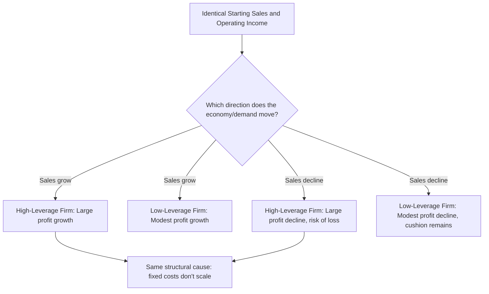

## High Operating Leverage versus Low Operating Leverage Firms

### Overview

Building on the mechanics of DOL and its cost-structure driver, this topic compares high- and low-operating-leverage firms holistically — across profit sensitivity, risk exposure, break-even characteristics, and the business conditions under which each structure tends to perform better or worse. Where prior topics established the formulas, this topic synthesizes them into a comparative framework for evaluating and choosing between these two firm archetypes.

### Defining Characteristics Side-by-Side

| Characteristic | High Operating Leverage Firm | Low Operating Leverage Firm |
| --- | --- | --- |
| Cost structure | Fixed costs are a large proportion of total costs | Variable costs are a large proportion of total costs |
| Contribution margin ratio ($CM\%$) | Typically high | Typically low |
| Break-even point (in dollars, relative to capacity) | Higher, since more fixed cost must be recovered | Lower, since less fixed cost must be recovered |
| Margin of safety (at a given sales level) | Typically narrower | Typically wider |
| DOL | High (often well above 2–3) | Low (closer to 1) |
| Profit sensitivity to sales changes | High — amplified swings, both directions | Low — dampened swings, both directions |
| Typical capital intensity | High (equipment, facilities, technology infrastructure) | Low (labor- or commission-based cost model) |

### Behavior in a Sales Upturn

**Key Points**

- A high-leverage firm captures a disproportionately large share of incremental sales as profit, since fixed costs don't grow with volume and most of each new sales dollar's contribution margin (already a high $CM\%$) flows straight to operating income.
- A low-leverage firm still becomes more profitable as sales rise, but the gain is more modest per dollar of sales growth, since a larger share of each new dollar is consumed by variable costs that scale with volume.
- This is why high-operating-leverage businesses are often associated with the potential for rapid profit growth during expansion phases — the same revenue growth translates into materially larger operating income growth than a low-leverage peer would see. [Inference: this describes the mechanical tendency under the standard linear CVP model; actual realized profit growth in practice also depends on whether fixed capacity is sufficient to handle the added volume without requiring a new step-fixed-cost increase.]

### Behavior in a Sales Downturn

**Key Points**

- A high-leverage firm's operating income falls disproportionately fast during a downturn, since fixed costs remain fully in place regardless of the volume decline — there is no natural cost reduction to cushion the profit impact.
- A low-leverage firm's costs shrink roughly in proportion to the sales decline (since most costs are variable), providing a natural buffer that partially protects operating income even as revenue falls.
- This asymmetric downside exposure is the central risk trade-off of high operating leverage: the same structural feature that amplifies upside profit growth equally amplifies downside profit erosion, and in a sustained or severe downturn, a high-leverage firm can move from solid profitability into losses much faster than a low-leverage firm facing the identical percentage sales decline.

### Worked Comparative Example

Two firms, each currently earning $80,000 operating income on $800,000 in sales, face an identical 15% sales decline (a recession scenario):

|  | High-Leverage Firm ($CM\%=50\%$) | Low-Leverage Firm ($CM\%=20\%$) |
| --- | --- | --- |
| Original Sales | $800,000 | $800,000 |
| Original CM | $400,000 | $160,000 |
| Fixed Costs | $320,000 | $80,000 |
| Original Operating Income | $80,000 | $80,000 |
| New Sales (−15%) | $680,000 | $680,000 |
| New CM | $340,000 | $136,000 |
| New Operating Income | $340,000−$320,000=**$20,000** | $136,000−$80,000=**$56,000** |
| **% Decline in Operating Income** | **75%** | **30%** |

**Example**

Both firms start from identical revenue and identical profit, but face the recession very differently. The high-leverage firm's profit collapses by 75% (from $80,000 to $20,000), while the low-leverage firm's profit declines by a much more moderate 30% (from $80,000 to $56,000) — despite both experiencing the exact same 15% sales decline. This is the downside expression of the same amplification that would have favored the high-leverage firm in a growth scenario.

### Visual: Divergent Paths Under Growth vs. Downturn

### When Each Structure Tends to Be Favored

**Key Points**

- **High operating leverage tends to suit**: businesses with strong confidence in sustained or growing demand, industries where scale economies from fixed infrastructure provide a durable competitive advantage, and situations where management has the capital and risk tolerance to absorb potential downside volatility in exchange for greater upside participation.
- **Low operating leverage tends to suit**: businesses facing uncertain, cyclical, or unpredictable demand, early-stage or capital-constrained companies that cannot safely commit to large fixed costs, and situations where capital preservation and downside protection are prioritized over maximizing upside participation in a potential growth scenario.
- Neither structure is universally superior — the appropriate choice is contingent on a firm's specific demand outlook, risk tolerance, capital access, and competitive environment, and firms can and do deliberately shift their structure over time via the mechanisms discussed in the prior topic (automation, outsourcing, compensation model changes). [Unverified: the "correct" operating leverage level for a specific real firm is a strategic judgment call dependent on numerous firm- and industry-specific factors well beyond the CVP framework alone.]

### Combining with Margin of Safety for a Fuller Risk Picture

**Key Points**

- High-leverage firms typically have a **narrower margin of safety** at a given sales level (since higher fixed costs raise the break-even point), compounding the downside risk illustrated above — not only does profit fall faster percentage-wise, but the firm may also be operating closer to the point where it falls into an outright loss.
- Evaluating a firm's risk profile benefits from looking at DOL and margin of safety together, rather than either metric in isolation — a high DOL combined with a thin margin of safety signals meaningfully more downside exposure than a high DOL firm that nonetheless maintains a large cushion above its break-even point.
- This combined view is often more informative for risk assessment than DOL alone, since DOL only describes *sensitivity*, while margin of safety describes *how much room* exists before that sensitivity actually produces a loss.

### Common Pitfalls

- **Treating "high operating leverage" as synonymous with "risky business" without context** — high leverage is only clearly risky when combined with uncertain or declining demand; in a firm confident of stable or growing sales, the same structure is a source of profit acceleration rather than primarily a risk.
- **Comparing DOL or leverage classification across firms in different industries as a quality signal** — cost structure baselines differ enormously by industry and business model, making cross-industry DOL comparisons more misleading than informative without controlling for industry norms.
- **Assuming operating leverage is a fixed, permanent trait of a firm** — as discussed in the prior topic, firms actively make choices (automation, outsourcing, compensation structure) that shift their leverage profile over time; a firm's current classification as "high" or "low" leverage can and does change.
- **Focusing only on the upside amplification of high leverage while planning growth strategy, without equally weighing the downside amplification if the growth thesis doesn't materialize** — the same mechanism produces both effects, and prudent planning considers both scenarios, not just the favorable one.

### Related Topics

- The Degree of Operating Leverage Formula
- Cost Structure as a Driver of DOL Magnitude
- Margin of Safety in Units Dollars and Percentage
- Definition and Intuition of Operating Leverage
- Financial Leverage and Combined Leverage
- CVP Model Assumptions and Limitations