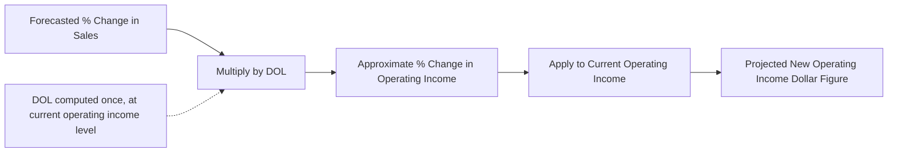

## Interpreting DOL as a Percentage Change Multiplier

### The Core Interpretation

DOL's primary practical use is as a multiplier that converts a forecasted percentage change in sales into a forecasted percentage change in operating income:

$$\%\Delta OperatingIncome\approx DOL\times\%\Delta Sales$$

This topic focuses specifically on how to apply and interpret this multiplier relationship correctly — its mechanics, its accuracy boundaries, and how to translate its output into concrete dollar forecasts.

### Mechanics of the Multiplier Relationship

**Key Points**

- $DOL$ acts exactly like an amplification factor: if $DOL=3.5$, a 4% increase in sales translates to an approximate $3.5\times4\%=14\%$ increase in operating income; a 4% decrease in sales translates to an approximate 14% decrease in operating income.
- The multiplier applies **symmetrically** in both directions at a given DOL value — the same DOL used to project a sales increase's effect also projects a sales decrease's effect, with the sign simply flipping to match the direction of the sales change.
- Because $DOL$ itself is a snapshot computed at the company's *current* operating income level, the multiplier is most accurate for changes starting from that same point — it is a **local** sensitivity measure, not a universal constant across all possible volume levels (see prior topic on DOL behavior near break-even for the volume-dependence of DOL itself).

### Step-by-Step Application

1. Compute DOL at the current sales/operating income level: $DOL=CM_{total}/OperatingIncome$.
2. Identify the forecasted percentage change in sales.
3. Multiply: $\%\Delta OperatingIncome\approx DOL\times\%\Delta Sales$.
4. Apply that percentage to current operating income to get the projected new dollar figure: $NewOperatingIncome\approx CurrentOperatingIncome\times(1+\%\Delta OperatingIncome)$.

### Worked Example

A company has: Sales = $900,000, Variable costs = $540,000, Fixed costs = $270,000.

$$CM_{total}=\$900{,}000-\$540{,}000=\$360{,}000$$

$$OperatingIncome=\$360{,}000-\$270{,}000=\$90{,}000$$

$$DOL=\$360{,}000/\$90{,}000=4.0$$

**Example**

**Scenario A — 12% sales increase forecast:**

$$\%\Delta OperatingIncome\approx4.0\times12\%=48\%$$

$$NewOperatingIncome\approx\$90{,}000\times1.48=\$133{,}200$$

**Scenario B — 6% sales decrease forecast:**

$$\%\Delta OperatingIncome\approx4.0\times(-6\%)=-24\%$$

$$NewOperatingIncome\approx\$90{,}000\times(1-0.24)=\$68{,}400$$

The same DOL value of 4.0 serves as the multiplier for both an upside and a downside scenario — this dual applicability is what makes DOL a compact tool for quick two-sided sensitivity forecasting from a single computed figure.

### Verifying the Multiplier Against a Full Recalculation

**Example**

Checking Scenario A via the full CVP equation: new sales = $\$900{,}000\times1.12=\$1{,}008{,}000$. At the same 60% variable cost ratio, new variable costs = $\$1{,}008{,}000\times0.60=\$604{,}800$. New CM = $\$1{,}008{,}000-\$604{,}800=\$403{,}200$. New operating income = $\$403{,}200-\$270{,}000=\$133{,}200$ — matching the DOL-multiplier projection exactly. This confirms that the multiplier shortcut is not an approximation *within* a single linear CVP relevant range — it is mathematically exact wherever the underlying linear assumptions (constant $CM_{unit}$, constant fixed costs) hold. [Inference: the exactness of this match specifically depends on the change staying within the same relevant range and on price/variable cost per unit remaining unchanged, consistent with the standard CVP model's linearity assumptions.]

### Visual: The Multiplier as a Translation Step

### When the Multiplier Is Most Reliable

**Key Points**

- **Small-to-moderate percentage sales changes** starting from a stable operating income base (not extremely close to break-even) are where the multiplier is most reliably accurate, since DOL itself is computed at that specific starting point and the underlying CVP relationships remain linear across the range covered.
- **Very large percentage sales changes** risk pushing the projected volume outside the original relevant range — into territory where fixed costs might step up, price or variable cost per unit might change (e.g., bulk discounts, capacity constraints), invalidating the constant-DOL assumption used in the projection (see CVP model assumptions and limitations).
- **Starting points very close to break-even** produce an extremely high (or negative) DOL, as covered in the prior topic — using such an extreme multiplier to project even a modest percentage sales change can produce an implausible or unstable projected result, since the underlying relationship is highly nonlinear in that region.
- The multiplier is best used as a **fast directional and magnitude estimate for planning conversations**, not as a substitute for a full recalculation when precision matters or when the forecasted change is large. [Unverified: the specific threshold at which a "large" percentage change becomes unreliable depends on how close the current relevant range's boundaries are, which varies case by case and cannot be generalized to a fixed percentage cutoff.]

### Comparing DOL Multipliers Across Scenarios

| Starting DOL | 5% Sales Increase → % Δ Operating Income | 5% Sales Decrease → % Δ Operating Income |
| --- | --- | --- |
| 1.5 (low leverage) | +7.5% | −7.5% |
| 3.0 (moderate leverage) | +15.0% | −15.0% |
| 6.0 (high leverage) | +30.0% | −30.0% |

**Example**

The same 5% sales swing produces dramatically different operating income outcomes depending purely on the starting DOL — a useful table for quickly communicating to management how much profit sensitivity a given cost structure implies, without needing to walk through the full income statement recalculation for each scenario.

### Using the Multiplier for Two-Sided Risk Communication

**Key Points**

- Presenting both the upside and downside projection together (as in the worked example above) gives decision-makers a symmetric view of both potential outcomes from a single DOL figure — useful for communicating the *range* of plausible profit outcomes under sales uncertainty, not just a single-point forecast.
- Because the multiplier effect is symmetric in percentage terms but **not** necessarily symmetric in dollar terms if projecting from different current bases (e.g., comparing a firm at high volume vs. one near break-even), care should be taken to pair the multiplier interpretation with the actual current operating income level when communicating dollar-based projections to avoid a misleadingly abstract percentage-only presentation.

### Common Pitfalls

- **Applying a DOL multiplier computed at one sales level to project a change from a different starting sales level** — DOL must be recomputed at whatever level is being used as the projection's starting point, since DOL itself changes with volume.
- **Using the multiplier for very large percentage changes without checking relevant-range validity** — see the CVP model assumptions and limitations topic; a large enough projected change may cross into a different fixed-cost or pricing regime, invalidating the linear multiplier.
- **Treating the DOL-based projection as more precise than the full recalculation** — the two methods are mathematically equivalent *within* the same relevant range (as demonstrated above), so neither is inherently more "approximate" than the other under those conditions; the DOL method is a shortcut, not a fundamentally different (and less accurate) estimate.
- **Forgetting to reconvert the projected percentage change back into a dollar figure** when communicating results to stakeholders who need an actionable number rather than an abstract percentage.

### Related Topics

- The Degree of Operating Leverage Formula
- DOL Behavior Near the Break Even Point
- High Operating Leverage versus Low Operating Leverage Firms
- Sensitivity Analysis in CVP Modeling
- The CVP Equation and Profit Function
- CVP Model Assumptions and Limitations