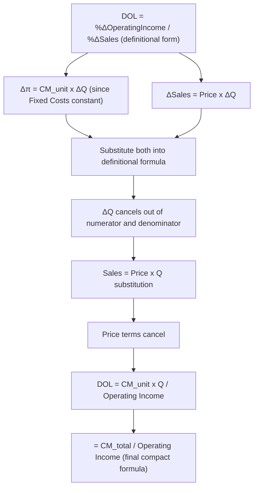

## Deriving DOL from Contribution Margin and Operating Income

### Purpose of This Derivation

While the Degree of Operating Leverage formula has already been introduced and applied in prior topics, this topic works through the **full algebraic derivation** step by step — starting from the raw definition of DOL as a ratio of percentage changes and arriving rigorously at the compact $CM_{total}/OperatingIncome$ formula. Understanding each derivation step clarifies exactly which CVP assumptions the formula depends on, and why it works as a single-period calculation despite being defined in terms of a *change*.

### Step 1: Start from the Definitional Formula

DOL is defined as the ratio of the percentage change in operating income to the percentage change in sales that caused it:

$$DOL=\frac{\%\Delta OperatingIncome}{\%\Delta Sales}=\frac{\Delta\pi/\pi}{\Delta Sales/Sales}$$

This form requires observing (or projecting) two data points — an initial operating income $\pi$ and sales level, and a changed operating income $\pi+\Delta\pi$ resulting from a changed sales level. It is conceptually correct but operationally inconvenient, since it requires a "before and after" comparison rather than a single snapshot.

### Step 2: Express the Change in Operating Income

Using the CVP profit equation, operating income is:

$$\pi=Q\times CM_{unit}-FixedCosts$$

Since fixed costs do not change with volume (by the core CVP assumption — see CVP model assumptions and limitations), a change in volume $\Delta Q$ produces a change in operating income of exactly:

$$\Delta\pi=CM_{unit}\times\Delta Q$$

**Key Points**

- This is the critical simplifying step: because $FixedCosts$ is constant, it contributes *zero* to $\Delta\pi$ — the entire change in operating income comes from the change in contribution margin.
- This is also why DOL, unlike operating income itself, does not require knowing the *absolute* level of fixed costs directly in this step — fixed costs' effect is already captured through their earlier role in determining the current operating income level.

### Step 3: Express the Change in Sales

Similarly, a change in volume produces a change in sales revenue of:

$$\Delta Sales=Price\times\Delta Q$$

### Step 4: Substitute Into the Definitional Formula

$$DOL=\frac{\Delta\pi/\pi}{\Delta Sales/Sales}=\frac{(CM_{unit}\times\Delta Q)/\pi}{(Price\times\Delta Q)/Sales}$$

Rearranging as a single fraction:

$$DOL=\frac{CM_{unit}\times\Delta Q\times Sales}{\pi\times Price\times\Delta Q}$$

**Key Points**

- $\Delta Q$ appears in both the numerator and denominator and **cancels out entirely** — this is the mathematical reason DOL does not depend on the *size* of the sales change being considered, only on the current operating income level.
- This cancellation is what allows DOL to be computed from a single period's data rather than requiring an actual observed change — the formula is defined in terms of a ratio of changes, but algebraically simplifies to something requiring no change data at all.

### Step 5: Simplify Using $Sales=Price\times Q$

After canceling $\Delta Q$:

$$DOL=\frac{CM_{unit}\times Sales}{\pi\times Price}=\frac{CM_{unit}\times(Price\times Q)}{\pi\times Price}$$

The $Price$ terms cancel:

$$DOL=\frac{CM_{unit}\times Q}{\pi}$$

Since $CM_{unit}\times Q=CM_{total}$, this reduces to the final compact formula:

$$DOL=\frac{CM_{total}}{OperatingIncome}$$

### Visual: The Full Derivation Chain

### Why Each Cancellation Matters Conceptually

**Key Points**

- **The $\Delta Q$ cancellation** shows that DOL is a *rate* property of the cost structure at a given operating point, not a property of any particular hypothetical change being considered — this is why the same DOL value applies whether forecasting a 2% or a 20% sales change (within the same relevant range).
- **The $Price$ cancellation** shows that DOL does not depend on the absolute price level of the product — only on the *proportion* of each sales dollar that becomes contribution margin, relative to the resulting operating income. This is consistent with DOL being fundamentally about cost structure (fixed vs. variable), not about pricing level per se.
- **The dependence that survives**: after all cancellations, DOL depends only on $CM_{total}$ and $OperatingIncome$ — both of which are fully determined once fixed costs, variable cost per unit, price, and volume are known at the current operating point. This confirms DOL is entirely a function of the current period's income statement structure, requiring no forward-looking data to compute.

### Worked Numerical Trace of the Derivation

A company: Price = $30, Variable cost/unit = $18 ($CM_{unit}=\$12$), Fixed costs = $60,000, current volume = 8,000 units.

**Example**

**Current state:**

$$CM_{total}=8{,}000\times\$12=\$96{,}000$$

$$OperatingIncome=\$96{,}000-\$60{,}000=\$36{,}000$$

**Applying the definitional formula directly** (suppose volume rises to 8,800 units, $\Delta Q=800$):

$$\Delta\pi=\$12\times800=\$9{,}600$$

$$\%\Delta OperatingIncome=\$9{,}600/\$36{,}000=26.67\%$$

$$\Delta Sales=\$30\times800=\$24{,}000$$

$$\%\Delta Sales=\$24{,}000/(8{,}000\times\$30)=\$24{,}000/\$240{,}000=10\%$$

$$DOL_{definitional}=26.67\%/10\%=2.667$$

**Applying the compact formula directly:**

$$DOL_{compact}=\$96{,}000/\$36{,}000=2.667$$

Both approaches converge on identical results ($DOL=2.667$), confirming the derivation — the compact formula is not an approximation of the definitional one, but an exact algebraic simplification of it.

### Common Pitfalls

- **Believing the compact formula ($CM_{total}/OperatingIncome$) is an approximation** — it is an exact algebraic equivalent of the definitional percentage-change formula under the standard CVP linearity assumptions, not a simplified estimate.
- **Attempting to apply the derivation's cancellation logic outside the linear CVP model** — the $\Delta Q$ and $Price$ cancellations specifically rely on $CM_{unit}$, $Price$, and $FixedCosts$ being constant across the volume range considered; if these vary (step-fixed costs, price breaks), the compact formula no longer exactly matches the definitional one (see CVP model assumptions and limitations).
- **Forgetting that the derivation assumes a single product** — for multi-product firms, the derivation would need to be extended using a weighted-average $CM_{unit}$ and a mix-consistent volume measure, following the same logic as multi-product break-even analysis.
- **Treating the formula as needing forward-looking (future period) data** — a common misconception given DOL's percentage-change definition; the derivation shows the formula is fully computable from a single period's contribution margin and operating income alone.

### Related Topics

- The Degree of Operating Leverage Formula
- The CVP Equation and Profit Function
- Interpreting DOL as a Percentage Change Multiplier
- DOL Behavior Near the Break Even Point
- Cost Structure as a Driver of DOL Magnitude
- Multi Product CVP and Weighted Average Contribution Margin