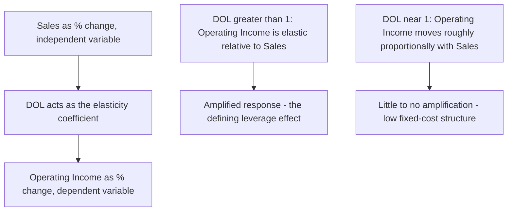

## An Elasticity Interpretation of DOL

### Framing DOL as an Elasticity

In economics, an **elasticity** measures the responsiveness of one variable to a percentage change in another, generally expressed as:

$$Elasticity=\frac{\%\Delta Dependent\ Variable}{\%\Delta Independent\ Variable}$$

The Degree of Operating Leverage fits this exact template, with operating income as the dependent variable and sales as the independent variable:

$$DOL=\frac{\%\Delta OperatingIncome}{\%\Delta Sales}$$

This means DOL can be understood, precisely, as **the elasticity of operating income with respect to sales** — a direct analog to concepts like price elasticity of demand, which measures the percentage responsiveness of quantity demanded to a percentage change in price. Viewing DOL through this lens connects CVP/managerial accounting to the broader mathematical family of elasticity measures used throughout economics and finance.

### Why the Elasticity Framing Is Useful

**Key Points**

- Elasticity measures are unit-free — because both numerator and denominator are percentages, DOL (like any elasticity) can be compared meaningfully across companies of different sizes, currencies, or absolute scale, unlike comparing raw dollar sensitivities directly.
- The elasticity framing immediately explains DOL's core property: values greater than 1 indicate the dependent variable (operating income) moves *more than proportionally* relative to the independent variable (sales) — the defining feature of "leverage" or amplification in this context.
- Just as price elasticity of demand can vary depending on the current price level (elastic vs. inelastic regions of a demand curve), DOL varies depending on the current sales/operating-income level — this is the same underlying mathematical behavior responsible for DOL's extreme values near break-even (see DOL behavior near the break-even point).

### Point Elasticity vs. Arc Elasticity: A Parallel Distinction

Economics distinguishes between **point elasticity** (calculated at a single specific point, often using calculus) and **arc elasticity** (calculated as an average over a range between two observed points). DOL has an analogous distinction:

|  | Point-Style DOL (Compact Formula) | Arc-Style DOL (Definitional, Two-Point) |
| --- | --- | --- |
| Formula | $CM_{total}/OperatingIncome$ | $(\%\Delta OperatingIncome)/(\%\Delta Sales)$, using two observed data points |
| Data required | Single period's CM and operating income | Two periods' actual sales and operating income figures |
| Interpretation | Instantaneous sensitivity at the current operating point | Average sensitivity across the observed range between two points |
| Exactness | Exact under linear CVP assumptions, for infinitesimally small changes | Exact for the specific observed change, by construction |

**Key Points**

- The compact formula ($CM_{total}/OperatingIncome$) is the CVP analog of a *point elasticity* — it measures sensitivity precisely at the current operating income level, analogous to taking a derivative at a single point on a curve.
- Under the standard linear CVP model, both approaches produce identical results for *any* size of change (as demonstrated in the derivation topic), because the underlying profit function is perfectly linear within the relevant range — this is a special property of the CVP model, not a general feature of all elasticity calculations in economics (where point and arc elasticity often diverge for large changes due to curvature in the underlying relationship).
- [Inference: this exact equivalence between point and arc measures is specific to CVP's linear assumptions; in other elasticity applications where the underlying relationship is curved (such as most real-world demand curves), point and arc elasticity calculated over a large range would typically differ, unlike in the CVP case.]

### Worked Example: DOL as Elasticity in Practice

A company has $CM_{total}=\$250{,}000$ and $OperatingIncome=\$50{,}000$, giving $DOL=5.0$.

**Example**

Framed as an elasticity statement: "Operating income is five times as elastic as sales with respect to volume changes" — meaning operating income is highly responsive, moving 5% for every 1% move in sales. This is directly comparable in form to saying "demand is twice as elastic as price" in a standard microeconomics context, even though the underlying economic mechanisms (cost structure vs. consumer behavior) are entirely different.

### Visual: DOL as an Elasticity Curve

### Elastic vs. Inelastic Language Applied to DOL

Borrowing directly from elasticity terminology:

| DOL Value | Elasticity Classification | Meaning |
| --- | --- | --- |
| $DOL>1$ | "Elastic" (operating income more responsive than sales) | Standard leveraged CVP case — virtually all firms with any fixed costs |
| $DOL=1$ | "Unit elastic" | Theoretical case of zero fixed costs; operating income moves exactly proportionally with sales |
| $DOL<1$ | "Inelastic" | Not possible under the standard CVP model with positive fixed costs and positive operating income |

**Key Points**

- Because $DOL=CM_{total}/OperatingIncome$ and $CM_{total}=OperatingIncome+FixedCosts$ (by definition), $DOL$ can be rewritten as $DOL=1+(FixedCosts/OperatingIncome)$ — since $FixedCosts/OperatingIncome$ is always positive (assuming both are positive), $DOL$ is mathematically guaranteed to exceed 1 whenever a firm has any positive fixed costs at all.
- This confirms, from the elasticity perspective, why "inelastic" operating income (DOL < 1) cannot occur in the standard CVP framework with positive fixed costs — the presence of any fixed cost structurally guarantees at least some amplification of profit relative to sales changes.
- The only way to approach $DOL=1$ (unit elasticity, no amplification) is to approach a hypothetical **all-variable-cost** structure, where fixed costs shrink toward zero — reinforcing the direct link between elasticity magnitude and the underlying fixed/variable cost mix (see cost structure as a driver of DOL magnitude).

### Practical Value of the Elasticity Framing

**Key Points**

- Framing DOL as an elasticity makes it straightforward to communicate operating leverage concepts to audiences already familiar with elasticity from economics or finance backgrounds, without needing to introduce CVP-specific terminology from scratch.
- The elasticity lens also clarifies *why* DOL is dimensionless and scale-independent — like any properly constructed elasticity, it is a ratio of percentages, which strips away the effect of a company's absolute size, currency, or units, allowing direct comparison of "operating income responsiveness" across firms of very different scales. [Unverified: while DOL is technically comparable across firms in this scale-independent sense, whether such a cross-firm comparison is *practically meaningful* still depends on comparing firms with reasonably similar business models, as noted in the discussion of high vs. low operating leverage firms.]

### Common Pitfalls

- **Assuming DOL, like some real-world elasticities, can fall below 1** — under the standard CVP model with positive fixed costs and positive operating income, this is mathematically impossible, unlike many other economic elasticities which can range freely above or below 1 depending on context.
- **Conflating DOL (an elasticity of profit to sales) with price elasticity of demand (an elasticity of quantity to price)** — these are different elasticities measuring entirely different relationships; the analogy is structural (both are ratios of percentage changes) but the variables involved are unrelated.
- **Assuming point and arc DOL will always match exactly outside the standard linear CVP model** — this equivalence is a special consequence of CVP's linearity assumptions; if applying elasticity reasoning to a genuinely non-linear cost or revenue relationship, point and arc measures could diverge, as they typically do in other elasticity contexts.
- **Treating the elasticity framing as introducing new information beyond the standard DOL formula** — it is a reinterpretation and conceptual lens on the same underlying mathematics already established in the DOL formula and its derivation, not an independent or alternative calculation method.

### Related Topics

- The Degree of Operating Leverage Formula
- Deriving DOL from Contribution Margin and Operating Income
- DOL Behavior Near the Break Even Point
- Interpreting DOL as a Percentage Change Multiplier
- Cost Structure as a Driver of DOL Magnitude
- CVP Model Assumptions and Limitations