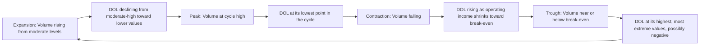

## DOL Across the Business Cycle

### Purpose

This topic examines how Degree of Operating Leverage manifests and matters across the phases of a macroeconomic business cycle — expansion, peak, contraction, and trough — connecting the mechanical DOL properties established in prior topics (volume-dependence, decay, elasticity behavior) to real-world cyclical business planning and risk assessment.

### The Business Cycle Phases and Their Volume Implications

**Key Points**

- **Expansion**: Aggregate demand grows, and firms with high operating leverage tend to see operating income grow disproportionately faster than sales — the same amplification mechanism that produces large profit swings from small volume changes near break-even works powerfully in a firm's favor as volume climbs during this phase.
- **Peak**: Firms are typically operating well above their break-even points at cycle peaks, meaning DOL for most firms is closer to its decayed, lower values (see DOL decay as sales volume grows) — profit growth continues but the *rate* of amplification from further sales gains diminishes as the firm moves further from break-even.
- **Contraction**: As demand falls, high-operating-leverage firms experience the mirror-image effect — operating income falls disproportionately faster than sales, and firms that were comfortably above break-even at the peak can move rapidly toward, or even below, break-even as volume declines, entering the high-DOL (extreme sensitivity) zone discussed in DOL behavior near the break-even point.
- **Trough**: Firms operating at or near break-even during a downturn exhibit the most extreme DOL values (very high or even negative, per the earlier topic) — this is the point in the cycle where operating leverage's structural risk is most acute and most visible in reported results.

### Visual: DOL's Position Through a Full Cycle

### Why High-DOL Firms Are Especially Cycle-Sensitive

**Key Points**

- A high-fixed-cost structure means a firm cannot easily shed costs as volume declines during a contraction — unlike a low-DOL, variable-cost-heavy firm whose costs naturally shrink with falling sales, a high-DOL firm's fixed cost base remains largely committed regardless of the downturn's severity.
- This asymmetry means high-DOL firms often show **more pronounced earnings cyclicality** than low-DOL firms with comparable revenue cyclicality — the underlying sales swing may be similar across firms in the same industry facing the same demand shock, but the *profit* swing is amplified more severely for the higher-fixed-cost firm. [Inference: this describes the mechanical tendency of the CVP model; the actual degree of amplification realized in practice also depends on whether a firm can take other cost-mitigation actions, such as temporary cost reductions, that fall outside the standard fixed/variable cost classification used in CVP analysis.]
- Industries with structurally high fixed costs (capital-intensive manufacturing, airlines, hospitality, heavy industry) have historically been cited as exhibiting pronounced boom-bust earnings patterns tied to demand cycles, consistent with high baseline operating leverage. [Unverified: while this pattern is widely discussed in the context of these industries, the specific magnitude of cyclicality for any individual firm depends on its own particular cost structure, capacity utilization, and competitive position, not solely its industry classification.]

### Worked Illustration: A Firm's DOL Across a Simulated Cycle

A firm has $CM_{unit}=\$18$, $FixedCosts=\$180{,}000$ (break-even = 10,000 units).

| Cycle Phase | Volume | Operating Income | DOL |
| --- | --- | --- | --- |
| Trough (prior cycle) | 10,500 | $9,000 | 21.0 |
| Early Expansion | 14,000 | $72,000 | 3.5 |
| Peak | 20,000 | $180,000 | 2.0 |
| Early Contraction | 15,000 | $90,000 | 3.0 |
| Deep Contraction / New Trough | 10,800 | $14,400 | 13.5 |

**Example**

Note that the firm's DOL at "Early Contraction" (3.0, at 15,000 units) is *lower* than its DOL was at "Early Expansion" (3.5, at 14,000 units) — even though the firm is now shrinking rather than growing — simply because 15,000 units still represents a larger operating income base than 14,000 units did. This reinforces that DOL tracks *proximity to break-even*, not the *direction* of the current trend; a firm can have a low DOL while contracting (if it's still comfortably above break-even) or a high DOL while expanding (if it's expanding from a position very close to break-even).

### Strategic and Planning Implications Across the Cycle

**Key Points**

- **Pro-cyclical capacity investment risk**: A firm that adds fixed costs (capacity, automation, headcount) near a cycle peak — when demand and confidence are high — raises its DOL right before entering a phase (contraction) where high DOL becomes a liability rather than an asset, a timing mismatch worth explicit consideration in capital planning.
- **Counter-cyclical cost-structure flexibility**: Some firms deliberately try to increase the *variable* share of their cost structure ahead of anticipated downturns (e.g., shifting to more flexible staffing, outsourcing arrangements, or usage-based contracts) specifically to reduce DOL and dampen earnings volatility during the contraction phase — trading some upside potential for downside protection.
- **Scenario planning across cycle phases**: Because DOL itself changes substantially across the cycle (as the worked example shows), a single DOL snapshot taken at one point should not be treated as a permanent risk characterization — prudent planning models DOL's likely range across multiple plausible volume scenarios (expansion, contraction) rather than relying on a single current-period calculation. [Unverified: the specific extent to which firms actually adjust cost structure deliberately in anticipation of cycle turns, versus reactively during a downturn already underway, varies significantly by firm and is not a universal practice.]
- **Covenant and liquidity risk**: For firms with debt obligations (fixed financial costs layered on top of fixed operating costs), a high-DOL firm entering a contraction faces compounding risk — operating income can fall sharply due to operating leverage at the same time that fixed debt service obligations remain unchanged, a combination explored further under combined leverage.

### Distinguishing Structural DOL from Cyclical-Position DOL

**Key Points**

- It is useful to separate two related but distinct ideas: a firm's **structural** operating leverage (determined by its underlying fixed/variable cost mix, largely independent of the current point in the cycle) versus its **currently observed** DOL (which reflects both that structure and where the firm happens to sit on the volume/decay curve at a given moment).
- Two firms with identical structural cost mixes can show very different *observed* DOL values simply because one is currently operating near a cycle peak and the other near a cycle trough — comparing their observed DOL figures without accounting for cyclical position risks misattributing a cyclical-timing difference to a structural difference in risk profile.
- This distinction matters for benchmarking: comparing a firm's DOL to an industry peer is most meaningful when both are evaluated at a similar point relative to their respective break-even positions, or when comparing structural cost-mix percentages directly rather than a single point-in-time DOL figure.

### Common Pitfalls

- **Treating a single DOL reading as representative of a firm's risk across the full cycle** — DOL fluctuates substantially with volume, and a reading taken near a cycle peak will understate the sensitivity the same firm would exhibit if a downturn pushed volume back toward break-even.
- **Assuming all firms in a capital-intensive industry are equally cycle-sensitive** — while such industries often have elevated baseline fixed costs, actual DOL and cyclical earnings sensitivity still depend on each specific firm's cost structure, capacity utilization, and current position relative to its own break-even point.
- **Conflating operating leverage cyclicality with financial leverage cyclicality** — this topic addresses operating (cost-structure) leverage specifically; firms also carrying significant fixed financial obligations (debt) face a compounding, related but distinct form of cyclical risk (see financial leverage and combined leverage).
- **Assuming a firm's cost structure decisions made near a cycle peak will be easy to reverse in a subsequent contraction** — many fixed-cost commitments (long-term leases, capital equipment, permanent headcount) are not quickly or costlessly reversible once demand turns down, meaning the DOL implications of expansion-phase decisions can persist well into a contraction.

### Related Topics

- DOL Decay as Sales Volume Grows
- DOL Behavior Near the Break Even Point
- Cost Structure as a Driver of DOL Magnitude
- High Operating Leverage versus Low Operating Leverage Firms
- Financial Leverage and Combined Leverage
- Margin of Safety in Units Dollars and Percentage