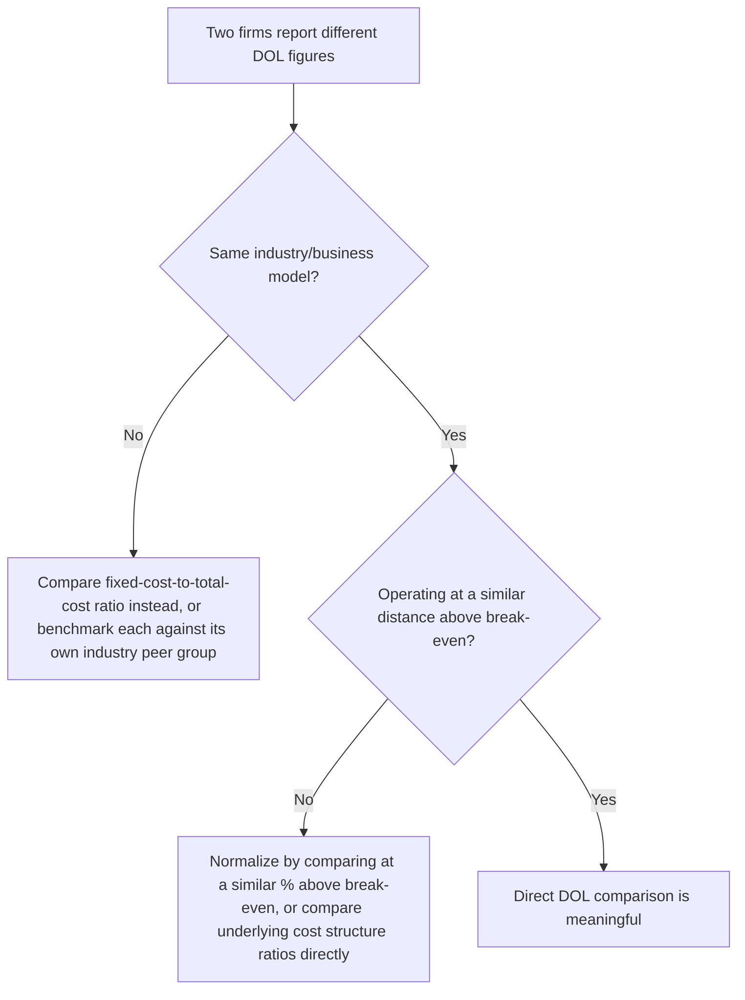

## Comparing DOL Across Companies and Industries

### The Comparison Problem

Because DOL is scale-independent (an elasticity, as established in the prior derivation topics), it is tempting to treat it as a directly comparable metric across any two firms. This topic examines when such comparisons are valid, what confounding factors distort them, and how to conduct a comparison that actually isolates meaningful differences in operating leverage rather than artifacts of scale, cyclical timing, or industry structure.

### Confounding Factor 1: Cyclical Position

As established in the prior topic, a firm's *observed* DOL depends heavily on where it currently sits relative to its own break-even point — not solely on its underlying fixed/variable cost structure.

**Key Points**

- Comparing two firms' current DOL readings without accounting for each firm's distance from break-even risks confusing a **timing** difference for a **structural** difference — a firm currently near break-even will show an inflated DOL relative to its "typical" structural leverage, while a firm currently operating at high volume will show a deflated DOL relative to the same benchmark.
- A more apples-to-apples comparison either (a) evaluates both firms at a similar percentage distance above their respective break-even points, or (b) compares the underlying fixed-cost-to-variable-cost ratio directly, bypassing the volume-dependence of DOL entirely.

### Confounding Factor 2: Industry Cost Structure Norms

**Key Points**

- Different industries have systematically different "normal" fixed-cost intensities driven by their underlying business models — capital-intensive industries (manufacturing, airlines, telecommunications infrastructure, hospitality) typically carry substantially higher baseline fixed costs than labor- or commission-intensive industries (many retail, distribution, or services businesses).
- A DOL of 4.0 might be unremarkable — even relatively low — within a capital-intensive industry, while the same DOL of 4.0 might be unusually high within an industry where most peer firms operate with primarily variable cost structures.
- Meaningful comparison therefore generally requires benchmarking within an industry or peer group with a broadly similar business model, rather than comparing DOL figures across fundamentally different types of businesses. [Inference: the specific "normal" DOL range for any given industry is not a fixed, universal figure — it depends on the particular competitive, technological, and capital-market conditions prevailing at a given time, and should be established empirically for the relevant peer group rather than assumed from general industry category alone.]

### Worked Example: Same DOL Figure, Different Meaning

|  | Firm A (Capital-Intensive Industry) | Firm B (Labor-Intensive Industry) |
| --- | --- | --- |
| Reported DOL | 3.5 | 3.5 |
| Industry-typical DOL range | 3.0 – 6.0 | 1.2 – 2.0 |
| Relative to peers | Below-average leverage for its industry | Far above-average leverage for its industry |

**Example**

Firm A and Firm B report the identical DOL of 3.5, but the implication is very different: Firm A is actually *less* leveraged than a typical firm in its own industry, while Firm B is dramatically *more* leveraged than a typical firm in its industry. A raw DOL comparison between A and B in isolation ("they have the same leverage") would miss this entirely — the meaningful comparison is each firm against its own relevant peer group, not against each other directly.

### A More Robust Comparison Framework

### Confounding Factor 3: Definitional and Accounting Differences

**Key Points**

- DOL calculations depend on how a company classifies its costs as fixed versus variable — since this classification often involves managerial judgment (particularly for mixed/semi-variable costs, see high-low method and regression), two firms may compute meaningfully different DOL figures from similar underlying economics purely due to differing internal cost classification conventions.
- Companies do not universally disclose a standardized DOL figure in external financial reporting (unlike, for example, a GAAP-defined metric) — DOL is a managerial accounting construct, so any DOL comparison across companies using external analysts' estimates should account for the fact that the underlying fixed/variable split was likely estimated, not directly reported, and different analysts may use different estimation methods. [Unverified: the degree of variation introduced by differing estimation methodologies across analysts or data providers is not something that can be generalized without examining the specific sources being compared.]
- Even within a single company, comparing DOL calculated using multiple product lines' blended figures versus DOL calculated for a single, more homogeneous product line can differ meaningfully — see multi-product CVP and weighted-average contribution margin for the underlying mechanics of blended figures.

### A More Robust Alternative: Comparing Cost Structure Ratios Directly

Because DOL's volume-dependence complicates direct comparison, a common alternative is to compare the underlying **fixed cost as a percentage of total costs** (or equivalently, $CM\%$) directly, since these ratios are less sensitive to the specific volume level at which each firm happens to be operating relative to its own break-even point:

$$FixedCostRatio=\frac{FixedCosts}{FixedCosts+VariableCosts}$$

**Key Points**

- This ratio captures the underlying structural leverage characteristic without being distorted by each firm's current cyclical position — two firms with the same fixed-cost ratio have genuinely similar structural operating leverage, regardless of where each currently sits relative to its own break-even point.
- This is a useful *supplementary* comparison alongside DOL, not a full replacement — DOL still captures the *current* sensitivity that matters for near-term forecasting, while the fixed-cost ratio captures the more stable *structural* characteristic useful for longer-term or cross-cyclical comparison.

### Practical Guidance for Making Comparisons

**Key Points**

- **When comparing within the same company over time**: check whether the company's volume has moved significantly relative to its own break-even point between the periods being compared — a rising or falling DOL may reflect volume movement rather than any actual change in cost structure.
- **When comparing across companies in the same industry**: DOL comparisons are more meaningful, but ideally supplemented by checking each firm's margin of safety, since two firms with similar DOL but very different margins of safety face different near-term risk despite similar current sensitivity.
- **When comparing across industries**: raw DOL comparison is generally not meaningful without substantial caveats; comparing fixed-cost ratios, or normalizing for typical industry ranges, produces a more defensible comparison.
- **When using externally reported or analyst-estimated DOL figures**: treat the underlying fixed/variable cost classification as an estimate subject to methodological variation, rather than as a precisely defined, audited figure comparable to a standard financial ratio.

### Common Pitfalls

- **Ranking companies by raw DOL as a simple "riskiness" league table** without controlling for industry, cyclical position, or cost-classification methodology — this is likely to produce a ranking that reflects these confounds more than genuine differences in structural risk.
- **Assuming a lower DOL always indicates a "safer" or "better-managed" company** — a low DOL may simply reflect a company operating at high volume relative to its own break-even, a position-dependent artifact rather than evidence of superior cost management (see DOL decay as sales volume grows).
- **Using DOL comparisons interchangeably with the fixed-cost-ratio comparison** as if they measure exactly the same thing — DOL is volume-dependent; the fixed-cost ratio is not, and the two will diverge for firms at different points in their own cycle.
- **Ignoring that cost classification (fixed vs. variable) itself involves judgment** — treating DOL figures sourced from different companies' internal classifications, or from different analysts' estimation methods, as if they were computed on a perfectly consistent and comparable basis.

### Related Topics

- The Degree of Operating Leverage Formula
- DOL Decay as Sales Volume Grows
- DOL Across the Business Cycle
- Cost Structure as a Driver of DOL Magnitude
- High Operating Leverage versus Low Operating Leverage Firms
- High-Low Method and Regression for Mixed Cost Separation