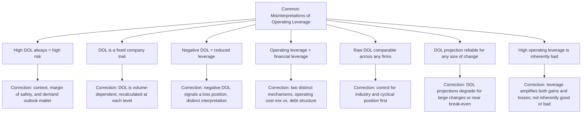

## Common Misinterpretations of Operating Leverage

### Purpose

This topic consolidates the recurring misinterpretations of operating leverage and DOL that have been flagged individually throughout this chapter into a single organized reference, along with several additional misconceptions not yet covered explicitly. It serves as a capstone checklist for correctly applying operating leverage concepts in practice.

### Misinterpretation 1: "High DOL Always Means High Risk"

**The error**: Treating any high DOL reading as an unambiguous danger signal, regardless of context.

**Why it's wrong**: DOL is volume-dependent (see DOL behavior near the break-even point and DOL decay as sales volume grows) — a high DOL may simply indicate a company is currently operating close to its own break-even point, a *positional* fact rather than necessarily a poor structural decision. A capital-intensive firm confidently expanding into strong, predictable demand may rationally carry high structural leverage as a deliberate choice to capture greater upside (see definition and intuition of operating leverage).

**Correct framing**: High DOL indicates high *sensitivity*, which is genuinely risky only when combined with demand uncertainty, a thin margin of safety, or an unfavorable macro environment. Context — not the number alone — determines whether high DOL is dangerous.

### Misinterpretation 2: "DOL Is a Fixed, Permanent Company Characteristic"

**The error**: Quoting a single DOL figure as if it describes the company's leverage profile indefinitely.

**Why it's wrong**: Because $DOL=CM_{total}/OperatingIncome$, and operating income changes every time sales volume changes, DOL is recalculated fresh at every different sales level — the same company can report a DOL of 8 in one quarter and a DOL of 2.5 in the next, purely from normal sales fluctuation, without any change to its underlying fixed/variable cost mix.

**Correct framing**: Distinguish between a company's **structural** operating leverage (its fixed-cost ratio, relatively stable) and its **currently observed** DOL (a snapshot that moves with volume) — see comparing DOL across companies and industries for this distinction in more depth.

### Misinterpretation 3: "A Negative DOL Means Negative Leverage or Reduced Risk"

**The error**: Reading a negative DOL value as somehow "less" leveraged, or interpreting the negative sign the same way one would interpret DOL values between 0 and 1.

**Why it's wrong**: A negative DOL occurs specifically when a company is operating at a loss (operating income below zero) — it reflects the formula's denominator becoming negative, not a meaningful reduction in sensitivity. Values of DOL between 0 and 1 do not occur at all in the standard CVP model with positive fixed costs.

**Correct framing**: A negative DOL should be read as a signal that the company is in a loss position with extreme volume sensitivity in either direction, not evaluated using the same "amplification factor" interpretation applied comfortably above break-even.

### Misinterpretation 4: "DOL and Financial Leverage Are the Same Thing"

**The error**: Using "leverage" loosely, treating operating leverage (fixed vs. variable *operating* costs) and financial leverage (debt financing and its effect on returns to equity) as interchangeable concepts.

**Why it's wrong**: Operating leverage concerns the sensitivity of *operating income* to *sales* changes, driven by the operating cost structure. Financial leverage concerns the sensitivity of *net income* (or earnings per share) to *operating income* changes, driven by fixed financial obligations like interest expense. They are mechanically distinct, though a firm high in both dimensions faces compounding risk (see financial leverage and combined leverage).

**Correct framing**: Always specify which type of leverage is being discussed; a firm can be high in one and low in the other.

### Visual: The Family of Misinterpretations at a Glance

### Misinterpretation 5: "Raw DOL Figures Are Directly Comparable Across Any Two Companies"

**The error**: Ranking or comparing companies by DOL without adjusting for industry norms or each company's current position relative to its own break-even point.

**Why it's wrong**: As shown in the prior topic, identical DOL figures can represent very different relative leverage positions depending on industry-typical cost structures, and DOL's volume-dependence means two firms at different points in their own operating range are not being compared on equal footing.

**Correct framing**: Meaningful comparison requires controlling for industry and cyclical position, or supplementing DOL with a volume-independent measure like the fixed-cost-to-total-cost ratio.

### Misinterpretation 6: "The DOL Percentage-Change Formula Works Equally Well for Any Size of Forecast"

**The error**: Applying $\%\Delta OperatingIncome\approx DOL\times\%\Delta Sales$ confidently to very large forecasted sales swings, or to forecasts starting from a position very close to break-even.

**Why it's wrong**: The approximation is exact only within the same relevant range, where $CM_{unit}$ and fixed costs remain genuinely constant (see interpreting DOL as a percentage change multiplier). Large swings risk crossing into a different fixed-cost regime (step-fixed costs) or triggering price/cost changes; starting points near break-even involve an extremely large or unstable DOL multiplier, making the projection unreliable in that region specifically.

**Correct framing**: Use the DOL multiplier for small-to-moderate forecasts within a stable relevant range; verify large or near-break-even projections against a full recalculation instead.

### Misinterpretation 7: "High Operating Leverage Is Inherently a Bad (or Good) Thing"

**The error**: Treating operating leverage as having an inherent, universal valence — either always a red flag or always a sign of a strong, scalable business.

**Why it's wrong**: As established in high operating leverage versus low operating leverage firms, high DOL amplifies profit in *both* directions — it produces outsized gains during growth and outsized losses during contraction. Whether this is favorable depends entirely on the firm's confidence in future demand direction and its risk tolerance, not on any property of the leverage figure itself.

**Correct framing**: Evaluate operating leverage in light of demand outlook, margin of safety, and the company's capacity to withstand the downside scenario — never as an inherently positive or negative signal in isolation.

### A Consolidated Diagnostic Checklist

**Key Points**

- Before drawing a conclusion from a DOL figure, ask: *At what volume level relative to break-even was this computed?* (addresses misinterpretations 1, 2, 6)
- Ask: *Is operating income positive, or is this company currently operating at a loss?* (addresses misinterpretation 3)
- Ask: *Am I discussing operating leverage specifically, or conflating it with financial/debt-related leverage?* (addresses misinterpretation 4)
- Ask: *Am I comparing this figure to a relevant peer group at a similar cyclical position, or to an unrelated benchmark?* (addresses misinterpretation 5)
- Ask: *Does the conclusion assume leverage is good or bad on its own, or does it account for the specific demand scenario being considered?* (addresses misinterpretation 7)

### Common Pitfalls (Meta-Level)

- **Presenting DOL as a single summary statistic without any of the above context** in a report or analysis intended for decision-making — a bare DOL number, without volume position, industry context, and demand-outlook framing, risks being misread using any of the misinterpretations above.
- **Assuming familiarity with the DOL formula alone is sufficient to avoid these misinterpretations** — the formula's mechanics are simple, but its correct *interpretation* requires the layered context developed across this chapter (volume-dependence, elasticity framing, cyclical positioning, cross-company comparability).
- **Treating this list as exhaustive** — as CVP and operating leverage concepts are applied to increasingly complex real-world situations (multi-product firms, firms with both step-fixed costs and financial leverage, highly cyclical industries), additional nuanced misinterpretations can arise beyond this consolidated set. [Inference: this caveat reflects that the list synthesizes misinterpretations explicitly addressed in this chapter's preceding topics rather than claiming to be a complete taxonomy of every possible misapplication of operating leverage concepts.]

### Related Topics

- The Degree of Operating Leverage Formula
- DOL Behavior Near the Break Even Point
- DOL Decay as Sales Volume Grows
- DOL Across the Business Cycle
- Comparing DOL Across Companies and Industries
- Financial Leverage and Combined Leverage