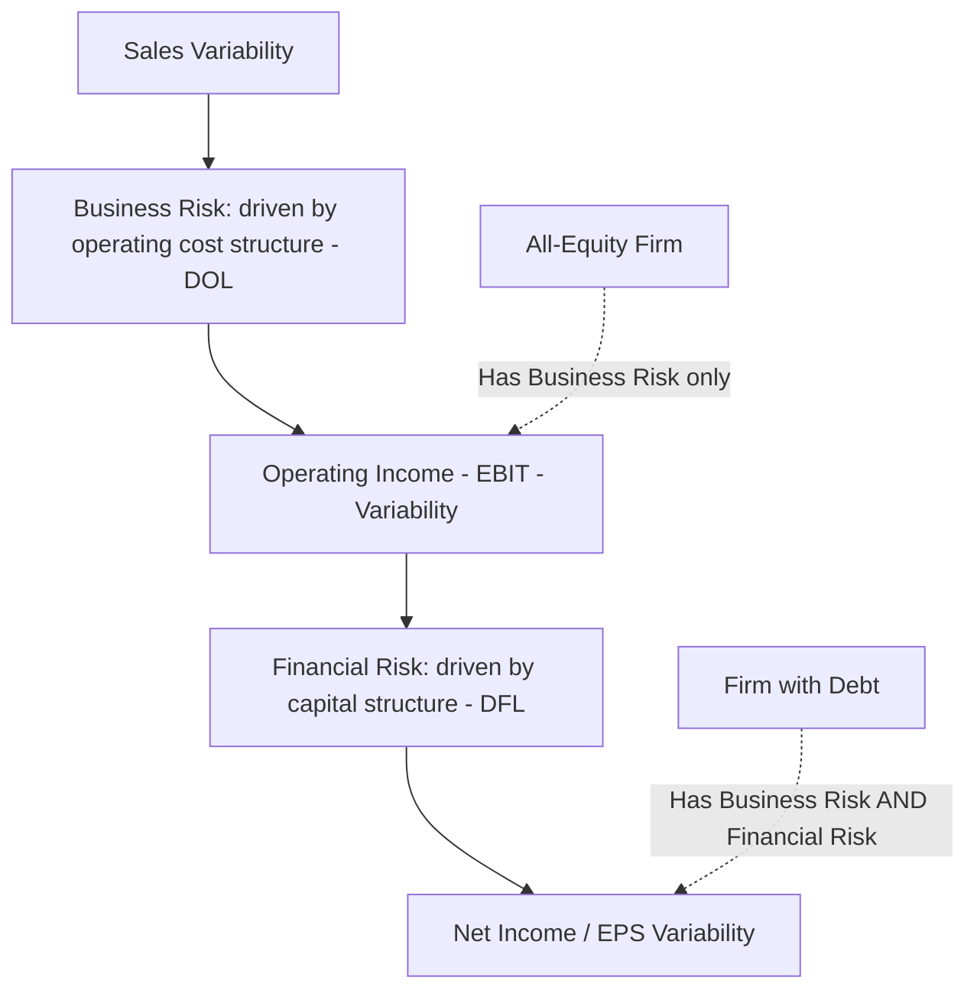

## Business Risk versus Financial Risk

### Definitions

**Business risk** (also called operating risk) is the variability or uncertainty in a firm's **operating income** (EBIT) arising from the nature of its operations — its industry, competitive position, demand volatility, and cost structure. It exists independent of how the firm is financed.

**Financial risk** is the *additional* variability introduced into a firm's **net income** (or earnings per share) specifically because of its use of fixed financial obligations — primarily debt and the interest expense it requires. It is layered on top of business risk, not a separate independent source of variability.

### The Core Distinction

| Aspect | Business Risk | Financial Risk |
| --- | --- | --- |
| Source | Operating cost structure (fixed vs. variable operating costs), industry demand volatility, competitive dynamics | Capital structure (debt vs. equity financing), fixed interest obligations |
| Measured by | Variability of operating income (EBIT); captured quantitatively by Degree of Operating Leverage (DOL) | Variability of net income/EPS relative to operating income; captured quantitatively by Degree of Financial Leverage (DFL) |
| Exists even with zero debt? | Yes — a fully equity-financed firm still has business risk from its operations | No — a firm with zero debt has zero financial risk by definition |
| Primary driver | Fixed vs. variable *operating* costs (see cost structure as a driver of DOL magnitude) | Fixed vs. variable *financing* costs (interest expense is fixed; equity dividends are discretionary) |
| Who bears it | All capital providers (both debt and equity holders) share exposure to business risk | Financial risk is layered specifically onto equity holders, since debt holders have a prior, fixed claim |

**Key Points**

- Business risk is inherent to *what a company does* — the products it sells, the industry it operates in, and how it has structured its operating costs; it would exist even for a company financed entirely with equity and no debt.
- Financial risk is inherent to *how a company is financed* — it is entirely a function of capital structure choices and does not exist for an all-equity firm, regardless of how volatile that firm's operating income might be.
- The two risks are **additive** in their effect on the ultimate variability of returns to equity holders: total risk borne by shareholders combines both the underlying business risk and any additional financial risk layered on top through debt financing.

### Why the Distinction Matters

**Key Points**

- **Separating causes from effects**: A firm with volatile net income could be volatile because of an inherently risky business (high business risk), heavy use of debt (high financial risk), or both — the distinction lets analysts and managers diagnose *which* lever is driving observed earnings volatility, since the appropriate response differs (operational restructuring vs. capital structure adjustment).
- **Independent management levers**: Business risk is primarily managed through operating decisions — cost structure choices (see cost structure as a driver of DOL magnitude), product diversification, pricing strategy. Financial risk is managed through capital structure decisions — how much debt to carry, at what terms. A firm can adjust one without necessarily changing the other.
- **Trade-off awareness in capital structure decisions**: A firm with already-high business risk (high DOL, volatile operating income) adding significant debt on top compounds its risk multiplicatively rather than just additively in a risk-of-financial-distress sense — this compounding effect is formalized in the concept of combined leverage.

### Visual: Two Independent Sources Combining Into Total Risk

### Worked Example: Isolating the Two Risk Sources

Two firms in the same industry, with identical operations and identical business risk (same DOL = 3.0), but different financing:

|  | Firm All-Equity | Firm Leveraged (Debt-Financed) |
| --- | --- | --- |
| Operating Income (EBIT) | $100,000 | $100,000 |
| Interest Expense | $0 | $40,000 |
| Net Income (pre-tax) | $100,000 | $60,000 |
| DOL (business risk measure) | 3.0 | 3.0 (identical — same operations) |

**Example**

Suppose a 10% sales decline causes both firms' operating income to fall by 30% (consistent with their identical $DOL=3.0$, per the DOL multiplier relationship): EBIT falls from $100,000 to $70,000 for both firms — this 30% EBIT decline reflects their **identical business risk**.

But the effect on net income diverges sharply:

- **Firm All-Equity**: Net income falls from $100,000 to $70,000 — a 30% decline, exactly matching the EBIT decline (no financial risk layered on).
- **Firm Leveraged**: Net income falls from $60,000 ($100,000 − $40,000 interest) to $30,000 ($70,000 − $40,000 interest) — a 50% decline, substantially larger than the 30% EBIT decline, because the fixed $40,000 interest expense doesn't shrink even as operating income falls.

**Example**

This isolates the effect precisely: both firms experienced identical business risk (30% EBIT swing from the same DOL), but Firm Leveraged experienced a much larger net income swing (50%) purely due to financial risk from its debt — the *additional* 20 percentage points of net income sensitivity is attributable entirely to financial leverage, not to any difference in the underlying operations.

### How Business Risk and Financial Risk Combine

The multiplicative relationship (formalized further in combined leverage) can be previewed here conceptually:

$$DegreeOfCombinedLeverage=DOL\times DFL$$

**Key Points**

- Because the two risk sources compound multiplicatively rather than simply adding, a firm with both high business risk (high DOL) and high financial risk (high DFL, from significant debt) faces a **combined** sensitivity in net income/EPS to sales changes that can be substantially more extreme than either factor alone would suggest.
- This compounding is a central reason lenders and credit analysts pay close attention to a borrower's underlying business risk (cost structure, industry volatility) *before* evaluating how much additional debt that borrower can safely carry — a firm with already-high business risk has less capacity to safely add financial risk on top without pushing total earnings volatility to potentially unsustainable levels. [Inference: this describes the standard rationale commonly cited in credit analysis and capital structure theory; the specific safe threshold of combined leverage for any real firm depends on numerous additional factors — industry norms, cash flow predictability, access to capital markets — beyond the DOL/DFL framework alone.]

### Practical Implications for Different Stakeholders

**Key Points**

- **Equity investors** bear the combined effect of both business and financial risk, since equity is the residual claim after all fixed obligations (both operating fixed costs embedded in EBIT and financial fixed costs like interest) have been met — equity holders in a high-DOL, high-DFL firm face the most amplified exposure to sales volatility of any capital provider.
- **Debt holders** are primarily exposed to business risk indirectly (a firm with volatile, cyclical operating income is a riskier borrower, all else equal) but are largely insulated from financial risk itself, since they hold the prior fixed claim that financial risk is defined relative to.
- **Management** can independently pursue business-risk reduction (diversifying products, shifting cost structure toward variable costs) and financial-risk reduction (reducing debt levels, extending debt maturities, using fixed-to-floating rate swaps) as separate strategic levers, chosen according to which risk source is judged to pose the greater threat to the firm's stability.

### Common Pitfalls

- **Treating "risk" as a single undifferentiated concept** when discussing a firm's volatility — failing to specify whether a discussion concerns business risk (operations) or financial risk (financing) can lead to prescribing the wrong remedy (e.g., recommending debt reduction for a problem that is actually rooted in operating cost structure).
- **Assuming an all-equity firm has "no risk"** — an all-equity firm can still have very high business risk if its operating cost structure is highly fixed-cost-intensive or its industry demand is highly volatile; zero financial risk does not mean zero risk overall.
- **Assuming DOL alone fully captures a firm's earnings risk** — DOL only captures business risk (EBIT sensitivity); a full risk picture for equity holders requires also considering financial risk via DFL and their combined multiplicative effect.
- **Believing business risk and financial risk are independent and simply additive** rather than compounding multiplicatively — the worked example shows how a firm's financial risk amplifies, rather than merely adds to, the underlying business-risk-driven earnings swing.

### Related Topics

- The Degree of Operating Leverage Formula
- Financial Leverage and Combined Leverage
- Cost Structure as a Driver of DOL Magnitude
- High Operating Leverage versus Low Operating Leverage Firms
- Margin of Safety in Units Dollars and Percentage
- Capital Structure and the Cost of Capital