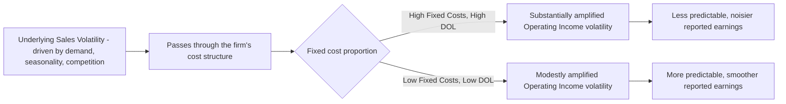

## Operating Leverage as a Driver of Earnings Volatility

### Purpose

This topic makes explicit the causal chain connecting a firm's operating leverage (its fixed/variable cost mix) to observed, real-world earnings volatility — the period-to-period fluctuation in reported operating income. Where prior topics established DOL's formula, decay behavior, and cyclical position, this topic focuses specifically on operating leverage as a *statistical driver of variance* in earnings, connecting the CVP framework to the broader concept of earnings quality and predictability.

### The Causal Chain

$$SalesVolatility\ \xrightarrow{\text{amplified by}}\ DOL\ \longrightarrow\ EarningsVolatility$$

**Key Points**

- Sales volatility is typically the starting point — driven by demand cyclicality, competitive dynamics, seasonality, or macroeconomic conditions — and is largely outside a firm's direct control in the short run.
- Operating leverage (DOL) acts as a **multiplier** on that underlying sales volatility, translating a given percentage variability in sales into a larger percentage variability in operating income, precisely as established by the DOL relationship $\%\Delta OperatingIncome\approx DOL\times\%\Delta Sales$.
- Because DOL is generally greater than 1 for any firm with positive fixed costs (see the elasticity interpretation of DOL), operating leverage is a *volatility-amplifying* mechanism by construction — it never dampens sales volatility as it flows through to earnings, only sustains it at parity (in the theoretical zero-fixed-cost limit) or magnifies it.

### Quantifying the Amplification of Volatility

If sales volatility is measured by its standard deviation (or coefficient of variation) across periods, the *approximate* relationship between sales volatility and earnings volatility, for a firm with a roughly constant DOL over the range considered, is:

$$\sigma_{\%\Delta OperatingIncome}\approx DOL\times\sigma_{\%\Delta Sales}$$

**Key Points**

- This says the **standard deviation** (a common statistical volatility measure) of period-over-period operating income changes is approximately DOL times the standard deviation of sales changes — a direct extension of the point-estimate DOL multiplier relationship to a distribution of possible outcomes rather than a single scenario.
- A firm with $DOL=4$ facing sales that historically vary with a standard deviation of 6% will tend to exhibit operating income that varies with a standard deviation of roughly 24% — a substantially "noisier," less predictable earnings stream than its underlying sales pattern alone would suggest. [Inference: this approximation inherits the same caveats as the point-estimate DOL multiplier — it is most accurate for volatility staying within a single relevant range and assumes DOL itself doesn't change dramatically across the range of sales outcomes being considered; in practice, since DOL itself is volume-dependent (see DOL decay as sales volume grows), this relationship is an approximation that works best when the range of sales outcomes doesn't push the firm dramatically closer to or further from its break-even point.]

### Worked Example: Two Firms, Same Sales Volatility, Different Earnings Volatility

Two firms in the same industry, facing the same demand environment (identical sales volatility, standard deviation of sales changes = 8%), but different operating leverage:

|  | Firm Low-DOL (DOL = 1.8) | Firm High-DOL (DOL = 5.5) |
| --- | --- | --- |
| Sales volatility (σ, % change) | 8% | 8% |
| Approximate operating income volatility (σ, % change) | $1.8\times8\%=14.4\%$ | $5.5\times8\%=44.0\%$ |

**Example**

Despite facing *identical* underlying sales volatility (both firms compete in the same market with the same demand fluctuations), Firm High-DOL's earnings are roughly three times more volatile in percentage terms than Firm Low-DOL's. An analyst or investor evaluating "earnings quality" or predictability for these two firms would find Firm High-DOL's reported profits considerably harder to forecast reliably from one period to the next, purely as a consequence of its cost structure — not because its underlying business is inherently less predictable at the sales level.

### Visual: The Volatility Amplification Pipeline

### Implications for Earnings Predictability and Forecasting

**Key Points**

- **Forecast confidence intervals should widen with DOL**: a forecast of operating income for a high-DOL firm should carry a proportionally wider range of plausible outcomes than the same percentage sales forecast uncertainty would imply for a low-DOL firm — treating both with the same forecast precision understates the genuine uncertainty in the high-DOL case.
- **Earnings volatility from operating leverage is a distinct phenomenon from earnings volatility from one-time or non-recurring items** — a highly leveraged operating cost structure produces *recurring*, structurally embedded earnings volatility tied to ordinary sales fluctuation, as opposed to episodic volatility from unusual events; distinguishing the two matters for assessing the sustainability and predictability of a firm's core earnings power.
- **Valuation implications**: all else equal, a firm with structurally more volatile (higher-DOL-driven) earnings is often perceived as riskier by investors, which can be reflected in a higher required rate of return or valuation discount relative to a firm with equivalent *average* earnings but lower earnings volatility. [Unverified: the specific magnitude of any valuation discount attributable to operating-leverage-driven earnings volatility, versus other risk factors, is a matter of empirical asset-pricing research and market conditions rather than a fixed relationship that can be stated generally.]

### Disentangling Sales Volatility from Cost-Structure-Driven Volatility

**Key Points**

- When observing volatile reported earnings for a company, it is useful to ask: *is this volatility coming primarily from the underlying business (unpredictable sales) or from the cost structure amplifying otherwise modest sales fluctuations (high DOL)?* — these point to very different remedies.
- If sales volatility is the primary driver, remedies center on demand-side actions: diversifying customers/markets, improving demand forecasting, building order backlogs or long-term contracts to smooth revenue recognition.
- If cost-structure amplification (high DOL) is the primary driver, remedies center on the operating cost mix itself: converting some fixed costs to variable arrangements (outsourcing, flexible staffing, usage-based leasing) to reduce the multiplier effect, even if underlying sales volatility remains unchanged (see cost structure as a driver of DOL magnitude for these specific mechanisms).
- In practice, both factors are frequently present simultaneously, and a full earnings-volatility diagnosis benefits from examining both the firm's historical sales volatility *and* its DOL, rather than attributing volatile earnings to a single cause without examining each contributing factor. [Inference: this diagnostic framing follows from the multiplicative relationship established above; a rigorous decomposition of observed earnings volatility into a sales-volatility component and a DOL-amplification component would require statistical analysis beyond the simple multiplier approximation shown here.]

### Common Pitfalls

- **Attributing volatile earnings entirely to "a volatile business" without checking whether cost-structure amplification (high DOL) is compounding otherwise modest sales volatility** — the two causes call for different remedies, and conflating them risks pursuing demand-side fixes for what is actually a cost-structure problem, or vice versa.
- **Applying the volatility amplification formula ($\sigma_{OperatingIncome}\approx DOL\times\sigma_{Sales}$) using a DOL computed at one specific volume level to a wide range of possible sales outcomes** — since DOL itself changes with volume (see DOL decay as sales volume grows), this approximation is most reliable when the range of sales outcomes being modeled doesn't span a wide distance from the DOL's calculation point.
- **Assuming lower observed earnings volatility always indicates lower business risk** — a firm's earnings could appear smooth simply because it currently operates at high volume (low DOL, per the decay relationship) even while carrying an underlying high-fixed-cost structure that would produce much more volatile earnings if sales fell closer to its break-even point.
- **Treating operating-leverage-driven volatility as identical in character to financial-leverage-driven volatility** — both amplify earnings variability, but through mechanically distinct channels (operating cost structure vs. capital structure), and conflating them obscures which remedy (operational vs. financial restructuring) is actually appropriate (see business risk versus financial risk).

### Related Topics

- The Degree of Operating Leverage Formula
- DOL Decay as Sales Volume Grows
- Business Risk versus Financial Risk
- Cost Structure as a Driver of DOL Magnitude
- DOL Across the Business Cycle
- Financial Leverage and Combined Leverage