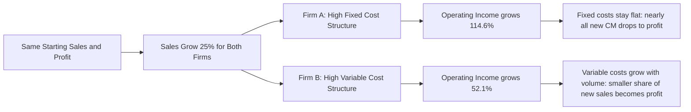

## Cost Structure and Upside Potential in Expansions

### Purpose

This topic examines the favorable, growth-phase counterpart to downside risk in downturns — how a firm's fixed/variable cost mix determines the magnitude of profit gains it can capture during periods of rising sales. Operating leverage's amplification mechanism, which erodes profit disproportionately in a downturn, works with equal mathematical force in the opposite direction during an expansion, and this topic treats that upside case as a first-class subject in its own right rather than merely the mirror image of the downturn analysis.

### The Mechanics of Upside Capture

**Key Points**

- Once fixed costs are fully covered (i.e., the firm is operating above its break-even point), every additional unit sold contributes its **full** $CM_{unit}$ directly to operating income, with no offsetting cost growth to dilute that contribution — this is the same mechanism that produces downside vulnerability, now working favorably.
- A firm with a high-fixed-cost structure typically also carries a high $CM\%$ (since its variable cost per unit tends to be low relative to price) — meaning a larger share of each incremental sales dollar during an expansion flows straight to profit, compared to a low-fixed-cost firm whose lower $CM\%$ captures a smaller share of each new sales dollar as profit.
- This is precisely the favorable side of the amplification relationship established in definition and intuition of operating leverage: the identical structural feature that threatens a high-DOL firm during a downturn is the source of its accelerated profit growth during an expansion.

### Worked Example: Two Firms Capturing an Identical Sales Increase

Two firms in the same industry, both starting with $500,000 in sales and $60,000 in operating income, both experiencing an identical 25% sales increase:

|  | Firm A (High Fixed, $CM\%=55\%$) | Firm B (High Variable, $CM\%=25\%$) |
| --- | --- | --- |
| Original Sales | $500,000 | $500,000 |
| Original CM | $275,000 | $125,000 |
| Fixed Costs | $215,000 | $65,000 |
| Original Operating Income | $60,000 | $60,000 |
| New Sales (+25%) | $625,000 | $625,000 |
| New CM | $343,750 | $156,250 |
| New Operating Income | $343,750−$215,000=**$128,750** | $156,250−$65,000=**$91,250** |
| **% Growth in Operating Income** | **+114.6%** | **+52.1%** |

**Example**

Both firms began from identical sales and profit, and both experienced an identical 25% sales increase — but Firm A's operating income more than doubled (a 114.6% increase), while Firm B's grew by a still-solid but much smaller 52.1%. This is the exact structural mirror of the downturn example in the prior topic, using the same two firms and the same percentage change in the opposite direction — demonstrating that operating leverage is symmetric: the firm most exposed to downside risk in a downturn is the same firm best positioned to capture outsized gains in an expansion.

### Visual: Divergent Expansion Paths by Cost Structure

### Why Capacity and Utilization Matter to Realized Upside

**Key Points**

- The upside amplification described above assumes the firm has sufficient existing **fixed capacity** to absorb the additional volume without triggering a step-fixed-cost increase (a new facility, additional equipment, a new supervisory layer) — if growth requires crossing such a threshold, some of the theoretical amplification is offset by the new fixed cost (see break-even analysis under step fixed costs).
- A firm operating well below its capacity ceiling when an expansion begins is positioned to capture the *full* benefit of operating leverage's upside amplification across a wide range of volume growth, since its existing fixed cost base can absorb substantially more volume before requiring expansion.
- A firm already operating near its capacity ceiling as an expansion begins will capture the amplified upside only up to that ceiling, after which further growth requires new fixed investment — potentially resetting the DOL calculation at a new, different level once the new fixed costs are incurred. [Inference: whether the marginal step-fixed-cost investment is worthwhile depends on whether the resulting additional capacity generates enough incremental contribution margin to justify the new fixed cost, following the same evaluation logic covered in break-even analysis under step fixed costs.]

### Strategic Implications for Expansion Planning

**Key Points**

- **Deliberately building fixed-cost capacity ahead of anticipated growth** (a calculated bet on future demand) is a strategy specifically designed to maximize upside capture during an expansion — investing in owned equipment, technology infrastructure, or expanded facilities before demand fully materializes increases DOL and, if the growth forecast proves accurate, disproportionately amplifies the resulting profit.
- **This strategy carries the mirror-image risk discussed in the downturn topic**: if the anticipated growth does not materialize (or reverses), the same fixed-cost investment that would have amplified gains instead amplifies losses — the decision to build ahead of demand is a genuine bet on the demand forecast being correct, not a costless way to capture upside.
- **Timing relative to the business cycle matters**: adding fixed capacity early in a sustained expansion phase (when there is a long runway of anticipated growth ahead) offers more opportunity to realize the amplification benefit across a large volume range before the cycle turns, compared to adding the same fixed capacity late in an expansion phase, just before a downturn (see DOL across the business cycle for the cyclical positioning dynamics).

### Comparing the Two Sides of the Same Coin

| Dimension | Downturn (Downside) | Expansion (Upside) |
| --- | --- | --- |
| Mechanism | Fixed costs don't shrink; CM decline flows fully to reduced operating income | Fixed costs don't grow; CM increase flows fully to increased operating income |
| High-DOL firm outcome | Disproportionately severe profit decline; risk of falling into loss | Disproportionately large profit growth; faster path to higher profitability |
| Low-DOL firm outcome | More modest profit decline; natural cost cushion from variable costs | More modest profit growth; costs scale up alongside revenue, capturing less incremental margin |
| Strategic lever | Shift toward variable costs to reduce downside exposure | Shift toward fixed costs (or invest ahead of demand) to increase upside capture |
| Key risk | Demand doesn't recover; fixed costs become unsustainable | Demand doesn't materialize as forecast; fixed investment doesn't get utilized |

**Key Points**

- This table crystallizes the central theme running through this chapter: operating leverage is not inherently favorable or unfavorable — it is a **symmetric amplifier**, and evaluating a given cost structure requires weighing both the downside topic and this upside topic together against the firm's actual demand outlook and risk tolerance, not evaluating either in isolation.
- A firm's decision to increase or decrease its operating leverage is, in substance, a bet on the direction and reliability of future sales — a decision best made with an explicit view on both the upside potential (this topic) and downside exposure (the prior topic) simultaneously, since the same structural change produces both effects together, not selectively.

### Common Pitfalls

- **Evaluating a high-fixed-cost structure only in terms of its upside potential** (as this topic might tempt in isolation) without weighing the identical structure's downside vulnerability covered in the previous topic — the two must be considered as an inseparable pair, not independently.
- **Assuming upside amplification is guaranteed simply by carrying high fixed costs** — the amplification only materializes if sales volume actually grows; a high-fixed-cost firm that fails to grow captures no upside benefit and instead bears the ongoing burden of its fixed cost base without the offsetting profit growth.
- **Ignoring capacity constraints when projecting upside amplification** — the clean DOL-multiplier relationship assumes existing fixed costs can absorb the additional volume; growth that requires crossing a step-fixed-cost threshold partially offsets the projected amplification (see break-even analysis under step fixed costs).
- **Treating "building ahead of demand" as a low-risk way to boost future profitability** without acknowledging it is a forecast-dependent bet — the same fixed investment that pays off handsomely if demand materializes becomes a source of amplified losses if it does not.

### Related Topics

- Cost Structure and Downside Risk in Downturns
- Definition and Intuition of Operating Leverage
- Cost Structure as a Driver of DOL Magnitude
- Break Even Analysis Under Step Fixed Costs
- DOL Across the Business Cycle
- High Operating Leverage versus Low Operating Leverage Firms