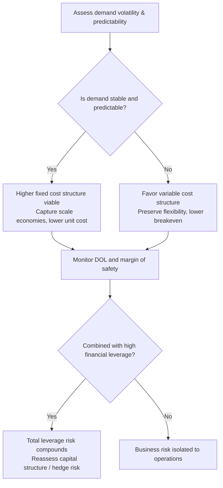

## The Risk Return Tradeoff of High Fixed Cost Structures

### Conceptual Foundation

A firm's cost structure — the mix between fixed costs (FC) and variable costs (VC) — determines how revenue fluctuations translate into profit fluctuations. A high fixed cost structure means a large proportion of total costs do not vary with output in the short run (e.g., depreciation, salaried labor, rent, insurance), while variable costs (materials, sales commissions, hourly labor) scale with volume.

This mix is a **strategic choice**, not merely an accounting artifact. Firms often trade variable costs for fixed costs deliberately — for example, automating a manual process (converting variable labor into fixed depreciation) — because doing so changes the firm's risk-return profile, not just its expense classification.

**Key Points**

- Fixed costs create **operating leverage**: they magnify the effect of sales changes on operating income (EBIT).
- High fixed cost structures raise the **breakeven point** in unit terms but can lower per-unit cost at high volume.
- The tradeoff is asymmetric: leverage magnifies gains in expansions and magnifies losses in contractions.
- This is a real-side analog to financial leverage (debt), and the two compound when combined (total leverage).

---

### Degree of Operating Leverage (DOL)

DOL quantifies sensitivity of operating income to sales changes.

$$DOL = \frac{\%\Delta EBIT}{\%\Delta Sales} = \frac{Q(P - V)}{Q(P - V) - F}$$

Where:

- $Q$ = quantity sold
- $P$ = price per unit
- $V$ = variable cost per unit
- $F$ = total fixed costs
- $Q(P-V)$ = total contribution margin

**Interpretation:** A DOL of 3.0 means a 1% increase in sales produces roughly a 3% increase in EBIT — and symmetrically, a 1% sales decline produces a 3% EBIT decline.

DOL is **not a fixed constant** of the firm — it varies with the current level of output, since it is a local elasticity measured near the operating point. As $Q$ rises above breakeven, DOL asymptotically approaches 1; as $Q$ approaches the breakeven quantity from above, DOL rises toward infinity.

**Example**

A firm has:

- Price $P = \$50$
- Variable cost $V = \$30$
- Fixed costs $F = \$400{,}000$
- Current volume $Q = 30{,}000$ units

Contribution margin per unit $= 50 - 30 = \$20$

Total contribution margin $= 30{,}000 \times 20 = \$600{,}000$

EBIT $= 600{,}000 - 400{,}000 = \$200{,}000$

$$DOL = \frac{600{,}000}{600{,}000 - 400{,}000} = \frac{600{,}000}{200{,}000} = 3.0$$

A 10% sales increase (to 33,000 units) would be expected to increase EBIT by approximately 30%. Verifying directly:

New EBIT $= 33{,}000(20) - 400{,}000 = 660{,}000 - 400{,}000 = 260{,}000$, a 30% increase from $200,000 — confirming the DOL estimate. [Note: this linear DOL approximation is exact only when $P$ and $V$ are constant per unit across the volume range; in practice, economies of scale or price discounts can cause deviations. [Inference]]

---

### Breakeven and Margin of Safety

$$Q_{BE} = \frac{F}{P - V}$$

For the example above: $Q_{BE} = 400{,}000 / 20 = 20{,}000$ units.

**Margin of Safety** measures the cushion between current sales and the breakeven point:

$$\text{Margin of Safety} = \frac{Q_{current} - Q_{BE}}{Q_{current}}$$

At $Q = 30{,}000$: $(30{,}000 - 20{,}000)/30{,}000 = 33.3\%$. Sales could fall by a third before the firm hits breakeven. A low margin of safety combined with high DOL is a red flag for earnings volatility, since it indicates the firm is operating close to the steep, high-sensitivity region of its cost curve.

---

### The Risk Side of the Tradeoff

High fixed cost structures increase **business risk** — the volatility of operating income (EBIT) that is inherent to the firm's operations, independent of how it is financed.

**Mechanisms of increased risk:**

1. **Downside amplification** — during a revenue contraction, fixed costs cannot be quickly shed, so losses accumulate faster than revenue declines.
2. **Reduced flexibility** — firms with high fixed costs (e.g., airlines, semiconductor fabs, hotels) have limited ability to adjust the cost base in a downturn without structural changes (layoffs, asset sales, restructuring), which carry their own costs and lags.
3. **Elevated bankruptcy/distress risk** — combined with financial leverage (debt), high operating leverage compounds volatility in net income and can accelerate covenant breaches or liquidity crises during downturns.
4. **Correlation with cyclicality** — capital-intensive, high-fixed-cost industries (manufacturing, airlines, telecom infrastructure) tend to be more cyclical, so operating leverage is often highest precisely where demand is least predictable.

---

### The Return Side of the Tradeoff

The same mechanism that creates downside risk creates upside potential:

1. **Scalability** — once fixed costs are covered, each incremental unit contributes its full margin ($P - V$) to profit, since no additional fixed cost is triggered. This is why software, media, and platform businesses (near-zero marginal cost) exhibit extreme operating leverage and can scale profit disproportionately to revenue.
2. **Competitive cost advantage at scale** — spreading fixed costs over higher volume lowers average total cost per unit, potentially enabling lower prices while preserving margin — a durable advantage in commoditized markets.
3. **Capacity for outsized returns in expansions** — investors and managers may accept operating risk because expected returns, weighted across the business cycle, can be higher due to this convexity in upside scenarios, though this depends on demand actually materializing. [Inference — the return premium is realized only conditional on favorable demand outcomes, and is not guaranteed by the cost structure itself]

---

### Comparing Cost Structure Strategies

| Dimension | High Fixed Cost Structure | High Variable Cost Structure |
| --- | --- | --- |
| Breakeven volume | Higher | Lower |
| DOL | Higher (more sensitive) | Lower (more stable) |
| Downturn resilience | Lower — costs persist | Higher — costs scale down with revenue |
| Upside in expansion | Amplified profit growth | Proportional, less amplified profit growth |
| Typical industries | Airlines, manufacturing, utilities, software/SaaS | Retail, services, consulting, distribution |
| Flexibility to adjust cost base | Low (short run) | High |

---

### Interaction with Financial Leverage (Total Leverage)

Operating leverage and financial leverage (debt-driven amplification of EPS) compound multiplicatively:

$$DTL = DOL \times DFL = \frac{\%\Delta EPS}{\%\Delta Sales}$$

Where DFL (Degree of Financial Leverage) captures the added sensitivity from fixed financial charges (interest expense). A firm with both high operating leverage and high financial leverage exhibits the most extreme swings in EPS relative to sales — a compounding of business risk and financial risk that significantly raises equity volatility and, correspondingly, the required return demanded by equity holders. [Unverified: exact required-return impact is model-dependent (e.g., depends on assumptions in a CAPM or multi-factor framework) and cannot be stated as a universal quantity]

---

### Diagram: Cost Structure Risk-Return Mechanism (svg_diagram)

<svg viewBox="0 0 760 460" xmlns="http://www.w3.org/2000/svg" font-family="Arial, sans-serif">
<text x="380" y="28" text-anchor="middle" font-size="18" font-weight="bold">Fixed vs. Variable Cost Structure — Breakeven & Leverage (svg_diagram)</text>
<!-- Axes -->
<line x1="80" y1="400" x2="700" y2="400" stroke="black" stroke-width="2"/>
<line x1="80" y1="400" x2="80" y2="60" stroke="black" stroke-width="2"/>
<text x="390" y="430" text-anchor="middle" font-size="13">Units Sold (Q)</text>
<text x="30" y="230" text-anchor="middle" font-size="13" transform="rotate(-90 30 230)">Dollars ($)</text>
<!-- Fixed cost line (horizontal) -->
<line x1="80" y1="330" x2="700" y2="330" stroke="#c0392b" stroke-width="2" stroke-dasharray="6,3"/>
<text x="620" y="322" font-size="12" fill="#c0392b">Fixed Costs (F)</text>
<!-- Total cost line -->
<line x1="80" y1="330" x2="700" y2="130" stroke="#e67e22" stroke-width="2.5"/>
<text x="600" y="150" font-size="12" fill="#e67e22">Total Cost (F + VQ)</text>
<!-- Total revenue line -->
<line x1="80" y1="400" x2="700" y2="80" stroke="#27ae60" stroke-width="2.5"/>
<text x="600" y="95" font-size="12" fill="#27ae60">Total Revenue (PQ)</text>
<!-- Breakeven point -->
<circle cx="330" cy="255" r="5" fill="black"/>
<line x1="330" y1="255" x2="330" y2="400" stroke="black" stroke-width="1" stroke-dasharray="3,3"/>
<text x="335" y="415" font-size="12">Q_BE</text>
<text x="340" y="250" font-size="12" font-weight="bold">Breakeven Point</text>
<!-- Loss zone -->
<polygon points="80,330 330,255 80,400" fill="#e74c3c" opacity="0.15"/>
<text x="150" y="380" font-size="12" fill="#c0392b">Loss Zone</text>
<!-- Profit zone -->
<polygon points="330,255 700,80 700,130" fill="#2ecc71" opacity="0.15"/>
<text x="550" y="180" font-size="12" fill="#27ae60">Profit Zone (steep growth)</text>
<!-- Legend note -->

<text x="80" y="450" font-size="11" fill="#555">Steeper revenue-cost gap past Q_BE illustrates operating leverage: EBIT grows faster than sales beyond breakeven.</text>

</svg>

---

### Diagram: Decision Logic for Cost Structure Choice (svg_diagram is not applicable here — flowchart shown as Mermaid)

---

### Managerial and Analytical Implications

- **Capacity planning:** Firms anticipating strong, sustained demand may rationally shift toward fixed costs (automation, owned infrastructure) to capture the return side of the tradeoff.
- **Downturn hedging:** Firms in cyclical industries often adopt strategies to convert fixed costs into variable ones — outsourcing, leasing instead of owning, variable-pay compensation structures — explicitly to reduce DOL and business risk.
- **Investor perspective:** Equity in high-DOL firms typically requires a higher expected return to compensate for greater earnings volatility, all else equal, consistent with standard risk-return principles. [Inference: the magnitude of required-return impact depends on how much of this risk is diversifiable versus systematic]
- **Scenario analysis:** Because DOL is volume-dependent, analysts should compute it at multiple demand scenarios (base, downside, upside) rather than relying on a single point estimate near current operations.

---

### Related Topics

- Degree of Financial Leverage (DFL) and combined/total leverage
- Breakeven analysis and target-profit volume planning
- Contribution margin analysis and cost-volume-profit (CVP) modeling
- Operating leverage in SaaS and platform business models
- Business risk vs. financial risk decomposition in corporate finance
- Cyclicality and industry-level cost structure benchmarking
- Real options approach to capacity and automation investment decisions