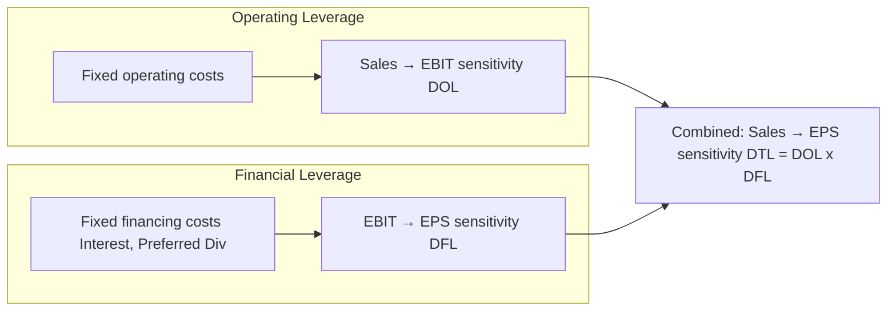

## Financial Leverage Definition and Mechanics

### Conceptual Foundation

Financial leverage refers to the use of fixed-cost financing sources — primarily debt and preferred stock — to fund a firm's assets, in place of or alongside equity. Unlike operating leverage (which arises from fixed *operating* costs), financial leverage arises from fixed *financing* charges: interest expense on debt and preferred dividends.

The core mechanic: fixed financing charges must be paid regardless of the firm's operating performance. This means that once operating income (EBIT) exceeds these fixed charges, the *residual* return to common shareholders grows disproportionately as EBIT rises — and shrinks disproportionately as EBIT falls. Financial leverage is thus a mechanism for transferring risk and potential return between the firm's capital providers, concentrating both in a smaller equity base.

**Key Points**

- Financial leverage magnifies the variability of earnings per share (EPS) and return on equity (ROE) relative to variability in EBIT.
- It does not change the firm's underlying business risk (that is operating leverage's domain) — it adds **financial risk** on top of it.
- Leverage is favorable when the firm earns a return on assets that exceeds the after-tax cost of debt; it is unfavorable in the reverse case.
- Financial leverage is a capital structure decision, distinct from and compounding with operating leverage.

---

### The Leverage Mechanism

Consider a firm financed with a mix of debt (fixed interest obligation) and equity. The income statement flow from EBIT to EPS is:

$$EBIT \rightarrow (\text{less Interest}) \rightarrow EBT \rightarrow (\text{less Taxes}) \rightarrow \text{Net Income} \rightarrow (\text{less Preferred Dividends}) \rightarrow \text{Earnings to Common} \rightarrow EPS$$

Because interest ($I$) is a fixed dollar amount (contractually set, independent of EBIT), any change in EBIT flows through almost entirely to EBT, then to net income, then concentrated across a fixed number of common shares. The higher the proportion of fixed charges relative to EBIT, the larger the *percentage* swing in EPS for a given *percentage* swing in EBIT.

**Illustration — Two Financing Structures**

Assume a firm needs $1,000,000 in assets and generates EBIT under two demand scenarios.

*Structure A — All Equity:* 100,000 shares issued, no debt.

*Structure B — Leveraged:* $500,000 in debt at 8% interest ($40,000/year), 50,000 shares issued.

|  | Structure A (EBIT = $100k) | Structure A (EBIT = $150k) | Structure B (EBIT = $100k) | Structure B (EBIT = $150k) |
| --- | --- | --- | --- | --- |
| EBIT | $100,000 | $150,000 | $100,000 | $150,000 |
| Interest | $0 | $0 | $40,000 | $40,000 |
| EBT | $100,000 | $150,000 | $60,000 | $110,000 |
| Taxes (30%) | $30,000 | $45,000 | $18,000 | $33,000 |
| Net Income | $70,000 | $105,000 | $42,000 | $77,000 |
| Shares | 100,000 | 100,000 | 50,000 | 50,000 |
| EPS | $0.70 | $1.05 | $0.84 | $1.54 |

A 50% increase in EBIT ($100k → $150k) produces:

- Structure A: EPS rises 50% ($0.70 → $1.05) — no amplification, since there is no fixed financial charge.
- Structure B: EPS rises 83.3% ($0.84 → $1.54) — amplified due to the fixed interest charge being "absorbed" before the residual accrues to fewer shares.

This demonstrates the core mechanic: **the same operating performance produces a materially different, and more volatile, equity return outcome under leverage.**

---

### Degree of Financial Leverage (DFL)

DFL quantifies the sensitivity of EPS to changes in EBIT:

$$DFL = \frac{\%\Delta EPS}{\%\Delta EBIT} = \frac{EBIT}{EBIT - I}$$

When preferred dividends ($PD$) exist, since these are paid from after-tax income, the formula adjusts to keep units consistent:

$$DFL = \frac{EBIT}{EBIT - I - \dfrac{PD}{1-t}}$$

Where $t$ is the marginal tax rate.

**Example (using Structure B at EBIT = $100,000):**

$$DFL = \frac{100{,}000}{100{,}000 - 40{,}000} = \frac{100{,}000}{60{,}000} = 1.67$$

Interpretation: a 1% change in EBIT produces approximately a 1.67% change in EPS at this operating level. Verifying against the table above: EBIT rose 50%, and $1.67 \times 50\% = 83.5\%$, closely matching the 83.3% EPS increase computed directly (the small discrepancy stems from rounding at intermediate steps).

Like DOL, **DFL is not a fixed firm characteristic** — it is measured at a specific EBIT level and changes as EBIT changes, since it captures a local sensitivity around the current base rather than a constant multiplier valid across all output levels.

---

### Favorable vs. Unfavorable Leverage

The desirability of financial leverage hinges on the relationship between the return generated on borrowed funds and the cost of that debt:

- **Favorable (positive) leverage:** Return on assets (ROA) > after-tax cost of debt. Borrowing to invest in assets that earn more than the cost of the debt increases ROE for shareholders — leverage "works for" equity holders.
- **Unfavorable (negative) leverage:** ROA < after-tax cost of debt. In this case, servicing debt consumes more than the assets generate, and leverage erodes ROE — the fixed obligation persists even as returns disappoint.

This relationship can be expressed via the leverage effect on ROE:

$$ROE = ROA + \left(ROA - r_d(1-t)\right) \times \frac{D}{E}$$

Where $r_d$ is the pre-tax cost of debt, $D/E$ is the debt-to-equity ratio, and $t$ is the tax rate. The term $(ROA - r_d(1-t))$ is the leverage spread — positive spread amplifies ROE upward with more debt; negative spread amplifies ROE downward with more debt. [Note: this decomposition assumes a simplified capital structure without preferred stock and treats $D/E$ and $r_d$ as constant, which may not hold as leverage increases and lenders reprice risk. [Inference]]

---

### The Tax Shield Effect

Interest expense is generally tax-deductible, while dividends to equity holders are not. This creates the **interest tax shield**:

$$\text{Tax Shield} = I \times t$$

This is a secondary mechanism (distinct from the EPS-amplification mechanic above) through which debt financing can increase the total cash flow available to capital providers, all else equal — a foundational element of capital structure theory (e.g., Modigliander-Miller with taxes). [Unverified: the realized value of the tax shield depends on the firm consistently having sufficient taxable income to utilize the deduction, and on jurisdiction-specific tax rules]

---

### Risk Implications

| Aspect | Effect of Higher Financial Leverage |
| --- | --- |
| EPS volatility | Increases (higher DFL) |
| ROE volatility | Increases |
| Fixed obligations | Interest and principal repayment become mandatory, independent of performance |
| Bankruptcy / default risk | Increases, especially in downturns |
| Financial flexibility | Decreases — less capacity to raise additional debt cheaply |
| Equity holder residual claim | Smaller equity base absorbs full swing in profits/losses |
| Cost of equity | Typically rises, reflecting increased risk borne by shareholders |

A critical distinction: financial leverage does **not** change the firm's *operating* risk (the volatility of EBIT itself) — it only determines how a given level of EBIT volatility is transmitted and amplified into EPS and ROE volatility for common shareholders.

---

### Diagram: Financial Leverage Mechanism (svg_diagram)

<svg xmlns="http://www.w3.org/2000/svg" viewBox="0 0 760 420" font-family="Arial, sans-serif">
<text x="380" y="26" text-anchor="middle" font-size="17" font-weight="bold">Financial Leverage Mechanism (svg_diagram)</text>

<rect x="40" y="60" width="140" height="50" rx="6" fill="#3498db" opacity="0.15" stroke="#3498db" stroke-width="1.5" />
<text x="110" y="90" text-anchor="middle" font-size="13" font-weight="bold">EBIT</text>

<line x1="180" y1="85" x2="260" y2="85" stroke="black" stroke-width="1.5" marker-end="url(#arrow)" />

<rect x="260" y="30" width="150" height="45" rx="6" fill="#e74c3c" opacity="0.15" stroke="#e74c3c" stroke-width="1.5" />
<text x="335" y="57" text-anchor="middle" font-size="12">Interest (Fixed, I)</text>

<rect x="260" y="100" width="150" height="45" rx="6" fill="#f39c12" opacity="0.15" stroke="#f39c12" stroke-width="1.5" />
<text x="335" y="127" text-anchor="middle" font-size="12" font-weight="bold">EBT</text>
<line x1="180" y1="85" x2="335" y2="52" stroke="black" stroke-width="1" stroke-dasharray="4,2" />
<line x1="180" y1="85" x2="335" y2="122" stroke="black" stroke-width="1.5" marker-end="url(#arrow)" />

<line x1="410" y1="122" x2="480" y2="122" stroke="black" stroke-width="1.5" marker-end="url(#arrow)" />
<rect x="480" y="100" width="150" height="45" rx="6" fill="#9b59b6" opacity="0.15" stroke="#9b59b6" stroke-width="1.5" />
<text x="555" y="127" text-anchor="middle" font-size="12">Net Income</text>

<line x1="555" y1="145" x2="555" y2="210" stroke="black" stroke-width="1.5" marker-end="url(#arrow)" />
<rect x="470" y="210" width="170" height="50" rx="6" fill="#2ecc71" opacity="0.15" stroke="#2ecc71" stroke-width="1.5" />
<text x="555" y="240" text-anchor="middle" font-size="13" font-weight="bold">EPS (fewer shares)</text>

<text x="110" y="180" font-size="12" fill="#555">EBIT change flows fully</text>

<text x="110" y="196" font-size="12" fill="#555">through fixed interest layer</text>

<text x="440" y="290" font-size="12" fill="#555">Result: %ΔEPS &gt; %ΔEBIT</text>

<text x="440" y="306" font-size="12" fill="#555">when EBIT &gt; Interest (DFL &gt; 1)</text>

</svg>

---

### Financial Leverage vs. Operating Leverage — Distinguishing the Two

---

### Common Pitfalls in Interpretation

- Treating DFL as constant across all EBIT levels — it is highly sensitive near the point where EBIT approaches the fixed charge amount, approaching infinity as $EBIT \to I$.
- Confusing financial leverage with operating leverage when diagnosing earnings volatility — they arise from different fixed-cost layers (operating vs. capital structure) and require different remedies.
- Assuming leverage is inherently value-destructive; the sign of its effect depends entirely on the spread between asset returns and the cost of debt, not on the presence of debt itself.
- Ignoring preferred stock's fixed dividend obligation, which behaves similarly to debt for DFL purposes despite not being a debt instrument.

---

### Related Topics

- Degree of Combined/Total Leverage (DTL = DOL × DFL)
- Capital structure theory: Modigliani-Miller propositions with and without taxes
- Cost of capital (WACC) and its relationship to leverage
- Trade-off theory of capital structure (tax shield vs. financial distress costs)
- ROE decomposition (DuPont analysis) and the leverage multiplier component
- Credit risk and covenant analysis under high leverage
- Interest coverage ratio and debt capacity assessment