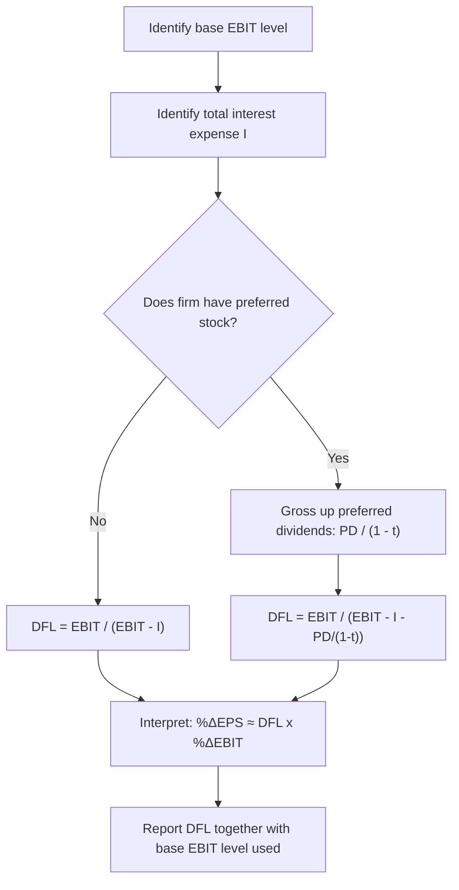

## The Degree of Financial Leverage Formula

### Definition and Purpose

The Degree of Financial Leverage (DFL) is a quantitative measure of how sensitive a firm's earnings per share (EPS), or earnings available to common shareholders, is to a given percentage change in operating income (EBIT). It isolates the amplifying effect of fixed financing charges — interest and preferred dividends — on the residual earnings that accrue to common equity.

**Key Points**

- DFL measures elasticity: the percentage response in EPS per percentage change in EBIT.
- It captures financial risk specifically — risk introduced by the capital structure, separate from operating (business) risk.
- DFL is evaluated at a specific EBIT level; it is a local measure, not a fixed constant of the firm.
- A DFL of 1.0 indicates no financial leverage (no fixed financing charges); values above 1.0 indicate amplification.

---

### The Core Formula

**Percentage-Change (Definitional) Form:**

$$DFL = \frac{\%\Delta EPS}{\%\Delta EBIT}$$

This is the fundamental definition — DFL as an elasticity computed from two income statements at different EBIT levels.

**Point Formula (No Preferred Stock):**

$$DFL = \frac{EBIT}{EBIT - I}$$

Where:

- $EBIT$ = earnings before interest and taxes at the base level
- $I$ = total interest expense (fixed financing charge)

**Point Formula (With Preferred Stock):**

Since preferred dividends are paid from after-tax income (they are not tax-deductible like interest), they must be "grossed up" to a pre-tax equivalent to keep the formula's units consistent:

$$DFL = \frac{EBIT}{EBIT - I - \dfrac{PD}{1-t}}$$

Where:

- $PD$ = total preferred dividends
- $t$ = the firm's marginal tax rate

**Derivation logic:** EPS is derived from EBIT by subtracting interest (pre-tax), then applying taxes, then subtracting preferred dividends (post-tax) before dividing by shares outstanding. Because $\%\Delta EPS / \%\Delta EBIT$ simplifies algebraically to $EBIT / (EBIT - I - PD/(1-t))$, dividing preferred dividends by $(1-t)$ restates them on the same pre-tax basis as interest, ensuring the denominator reflects total fixed-charge burden in comparable units.

---

### Worked Example — No Preferred Stock

A firm has:

- EBIT = $800,000
- Interest expense = $300,000

$$DFL = \frac{800{,}000}{800{,}000 - 300{,}000} = \frac{800{,}000}{500{,}000} = 1.60$$

**Interpretation:** A 1% increase in EBIT is expected to produce approximately a 1.6% increase in EPS. A 20% decline in EBIT would be expected to produce approximately a 32% decline in EPS ($1.60 \times 20\%$).

**Verification via full income statement (100,000 shares, 25% tax rate):**

|  | Base (EBIT = $800k) | EBIT +10% ($880k) |
| --- | --- | --- |
| EBIT | $800,000 | $880,000 |
| Interest | $300,000 | $300,000 |
| EBT | $500,000 | $580,000 |
| Taxes (25%) | $125,000 | $145,000 |
| Net Income | $375,000 | $435,000 |
| EPS (100k shares) | $3.75 | $4.35 |

$\%\Delta EPS = (4.35 - 3.75)/3.75 = 16.0\%$

$\%\Delta EBIT = 10\%$

$DFL_{realized} = 16.0\% / 10\% = 1.60$ — matching the point formula exactly, confirming internal consistency.

---

### Worked Example — With Preferred Stock

A firm has:

- EBIT = $500,000
- Interest expense = $100,000
- Preferred dividends = $60,000
- Tax rate = 30%

$$DFL = \frac{500{,}000}{500{,}000 - 100{,}000 - \dfrac{60{,}000}{1 - 0.30}}$$

$$= \frac{500{,}000}{500{,}000 - 100{,}000 - 85{,}714} = \frac{500{,}000}{314{,}286} = 1.59$$

**Common error to flag:** Omitting the $(1-t)$ adjustment and simply subtracting raw preferred dividends understates the true fixed-charge burden, since preferred dividends consume more pre-tax earnings than their face amount to leave the stated after-tax dividend intact. This is one of the most frequent calculation errors in applying the DFL formula.

---

### Behavior of the Formula Across EBIT Levels

DFL is not constant — it is a function of where EBIT stands relative to fixed charges:

| EBIT relative to fixed charges | DFL behavior |
| --- | --- |
| $EBIT \to \infty$ | $DFL \to 1$ (fixed charges become negligible relative to EBIT) |
| $EBIT$ slightly above fixed charges | $DFL \to \infty$ (denominator approaches zero) |
| $EBIT = $ fixed charges exactly | DFL undefined (division by zero) |
| $EBIT < $ fixed charges | DFL formula still computes but yields a negative value, signaling that a decline in EBIT causes an even larger *percentage* decline in an already-negative or thin earnings base — interpretation requires care in this region [Inference: sign interpretation in this region is a known analytical subtlety in leverage formulas and is generally treated cautiously in practice] |

This non-linearity means analysts should always report the EBIT level at which a DFL figure is calculated, since quoting DFL without its base level is not meaningfully interpretable.

---

### Relationship to the Combined/Total Leverage Formula

DFL is one multiplicative component of the Degree of Total (Combined) Leverage:

$$DTL = DOL \times DFL = \frac{\%\Delta EPS}{\%\Delta Sales}$$

This shows DFL's role in isolating the "second stage" amplification — from EBIT to EPS — that occurs after DOL has already amplified the "first stage" — from Sales to EBIT. Multiplying the two chains the full sensitivity from top-line sales all the way to bottom-line per-share earnings.

---

### Diagram: DFL as an Elasticity Chain (svg_diagram)

<svg xmlns="http://www.w3.org/2000/svg" viewBox="0 0 760 320" font-family="Arial, sans-serif">
<text x="380" y="26" text-anchor="middle" font-size="17" font-weight="bold">DFL Formula Structure (svg_diagram)</text>
<rect x="40" y="70" width="160" height="55" rx="6" fill="#3498db" opacity="0.15" stroke="#3498db" stroke-width="1.5" />
<text x="120" y="102" text-anchor="middle" font-size="13" font-weight="bold">EBIT (numerator)</text>
<line x1="200" y1="97" x2="280" y2="97" stroke="black" stroke-width="1.5" marker-end="url(#arrow2)" />
<text x="240" y="88" text-anchor="middle" font-size="11">÷</text>
<rect x="280" y="70" width="230" height="55" rx="6" fill="#e74c3c" opacity="0.15" stroke="#e74c3c" stroke-width="1.5" />
<text x="395" y="95" text-anchor="middle" font-size="12" font-weight="bold">EBIT − Interest</text>
<text x="395" y="112" text-anchor="middle" font-size="11">− PD / (1 − t)</text>
<line x1="510" y1="97" x2="590" y2="97" stroke="black" stroke-width="1.5" marker-end="url(#arrow2)" />
<text x="550" y="88" text-anchor="middle" font-size="11">=</text>
<rect x="590" y="70" width="130" height="55" rx="6" fill="#2ecc71" opacity="0.15" stroke="#2ecc71" stroke-width="1.5" />
<text x="655" y="102" text-anchor="middle" font-size="14" font-weight="bold">DFL</text>

<text x="120" y="160" font-size="12" fill="#555">Total earnings base</text>

<text x="395" y="160" font-size="12" fill="#555">Earnings after all fixed</text>

<text x="395" y="176" font-size="12" fill="#555">financing charges (pre-tax equiv.)</text>

<line x1="40" y1="220" x2="720" y2="220" stroke="#999" stroke-width="1" stroke-dasharray="4,3" />
<text x="380" y="245" text-anchor="middle" font-size="12" fill="#555">As denominator shrinks toward zero (EBIT ≈ fixed charges), DFL grows without bound</text>
</svg>

---

### Calculation Workflow

---

### Practical Considerations and Limitations

- **Linearity assumption:** The point formula assumes interest and preferred dividends remain fixed as EBIT changes over the relevant range — reasonable for small changes, but large EBIT swings may coincide with refinancing, covenant triggers, or changes in debt levels that invalidate the static assumption. [Inference]
- **Tax rate sensitivity:** The preferred-stock adjustment depends on the marginal tax rate remaining stable; a change in tax rate (e.g., a firm moving between tax brackets or jurisdictions) alters the effective DFL. [Unverified: exact tax treatment of preferred dividends varies by jurisdiction and corporate structure]
- **Comparability across firms:** DFL comparisons across firms are only meaningful when computed at analogous EBIT bases relative to each firm's fixed-charge structure — comparing DFL at wildly different distances from breakeven can be misleading.
- **Use in forecasting:** DFL is frequently used to project EPS sensitivity under different EBIT scenarios (e.g., stress testing), but should be recalculated at each scenario's EBIT level rather than applied as a single static multiplier across a wide range.

---

### Related Topics

- Degree of Operating Leverage (DOL) formula and derivation
- Degree of Total/Combined Leverage (DTL = DOL × DFL)
- EPS sensitivity analysis and scenario/stress testing
- Preferred stock features and their treatment in capital structure analysis
- Interest coverage ratio (EBIT / Interest) as a related solvency metric
- Capital structure optimization and the tradeoff theory
- ROE leverage decomposition (DuPont framework)