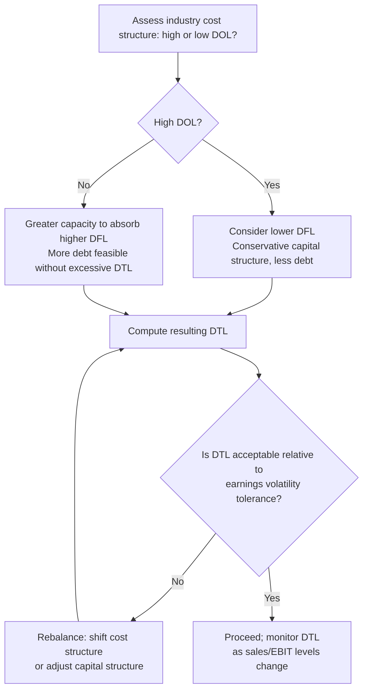

## Interaction Between Operating and Financial Leverage

### Conceptual Foundation

Operating leverage and financial leverage are two distinct sources of fixed-cost amplification acting on different segments of the income statement — but they do not operate independently. They compound **multiplicatively**, not additively, because each is an elasticity chained onto the output of the other. Operating leverage transforms sales volatility into EBIT volatility; financial leverage then transforms that already-amplified EBIT volatility into further-amplified EPS volatility. The result is that a firm combining both high fixed operating costs and high fixed financing charges experiences compounded — not merely summed — earnings sensitivity.

**Key Points**

- Operating leverage acts on the Sales → EBIT link; financial leverage acts on the EBIT → EPS link.
- The two combine multiplicatively via the Degree of Total (Combined) Leverage: $DTL = DOL \times DFL$.
- Total business risk (operating) and financial risk (financing) are conceptually separable but compound in their effect on equity holders.
- A firm can rationally offset high operating leverage with lower financial leverage (or vice versa) to manage aggregate earnings volatility — a key capital structure planning insight.

---

### The Combined Leverage Chain

The full pathway from sales to EPS can be decomposed into two sequential elasticity stages:

$$\text{Sales} \xrightarrow{DOL} \text{EBIT} \xrightarrow{DFL} \text{EPS}$$

Formally:

$$DTL = DOL \times DFL = \frac{\%\Delta EBIT}{\%\Delta Sales} \times \frac{\%\Delta EPS}{\%\Delta EBIT} = \frac{\%\Delta EPS}{\%\Delta Sales}$$

Note that $\%\Delta EBIT$ cancels algebraically, leaving DTL as a direct measure of how sensitive EPS is to sales changes — collapsing both fixed-cost layers (operating and financing) into a single end-to-end elasticity.

**Expanded formula (no preferred stock):**

$$DTL = \frac{Q(P - V)}{Q(P - V) - F - I}$$

Where:

- $Q(P-V)$ = total contribution margin
- $F$ = total fixed operating costs
- $I$ = interest expense

This form makes the compounding explicit: both fixed operating costs ($F$) and fixed financing costs ($I$) are subtracted from the same contribution margin base in the denominator, meaning both layers erode the same "cushion" that separates the firm from its overall breakeven point (in this case, the point where EPS itself would be zero).

---

### Worked Example

A firm has:

- Price $P = \$40$, Variable cost $V = \$25$ per unit
- Fixed operating costs $F = \$300{,}000$
- Interest expense $I = \$150{,}000$
- Current volume $Q = 40{,}000$ units

**Step 1 — Compute DOL:**

Contribution margin $= 40{,}000 \times (40-25) = \$600{,}000$

EBIT $= 600{,}000 - 300{,}000 = \$300{,}000$

$$DOL = \frac{600{,}000}{300{,}000} = 2.0$$

**Step 2 — Compute DFL:**

$$DFL = \frac{300{,}000}{300{,}000 - 150{,}000} = \frac{300{,}000}{150{,}000} = 2.0$$

**Step 3 — Compute DTL:**

$$DTL = DOL \times DFL = 2.0 \times 2.0 = 4.0$$

**Verification via direct formula:**

$$DTL = \frac{600{,}000}{600{,}000 - 300{,}000 - 150{,}000} = \frac{600{,}000}{150{,}000} = 4.0$$

Both approaches agree. **Interpretation:** a 10% increase in sales at this operating point would be expected to produce approximately a 40% increase in EPS — and symmetrically, a 10% sales decline would produce an approximate 40% EPS decline. This illustrates how a moderate degree of each individual leverage type (2.0 and 2.0) combines into a substantial combined sensitivity (4.0), which may not be intuitively obvious without decomposing the two effects.

---

### Risk Allocation Across the Chain

| Stage | Leverage Type | Risk Category | Affects |
| --- | --- | --- | --- |
| Sales → EBIT | Operating (DOL) | Business risk | All capital providers (both debt and equity) |
| EBIT → EPS | Financial (DFL) | Financial risk | Common equity holders specifically |
| Sales → EPS | Combined (DTL) | Total risk to equity | Common equity holders, compounded |

This decomposition matters because business risk (driven by cost structure and industry economics) and financial risk (driven by the capital structure decision) originate from different managerial levers and are typically managed by different means — operating risk through capacity planning, outsourcing, and automation choices; financial risk through capital structure and debt policy.

---

### Strategic Tradeoff: Offsetting One Leverage Type With the Other

Because DTL compounds multiplicatively, firms often manage aggregate earnings risk by deliberately choosing a financial leverage level that is inversely related to their operating leverage level:

- **High DOL industries** (e.g., airlines, semiconductor manufacturing, heavy industry) — characterized by high fixed operating costs relative to variable costs — often adopt more conservative capital structures (lower DFL, less debt) to avoid compounding already-high business risk with additional financial risk. This is a widely observed pattern in capital structure practice. [Inference: while this pattern is commonly cited in corporate finance analysis, individual firm capital structure decisions also reflect factors like industry norms, credit access, and management risk preference, so it should not be treated as a strict rule]
- **Low DOL industries** (e.g., retail, services, distribution) — characterized by predominantly variable cost structures — have more capacity to absorb financial leverage without excessive combined risk, since their EBIT is inherently more stable across demand cycles.

This is sometimes referred to informally as the **leverage tradeoff principle**: total firm risk is a function of both leverage types jointly, and prudent capital structure management considers them together rather than in isolation.

---

### Diagram: The Combined Leverage Pathway (svg_diagram)

<svg xmlns="http://www.w3.org/2000/svg" viewBox="0 0 780 380" font-family="Arial, sans-serif">
<text x="390" y="26" text-anchor="middle" font-size="17" font-weight="bold">Combined Leverage Pathway (svg_diagram)</text>
<rect x="30" y="80" width="140" height="55" rx="6" fill="#2ecc71" opacity="0.15" stroke="#2ecc71" stroke-width="1.5" />
<text x="100" y="112" text-anchor="middle" font-size="13" font-weight="bold">Sales</text>
<line x1="170" y1="107" x2="260" y2="107" stroke="black" stroke-width="1.5" marker-end="url(#arrow3)" />
<text x="215" y="95" text-anchor="middle" font-size="12" font-weight="bold">DOL</text>
<text x="215" y="130" text-anchor="middle" font-size="10" fill="#555">Fixed operating costs</text>
<rect x="260" y="80" width="140" height="55" rx="6" fill="#f39c12" opacity="0.15" stroke="#f39c12" stroke-width="1.5" />
<text x="330" y="112" text-anchor="middle" font-size="13" font-weight="bold">EBIT</text>
<line x1="400" y1="107" x2="490" y2="107" stroke="black" stroke-width="1.5" marker-end="url(#arrow3)" />
<text x="445" y="95" text-anchor="middle" font-size="12" font-weight="bold">DFL</text>
<text x="445" y="130" text-anchor="middle" font-size="10" fill="#555">Fixed financing costs</text>
<rect x="490" y="80" width="140" height="55" rx="6" fill="#9b59b6" opacity="0.15" stroke="#9b59b6" stroke-width="1.5" />
<text x="560" y="112" text-anchor="middle" font-size="13" font-weight="bold">EPS</text>

<path d="M 100 135 Q 330 260 560 135" stroke="#e74c3c" stroke-width="2" fill="none" stroke-dasharray="6,3" marker-end="url(#arrow3)" />
<text x="330" y="245" text-anchor="middle" font-size="13" font-weight="bold" fill="#e74c3c">DTL = DOL × DFL</text>
<text x="330" y="265" text-anchor="middle" font-size="11" fill="#555">Full compounded sensitivity, Sales → EPS</text>

<text x="390" y="330" text-anchor="middle" font-size="11" fill="#555">Business risk (DOL) and financial risk (DFL) accumulate along separate segments,</text>

<text x="390" y="346" text-anchor="middle" font-size="11" fill="#555">but their combined effect on equity holders is multiplicative, not additive.</text>

</svg>

---

### Decision Framework for Managing Combined Leverage

---

### Analytical and Forecasting Implications

- **Scenario planning:** Because both DOL and DFL vary with the operating point, DTL should be recomputed at each forecast scenario (optimistic, base, pessimistic) rather than treated as a static multiplier extrapolated from current conditions.
- **Early warning indicator:** A rising DTL over time — even without a change in headline debt levels — can signal that a firm is operating closer to its combined breakeven point (where EPS approaches zero), which is useful for credit and equity risk monitoring.
- **Cross-sectional comparison caution:** Comparing DTL across firms in different industries can be misleading unless each firm's DOL and DFL components are examined separately, since two firms can arrive at similar DTL figures through very different risk compositions (e.g., high DOL/low DFL vs. low DOL/high DFL).
- **Limitation of the linear model:** As with DOL and DFL individually, the DTL point formula assumes cost and financing structures remain fixed over the range being analyzed; large swings in sales may trigger changes in fixed cost bases (e.g., capacity expansion, refinancing) that invalidate the static assumption. [Inference]

---

### Related Topics

- Degree of Operating Leverage (DOL) — formula and derivation
- Degree of Financial Leverage (DFL) — formula and derivation
- Business risk vs. financial risk decomposition
- Capital structure theory and the tradeoff between operating and financial risk
- Breakeven analysis extended to EPS-based breakeven (combined breakeven point)
- Industry benchmarking of cost structure and leverage profiles
- Credit risk assessment using combined leverage and coverage ratios