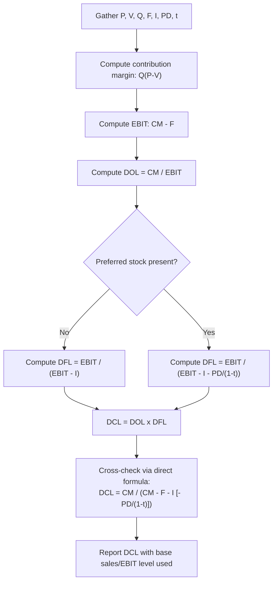

## The Degree of Combined Leverage Formula

### Definition and Purpose

The Degree of Combined Leverage (DCL), also called the Degree of Total Leverage (DTL), measures the sensitivity of earnings per share (EPS) to a percentage change in sales revenue. It is the single elasticity that captures the entire cost structure of the firm — both fixed operating costs and fixed financing costs — in one measure, spanning the full income statement from the top line to the bottom line per-share result.

**Key Points**

- DCL/DTL synthesizes operating leverage (DOL) and financial leverage (DFL) into one end-to-end sensitivity measure.
- It is derived as the product $DOL \times DFL$, reflecting the multiplicative (not additive) nature of the two-stage amplification.
- Like its components, DCL is a local measure — computed at a specific sales/EBIT level — not a fixed firm constant.
- It provides the most complete single-number summary of a firm's total earnings volatility relative to sales volatility.

---

### The Core Formulas

**Definitional (Elasticity) Form:**

$$DCL = \frac{\%\Delta EPS}{\%\Delta Sales}$$

**Multiplicative (Component) Form:**

$$DCL = DOL \times DFL$$

**Direct (Expanded) Point Formula — No Preferred Stock:**

$$DCL = \frac{Q(P - V)}{Q(P - V) - F - I}$$

**Direct (Expanded) Point Formula — With Preferred Stock:**

$$DCL = \frac{Q(P - V)}{Q(P - V) - F - I - \dfrac{PD}{1-t}}$$

Where:

- $Q$ = quantity sold
- $P$ = price per unit
- $V$ = variable cost per unit
- $F$ = total fixed operating costs
- $I$ = interest expense
- $PD$ = preferred dividends
- $t$ = marginal tax rate

**Derivation logic:** The numerator, $Q(P-V)$, is the total contribution margin — the pool of dollars available to cover all fixed charges (operating and financing) before any residual accrues to common equity. The denominator subtracts *both* layers of fixed cost ($F$ and $I$, plus the grossed-up preferred dividend term where applicable) from that same pool, directly measuring how thin the cushion is between current operations and the point where earnings to common shareholders reach zero.

---

### Worked Example — Full Derivation

A firm has:

- Price $P = \$60$, Variable cost $V = \$35$ per unit
- Fixed operating costs $F = \$500{,}000$
- Interest expense $I = \$200{,}000$
- Current volume $Q = 50{,}000$ units
- No preferred stock

**Step 1 — Contribution margin and EBIT:**

Contribution margin $= 50{,}000 \times (60 - 35) = \$1{,}250{,}000$

EBIT $= 1{,}250{,}000 - 500{,}000 = \$750{,}000$

**Step 2 — DOL:**

$$DOL = \frac{1{,}250{,}000}{750{,}000} = 1.667$$

**Step 3 — DFL:**

$$DFL = \frac{750{,}000}{750{,}000 - 200{,}000} = \frac{750{,}000}{550{,}000} = 1.364$$

**Step 4 — DCL via multiplication:**

$$DCL = 1.667 \times 1.364 = 2.273$$

**Step 5 — Verification via direct expanded formula:**

$$DCL = \frac{1{,}250{,}000}{1{,}250{,}000 - 500{,}000 - 200{,}000} = \frac{1{,}250{,}000}{550{,}000} = 2.273$$

Both methods agree. **Interpretation:** a 10% increase in sales at this operating point would be expected to produce approximately a 22.7% increase in EPS.

**Full income statement check (20,000 shares, 25% tax rate):**

|  | Base ($Q=50{,}000$) | Sales +10% ($Q=55{,}000$) |
| --- | --- | --- |
| Sales | $3,000,000 | $3,300,000 |
| Variable costs | $1,750,000 | $1,925,000 |
| Contribution margin | $1,250,000 | $1,375,000 |
| Fixed operating costs | $500,000 | $500,000 |
| EBIT | $750,000 | $875,000 |
| Interest | $200,000 | $200,000 |
| EBT | $550,000 | $675,000 |
| Taxes (25%) | $137,500 | $168,750 |
| Net Income | $412,500 | $506,250 |
| EPS (20k shares) | $20.625 | $25.3125 |

$\%\Delta EPS = (25.3125 - 20.625)/20.625 = 22.7\%$, precisely matching the DCL estimate of $2.273 \times 10\% = 22.7\%$.

---

### Behavior and Special Cases

| Condition | DCL Behavior |
| --- | --- |
| No fixed operating costs ($F=0$) and no debt ($I=0$) | $DCL = 1$ — EPS moves exactly proportionally with sales |
| High $F$, low $I$ | DCL driven primarily by DOL component |
| Low $F$, high $I$ | DCL driven primarily by DFL component |
| Sales near combined breakeven (denominator → 0) | $DCL \to \infty$ — extreme sensitivity near the point where EPS approaches zero |
| Sales well above combined breakeven | $DCL \to 1$ as fixed charges become proportionally negligible |

The combined breakeven point (in units) — where EPS equals zero — can be derived by setting the denominator of the expanded formula to zero:

$$Q_{BE,combined} = \frac{F + I}{P - V}$$

(extended to $\dfrac{F + I + PD/(1-t)}{P-V}$ where preferred stock exists). This differs from the simple operating breakeven ($Q_{BE} = F/(P-V)$ covered under operating leverage) by additionally requiring the contribution margin to cover financing charges, not just operating fixed costs.

---

### Using DCL for Risk Diagnosis

| Diagnostic Question | What DCL and Its Components Reveal |
| --- | --- |
| Is earnings volatility mainly operational or financial? | Compare DOL and DFL individually — a high DCL with high DOL/low DFL points to business risk; the reverse points to financial risk |
| How close is the firm to zero EPS? | Compare current $Q$ to $Q_{BE,combined}$ — smaller margin implies higher realized DCL |
| How would a recession affect EPS? | Apply DCL to a projected sales decline to estimate the resulting EPS decline, recomputing DCL at the new, lower base since it is not linear across large ranges |
| Is the firm's capital structure appropriately matched to its operating risk? | A high DOL combined with a high DFL compounds risk sharply — worth flagging for capital structure review |

---

### Diagram: DCL Formula Structure (svg_diagram)

<svg xmlns="http://www.w3.org/2000/svg" viewBox="0 0 780 340" font-family="Arial, sans-serif">
<text x="390" y="26" text-anchor="middle" font-size="17" font-weight="bold">Degree of Combined Leverage — Formula Structure (svg_diagram)</text>
<rect x="40" y="70" width="200" height="60" rx="6" fill="#3498db" opacity="0.15" stroke="#3498db" stroke-width="1.5" />
<text x="140" y="97" text-anchor="middle" font-size="13" font-weight="bold">Contribution Margin</text>
<text x="140" y="115" text-anchor="middle" font-size="11">Q(P − V)</text>
<line x1="240" y1="100" x2="320" y2="100" stroke="black" stroke-width="1.5" marker-end="url(#arrow4)" />
<text x="280" y="90" text-anchor="middle" font-size="11">÷</text>
<rect x="320" y="60" width="260" height="80" rx="6" fill="#e74c3c" opacity="0.15" stroke="#e74c3c" stroke-width="1.5" />
<text x="450" y="85" text-anchor="middle" font-size="12" font-weight="bold">Contribution Margin</text>
<text x="450" y="102" text-anchor="middle" font-size="11">− Fixed Operating Costs (F)</text>
<text x="450" y="119" text-anchor="middle" font-size="11">− Interest (I) [− PD/(1−t)]</text>
<line x1="580" y1="100" x2="650" y2="100" stroke="black" stroke-width="1.5" marker-end="url(#arrow4)" />
<text x="615" y="90" text-anchor="middle" font-size="11">=</text>
<rect x="650" y="70" width="100" height="60" rx="6" fill="#2ecc71" opacity="0.15" stroke="#2ecc71" stroke-width="1.5" />
<text x="700" y="105" text-anchor="middle" font-size="15" font-weight="bold">DCL</text>

<text x="140" y="160" font-size="11" fill="#555">Numerator: total</text>

<text x="140" y="176" font-size="11" fill="#555">contribution pool</text>

<text x="450" y="165" font-size="11" fill="#555">Denominator: residual after</text>

<text x="450" y="181" font-size="11" fill="#555">BOTH fixed-cost layers subtracted</text>

<line x1="40" y1="230" x2="750" y2="230" stroke="#999" stroke-width="1" stroke-dasharray="4,3" />
<text x="390" y="255" text-anchor="middle" font-size="12" fill="#555">Equivalent to DOL × DFL — same result reached via two independent calculation paths</text>
<text x="390" y="275" text-anchor="middle" font-size="12" fill="#555">Denominator shrinking toward zero (near combined breakeven) drives DCL toward infinity</text>
</svg>

---

### Calculation Workflow

---

### Practical Considerations and Limitations

- **Non-constancy across ranges:** DCL, like DOL and DFL, is a point estimate. It should be recalculated at each relevant sales scenario rather than applied as a fixed multiplier over wide forecast ranges, since the underlying formula is a ratio that changes shape as $Q$ moves.
- **Interpretive care near breakeven:** As current sales approach the combined breakeven point $Q_{BE,combined}$, DCL grows very large and becomes an unstable, unreliable predictor for practical forecasting purposes — small measurement errors in inputs can produce large swings in the reported figure. [Inference]
- **Decomposition is essential for diagnosis:** A given DCL value alone does not indicate *why* earnings are volatile — always examine the DOL and DFL components separately to determine whether the primary driver is cost structure (operating) or capital structure (financing).
- **Assumes cost/price stability:** The formula assumes $P$, $V$, $F$, and $I$ remain constant over the range being analyzed; in reality, large volume changes may trigger step-changes in fixed costs (e.g., added capacity) or renegotiated financing terms that break the static-formula assumption. [Inference]

---

### Related Topics

- Degree of Operating Leverage (DOL) — formula and derivation
- Degree of Financial Leverage (DFL) — formula and derivation
- Combined breakeven analysis (EPS-based breakeven point)
- Capital structure and cost structure alignment strategies
- Sensitivity and scenario analysis using leverage ratios
- Business risk vs. financial risk decomposition
- Coverage ratios (interest coverage, fixed charge coverage) as complementary solvency metrics