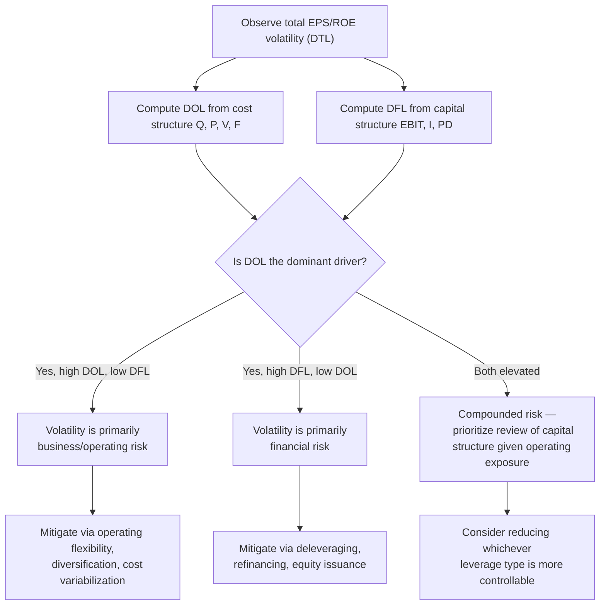

## Decomposing Total Risk into Business and Financial Risk

### Conceptual Foundation

Total risk borne by a firm's common equity holders — reflected in the volatility of earnings per share (EPS) and return on equity (ROE) — can be decomposed into two conceptually distinct, though interacting, components: **business risk** and **financial risk**. This decomposition is foundational to capital structure analysis, credit assessment, and equity valuation, because it separates risk arising from *how a firm operates* from risk arising from *how it finances those operations*.

**Key Points**

- Business risk is inherent to the firm's operations and industry, independent of financing choices.
- Financial risk is introduced entirely by the capital structure decision — specifically, the use of fixed-cost financing.
- Total risk to equity holders is the compounded effect of both, not their sum.
- The decomposition allows management, analysts, and investors to diagnose *where* volatility originates and to design offsetting strategies.

---

### Business Risk

**Definition:** Business risk (also called operating risk) is the inherent variability of a firm's operating income (EBIT) arising from the nature of its operations, industry, and cost structure — before any consideration of how the firm is financed.

**Primary drivers of business risk:**

1. **Demand variability** — cyclicality and sensitivity of sales to macroeconomic conditions, consumer preferences, or competitive dynamics.
2. **Sales price variability** — exposure to commodity price swings, competitive pricing pressure, or regulatory pricing constraints.
3. **Input cost variability** — volatility in the cost of raw materials, labor, or other variable inputs.
4. **Operating leverage (DOL)** — the proportion of fixed to variable operating costs, which determines how sensitively EBIT responds to sales changes (covered in detail under Degree of Operating Leverage).
5. **Ability to adjust costs and pricing** — flexibility to respond to changing conditions (e.g., adjusting output, renegotiating supplier contracts, repricing products).
6. **Diversification** — breadth of product lines, customer base, and geographic markets, which can smooth aggregate demand volatility.

Business risk exists **even for an all-equity-financed firm** — it is a function of the operating model alone, and represents the risk that would remain if the firm carried zero debt.

---

### Financial Risk

**Definition:** Financial risk is the *additional* variability introduced into EPS and ROE specifically because the firm uses fixed-cost financing sources (debt and preferred stock) rather than financing entirely with common equity.

**Primary drivers of financial risk:**

1. **Degree of financial leverage (DFL)** — the extent to which fixed interest and preferred dividend obligations amplify EBIT volatility into EPS volatility.
2. **Debt-to-equity ratio** — the proportion of the capital structure financed with fixed-obligation instruments.
3. **Cost of debt relative to return on assets** — determines whether leverage is favorable (amplifying gains) or unfavorable (amplifying losses).
4. **Debt maturity structure and covenants** — refinancing risk and the presence of restrictive covenants that constrain flexibility during downturns.
5. **Fixed charge coverage** — the cushion between EBIT and total fixed financing obligations.

Financial risk is **zero for an all-equity-financed firm** — it is entirely a consequence of the capital structure decision and can, in principle, be adjusted by management independent of the operating business.

---

### The Decomposition Framework

$$\text{Total Risk (EPS/ROE volatility)} = f(\text{Business Risk}) \times f(\text{Financial Risk})$$

Expressed through the leverage measures:

$$\underbrace{DTL}_{\text{Total Risk Proxy}} = \underbrace{DOL}_{\text{Business Risk Proxy}} \times \underbrace{DFL}_{\text{Financial Risk Proxy}}$$

This mirrors the combined leverage relationship covered elsewhere in this chapter, but reframes it explicitly as a **risk decomposition tool** rather than purely an earnings-sensitivity calculation. The insight is that DOL and DFL are not just elasticity multipliers — they serve as *quantitative proxies* for business risk and financial risk respectively, allowing analysts to attribute a firm's total earnings volatility to its operating side versus its financing side.

---

### Comparative Framework

| Dimension | Business Risk | Financial Risk |
| --- | --- | --- |
| Source | Operating cost structure, industry, demand | Capital structure, debt/preferred stock usage |
| Present in all-equity firm? | Yes | No (zero by definition) |
| Primary quantitative proxy | DOL | DFL |
| Who bears it | All capital providers (debt and equity) | Concentrated on common equity holders |
| Controllable by management? | Partially (via operating decisions, capacity planning) | Directly (via capital structure/financing decisions) |
| Typical mitigation | Diversification, flexible cost structures, hedging input/output prices | Reducing debt, extending maturities, using less leverage |
| Manifests as | EBIT volatility | Additional EPS/ROE volatility beyond EBIT volatility |

---

### Worked Illustration — Isolating Each Risk Component

Two firms in different industries, both currently at EBIT = $400,000:

**Firm A (Capital-intensive manufacturing):**

- $DOL = 3.5$ (high fixed operating costs)
- $DFL = 1.2$ (modest debt)
- $DTL = 3.5 \times 1.2 = 4.2$

**Firm B (Retail/distribution):**

- $DOL = 1.3$ (low fixed operating costs, mostly variable)
- $DFL = 3.0$ (heavily debt-financed)
- $DTL = 1.3 \times 3.0 = 3.9$

Both firms exhibit *similar* total leverage (DTL ≈ 4.0), yet their risk composition is fundamentally different:

- Firm A's volatility is **operationally driven** — a downturn in demand would hit EBIT hard regardless of financing, since fixed operating costs cannot flex down quickly.
- Firm B's volatility is **financially driven** — its EBIT is comparatively stable, but its heavy debt load means that even modest EBIT declines are sharply amplified into EPS declines.

**Practical implication:** these two firms require different risk mitigation strategies despite similar aggregate DTL — Firm A would benefit most from operational flexibility (variable cost conversion, diversification), while Firm B would benefit most from deleveraging or refinancing to reduce fixed financial obligations. This illustrates why decomposing total risk, rather than looking only at the aggregate DTL figure, is essential for sound risk management. [Inference: the specific mitigation priority in practice also depends on factors such as covenant terms, refinancing timing, and management's strategic flexibility, not solely on the DOL/DFL split]

---

### Diagram: Risk Decomposition Structure (svg_diagram)

<svg xmlns="http://www.w3.org/2000/svg" viewBox="0 0 780 400" font-family="Arial, sans-serif">
<text x="390" y="26" text-anchor="middle" font-size="17" font-weight="bold">Decomposition of Total Risk (svg_diagram)</text>
<rect x="290" y="55" width="200" height="50" rx="6" fill="#34495e" opacity="0.15" stroke="#34495e" stroke-width="1.5" />
<text x="390" y="85" text-anchor="middle" font-size="13" font-weight="bold">Total Risk (DTL)</text>
<line x1="340" y1="105" x2="180" y2="160" stroke="black" stroke-width="1.5" />
<line x1="440" y1="105" x2="600" y2="160" stroke="black" stroke-width="1.5" />
<rect x="60" y="160" width="240" height="90" rx="6" fill="#3498db" opacity="0.15" stroke="#3498db" stroke-width="1.5" />
<text x="180" y="185" text-anchor="middle" font-size="13" font-weight="bold">Business Risk</text>
<text x="180" y="203" text-anchor="middle" font-size="11">Proxy: DOL</text>
<text x="180" y="220" text-anchor="middle" font-size="10" fill="#555">Cost structure, demand,</text>
<text x="180" y="235" text-anchor="middle" font-size="10" fill="#555">industry, pricing power</text>
<rect x="480" y="160" width="240" height="90" rx="6" fill="#e74c3c" opacity="0.15" stroke="#e74c3c" stroke-width="1.5" />
<text x="600" y="185" text-anchor="middle" font-size="13" font-weight="bold">Financial Risk</text>
<text x="600" y="203" text-anchor="middle" font-size="11">Proxy: DFL</text>
<text x="600" y="220" text-anchor="middle" font-size="10" fill="#555">Debt load, preferred stock,</text>
<text x="600" y="235" text-anchor="middle" font-size="10" fill="#555">fixed charge coverage</text>

<text x="180" y="280" text-anchor="middle" font-size="11" fill="#555">Present even with zero debt</text>

<text x="600" y="280" text-anchor="middle" font-size="11" fill="#555">Zero for all-equity firm</text>

<line x1="60" y1="320" x2="720" y2="320" stroke="#999" stroke-width="1" stroke-dasharray="4,3" />
<text x="390" y="345" text-anchor="middle" font-size="12" fill="#555">Combine multiplicatively (DTL = DOL × DFL) — not additively — to determine</text>
<text x="390" y="362" text-anchor="middle" font-size="12" fill="#555">total earnings volatility borne by common equity holders</text>
</svg>

---

### Diagnostic Workflow

---

### Applications of the Decomposition

- **Capital structure policy:** Firms with inherently high business risk (e.g., cyclical, capital-intensive industries) often deliberately limit financial risk by maintaining lower leverage, recognizing that combined risk would otherwise become excessive — a pattern frequently observed across industries with differing operating cost structures. [Inference]
- **Credit analysis:** Lenders and rating agencies examine both DOL and DFL (or their underlying drivers) separately to assess whether a borrower's risk stems from an inherently volatile business model, a stretched balance sheet, or both — informing different covenant structures and pricing.
- **Cost of capital estimation:** Business risk is typically associated with a firm's *unlevered* (asset) beta in asset pricing models, while financial risk is captured by re-levering that beta to reflect the firm's actual capital structure — a standard technique for isolating financing effects when comparing firms with different leverage. [Inference: the precise beta re-levering formula and its assumptions (e.g., Hamada equation) depend on the specific model used and its underlying assumptions about debt beta and tax treatment]
- **Strategic planning:** Management evaluating a major capital expenditure (which may raise operating leverage) can use this decomposition to assess whether existing financial leverage should be reduced concurrently to keep total risk within an acceptable range.

---

### Common Analytical Pitfalls

- Treating DTL as informative on its own without decomposing it — the same DTL figure can arise from very different risk profiles, as shown in the worked example above.
- Assuming business risk is entirely outside management's control — while inherent to the industry to a degree, diversification, hedging, and flexible operating models can meaningfully influence it.
- Ignoring the interaction effect — because the two risks compound multiplicatively, a firm cannot fully understand its risk exposure by evaluating DOL and DFL as isolated, independent figures; their *product* is what matters for equity holders.
- Overlooking off-balance-sheet fixed obligations (e.g., long-term lease commitments, contractual purchase obligations) that behave like financial risk but may not appear in a simple debt-to-equity calculation. [Unverified: the appropriate treatment of such obligations depends on applicable accounting standards and the specific analytical framework used]

---

### Related Topics

- Degree of Operating Leverage (DOL) — formula and derivation
- Degree of Financial Leverage (DFL) — formula and derivation
- Degree of Combined/Total Leverage (DTL) formula
- Unlevered vs. levered beta (Hamada equation) in cost of capital estimation
- Capital structure theory: tradeoff theory and optimal leverage
- Credit rating methodology and coverage ratio analysis
- Diversification and its effect on aggregate business risk