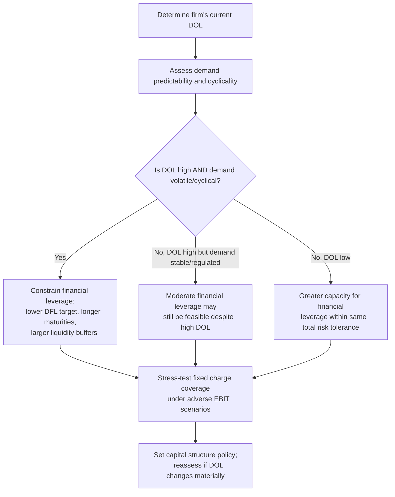

## Capital Structure Implications of High Operating Leverage

### Conceptual Foundation

A firm's degree of operating leverage (DOL) — determined by its cost structure — has direct, practical implications for how that firm should be financed. Because operating leverage and financial leverage compound multiplicatively into total risk borne by equity holders (as established via $DTL = DOL \times DFL$), a firm's operating risk profile is not a neutral backdrop to capital structure decisions — it is a primary input into them. High operating leverage constrains the amount of financial leverage a firm can prudently add without pushing total risk to levels that jeopardize solvency, credit access, or investor confidence.

**Key Points**

- High DOL firms exhibit greater EBIT volatility, meaning fixed financing charges are serviced from a less predictable earnings base.
- Because $DTL = DOL \times DFL$, a high DOL firm reaches a given DTL "budget" at a much lower DFL than a low DOL firm.
- Debt capacity is inversely related to operating leverage, all else equal — the observed empirical pattern is that capital-intensive, high-fixed-cost industries tend toward more conservative leverage, though firm-specific factors also matter significantly.
- Fixed charge coverage, not just debt-to-equity ratios, becomes especially critical for assessing appropriate leverage in high-DOL firms.

---

### Why High Operating Leverage Constrains Debt Capacity

**1. EBIT Volatility Threatens Fixed Charge Coverage**

Interest and principal obligations are fixed regardless of operating performance. A high-DOL firm's EBIT can swing sharply with modest sales changes (recall $DOL = \%\Delta EBIT / \%\Delta Sales$), meaning that in a downturn, EBIT can fall toward or below the level needed to cover interest obligations far more readily than for a low-DOL firm with the same current EBIT level.

**2. Compounding Effect on Total Leverage**

Since $DTL = DOL \times DFL$, adding financial leverage on top of high operating leverage produces a **disproportionately large** increase in total earnings sensitivity. Consider two firms both targeting a maximum acceptable $DTL$ of 6.0:

|  | High-DOL Firm ($DOL = 4.0$) | Low-DOL Firm ($DOL = 1.5$) |
| --- | --- | --- |
| Maximum sustainable DFL | $6.0 / 4.0 = 1.5$ | $6.0 / 1.5 = 4.0$ |
| Implied debt capacity | Low — must keep interest small relative to EBIT | High — can support substantially more fixed financing charges |

This illustrates why the same total-risk tolerance ($DTL \leq 6.0$) translates into very different financial leverage capacities depending on the underlying operating cost structure.

**3. Reduced Flexibility During Downturns**

High-DOL firms cannot easily shed fixed operating costs in a downturn (equipment, long-term leases, salaried workforce). If they are also highly financially levered, they face two layers of inflexible fixed obligations simultaneously — operating and financing — precisely when cash flow is under the most pressure. This dual inflexibility elevates the probability of covenant breaches, credit downgrades, or financial distress during cyclical troughs. [Inference: the magnitude of this effect depends on the specific timing and depth of a downturn, and on other firm-specific liquidity buffers, so it should be understood as a structural vulnerability rather than a certainty]

---

### Empirical Patterns Across Industries

| Industry Type | Typical DOL | Typical Capital Structure Pattern |
| --- | --- | --- |
| Airlines | High (aircraft, crew, fixed schedules) | Historically variable; heavy debt use has contributed to volatility in this sector during downturns [Unverified: current leverage levels vary considerably by carrier and over time and should be checked against current data for any specific analysis] |
| Utilities | High (large fixed infrastructure) | Often supported by regulated, stable demand — allows higher leverage despite high DOL, since regulatory structure reduces effective business risk |
| Semiconductor manufacturing | High (fab costs largely fixed) | Tends toward more conservative leverage; also common to maintain substantial cash reserves given cyclicality [Inference] |
| Retail/distribution | Low (largely variable costs) | Can typically support relatively higher leverage in normal conditions due to more stable EBIT |
| Software/SaaS | High at scale (low marginal cost) but often young/high-growth | Often financed primarily with equity rather than debt, particularly pre-profitability, partly due to earnings unpredictability during growth phases [Inference] |

**Important caveat:** the utilities example demonstrates that DOL alone does not fully determine appropriate leverage — the *predictability* of demand matters as much as the cost structure itself. A high-DOL firm facing highly stable, regulated, or contractually secured demand may reasonably carry more financial leverage than a high-DOL firm facing volatile, cyclical demand, because the effective business risk differs even at similar DOL levels.

---

### Practical Capital Structure Guidelines for High-DOL Firms

1. **Prioritize fixed charge coverage ratios** over simple debt-to-equity or debt-to-assets ratios, since coverage directly measures the cushion between EBIT and fixed obligations — the metric most sensitive to the interaction with operating leverage.
2. **Favor longer debt maturities** to reduce refinancing risk during cyclical troughs, when the firm's ability to access credit markets on favorable terms may itself be impaired.
3. **Maintain larger cash and liquidity buffers** to absorb EBIT volatility without breaching covenants or missing fixed payments.
4. **Consider hybrid or flexible financing instruments** (e.g., convertible debt, revenue-based financing) where fixed obligations can adjust somewhat with performance, partially mitigating the compounding effect.
5. **Stress-test capital structure decisions against DOL-driven downside scenarios** — model EBIT under a meaningfully adverse demand scenario (informed by the firm's DOL) and verify fixed charges remain serviceable, rather than only underwriting to a base-case forecast.
6. **Reassess capital structure when DOL changes** — e.g., after a major capacity expansion or automation investment that raises fixed operating costs, since the previously "safe" financial leverage level may no longer be appropriate.

---

### The Aggregate Risk Budget Concept

A useful mental model is treating total acceptable risk (an implicit "DTL budget," informed by industry norms, credit rating targets, or management risk tolerance) as a constraint to be allocated between operating and financial leverage:

$$DTL_{max} = DOL \times DFL_{max} \implies DFL_{max} = \frac{DTL_{max}}{DOL}$$

As $DOL$ rises, the "budget" remaining for $DFL$ shrinks proportionally, all else equal. This reframes capital structure policy not as an isolated financing decision, but as one component of a joint operating-financing risk allocation problem.

---

### Diagram: Risk Budget Allocation Concept (svg_diagram)

<svg xmlns="http://www.w3.org/2000/svg" viewBox="0 0 760 380" font-family="Arial, sans-serif">
<text x="380" y="26" text-anchor="middle" font-size="17" font-weight="bold">Operating Leverage Constrains Financial Leverage Capacity (svg_diagram)</text>

<text x="190" y="60" text-anchor="middle" font-size="13" font-weight="bold">High-DOL Firm</text>

<rect x="60" y="80" width="260" height="40" fill="`#e74c3c`" opacity="0.4" stroke="`#c0392b`" />

<text x="190" y="105" text-anchor="middle" font-size="12" fill="white">DOL = 4.0 (large share of budget)</text>

<rect x="60" y="120" width="98" height="40" fill="`#3498db`" opacity="0.4" stroke="`#2980b9`" />

<text x="109" y="145" text-anchor="middle" font-size="11">DFL ≤ 1.5</text>

<text x="190" y="180" text-anchor="middle" font-size="11" fill="#555">Total risk budget (DTL) largely consumed by DOL</text>

<text x="190" y="196" text-anchor="middle" font-size="11" fill="#555">→ little room remains for financial leverage</text>

<text x="570" y="60" text-anchor="middle" font-size="13" font-weight="bold">Low-DOL Firm</text>

<rect x="440" y="80" width="98" height="40" fill="`#e74c3c`" opacity="0.4" stroke="`#c0392b`" />

<text x="489" y="105" text-anchor="middle" font-size="11" fill="white">DOL=1.5</text>

<rect x="440" y="120" width="260" height="40" fill="`#3498db`" opacity="0.4" stroke="`#2980b9`" />

<text x="570" y="145" text-anchor="middle" font-size="12">DFL ≤ 4.0 (large room remains)</text>

<text x="570" y="180" text-anchor="middle" font-size="11" fill="#555">Low operating risk leaves more</text>

<text x="570" y="196" text-anchor="middle" font-size="11" fill="#555">capacity for financial leverage</text>

<line x1="40" y1="230" x2="740" y2="230" stroke="#999" stroke-width="1" stroke-dasharray="4,3" />
<text x="380" y="255" text-anchor="middle" font-size="12" fill="#555">Both firms shown at the same total risk tolerance, DTL_max = 6.0</text>
<text x="380" y="272" text-anchor="middle" font-size="12" fill="#555">Illustrates why DOL and DFL should be evaluated jointly, not independently, in capital structure policy</text>
</svg>

---

### Decision Framework

---

### Common Pitfalls

- Setting capital structure targets (e.g., a target debt-to-equity ratio) without reference to the firm's DOL, treating financing policy as independent of the operating cost structure.
- Benchmarking leverage solely against industry-average debt ratios without considering whether the firm's own demand predictability differs from the industry norm (as in the utilities example above).
- Failing to revisit capital structure after a significant shift in operating leverage — e.g., a major automation investment or a shift toward owned rather than leased facilities — which changes the DOL side of the risk equation.
- Relying only on point-in-time DTL calculations rather than stress-testing under a plausible adverse demand scenario, which is where the compounding effect of high DOL and high DFL becomes most consequential.

---

### Related Topics

- Degree of Operating Leverage (DOL) — formula and derivation
- Degree of Financial Leverage (DFL) — formula and derivation
- Degree of Combined/Total Leverage (DTL) and the multiplicative risk relationship
- Fixed charge coverage ratio and debt service coverage analysis
- Capital structure trade-off theory (tax benefits vs. financial distress costs)
- Industry-specific capital structure benchmarking
- Credit rating methodology as applied to cyclical, capital-intensive industries