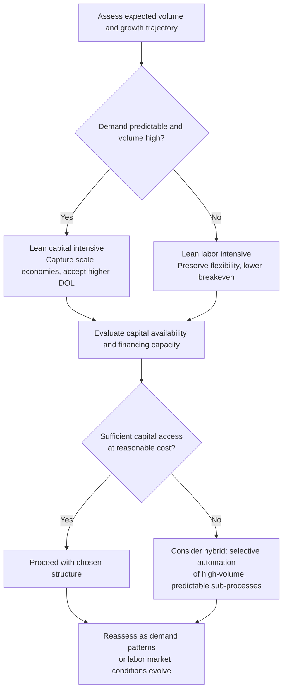

## Capital Intensive versus Labor Intensive Cost Structures

### Conceptual Foundation

Capital intensive and labor intensive represent two archetypal production strategies distinguished by the relative proportion of capital (equipment, automation, facilities) versus labor (human workforce) used to produce goods or services. This choice is a fundamental determinant of a firm's cost structure — capital intensity typically correlates with a higher proportion of fixed costs, while labor intensity typically correlates with a higher proportion of variable costs — and therefore connects directly to operating leverage, breakeven economics, and business risk.

**Key Points**

- Capital intensity substitutes fixed costs (depreciation, equipment financing, facility costs) for variable labor costs, generally raising operating leverage (DOL).
- Labor intensity substitutes variable costs (hourly wages, piece-rate compensation) for fixed capital costs, generally lowering DOL and increasing cost flexibility.
- The choice is not purely technological — it reflects strategic tradeoffs among cost efficiency at scale, flexibility, capital availability, and labor market conditions.
- Neither structure is universally superior; the optimal choice depends on demand predictability, expected volume, and the firm's risk tolerance.

---

### Capital Intensive Cost Structures

**Definition:** Production processes that rely heavily on machinery, automation, and fixed physical infrastructure relative to human labor input.

**Characteristics:**

- High fixed costs: depreciation, equipment financing/leasing, facility maintenance, insurance on capital assets.
- Lower variable cost per unit at scale, since machinery can often produce additional units with minimal incremental cost beyond materials and energy.
- Higher breakeven volume, but potentially lower average total cost per unit once volume is achieved.
- Typically higher DOL — EBIT is more sensitive to sales fluctuations.

**Representative examples:** automobile manufacturing, semiconductor fabrication, oil refining, airlines, utilities, and large-scale chemical processing.

**Advantages:**

1. **Economies of scale** — fixed costs spread over larger volumes reduce average cost per unit, potentially enabling more competitive pricing at high volume.
2. **Consistency and quality control** — automated processes often reduce variability in output quality compared to manual processes.
3. **Reduced dependency on labor markets** — less exposed to wage inflation, labor shortages, or unionization dynamics (though not immune, given the need for skilled technical staff to operate and maintain equipment).
4. **Higher throughput potential** — automated systems can often operate continuously (24/7) in ways manual labor cannot without significant additional cost.

**Disadvantages:**

1. **Higher business risk** — elevated DOL means downturns hit EBIT disproportionately hard, since fixed costs persist regardless of demand.
2. **Reduced flexibility** — difficult and costly to quickly scale production down (or up) in response to demand shifts; capital equipment cannot be "furloughed" the way labor can be reduced.
3. **High upfront capital requirements** — significant investment needed before any output is produced, raising financing needs and execution risk.
4. **Obsolescence risk** — technology and equipment can become outdated, requiring further capital investment to remain competitive. [Inference: the pace of this risk varies substantially by industry and specific technology]

---

### Labor Intensive Cost Structures

**Definition:** Production processes that rely heavily on human labor relative to capital equipment, where output scales primarily through hiring and scheduling workers rather than through fixed machinery.

**Characteristics:**

- High variable costs: wages, benefits, and often overtime or contractor costs that scale directly with output or service volume.
- Lower fixed costs: minimal specialized equipment or facility investment relative to capital intensive alternatives.
- Lower breakeven volume, since fewer fixed costs must be covered before profitability.
- Typically lower DOL — EBIT tends to track sales more proportionally.

**Representative examples:** consulting services, hospitality and food service, professional services (legal, accounting), agriculture in many contexts, and certain retail operations.

**Advantages:**

1. **Greater flexibility** — labor levels can typically be adjusted (hiring, layoffs, hours reduction) more quickly and with lower cost than capital equipment can be added or removed.
2. **Lower breakeven risk** — the firm requires a smaller volume to cover its (lower) fixed cost base, reducing downside exposure in a demand contraction.
3. **Lower upfront capital requirements** — reduces financing needs and the risk associated with large irreversible capital commitments.
4. **Adaptability to changing processes** — human labor can often be redeployed or retrained more readily than specialized equipment can be repurposed.

**Disadvantages:**

1. **Limited economies of scale** — unit costs do not decline as steeply with volume, since labor costs scale roughly proportionally with output.
2. **Exposure to labor market dynamics** — wage inflation, labor shortages, turnover, and unionization can directly and immediately affect the cost base.
3. **Quality and consistency variability** — human-performed processes can introduce more variability than automated ones, depending on the task.
4. **Potentially lower ceiling on throughput** — scaling output significantly may require proportionally scaling headcount, which carries its own recruiting, training, and management overhead costs.

---

### Comparative Summary

| Dimension | Capital Intensive | Labor Intensive |
| --- | --- | --- |
| Cost structure | Predominantly fixed | Predominantly variable |
| Typical DOL | High | Low |
| Breakeven volume | Higher | Lower |
| Flexibility to adjust to demand | Low (short run) | High |
| Economies of scale | Strong at high volume | Limited |
| Upfront capital requirement | High | Low |
| Sensitivity to labor market conditions | Lower (though skilled technical labor still matters) | High |
| Business risk profile | More volatile EBIT in cyclical downturns | More stable EBIT, tracks demand more closely |
| Typical financing implication | Often requires more conservative financial leverage given high DOL (see capital structure implications of high operating leverage) | Can often support relatively more financial leverage given lower DOL, all else equal |

---

### Strategic Decision Factors

Choosing between (or blending) capital intensive and labor intensive approaches typically depends on:

1. **Demand predictability** — stable, predictable demand supports capital intensity (fixed costs can be reliably covered); volatile or uncertain demand favors labor intensity (variable costs flex with actual volume).
2. **Expected volume and growth trajectory** — high anticipated volume favors capital intensity to capture scale economies; uncertain or currently low volume favors labor intensity to avoid stranding fixed investment.
3. **Capital availability and cost of capital** — access to affordable financing enables capital intensive strategies; capital constraints favor labor intensive approaches with lower upfront requirements.
4. **Labor market conditions** — tight labor markets, high wage inflation, or labor shortages can push firms toward automation (capital intensity) as a hedge against rising and unpredictable labor costs. [Inference: this dynamic is commonly cited as a driver of automation adoption, though the decision also depends on the specific cost and reliability of available automation technology for the task in question]
5. **Product/service standardization** — highly standardized, high-volume outputs are generally more amenable to capital intensive automation; customized, variable, or judgment-intensive outputs often remain labor intensive.
6. **Regulatory and competitive environment** — industry-specific regulations (e.g., safety, environmental) can favor one approach, and competitive pressure to match industry cost structures can constrain strategic choice.

---

### Hybrid and Transitional Structures

Most real-world firms operate somewhere on a spectrum rather than at either pure extreme, and many pursue deliberate **shifts** along this spectrum over time:

- **Automation transitions:** Firms often convert labor intensive processes to capital intensive ones as volume grows and demand stabilizes, converting variable labor costs into fixed depreciation to capture scale economies — directly raising DOL as part of a calculated growth strategy.
- **Outsourcing and variabilization:** Conversely, firms facing demand uncertainty may deliberately shift toward labor intensity (or outsourced, variable-cost labor arrangements) to reduce fixed costs and lower DOL, trading some scale efficiency for flexibility and risk reduction.
- **Selective automation:** Firms may automate only the most volume-stable or predictable parts of a process while keeping variable, judgment-dependent, or highly fluctuating portions labor intensive — a blended approach that manages aggregate business risk.

---

### Diagram: Cost Structure Comparison (svg_diagram)

<svg xmlns="http://www.w3.org/2000/svg" viewBox="0 0 760 400" font-family="Arial, sans-serif">

<text x="380" y="26" text-anchor="middle" font-size="17" font-weight="bold">Capital Intensive vs. Labor Intensive Cost Curves (svg_diagram)</text>

<line x1="80" y1="350" x2="700" y2="350" stroke="black" stroke-width="2" />

<line x1="80" y1="350" x2="80" y2="60" stroke="black" stroke-width="2" />

<text x="390" y="380" text-anchor="middle" font-size="13">Units Produced (Q)</text>

<text x="30" y="205" text-anchor="middle" font-size="13" transform="rotate(-90 30 205)">Total Cost ($)</text>

<line x1="80" y1="270" x2="700" y2="180" stroke="#c0392b" stroke-width="2.5" />

<text x="600" y="170" font-size="12" fill="#c0392b">Capital Intensive (high F, low V)</text>

<line x1="80" y1="270" x2="700" y2="270" stroke="#c0392b" stroke-width="1.5" stroke-dasharray="5,3" />

<text x="90" y="262" font-size="11" fill="#c0392b">High Fixed Cost Base</text>

<line x1="80" y1="330" x2="700" y2="100" stroke="#2980b9" stroke-width="2.5" />

<text x="600" y="90" font-size="12" fill="#2980b9">Labor Intensive (low F, high V)</text>

<line x1="80" y1="330" x2="700" y2="330" stroke="#2980b9" stroke-width="1.5" stroke-dasharray="5,3" />

<text x="90" y="322" font-size="11" fill="#2980b9">Low Fixed Cost Base</text>

<circle cx="330" cy="225" r="5" fill="black" />

<text x="340" y="215" font-size="11" font-weight="bold">Crossover volume</text>

<text x="340" y="230" font-size="10" fill="#555">Below: labor intensive cheaper</text>

<text x="340" y="245" font-size="10" fill="#555">Above: capital intensive cheaper</text>

</svg>

---

### Decision Framework

---

### Connection to Broader Financial Concepts

- Capital intensity directly raises **Degree of Operating Leverage (DOL)**, connecting this strategic choice to the earnings-sensitivity framework covered under operating leverage.
- Because high DOL constrains prudent financial leverage capacity (see capital structure implications of high operating leverage), a firm's capital-vs-labor intensity choice has downstream implications for its optimal debt policy.
- The crossover volume concept parallels standard breakeven analysis, but applied to a make-or-buy / automate-or-not decision rather than a pure profitability breakeven.

---

### Related Topics

- Degree of Operating Leverage (DOL) and its relationship to cost structure choices
- Capital structure implications of high operating leverage
- Automation investment decisions and capital budgeting under uncertainty
- Outsourcing and variabilization strategies as risk management tools
- Economies of scale and minimum efficient scale in production economics
- Make-or-buy decisions and vertical integration tradeoffs
- Labor market economics: wage inflation, automation substitution effects