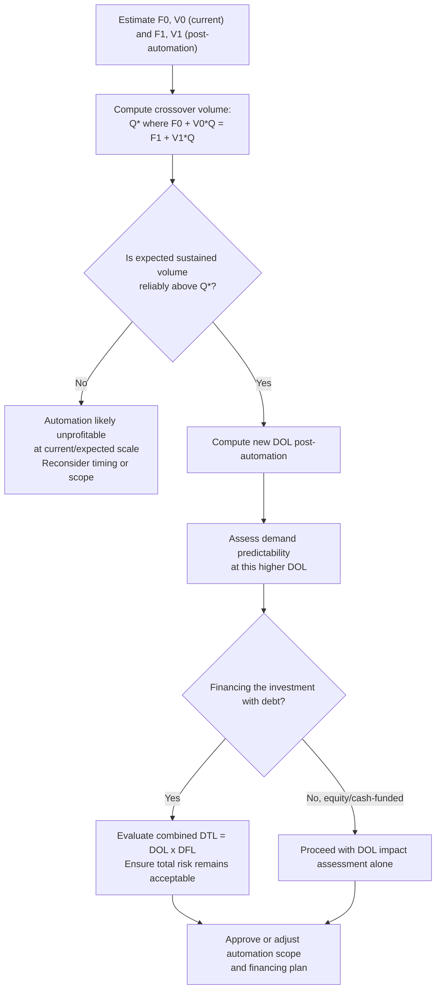

## Automation and Its Effect on the Fixed Variable Mix

### Conceptual Foundation

Automation is the deliberate substitution of capital equipment and software systems for manual human labor in the performance of a process. At the cost-structure level, this substitution has a direct and predictable mechanical effect: it converts costs that were previously **variable** (wages, hourly labor, piece-rate compensation) into costs that are largely **fixed** (equipment depreciation, software licensing, maintenance contracts, financing charges on the automation investment). This makes automation one of the clearest real-world levers by which a firm's operating leverage (DOL) is directly and intentionally reshaped.

**Key Points**

- Automation shifts the fixed-variable cost mix toward fixed costs by replacing scalable labor expense with a largely invariant capital cost base.
- This shift mechanically raises the Degree of Operating Leverage (DOL), increasing EBIT sensitivity to sales changes.
- The investment typically lowers variable cost per unit (since automated processes are often more efficient at the margin), which raises the breakeven volume threshold but can lower per-unit cost above that threshold.
- The decision to automate is fundamentally a risk-return tradeoff, not merely a cost-reduction exercise — it exchanges cost flexibility for scale efficiency.

---

### The Mechanical Effect on Cost Structure

Before automation, a labor-intensive process might have costs structured as:

$$\text{Total Cost} = F_0 + V_0 \cdot Q$$

Where $V_0$ includes substantial variable labor cost per unit.

After automating that process, costs typically restructure as:

$$\text{Total Cost} = F_1 + V_1 \cdot Q, \quad \text{where } F_1 > F_0 \text{ and } V_1 < V_0$$

The automation investment (equipment purchase or lease, installation, integration, financing) becomes a new or larger fixed cost component ($F_1$), while the labor cost that scaled with each unit produced is substantially reduced or eliminated, lowering the variable cost per unit ($V_1$).

**Worked Example:**

A manufacturing process currently relies on manual assembly:

- Fixed costs: $F_0 = \$200{,}000$
- Variable cost per unit (mostly labor): $V_0 = \$18$
- Price per unit: $P = \$30$
- Current volume: $Q = 40{,}000$ units

**Current (pre-automation) figures:**

Contribution margin per unit $= 30 - 18 = \$12$

EBIT $= 40{,}000 \times 12 - 200{,}000 = 480{,}000 - 200{,}000 = \$280{,}000$

$$DOL_{pre} = \frac{480{,}000}{280{,}000} = 1.71$$

**Proposed automation investment** adds $350,000 in annual fixed costs (depreciation and maintenance on new equipment) but reduces variable cost per unit to $10 (labor largely eliminated, replaced by minimal per-unit energy/materials cost):

New fixed costs: $F_1 = 200{,}000 + 350{,}000 = \$550{,}000$

New variable cost: $V_1 = \$10$

**Post-automation figures at the same volume ($Q = 40{,}000$):**

Contribution margin per unit $= 30 - 10 = \$20$

EBIT $= 40{,}000 \times 20 - 550{,}000 = 800{,}000 - 550{,}000 = \$250{,}000$

$$DOL_{post} = \frac{800{,}000}{250{,}000} = 3.20$$

**Interpretation:** At the current volume, automation actually *reduces* EBIT slightly ($280,000 → $250,000) because the fixed cost increase outweighs the variable cost savings at this scale — but it nearly doubles DOL (1.71 → 3.20), meaning the firm has taken on substantially more operating risk. This example illustrates a critical point: automation's benefit is volume-dependent, and evaluating it purely on current-volume profitability can obscure the leverage change taking place.

**Breakeven shift:**

$$Q_{BE,pre} = \frac{200{,}000}{12} = 16{,}667 \text{ units}$$

$$Q_{BE,post} = \frac{550{,}000}{20} = 27{,}500 \text{ units}$$

The breakeven volume rises by roughly 65%, meaning the firm now requires substantially higher sales just to reach the same zero-profit threshold — a direct consequence of trading variable cost for fixed cost.

**Volume at which automation becomes favorable:**

Setting pre- and post-automation EBIT equal reveals the crossover volume:

$$12Q - 200{,}000 = 20Q - 550{,}000 \implies 350{,}000 = 8Q \implies Q = 43{,}750$$

Only above 43,750 units does automation produce higher EBIT than the manual process — meaning at the example's current volume of 40,000 units, automation would not yet be profitable to adopt, despite lowering unit variable cost.

---

### Why Automation Raises Operating Leverage: The General Pattern

| Cost Category | Pre-Automation (Labor-Intensive) | Post-Automation (Capital-Intensive) |
| --- | --- | --- |
| Direct labor per unit | Variable, scales with output | Substantially reduced or eliminated |
| Equipment depreciation | Low or none | New, significant fixed component |
| Maintenance contracts | Minimal | Often fixed annual/contractual cost |
| Financing charges on equipment | None | Fixed (if debt-financed) |
| Energy/utilities for equipment | Low | Can rise, partially variable but often has a fixed baseline component |
| Marginal cost of an additional unit | Higher (labor-driven) | Lower (materials/energy only) |
| Overall DOL | Lower | Higher |

This table generalizes the mechanism seen in the worked example: nearly every dollar shifted from the labor line to the equipment/depreciation line moves the firm's cost structure toward the fixed end of the spectrum.

---

### Strategic Considerations Beyond the Immediate Cost Shift

1. **Volume threshold matters more than unit economics alone.** As shown above, automation can *increase* fixed costs enough that it is unprofitable below a certain volume, even though it lowers variable cost per unit. Firms should compute the crossover volume explicitly rather than relying on unit-cost comparisons alone.
2. **Demand predictability becomes more consequential.** Because automation raises DOL, the firm becomes more exposed to demand downturns after the investment — a consideration that should weigh heavily when demand is cyclical or uncertain (see the broader discussion of capital structure implications of high operating leverage, which applies directly once automation raises DOL).
3. **Reversibility is limited.** Once capital equipment is purchased and integrated, reducing the fixed cost base in response to a downturn (e.g., selling equipment) is typically far slower and more costly than reducing labor headcount, meaning the flexibility lost is not easily regained in the short run.
4. **Quality, throughput, and consistency gains are often the primary strategic driver**, with cost being only one dimension — automation frequently also targets improved consistency, higher throughput ceilings, or reduced dependency on labor market conditions, benefits that may justify the leverage increase even when the pure unit-cost crossover volume is not yet reached. [Inference]
5. **Financing the automation investment interacts with financial leverage.** If the automation investment is debt-financed, the firm simultaneously raises both DOL (via the new fixed operating costs) and DFL (via the new fixed interest obligation), compounding total risk sharply through $DTL = DOL \times DFL$ — a consideration that should inform how the investment is financed, not just whether to make it.

---

### Diagram: Cost Structure Shift From Automation (svg_diagram)

<svg viewBox="0 0 760 420" xmlns="http://www.w3.org/2000/svg" font-family="Arial, sans-serif">
<text x="380" y="26" text-anchor="middle" font-size="17" font-weight="bold">Automation's Effect on Cost Structure (svg_diagram)</text>
<line x1="80" y1="380" x2="700" y2="380" stroke="black" stroke-width="2"/>
<line x1="80" y1="380" x2="80" y2="60" stroke="black" stroke-width="2"/>
<text x="390" y="405" text-anchor="middle" font-size="13">Units Produced (Q)</text>
<text x="30" y="220" text-anchor="middle" font-size="13" transform="rotate(-90 30 220)">Total Cost ($)</text>
<!-- Pre-automation line: lower fixed, steeper slope -->
<line x1="80" y1="340" x2="700" y2="140" stroke="#2980b9" stroke-width="2.5"/>
<text x="600" y="130" font-size="12" fill="#2980b9">Pre-Automation (F₀ low, V₀ high)</text>
<line x1="80" y1="340" x2="700" y2="340" stroke="#2980b9" stroke-width="1" stroke-dasharray="4,2"/>
<!-- Post-automation line: higher fixed, flatter slope -->
<line x1="80" y1="260" x2="700" y2="180" stroke="#c0392b" stroke-width="2.5"/>
<text x="600" y="170" font-size="12" fill="#c0392b">Post-Automation (F₁ high, V₁ low)</text>
<line x1="80" y1="260" x2="700" y2="260" stroke="#c0392b" stroke-width="1" stroke-dasharray="4,2"/>
<!-- Crossover -->
<circle cx="500" cy="187" r="5" fill="black"/>
<line x1="500" y1="187" x2="500" y2="380" stroke="black" stroke-width="1" stroke-dasharray="3,3"/>
<text x="510" y="200" font-size="11" font-weight="bold">Crossover Q</text>
<text x="330" y="330" font-size="11" fill="#555">Below crossover: manual cheaper</text>
<text x="530" y="150" font-size="11" fill="#555">Above crossover: automated cheaper</text>

<text x="80" y="44" font-size="11" fill="#555">Note: automated line starts higher (F₁ > F₀) but rises more slowly (V₁ < V₀)</text>

</svg>

---

### Automation Decision Workflow

---

### Common Analytical Pitfalls

- **Evaluating automation purely on current-volume profitability**, missing that the investment may only become favorable above a specific crossover volume that must be explicitly solved for.
- **Ignoring the DOL increase** when assessing automation purely as a "cost savings" initiative — the leverage change has risk implications independent of whether the investment is profitable at current volume.
- **Overlooking the financing interaction** — debt-funding an automation project raises both DOL and DFL simultaneously, and the combined effect on total risk (DTL) can be understated if each is assessed in isolation.
- **Assuming automation is always the "efficient" choice** — below the crossover volume, or under highly uncertain demand, the labor-intensive alternative may be the economically and strategically sounder choice despite higher per-unit variable cost. [Inference]

---

### Related Topics

- Degree of Operating Leverage (DOL) — formula and derivation
- Capital Intensive versus Labor Intensive Cost Structures
- Capital structure implications of high operating leverage
- Capital budgeting and investment appraisal (NPV, payback) for automation projects
- Breakeven analysis and crossover volume calculations
- Combined leverage (DTL) when automation investments are debt-financed
- Real options analysis for phased or reversible automation investment